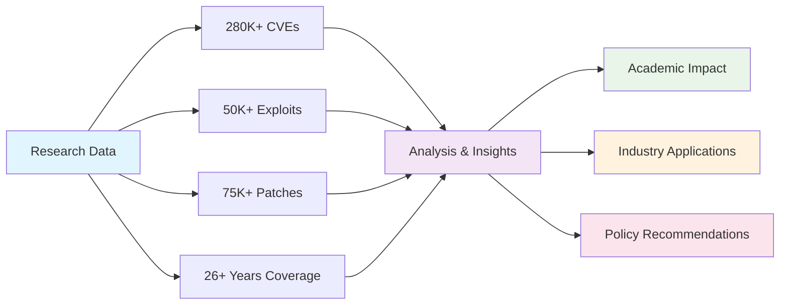
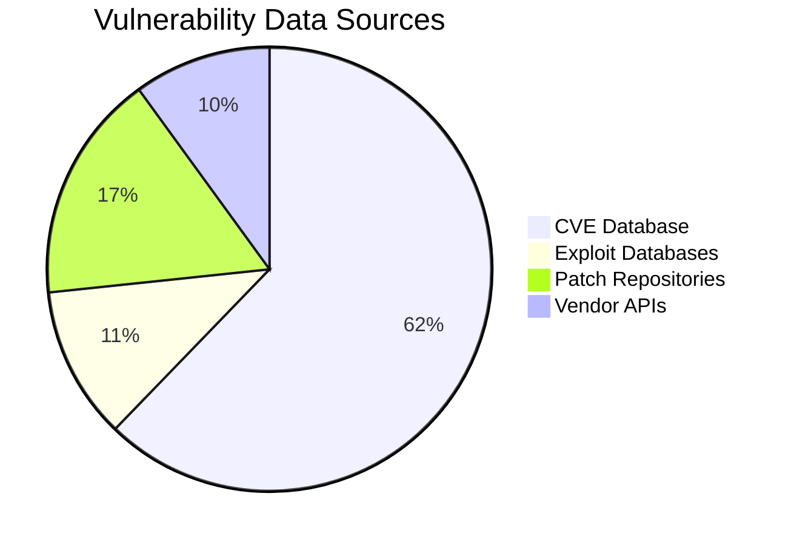
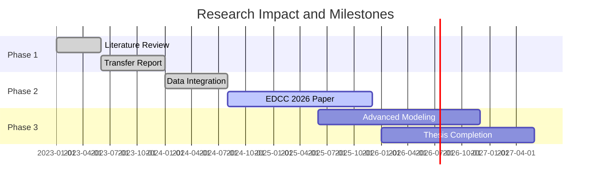
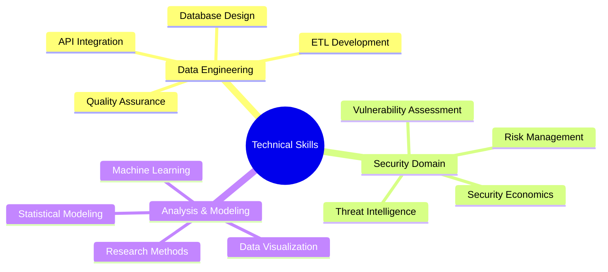
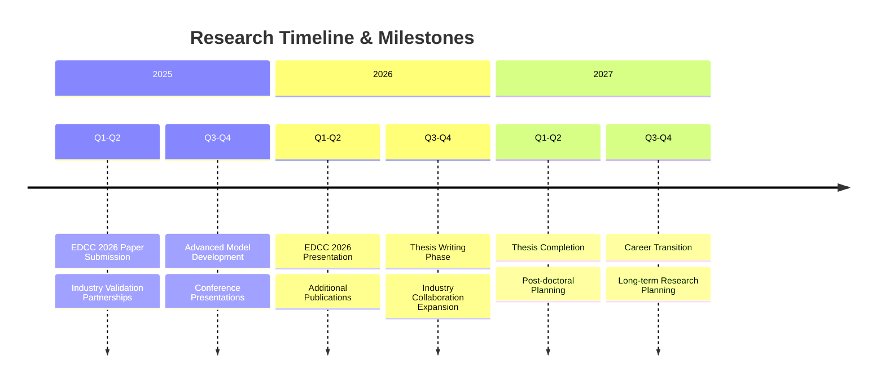

# About This Research

## Researcher Profile

!!! info "Academic Profile"
    **Eid ALBADDAH**  
    PhD Candidate in Cybersecurity  
    City St George's, University of London  
    Department of Computer Science

### Academic Journey

I am currently pursuing a **Doctor of Cybersecurity** degree, focusing on the complex dynamics of vulnerability lifecycles across modern software ecosystems. My research sits at the intersection of **security economics**, **data science**, and **empirical software engineering**, providing quantitative insights into how vulnerabilities are discovered, exploited, and patched across different vendor environments.

!!! quote "Research Philosophy"
    My approach to cybersecurity research is fundamentally **data-driven** and **empirical**. Rather than relying solely on theoretical frameworks, I believe in extracting insights from real-world security data to understand the actual dynamics of vulnerability management. This methodology enables evidence-based recommendations for both defensive strategies and policy development.

## Research Evolution

=== "Phase 1: Foundation Building (2023-2024)"
    
    **Focus**: Establishing the Research Framework

    During the initial phase of my PhD, I focused on building a solid foundation for vulnerability lifecycle analysis:

    - [x] **Literature Review**: Comprehensive analysis of existing security econometrics research, particularly building upon Stefan Frei's seminal 2009 work
    - [x] **Microsoft Ecosystem Focus**: Deep dive into Microsoft vulnerability patterns to establish baseline methodologies
    - [x] **Tool Development**: Creation of initial data collection and analysis frameworks
    - [x] **Transfer Report**: Successful completion demonstrating research viability and preliminary findings

    !!! success "Key Milestone"
        Transfer report approval, validating the research approach and establishing the foundation for expanded analysis.

=== "Phase 2: Expansion and Integration (2024-2025)"
    
    **Focus**: Multi-Vendor Ecosystem Analysis

    The current phase represents a significant expansion in both scope and sophistication:

    - [x] **Data Integration**: Incorporation of multiple vendor sources (Microsoft, Red Hat, Cisco) and community datasets (GitHub, MoreFixes)
    - [x] **Methodological Enhancement**: Implementation of advanced statistical techniques including survival analysis and heavy-tailed distribution modeling
    - [x] **Temporal Extension**: Dataset expansion to include vulnerabilities through May 2025
    - [ ] **Cross-Ecosystem Comparison**: Development of frameworks for comparing commercial vs. open source vulnerability management

    !!! note "Current Status"
        Active conference paper preparation and advanced modeling development.

=== "Phase 3: Advanced Modeling and Synthesis (2025-2027)"
    
    **Focus**: Predictive Frameworks and Thesis Completion

    The final phase will focus on synthesizing insights into actionable frameworks:

    - [ ] **Machine Learning Integration**: Development of exploit prediction and patch prioritization models
    - [ ] **Policy Implications**: Translation of research findings into actionable security policy recommendations
    - [ ] **Industry Validation**: Collaboration with industry partners to validate research findings
    - [ ] **Thesis Completion**: Integration of all research components into a comprehensive thesis

## Research Impact Metrics

## Core Research Questions

### Primary Research Questions

!!! question "1. Lifecycle Dynamics"
    How do vulnerability lifecycles differ across commercial and open source ecosystems, and what factors drive these differences?

!!! question "2. Temporal Patterns"
    What patterns exist in the "race" between exploit development and patch deployment, and how have these patterns evolved over time?

!!! question "3. Predictive Capability"
    Can we reliably predict which vulnerabilities will be exploited based on their characteristics, vendor ecosystem, and temporal context?

!!! question "4. Resource Optimization"
    How should organizations prioritize patch deployment to maximize security impact given limited resources?

### Secondary Research Questions

!!! abstract "Secondary Focus Areas"
    1. **Weakness Evolution**: How do Common Weakness Enumeration (CWE) patterns relate to exploitation likelihood and vendor response times?
    2. **Vendor Comparison**: What systematic differences exist between vendor security response patterns, and what drives these differences?
    3. **Economic Factors**: How do economic incentives influence vulnerability disclosure, exploitation, and patching behaviors?
    4. **Policy Impact**: What policy interventions could improve the overall security ecosystem's response to vulnerabilities?

## Dataset Overview

## Methodological Approach

!!! tip "Data-Driven Foundation"
    My research is built on one of the most comprehensive vulnerability datasets assembled for academic research:

    - **Scale**: 280K+ CVEs, 50K+ exploits, 75K+ patches across 26+ years
    - **Diversity**: Multiple vendor ecosystems (commercial and open source)
    - **Quality**: Rigorous validation and quality assurance procedures
    - **Integration**: Systematic ETL processes ensuring data consistency

### Analytical Framework

=== "Quantitative Analysis"
    - Statistical modeling of temporal patterns
    - Machine learning for prediction tasks
    - Survival analysis for time-to-event modeling
    - Heavy-tailed distribution analysis for security data

=== "Qualitative Analysis"
    - Case study analysis of significant vulnerabilities
    - Vendor policy and procedure analysis
    - Industry best practice evaluation

!!! warning "Validation Strategy"
    Research validity is ensured through:
    
    - **Temporal validation**: Time-series splits to prevent data leakage
    - **Cross-vendor validation**: Consistency checks across different ecosystems
    - **Industry feedback**: Validation with security practitioners
    - **Peer review**: Conference and journal submission processes

## Research Impact Timeline

## Research Impact and Applications

### Academic Contributions

!!! success "Methodological Innovation"
    Development of multi-vendor analysis frameworks for vulnerability research

!!! success "Empirical Insights"
    Evidence-based findings about vulnerability lifecycle patterns

!!! success "Data Resource"
    Creation of integrated datasets for future security research

!!! success "Tool Development"
    Open source tools for vulnerability analysis

### Industry Applications

| Application Area | Impact | Status |
|------------------|---------|---------|
| Risk Assessment | Improved frameworks for vulnerability risk evaluation | ✅ Active |
| Resource Allocation | Evidence-based patch prioritization strategies | ✅ Active |
| Threat Intelligence | Enhanced understanding of exploitation patterns | 🔄 In Progress |
| Policy Development | Data-driven recommendations for security policies | 📋 Planned |

## Technical Expertise

### Programming and Analysis
=== "Python"
    Advanced data analysis, machine learning, statistical modeling

=== "SQL"
    Complex database queries and analytical processing

=== "R"
    Statistical analysis and specialized security data modeling

=== "JavaScript"
    Data visualization and interactive dashboard development

### Core Competencies

## Current Projects and Publication Pipeline

### Conference Paper

!!! note "Upcoming Publication"
    **Multi-Vendor Vulnerability Lifecycle Analysis**
    
    - **Target Conference**: EDCC 2026 (European Dependable Computing Conference)
    - **Status**: Data analysis complete, writing in progress
    - **Focus**: Comparative analysis of vulnerability response across ecosystems
    - **Expected Submission**: Q4 2025

### Research Collaborations

!!! info "Active Partnerships"
    - **Industry Partnerships**: Collaboration with security vendors for data validation
    - **Academic Networks**: Participation in cybersecurity research communities
    - **Open Source Contributions**: Development of tools for vulnerability research

## Professional Development

=== "Conference Participation"
    - **Presenter**: Security research conference presentations
    - **Reviewer**: Peer review activities for security conferences
    - **Attendee**: Regular participation in major cybersecurity conferences

=== "Academic Service"
    - **Teaching**: Assistance with undergraduate cybersecurity courses
    - **Mentoring**: Support for junior researchers in security analytics
    - **Community**: Active participation in academic security research community

## Future Roadmap

### Long-term Vision

!!! example "Career Aspirations"
    - **Academic Career**: Pursue faculty position in cybersecurity research
    - **Industry Impact**: Develop practical tools for vulnerability management
    - **Policy Influence**: Contribute to evidence-based cybersecurity policy
    - **Research Leadership**: Lead major research initiatives in security analytics

---

!!! abstract "Research Commitment"
    *This research represents a commitment to improving cybersecurity through rigorous, data-driven analysis and evidence-based recommendations for both academic understanding and practical implementation.*

---