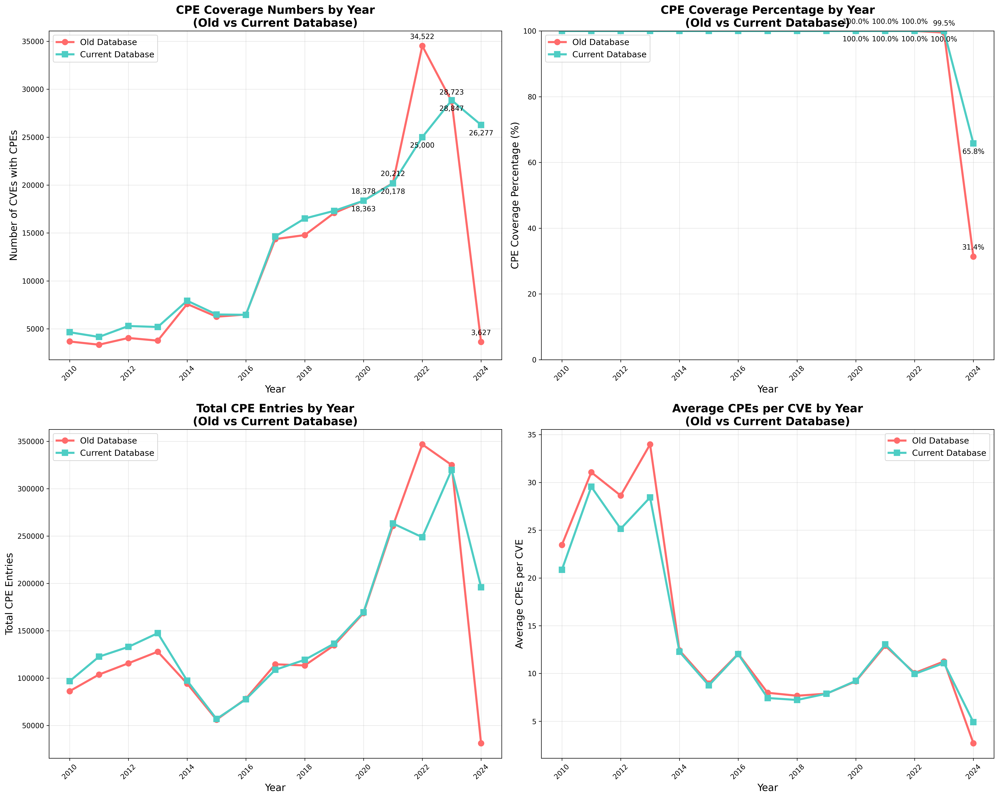
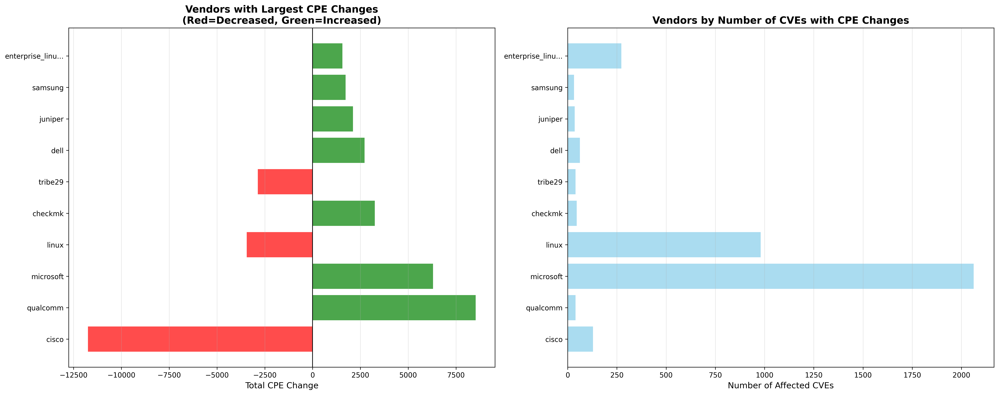
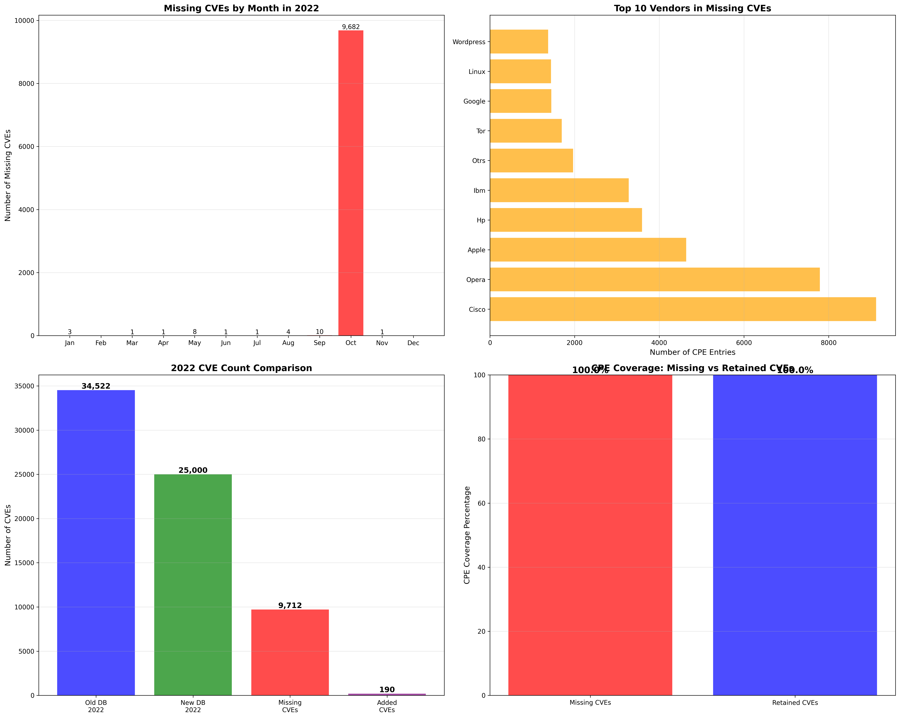

# CVE Database Migration & Quality Analysis

## Overview

This comprehensive analysis examines the differences between two CVE databases, focusing on Common Platform Enumeration (CPE) coverage patterns and data integrity across different time periods. The study reveals significant insights into data migration processes, quality improvements, and temporal anomalies that occurred during database transitions.

## Introduction

### Background

The analysis compares two CVE datasets:
- **Old Database**: CVE data up to April 21, 2024
- **New Database**: CVE data up to May 13, 2025

This comparison aims to understand changes in CPE coverage, identify data migration patterns, and investigate significant discrepancies, particularly the notable anomaly in 2022 data where 9,712 CVEs appear to be missing from the new database.

### Research Questions

1. **How has CPE coverage evolved** between the old and new databases across different years?
2. **What patterns emerge** in terms of vendor representation and platform coverage?
3. **Why does 2022 show a significant discrepancy** with 27.6% of CVEs missing from the new database?
4. **Are the missing CVEs** the result of data quality improvements or data loss?

### Methodology

The analysis employs SQL queries and statistical analysis to:
- Compare yearly CPE coverage trends
- Identify significant changes in CPE assignments
- Analyze vendor and platform distribution patterns
- Investigate temporal anomalies and data migration issues
- Examine specific examples of missing CVEs for pattern recognition

---

## Analysis Results

# CPE Difference between Old (Updated 21 April 2024) vs New DB (Updated 13 May 2025) 

### 1. Environment Setup and Data Loading


```python
import duckdb
import pandas as pd
import numpy as np
import matplotlib.pyplot as plt
import seaborn as sns
import json
import os
from datetime import datetime, timedelta
import warnings
warnings.filterwarnings('ignore')
from matplotlib.patches import Patch
import matplotlib.patches as mpatches
from scipy import stats

# Try to use Modin for faster pandas operations
try:
    import modin.pandas as mpd
    USE_MODIN = True
    print("Using Modin for accelerated pandas operations")
except ImportError:
    import pandas as mpd
    USE_MODIN = False
    print("Using standard pandas (Modin not available)")

# Set up high-quality plotting parameters
plt.rcParams['figure.dpi'] = 300
plt.rcParams['savefig.dpi'] = 300
plt.rcParams['savefig.format'] = 'eps'
plt.rcParams['font.size'] = 12
plt.rcParams['axes.titlesize'] = 14
plt.rcParams['axes.labelsize'] = 12
plt.rcParams['xtick.labelsize'] = 10
plt.rcParams['ytick.labelsize'] = 10
plt.rcParams['legend.fontsize'] = 10

# Global analysis period settings
ANALYSIS_END_DATE = "2024-12-31"
ANALYSIS_START_DATE = "1999-01-01"  # Set to None for all data
USE_ALL_DATA = True  # Toggle this to switch between full dataset and filtered

# Create output directory for figures
os.makedirs('figures', exist_ok=True)
os.makedirs('parquet_data', exist_ok=True)
print(f"Analysis Period: {'All available data' if USE_ALL_DATA else f'{ANALYSIS_START_DATE} to {ANALYSIS_END_DATE}'}")
```

    Using Modin for accelerated pandas operations
    Analysis Period: All available data
    

### 2. Load Parquet Data for Analysis


```python
def load_parquet_data():
    """
    Load Parquet files into DuckDB for analysis
    """
    
    # Create a new connection for analysis
    con = duckdb.connect(':memory:')  # Use in-memory database for faster processing
    
    # Load all parquet files
    parquet_files = {
        # MySQL tables
        'cve_main': '..\parquet_data\mysql_cve.parquet',
        'cve_main_old': '..\parquet_data\mysql_cvev5_v2.parquet',
        'exploits': '..\parquet_data\mysql_exploit.parquet',
        'exploits_old': '..\parquet_data\mysql_exploit_old.parquet',
        'msrc_patches': '..\parquet_data\mysql_msrc_vuln_unified.parquet',
        'cisco_patches': '..\parquet_data\mysql_cisco_vuln_unified.parquet',
        'redhat_patches': '..\parquet_data\mysql_redhat_vuln_unified.parquet',
        'github_advisories': '..\parquet_data\mysql_github_advisory_unified.parquet',
        'cwe_ref': '..\parquet_data\mysql_cwe.parquet',
        'capec_ref': '..\parquet_data\mysql_capec.parquet',
        
        # PostgreSQL tables (MoreFixes)
        'morefixes_cve': '..\parquet_data\postgres_cve.parquet',
        'morefixes_fixes': '..\parquet_data\postgres_fixes.parquet',
        'morefixes_commits': '..\parquet_data\postgres_commits.parquet',
        'morefixes_repository': '..\parquet_data\postgres_repository.parquet'
    }
    
    # Create views for each parquet file
    for table_name, file_path in parquet_files.items():
        if os.path.exists(file_path):
            con.sql(f"CREATE OR REPLACE VIEW {table_name} AS SELECT * FROM '{file_path}'")
            print(f"✓ Loaded {table_name}")
        else:
            print(f"✗ File not found: {file_path}")
    
    return con

# Load data for analysis
print("Loading Parquet data for analysis...")
analysis_con = load_parquet_data()
```

    Loading Parquet data for analysis...
    ✓ Loaded cve_main
    ✓ Loaded cve_main_old
    ✓ Loaded exploits
    ✓ Loaded exploits_old
    ✓ Loaded msrc_patches
    ✓ Loaded cisco_patches
    ✓ Loaded redhat_patches
    ✓ Loaded github_advisories
    ✓ Loaded cwe_ref
    ✓ Loaded capec_ref
    ✓ Loaded morefixes_cve
    ✓ Loaded morefixes_fixes
    ✓ Loaded morefixes_commits
    ✓ Loaded morefixes_repository
    


```python
# List of all table names I've loaded
table_names = [
    "cve_main", "cve_main_old", "exploits", "msrc_patches", "cisco_patches",
    "redhat_patches", "github_advisories", "cwe_ref", "capec_ref",
    "morefixes_cve", "morefixes_fixes", "morefixes_commits", "morefixes_repository"
]

print("\n--- Schema for all loaded tables ---")

for table_name in table_names:
    print(f"\nSchema for table: {table_name}")
    try:
        # Execute PRAGMA table_info() to get schema
        schema_info = analysis_con.execute(f"PRAGMA table_info('{table_name}');").fetchall()

        if not schema_info:
            print(f"  (Table '{table_name}' not found or is empty)")
            continue

        # Print header
        header = ["cid", "name", "type", "notnull", "pk", "dflt_value"]
        print(f"  {' '.join(f'{col:<15}' for col in header)}")
        print(f"  {'-'*90}")

        # Print rows
        for col_info in schema_info:
            cid, name, col_type, notnull, pk, dflt_value = col_info
            print(f"  {cid:<15} {name:<15} {col_type:<15} {str(notnull):<15} {str(pk):<15} {str(dflt_value):<15}")
    except duckdb.ParserException as e:
        print(f"  Error retrieving schema for {table_name}: {e}")
    except Exception as e:
        print(f"  An unexpected error occurred for {table_name}: {e}")
```

    
    --- Schema for all loaded tables ---
    
    Schema for table: cve_main
      cid             name            type            notnull         pk              dflt_value     
      ------------------------------------------------------------------------------------------
      0               id              BIGINT          False           None            False          
      1               cve_id          VARCHAR         False           None            False          
      2               assigner_org    VARCHAR         False           None            False          
      3               state           VARCHAR         False           None            False          
      4               description     VARCHAR         False           None            False          
      5               date_reserved   TIMESTAMP       False           None            False          
      6               date_published  TIMESTAMP       False           None            False          
      7               date_updated    TIMESTAMP       False           None            False          
      8               cvss_v2_score   FLOAT           False           None            False          
      9               cvss_v2_vector  VARCHAR         False           None            False          
      10              cvss_v3_score   FLOAT           False           None            False          
      11              cvss_v3_vector  VARCHAR         False           None            False          
      12              cvss_v3_severity VARCHAR         False           None            False          
      13              cvss_v4_score   FLOAT           False           None            False          
      14              cvss_v4_vector  VARCHAR         False           None            False          
      15              cvss_v4_severity VARCHAR         False           None            False          
      16              cwe_ids         VARCHAR         False           None            False          
      17              cpes            VARCHAR         False           None            False          
      18              vendors         VARCHAR         False           None            False          
      19              products        VARCHAR         False           None            False          
      20              references      VARCHAR         False           None            False          
      21              ssvc_exploitation VARCHAR         False           None            False          
      22              ssvc_automatable VARCHAR         False           None            False          
      23              ssvc_technical_impact VARCHAR         False           None            False          
      24              kev_known_exploited TINYINT         False           None            False          
      25              kev_vendor_project VARCHAR         False           None            False          
      26              kev_product     VARCHAR         False           None            False          
      27              kev_vulnerability_name VARCHAR         False           None            False          
      28              kev_date_added  TIMESTAMP       False           None            False          
      29              kev_short_description VARCHAR         False           None            False          
      30              kev_required_action VARCHAR         False           None            False          
      31              kev_due_date    TIMESTAMP       False           None            False          
      32              kev_ransomware_use VARCHAR         False           None            False          
      33              kev_notes       VARCHAR         False           None            False          
      34              kev_cwes        VARCHAR         False           None            False          
      35              epss_score      FLOAT           False           None            False          
      36              epss_percentile FLOAT           False           None            False          
      37              data_sources    VARCHAR         False           None            False          
      38              created_at      TIMESTAMP WITH TIME ZONE False           None            False          
      39              updated_at      TIMESTAMP WITH TIME ZONE False           None            False          
      40              has_exploit     TINYINT         False           None            False          
      41              exploit_count   INTEGER         False           None            False          
      42              first_exploit_date TIMESTAMP       False           None            False          
      43              latest_exploit_date TIMESTAMP       False           None            False          
    
    Schema for table: cve_main_old
      cid             name            type            notnull         pk              dflt_value     
      ------------------------------------------------------------------------------------------
      0               id              BIGINT          False           None            False          
      1               CVE ID          VARCHAR         False           None            False          
      2               State           VARCHAR         False           None            False          
      3               Date Published  TIMESTAMP       False           None            False          
      4               Date Updated    TIMESTAMP       False           None            False          
      5               Date Reserved   TIMESTAMP       False           None            False          
      6               Descriptions    VARCHAR         False           None            False          
      7               Affected Products VARCHAR         False           None            False          
      8               References      VARCHAR         False           None            False          
      9               Problem Types   VARCHAR         False           None            False          
      10              Base Severity   VARCHAR         False           None            False          
      11              Confidentiality Impact VARCHAR         False           None            False          
      12              Integrity Impact VARCHAR         False           None            False          
      13              Availability Impact VARCHAR         False           None            False          
      14              CVSS 2.0 Base Score FLOAT           False           None            False          
      15              CVSS 3.0 Base Score FLOAT           False           None            False          
      16              CVSS 3.1 Base Score FLOAT           False           None            False          
      17              cwe             VARCHAR         False           None            False          
      18              EPSS            FLOAT           False           None            False          
      19              vendors         VARCHAR         False           None            False          
      20              Software CPES   VARCHAR         False           None            False          
      21              V Score         FLOAT           False           None            False          
    
    Schema for table: exploits
      cid             name            type            notnull         pk              dflt_value     
      ------------------------------------------------------------------------------------------
      0               id              BIGINT          False           None            False          
      1               file            VARCHAR         False           None            False          
      2               description     VARCHAR         False           None            False          
      3               date_published  TIMESTAMP       False           None            False          
      4               author          VARCHAR         False           None            False          
      5               type            VARCHAR         False           None            False          
      6               platform        VARCHAR         False           None            False          
      7               port            DOUBLE          False           None            False          
      8               date_added      TIMESTAMP       False           None            False          
      9               date_updated    TIMESTAMP       False           None            False          
      10              verified        BIGINT          False           None            False          
      11              codes           VARCHAR         False           None            False          
      12              tags            VARCHAR         False           None            False          
      13              aliases         VARCHAR         False           None            False          
      14              screenshot_url  VARCHAR         False           None            False          
      15              application_url VARCHAR         False           None            False          
      16              source_url      VARCHAR         False           None            False          
      17              cve_id          VARCHAR         False           None            False          
    
    Schema for table: msrc_patches
      cid             name            type            notnull         pk              dflt_value     
      ------------------------------------------------------------------------------------------
      0               title           VARCHAR         False           None            False          
      1               release_date    TIMESTAMP       False           None            False          
      2               initial_release_date TIMESTAMP       False           None            False          
      3               cvrf_id         VARCHAR         False           None            False          
      4               cve_id          VARCHAR         False           None            False          
      5               exploited_status INTEGER         False           None            False          
      6               exploitation_potential_lsr INTEGER         False           None            False          
      7               exploitation_potential_osr INTEGER         False           None            False          
      8               publicly_disclosed INTEGER         False           None            False          
      9               cvss_score      FLOAT           False           None            False          
      10              cvss_vector     VARCHAR         False           None            False          
      11              vuln_title      VARCHAR         False           None            False          
      12              product_id      VARCHAR         False           None            False          
      13              product_name    VARCHAR         False           None            False          
      14              product_branch  VARCHAR         False           None            False          
      15              product_cpe     VARCHAR         False           None            False          
      16              threats         VARCHAR         False           None            False          
      17              remediations    VARCHAR         False           None            False          
      18              cwe_ids         VARCHAR         False           None            False          
      19              notes           VARCHAR         False           None            False          
      20              acknowledgments VARCHAR         False           None            False          
    
    Schema for table: cisco_patches
      cid             name            type            notnull         pk              dflt_value     
      ------------------------------------------------------------------------------------------
      0               advisory_id     VARCHAR         False           None            False          
      1               title           VARCHAR         False           None            False          
      2               cve_id          VARCHAR         False           None            False          
      3               vulnerability_title VARCHAR         False           None            False          
      4               current_release_date TIMESTAMP       False           None            False          
      5               initial_release_date TIMESTAMP       False           None            False          
      6               vulnerability_release_date TIMESTAMP       False           None            False          
      7               status          VARCHAR         False           None            False          
      8               version         VARCHAR         False           None            False          
      9               publisher       VARCHAR         False           None            False          
      10              publisher_category VARCHAR         False           None            False          
      11              summary         VARCHAR         False           None            False          
      12              details         VARCHAR         False           None            False          
      13              cvss_score      FLOAT           False           None            False          
      14              cvss_severity   VARCHAR         False           None            False          
      15              cvss_vector     VARCHAR         False           None            False          
      16              bug_ids         VARCHAR         False           None            False          
      17              product_id      VARCHAR         False           None            False          
      18              product_name    VARCHAR         False           None            False          
      19              product_full_path VARCHAR         False           None            False          
      20              acknowledgments VARCHAR         False           None            False          
      21              references      VARCHAR         False           None            False          
      22              remediations    VARCHAR         False           None            False          
    
    Schema for table: redhat_patches
      cid             name            type            notnull         pk              dflt_value     
      ------------------------------------------------------------------------------------------
      0               id              BIGINT          False           None            False          
      1               advisory_id     VARCHAR         False           None            False          
      2               title           VARCHAR         False           None            False          
      3               cve_id          VARCHAR         False           None            False          
      4               cwe_id          VARCHAR         False           None            False          
      5               vulnerability_title VARCHAR         False           None            False          
      6               current_release_date TIMESTAMP       False           None            False          
      7               initial_release_date TIMESTAMP       False           None            False          
      8               discovery_date  TIMESTAMP       False           None            False          
      9               release_date    TIMESTAMP       False           None            False          
      10              status          VARCHAR         False           None            False          
      11              version         VARCHAR         False           None            False          
      12              publisher       VARCHAR         False           None            False          
      13              publisher_category VARCHAR         False           None            False          
      14              summary         VARCHAR         False           None            False          
      15              details         VARCHAR         False           None            False          
      16              cvss_score      FLOAT           False           None            False          
      17              cvss_severity   VARCHAR         False           None            False          
      18              cvss_vector     VARCHAR         False           None            False          
      19              threat_impact   VARCHAR         False           None            False          
      20              aggregate_severity VARCHAR         False           None            False          
      21              product_id      VARCHAR         False           None            False          
      22              product_name    VARCHAR         False           None            False          
    
    Schema for table: github_advisories
      cid             name            type            notnull         pk              dflt_value     
      ------------------------------------------------------------------------------------------
      0               id              BIGINT          False           None            False          
      1               ghsa_id         VARCHAR         False           None            False          
      2               schema_version  VARCHAR         False           None            False          
      3               published       TIMESTAMP       False           None            False          
      4               modified        TIMESTAMP       False           None            False          
      5               summary         VARCHAR         False           None            False          
      6               details         VARCHAR         False           None            False          
      7               primary_cve     VARCHAR         False           None            False          
      8               all_cves        VARCHAR         False           None            False          
      9               cvss_v3_score   FLOAT           False           None            False          
      10              cvss_v3_vector  VARCHAR         False           None            False          
      11              cvss_v4_score   FLOAT           False           None            False          
      12              cvss_v4_vector  VARCHAR         False           None            False          
      13              database_severity VARCHAR         False           None            False          
      14              severity_score  FLOAT           False           None            False          
      15              cwe_ids         VARCHAR         False           None            False          
      16              github_reviewed BOOLEAN         False           None            False          
      17              github_reviewed_at TIMESTAMP       False           None            False          
      18              nvd_published_at TIMESTAMP       False           None            False          
      19              exploited       TINYINT         False           None            False          
      20              exploitability_level TINYINT         False           None            False          
      21              poc_available   TINYINT         False           None            False          
      22              patched         TINYINT         False           None            False          
      23              patch_available TINYINT         False           None            False          
      24              primary_ecosystem VARCHAR         False           None            False          
      25              all_ecosystems  VARCHAR         False           None            False          
      26              package_ecosystem VARCHAR         False           None            False          
      27              package_name    VARCHAR         False           None            False          
      28              package_purl    VARCHAR         False           None            False          
      29              references      VARCHAR         False           None            False          
      30              affected_ranges VARCHAR         False           None            False          
      31              affected_versions VARCHAR         False           None            False          
      32              created_at      TIMESTAMP WITH TIME ZONE False           None            False          
      33              updated_at      TIMESTAMP WITH TIME ZONE False           None            False          
    
    Schema for table: cwe_ref
      cid             name            type            notnull         pk              dflt_value     
      ------------------------------------------------------------------------------------------
      0               cwe_id          VARCHAR         False           None            False          
      1               name            VARCHAR         False           None            False          
      2               weakness_abstraction VARCHAR         False           None            False          
      3               status          VARCHAR         False           None            False          
      4               description     VARCHAR         False           None            False          
      5               extended_description VARCHAR         False           None            False          
      6               related_weaknesses VARCHAR         False           None            False          
      7               weakness_ordinalities VARCHAR         False           None            False          
      8               applicable_platforms VARCHAR         False           None            False          
      9               background_details VARCHAR         False           None            False          
      10              alternate_terms VARCHAR         False           None            False          
      11              modes_of_introduction VARCHAR         False           None            False          
      12              exploitation_factors VARCHAR         False           None            False          
      13              likelihood_of_exploit VARCHAR         False           None            False          
      14              common_consequences VARCHAR         False           None            False          
      15              detection_methods VARCHAR         False           None            False          
      16              potential_mitigations VARCHAR         False           None            False          
      17              observed_examples VARCHAR         False           None            False          
      18              functional_areas VARCHAR         False           None            False          
      19              affected_resources VARCHAR         False           None            False          
      20              taxonomy_mappings VARCHAR         False           None            False          
      21              related_attack_patterns VARCHAR         False           None            False          
      22              notes           VARCHAR         False           None            False          
      23              created_at      TIMESTAMP WITH TIME ZONE False           None            False          
    
    Schema for table: capec_ref
      cid             name            type            notnull         pk              dflt_value     
      ------------------------------------------------------------------------------------------
      0               capec_id        VARCHAR         False           None            False          
      1               name            VARCHAR         False           None            False          
      2               abstraction     VARCHAR         False           None            False          
      3               status          VARCHAR         False           None            False          
      4               description     VARCHAR         False           None            False          
      5               alternate_terms VARCHAR         False           None            False          
      6               likelihood_of_attack VARCHAR         False           None            False          
      7               typical_severity VARCHAR         False           None            False          
      8               related_attack_patterns VARCHAR         False           None            False          
      9               execution_flow  VARCHAR         False           None            False          
      10              prerequisites   VARCHAR         False           None            False          
      11              skills_required VARCHAR         False           None            False          
      12              resources_required VARCHAR         False           None            False          
      13              indicators      VARCHAR         False           None            False          
      14              consequences    VARCHAR         False           None            False          
      15              mitigations     VARCHAR         False           None            False          
      16              example_instances VARCHAR         False           None            False          
      17              related_weaknesses VARCHAR         False           None            False          
      18              taxonomy_mappings VARCHAR         False           None            False          
      19              notes           VARCHAR         False           None            False          
      20              created_at      TIMESTAMP WITH TIME ZONE False           None            False          
    
    Schema for table: morefixes_cve
      cid             name            type            notnull         pk              dflt_value     
      ------------------------------------------------------------------------------------------
      0               cve_id          VARCHAR         False           None            False          
      1               published_date  VARCHAR         False           None            False          
      2               last_modified_date VARCHAR         False           None            False          
      3               description     VARCHAR         False           None            False          
      4               nodes           VARCHAR         False           None            False          
      5               severity        VARCHAR         False           None            False          
      6               obtain_all_privilege VARCHAR         False           None            False          
      7               obtain_user_privilege VARCHAR         False           None            False          
      8               obtain_other_privilege VARCHAR         False           None            False          
      9               user_interaction_required VARCHAR         False           None            False          
      10              cvss2_vector_string VARCHAR         False           None            False          
      11              cvss2_access_vector VARCHAR         False           None            False          
      12              cvss2_access_complexity VARCHAR         False           None            False          
      13              cvss2_authentication VARCHAR         False           None            False          
      14              cvss2_confidentiality_impact VARCHAR         False           None            False          
      15              cvss2_integrity_impact VARCHAR         False           None            False          
      16              cvss2_availability_impact VARCHAR         False           None            False          
      17              cvss2_base_score VARCHAR         False           None            False          
      18              cvss3_vector_string VARCHAR         False           None            False          
      19              cvss3_attack_vector VARCHAR         False           None            False          
      20              cvss3_attack_complexity VARCHAR         False           None            False          
      21              cvss3_privileges_required VARCHAR         False           None            False          
      22              cvss3_user_interaction VARCHAR         False           None            False          
      23              cvss3_scope     VARCHAR         False           None            False          
      24              cvss3_confidentiality_impact VARCHAR         False           None            False          
      25              cvss3_integrity_impact VARCHAR         False           None            False          
      26              cvss3_availability_impact VARCHAR         False           None            False          
      27              cvss3_base_score VARCHAR         False           None            False          
      28              cvss3_base_severity VARCHAR         False           None            False          
      29              exploitability_score VARCHAR         False           None            False          
      30              impact_score    VARCHAR         False           None            False          
      31              ac_insuf_info   VARCHAR         False           None            False          
      32              reference_json  VARCHAR         False           None            False          
      33              problemtype_json VARCHAR         False           None            False          
    
    Schema for table: morefixes_fixes
      cid             name            type            notnull         pk              dflt_value     
      ------------------------------------------------------------------------------------------
      0               cve_id          VARCHAR         False           None            False          
      1               hash            VARCHAR         False           None            False          
      2               repo_url        VARCHAR         False           None            False          
      3               rel_type        VARCHAR         False           None            False          
      4               score           BIGINT          False           None            False          
      5               extraction_status VARCHAR         False           None            False          
    
    Schema for table: morefixes_commits
      cid             name            type            notnull         pk              dflt_value     
      ------------------------------------------------------------------------------------------
      0               hash            VARCHAR         False           None            False          
      1               repo_url        VARCHAR         False           None            False          
      2               author          VARCHAR         False           None            False          
      3               committer       VARCHAR         False           None            False          
      4               msg             VARCHAR         False           None            False          
      5               parents         VARCHAR         False           None            False          
      6               author_timezone BIGINT          False           None            False          
      7               num_lines_added BIGINT          False           None            False          
      8               num_lines_deleted BIGINT          False           None            False          
      9               dmm_unit_complexity DOUBLE          False           None            False          
      10              dmm_unit_interfacing DOUBLE          False           None            False          
      11              dmm_unit_size   DOUBLE          False           None            False          
      12              merge           BOOLEAN         False           None            False          
      13              committer_timezone BIGINT          False           None            False          
      14              author_date     TIMESTAMP WITH TIME ZONE False           None            False          
      15              committer_date  TIMESTAMP WITH TIME ZONE False           None            False          
    
    Schema for table: morefixes_repository
      cid             name            type            notnull         pk              dflt_value     
      ------------------------------------------------------------------------------------------
      0               repo_url        VARCHAR         False           None            False          
      1               repo_name       VARCHAR         False           None            False          
      2               description     VARCHAR         False           None            False          
      3               date_created    TIMESTAMP       False           None            False          
      4               date_last_push  TIMESTAMP       False           None            False          
      5               homepage        VARCHAR         False           None            False          
      6               repo_language   VARCHAR         False           None            False          
      7               owner           VARCHAR         False           None            False          
      8               forks_count     BIGINT          False           None            False          
      9               stars_count     BIGINT          False           None            False          
    

### Execute analysis

#### CPE analysis with yearly coverage trends and detailed change analysis


```python

def enhanced_cpe_coverage_analysis():
    """
    Enhanced CPE analysis with yearly coverage trends and detailed change analysis
    """
    
    print("=== Enhanced CPE Coverage and Change Analysis ===\n")
    
    # 1. CPE Coverage by Year - Old Database
    print("1. Analyzing CPE Coverage by Year...")
    
    old_yearly_coverage_query = """
    SELECT 
        EXTRACT(YEAR FROM "Date Published") as year,
        COUNT(*) as total_cves,
        COUNT(CASE WHEN "Software CPES" IS NOT NULL AND "Software CPES" != '' THEN 1 END) as cves_with_cpes,
        ROUND((COUNT(CASE WHEN "Software CPES" IS NOT NULL AND "Software CPES" != '' THEN 1 END) * 100.0 / COUNT(*)), 2) as coverage_percentage,
        SUM(CASE 
            WHEN "Software CPES" IS NULL OR "Software CPES" = '' THEN 0
            ELSE LENGTH("Software CPES") - LENGTH(REPLACE("Software CPES", ',', '')) + 1
        END) as total_cpe_entries,
        AVG(CASE 
            WHEN "Software CPES" IS NULL OR "Software CPES" = '' THEN 0
            ELSE LENGTH("Software CPES") - LENGTH(REPLACE("Software CPES", ',', '')) + 1
        END) as avg_cpes_per_cve
    FROM cve_main_old 
    WHERE "State" = 'PUBLISHED'
        AND "Date Published" IS NOT NULL
        AND EXTRACT(YEAR FROM "Date Published") >= 2010
        AND EXTRACT(YEAR FROM "Date Published") <= 2024
    GROUP BY EXTRACT(YEAR FROM "Date Published")
    ORDER BY year
    """
    
    # CPE Coverage by Year - Current Database
    current_yearly_coverage_query = """
    SELECT 
        EXTRACT(YEAR FROM date_published) as year,
        COUNT(*) as total_cves,
        COUNT(CASE WHEN cpes IS NOT NULL AND cpes != '' THEN 1 END) as cves_with_cpes,
        ROUND((COUNT(CASE WHEN cpes IS NOT NULL AND cpes != '' THEN 1 END) * 100.0 / COUNT(*)), 2) as coverage_percentage,
        SUM(CASE 
            WHEN cpes IS NULL OR cpes = '' THEN 0
            ELSE LENGTH(cpes) - LENGTH(REPLACE(cpes, ',', '')) + 1
        END) as total_cpe_entries,
        AVG(CASE 
            WHEN cpes IS NULL OR cpes = '' THEN 0
            ELSE LENGTH(cpes) - LENGTH(REPLACE(cpes, ',', '')) + 1
        END) as avg_cpes_per_cve
    FROM cve_main 
    WHERE state = 'PUBLISHED'
        AND date_published IS NOT NULL
        AND EXTRACT(YEAR FROM date_published) >= 2010
        AND EXTRACT(YEAR FROM date_published) <= 2024
    GROUP BY EXTRACT(YEAR FROM date_published)
    ORDER BY year
    """
    
    old_yearly_coverage = analysis_con.sql(old_yearly_coverage_query).df()
    current_yearly_coverage = analysis_con.sql(current_yearly_coverage_query).df()
    
    # Create CPE Coverage Visualizations
    fig, ((ax1, ax2), (ax3, ax4)) = plt.subplots(2, 2, figsize=(20, 16))
    
    # Graph 1: CPE Coverage Numbers by Year
    if not old_yearly_coverage.empty and not current_yearly_coverage.empty:
        # Find common years for comparison
        common_years = sorted(set(old_yearly_coverage['year']).intersection(set(current_yearly_coverage['year'])))
        
        old_cves_with_cpes = [old_yearly_coverage[old_yearly_coverage['year'] == y]['cves_with_cpes'].iloc[0] 
                             for y in common_years]
        current_cves_with_cpes = [current_yearly_coverage[current_yearly_coverage['year'] == y]['cves_with_cpes'].iloc[0] 
                                 for y in common_years]
        
        ax1.plot(common_years, old_cves_with_cpes, marker='o', linewidth=3, markersize=8,
                label='Old Database', color='#FF6B6B')
        ax1.plot(common_years, current_cves_with_cpes, marker='s', linewidth=3, markersize=8,
                label='Current Database', color='#4ECDC4')
        
        ax1.set_xlabel('Year', fontsize=14)
        ax1.set_ylabel('Number of CVEs with CPEs', fontsize=14)
        ax1.set_title('CPE Coverage Numbers by Year\n(Old vs Current Database)', fontsize=16, fontweight='bold')
        ax1.legend(fontsize=12)
        ax1.grid(True, alpha=0.3)
        ax1.tick_params(axis='x', rotation=45)
        
        # Add value annotations for recent years
        for i, year in enumerate(common_years[-5:], start=len(common_years)-5):
            ax1.annotate(f'{old_cves_with_cpes[i]:,}', 
                        (year, old_cves_with_cpes[i]), 
                        textcoords="offset points", xytext=(0,10), ha='center', fontsize=10)
            ax1.annotate(f'{current_cves_with_cpes[i]:,}', 
                        (year, current_cves_with_cpes[i]), 
                        textcoords="offset points", xytext=(0,-15), ha='center', fontsize=10)
    
    # Graph 2: CPE Coverage Percentage by Year
    if not old_yearly_coverage.empty and not current_yearly_coverage.empty:
        old_coverage_pct = [old_yearly_coverage[old_yearly_coverage['year'] == y]['coverage_percentage'].iloc[0] 
                           for y in common_years]
        current_coverage_pct = [current_yearly_coverage[current_yearly_coverage['year'] == y]['coverage_percentage'].iloc[0] 
                               for y in common_years]
        
        ax2.plot(common_years, old_coverage_pct, marker='o', linewidth=3, markersize=8,
                label='Old Database', color='#FF6B6B')
        ax2.plot(common_years, current_coverage_pct, marker='s', linewidth=3, markersize=8,
                label='Current Database', color='#4ECDC4')
        
        ax2.set_xlabel('Year', fontsize=14)
        ax2.set_ylabel('CPE Coverage Percentage (%)', fontsize=14)
        ax2.set_title('CPE Coverage Percentage by Year\n(Old vs Current Database)', fontsize=16, fontweight='bold')
        ax2.legend(fontsize=12)
        ax2.grid(True, alpha=0.3)
        ax2.tick_params(axis='x', rotation=45)
        ax2.set_ylim(0, 100)
        
        # Add percentage annotations for recent years
        for i, year in enumerate(common_years[-5:], start=len(common_years)-5):
            ax2.annotate(f'{old_coverage_pct[i]:.1f}%', 
                        (year, old_coverage_pct[i]), 
                        textcoords="offset points", xytext=(0,10), ha='center', fontsize=10)
            ax2.annotate(f'{current_coverage_pct[i]:.1f}%', 
                        (year, current_coverage_pct[i]), 
                        textcoords="offset points", xytext=(0,-15), ha='center', fontsize=10)
    
    # Graph 3: Total CPE Entries by Year
    if not old_yearly_coverage.empty and not current_yearly_coverage.empty:
        old_total_cpes = [old_yearly_coverage[old_yearly_coverage['year'] == y]['total_cpe_entries'].iloc[0] 
                         for y in common_years]
        current_total_cpes = [current_yearly_coverage[current_yearly_coverage['year'] == y]['total_cpe_entries'].iloc[0] 
                             for y in common_years]
        
        ax3.plot(common_years, old_total_cpes, marker='o', linewidth=3, markersize=8,
                label='Old Database', color='#FF6B6B')
        ax3.plot(common_years, current_total_cpes, marker='s', linewidth=3, markersize=8,
                label='Current Database', color='#4ECDC4')
        
        ax3.set_xlabel('Year', fontsize=14)
        ax3.set_ylabel('Total CPE Entries', fontsize=14)
        ax3.set_title('Total CPE Entries by Year\n(Old vs Current Database)', fontsize=16, fontweight='bold')
        ax3.legend(fontsize=12)
        ax3.grid(True, alpha=0.3)
        ax3.tick_params(axis='x', rotation=45)
    
    # Graph 4: Average CPEs per CVE by Year
    if not old_yearly_coverage.empty and not current_yearly_coverage.empty:
        old_avg_cpes = [old_yearly_coverage[old_yearly_coverage['year'] == y]['avg_cpes_per_cve'].iloc[0] 
                       for y in common_years]
        current_avg_cpes = [current_yearly_coverage[current_yearly_coverage['year'] == y]['avg_cpes_per_cve'].iloc[0] 
                           for y in common_years]
        
        ax4.plot(common_years, old_avg_cpes, marker='o', linewidth=3, markersize=8,
                label='Old Database', color='#FF6B6B')
        ax4.plot(common_years, current_avg_cpes, marker='s', linewidth=3, markersize=8,
                label='Current Database', color='#4ECDC4')
        
        ax4.set_xlabel('Year', fontsize=14)
        ax4.set_ylabel('Average CPEs per CVE', fontsize=14)
        ax4.set_title('Average CPEs per CVE by Year\n(Old vs Current Database)', fontsize=16, fontweight='bold')
        ax4.legend(fontsize=12)
        ax4.grid(True, alpha=0.3)
        ax4.tick_params(axis='x', rotation=45)
    
    plt.tight_layout()
    plt.savefig('cpe_coverage_trends_analysis.png', dpi=300, bbox_inches='tight')
    plt.show()
    
    # Print yearly coverage statistics
    print("\nYearly CPE Coverage Statistics:")
    print("="*120)
    print(f"{'Year':<6} {'Old DB CVEs':<12} {'Old DB w/CPE':<12} {'Old Coverage':<12} {'New DB CVEs':<12} {'New DB w/CPE':<12} {'New Coverage':<12} {'Coverage Diff':<13}")
    print("="*120)
    
    for year in common_years[-10:]:  # Show last 10 years
        old_row = old_yearly_coverage[old_yearly_coverage['year'] == year]
        current_row = current_yearly_coverage[current_yearly_coverage['year'] == year]
        
        if not old_row.empty and not current_row.empty:
            old_total = old_row['total_cves'].iloc[0]
            old_with_cpe = old_row['cves_with_cpes'].iloc[0]
            old_pct = old_row['coverage_percentage'].iloc[0]
            
            current_total = current_row['total_cves'].iloc[0]
            current_with_cpe = current_row['cves_with_cpes'].iloc[0]
            current_pct = current_row['coverage_percentage'].iloc[0]
            
            coverage_diff = current_pct - old_pct
            
            print(f"{int(year):<6} {old_total:<12,} {old_with_cpe:<12,} {old_pct:<12.1f}% "
                  f"{current_total:<12,} {current_with_cpe:<12,} {current_pct:<12.1f}% {coverage_diff:+<13.1f}%")
    
    return old_yearly_coverage, current_yearly_coverage

def analyze_significant_cpe_changes():
    """
    Detailed analysis of significant CPE changes with platform and justification analysis
    """
    
    print("\n\n2. Analyzing Significant CPE Changes in Detail...")
    
    # Get detailed information about CVEs with significant CPE changes
    detailed_cpe_changes_query = """
    WITH current_cpe_data AS (
        SELECT 
            cve_id,
            date_published,
            cvss_v3_score,
            description,
            CASE 
                WHEN cpes IS NULL OR cpes = '' THEN 0
                ELSE LENGTH(cpes) - LENGTH(REPLACE(cpes, ',', '')) + 1
            END as current_cpe_count,
            cpes as current_cpes
        FROM cve_main 
        WHERE state = 'PUBLISHED'
            AND date_published <= '2024-04-21'
    ),
    old_cpe_data AS (
        SELECT 
            "CVE ID" as cve_id,
            "Date Published" as date_published,
            "CVSS 3.0 Base Score" as cvss_v3_score,
            "Descriptions" as description,
            CASE 
                WHEN "Software CPES" IS NULL OR "Software CPES" = '' THEN 0
                ELSE LENGTH("Software CPES") - LENGTH(REPLACE("Software CPES", ',', '')) + 1
            END as old_cpe_count,
            "Software CPES" as old_cpes
        FROM cve_main_old 
        WHERE "State" = 'PUBLISHED'
    ),
    significant_changes AS (
        SELECT 
            c.cve_id,
            c.date_published,
            c.cvss_v3_score,
            LEFT(c.description, 200) as description_sample,
            c.current_cpe_count,
            o.old_cpe_count,
            (c.current_cpe_count - o.old_cpe_count) as cpe_difference,
            c.current_cpes,
            o.old_cpes,
            CASE 
                WHEN c.current_cpe_count > o.old_cpe_count THEN 'Added'
                WHEN c.current_cpe_count < o.old_cpe_count THEN 'Removed'
                ELSE 'Unchanged'
            END as change_type
        FROM current_cpe_data c
        INNER JOIN old_cpe_data o ON c.cve_id = o.cve_id
        WHERE ABS(c.current_cpe_count - o.old_cpe_count) >= 10
    )
    SELECT *
    FROM significant_changes
    ORDER BY ABS(cpe_difference) DESC
    LIMIT 20
    """
    
    significant_changes = analysis_con.sql(detailed_cpe_changes_query).df()
    
    print("\nTop 20 CVEs with Most Significant CPE Changes:")
    print("="*150)
    print(f"{'CVE ID':<15} {'Year':<6} {'CVSS':<6} {'Old':<5} {'New':<5} {'Diff':<6} {'Type':<8} {'Description Sample':<60}")
    print("="*150)
    
    for _, row in significant_changes.iterrows():
        year = str(row['date_published'])[:4] if pd.notna(row['date_published']) else 'N/A'
        cvss = f"{row['cvss_v3_score']:.1f}" if pd.notna(row['cvss_v3_score']) else 'N/A'
        desc = str(row['description_sample'])[:58] + "..." if len(str(row['description_sample'])) > 60 else str(row['description_sample'])
        change_sign = "+" if row['cpe_difference'] > 0 else ""
        
        print(f"{row['cve_id']:<15} {year:<6} {cvss:<6} {row['old_cpe_count']:<5} {row['current_cpe_count']:<5} "
              f"{change_sign}{row['cpe_difference']:<6} {row['change_type']:<8} {desc:<60}")
    
    # Detailed analysis of specific examples
    print("\n\n3. Detailed Platform Analysis for Significant Changes...")
    
    for idx, row in significant_changes.head(5).iterrows():
        print(f"\n{'='*100}")
        print(f"CVE: {row['cve_id']} | Change: {row['cpe_difference']:+} CPEs | Type: {row['change_type']}")
        print(f"Published: {str(row['date_published'])[:10]} | CVSS: {row['cvss_v3_score']}")
        print(f"Description: {row['description_sample']}...")
        print(f"{'='*100}")
        
        # Analyze old CPEs
        if row['old_cpes'] and str(row['old_cpes']) != 'nan':
            old_cpes_list = str(row['old_cpes']).split(',')
            print(f"\nOLD CPEs ({len(old_cpes_list)} entries):")
            print("-" * 80)
            
            # Extract and analyze platforms from old CPEs
            old_platforms = {}
            old_vendors = {}
            old_products = {}
            
            for i, cpe in enumerate(old_cpes_list[:10]):  # Show first 10
                cpe = cpe.strip()
                if cpe.startswith('cpe:'):
                    parts = cpe.split(':')
                    if len(parts) >= 6:
                        vendor = parts[3] if len(parts) > 3 else 'N/A'
                        product = parts[4] if len(parts) > 4 else 'N/A'
                        version = parts[5] if len(parts) > 5 else 'N/A'
                        
                        old_vendors[vendor] = old_vendors.get(vendor, 0) + 1
                        old_products[product] = old_products.get(product, 0) + 1
                        
                        print(f"  {i+1:2}. Vendor: {vendor:<15} Product: {product:<20} Version: {version[:15]}")
            
            if len(old_cpes_list) > 10:
                print(f"  ... and {len(old_cpes_list) - 10} more CPEs")
            
            # Show top vendors/products in old
            print(f"\n  Top Vendors in OLD: {', '.join([f'{k}({v})' for k, v in sorted(old_vendors.items(), key=lambda x: x[1], reverse=True)[:5]])}")
            print(f"  Top Products in OLD: {', '.join([f'{k}({v})' for k, v in sorted(old_products.items(), key=lambda x: x[1], reverse=True)[:5]])}")
        
        # Analyze new CPEs
        if row['current_cpes'] and str(row['current_cpes']) != 'nan':
            current_cpes_list = str(row['current_cpes']).split(',')
            print(f"\nNEW CPEs ({len(current_cpes_list)} entries):")
            print("-" * 80)
            
            # Extract and analyze platforms from new CPEs
            new_platforms = {}
            new_vendors = {}
            new_products = {}
            
            for i, cpe in enumerate(current_cpes_list[:10]):  # Show first 10
                cpe = cpe.strip()
                if cpe.startswith('cpe:'):
                    parts = cpe.split(':')
                    if len(parts) >= 6:
                        vendor = parts[3] if len(parts) > 3 else 'N/A'
                        product = parts[4] if len(parts) > 4 else 'N/A'
                        version = parts[5] if len(parts) > 5 else 'N/A'
                        
                        new_vendors[vendor] = new_vendors.get(vendor, 0) + 1
                        new_products[product] = new_products.get(product, 0) + 1
                        
                        print(f"  {i+1:2}. Vendor: {vendor:<15} Product: {product:<20} Version: {version[:15]}")
            
            if len(current_cpes_list) > 10:
                print(f"  ... and {len(current_cpes_list) - 10} more CPEs")
            
            # Show top vendors/products in new
            print(f"\n  Top Vendors in NEW: {', '.join([f'{k}({v})' for k, v in sorted(new_vendors.items(), key=lambda x: x[1], reverse=True)[:5]])}")
            print(f"  Top Products in NEW: {', '.join([f'{k}({v})' for k, v in sorted(new_products.items(), key=lambda x: x[1], reverse=True)[:5]])}")
            
            # Analysis of changes
            print(f"\n  CHANGE ANALYSIS:")
            if row['change_type'] == 'Removed':
                print(f"  🔴 MAJOR REDUCTION: {abs(row['cpe_difference'])} CPEs removed")
                print(f"  🔍 Possible reasons: Data cleanup, consolidation, or specificity improvement")
                
                # Check if vendors/products are similar
                if old_vendors and new_vendors:
                    common_vendors = set(old_vendors.keys()).intersection(set(new_vendors.keys()))
                    if common_vendors:
                        print(f"  ✅ Common vendors maintained: {', '.join(list(common_vendors)[:3])}")
                    else:
                        print(f"  ⚠️  Vendors completely changed!")
                        
            elif row['change_type'] == 'Added':
                print(f"  🟢 MAJOR ADDITION: {row['cpe_difference']} CPEs added")
                print(f"  🔍 Possible reasons: Extended coverage, new versions discovered, or improved data")
                
                # Check if this represents expansion or completely new data
                if old_vendors and new_vendors:
                    common_vendors = set(old_vendors.keys()).intersection(set(new_vendors.keys()))
                    if common_vendors:
                        print(f"  ✅ Expansion of existing vendors: {', '.join(list(common_vendors)[:3])}")
                    else:
                        print(f"  🆕 Completely new vendors added")
        
        print("\n" + "="*100)
    
    return significant_changes

def analyze_cpe_platform_patterns():
    """
    Analyze patterns in CPE changes by platform/vendor
    """
    
    print("\n\n4. Analyzing CPE Change Patterns by Platform/Vendor...")
    
    # Analyze which vendors/platforms had the most changes
    platform_changes_query = """
    WITH current_cpe_expanded AS (
        SELECT 
            cve_id,
            TRIM(UNNEST(STRING_SPLIT(cpes, ','))) as cpe_entry
        FROM cve_main 
        WHERE cpes IS NOT NULL 
            AND cpes != ''
            AND state = 'PUBLISHED'
            AND date_published <= '2024-04-21'
    ),
    old_cpe_expanded AS (
        SELECT 
            "CVE ID" as cve_id,
            TRIM(UNNEST(STRING_SPLIT("Software CPES", ','))) as cpe_entry
        FROM cve_main_old 
        WHERE "Software CPES" IS NOT NULL 
            AND "Software CPES" != ''
            AND "State" = 'PUBLISHED'
    ),
    current_vendors AS (
        SELECT 
            cve_id,
            SPLIT_PART(cpe_entry, ':', 4) as vendor,
            COUNT(*) as current_count
        FROM current_cpe_expanded
        WHERE cpe_entry LIKE 'cpe:%'
        GROUP BY cve_id, SPLIT_PART(cpe_entry, ':', 4)
    ),
    old_vendors AS (
        SELECT 
            cve_id,
            SPLIT_PART(cpe_entry, ':', 4) as vendor,
            COUNT(*) as old_count
        FROM old_cpe_expanded
        WHERE cpe_entry LIKE 'cpe:%'
        GROUP BY cve_id, SPLIT_PART(cpe_entry, ':', 4)
    ),
    vendor_changes AS (
        SELECT 
            COALESCE(c.vendor, o.vendor) as vendor,
            COALESCE(c.cve_id, o.cve_id) as cve_id,
            COALESCE(c.current_count, 0) as current_count,
            COALESCE(o.old_count, 0) as old_count,
            COALESCE(c.current_count, 0) - COALESCE(o.old_count, 0) as change
        FROM current_vendors c
        FULL OUTER JOIN old_vendors o ON c.cve_id = o.cve_id AND c.vendor = o.vendor
        WHERE COALESCE(c.current_count, 0) != COALESCE(o.old_count, 0)
    )
    SELECT 
        vendor,
        COUNT(*) as affected_cves,
        SUM(change) as total_cpe_change,
        AVG(change) as avg_change_per_cve,
        COUNT(CASE WHEN change > 0 THEN 1 END) as cves_gained,
        COUNT(CASE WHEN change < 0 THEN 1 END) as cves_lost
    FROM vendor_changes
    WHERE vendor IS NOT NULL 
        AND vendor != ''
        AND vendor != '*'
    GROUP BY vendor
    HAVING COUNT(*) >= 5
    ORDER BY ABS(SUM(change)) DESC
    LIMIT 15
    """
    
    platform_changes = analysis_con.sql(platform_changes_query).df()
    
    print("\nVendor/Platform Impact Analysis:")
    print("="*110)
    print(f"{'Vendor':<20} {'Affected CVEs':<13} {'Total CPE Change':<15} {'Avg Change/CVE':<15} {'CVEs Gained':<12} {'CVEs Lost':<10}")
    print("="*110)
    
    for _, row in platform_changes.iterrows():
        vendor_name = row['vendor'][:18] + "..." if len(row['vendor']) > 20 else row['vendor']
        change_sign = "+" if row['total_cpe_change'] > 0 else ""
        
        print(f"{vendor_name.title():<20} {row['affected_cves']:<13,} {change_sign}{row['total_cpe_change']:<15,} "
              f"{row['avg_change_per_cve']:<15.1f} {row['cves_gained']:<12,} {row['cves_lost']:<10,}")
    
    # Create visualization for platform changes
    fig, (ax1, ax2) = plt.subplots(1, 2, figsize=(20, 8))
    
    # Most impacted vendors by total change
    top_vendors = platform_changes.head(10)
    colors = ['red' if x < 0 else 'green' for x in top_vendors['total_cpe_change']]
    
    bars1 = ax1.barh(range(len(top_vendors)), top_vendors['total_cpe_change'], 
                    color=colors, alpha=0.7)
    
    ax1.set_yticks(range(len(top_vendors)))
    ax1.set_yticklabels([vendor[:15] + "..." if len(vendor) > 15 else vendor 
                        for vendor in top_vendors['vendor']])
    ax1.set_xlabel('Total CPE Change', fontsize=12)
    ax1.set_title('Vendors with Largest CPE Changes\n(Red=Decreased, Green=Increased)', 
                 fontsize=14, fontweight='bold')
    ax1.grid(axis='x', alpha=0.3)
    ax1.axvline(x=0, color='black', linestyle='-', linewidth=1)
    
    # Affected CVEs by vendor
    bars2 = ax2.barh(range(len(top_vendors)), top_vendors['affected_cves'], 
                    color='skyblue', alpha=0.7)
    
    ax2.set_yticks(range(len(top_vendors)))
    ax2.set_yticklabels([vendor[:15] + "..." if len(vendor) > 15 else vendor 
                        for vendor in top_vendors['vendor']])
    ax2.set_xlabel('Number of Affected CVEs', fontsize=12)
    ax2.set_title('Vendors by Number of CVEs with CPE Changes', 
                 fontsize=14, fontweight='bold')
    ax2.grid(axis='x', alpha=0.3)
    
    plt.tight_layout()
    plt.savefig('cpe_platform_changes_analysis.png', dpi=300, bbox_inches='tight')
    plt.show()
    
    return platform_changes

# Execute the enhanced analysis
print("Starting Enhanced CPE Analysis...")
old_coverage, current_coverage = enhanced_cpe_coverage_analysis()
significant_changes_data = analyze_significant_cpe_changes()
platform_changes_data = analyze_cpe_platform_patterns()

print("\n\n=== ANALYSIS COMPLETE ===")
print("Generated visualizations:")
print("1. cpe_coverage_trends_analysis.png - Yearly CPE coverage trends")
print("2. cpe_platform_changes_analysis.png - Platform/vendor change analysis")
print("\nDetailed results have been displayed above for review and interpretation.")
```

    Starting Enhanced CPE Analysis...
    === Enhanced CPE Coverage and Change Analysis ===
    
    1. Analyzing CPE Coverage by Year...
    


    

    


    
    Yearly CPE Coverage Statistics:
    ========================================================================================================================
    Year   Old DB CVEs  Old DB w/CPE Old Coverage New DB CVEs  New DB w/CPE New Coverage Coverage Diff
    ========================================================================================================================
    2015   6,259        6,259        100.0       % 6,494        6,494        100.0       % 0.0++++++++++%
    2016   6,490        6,490        100.0       % 6,457        6,457        100.0       % 0.0++++++++++%
    2017   14,361       14,361       100.0       % 14,642       14,642       100.0       % 0.0++++++++++%
    2018   14,779       14,779       100.0       % 16,510       16,510       100.0       % 0.0++++++++++%
    2019   17,082       17,082       100.0       % 17,308       17,308       100.0       % 0.0++++++++++%
    2020   18,378       18,378       100.0       % 18,363       18,363       100.0       % 0.0++++++++++%
    2021   20,212       20,212       100.0       % 20,178       20,178       100.0       % 0.0++++++++++%
    2022   34,522       34,522       100.0       % 25,000       25,000       100.0       % 0.0++++++++++%
    2023   28,861       28,723       99.5        % 28,849       28,847       100.0       % 0.5++++++++++%
    2024   11,568       3,627        31.4        % 39,952       26,277       65.8        % 34.4+++++++++%
    
    
    2. Analyzing Significant CPE Changes in Detail...
    
    Top 20 CVEs with Most Significant CPE Changes:
    ======================================================================================================================================================
    CVE ID          Year   CVSS   Old   New   Diff   Type     Description Sample                                          
    ======================================================================================================================================================
    CVE-2023-20231  2023   8.8    6122  140   -5982  Removed  A vulnerability in the web UI of Cisco IOS XE Software cou...
    CVE-2017-12240  2017   9.8    2762  265   -2497  Removed  The DHCP relay subsystem of Cisco IOS 12.2 through 15.6 an...
    CVE-2017-6736   2017   8.8    2056  2     -2054  Removed  The Simple Network Management Protocol (SNMP) subsystem of...
    CVE-2023-28578  2024   9.3    0     680   +680    Added    Memory corruption in Core Services while executing the com...
    CVE-2023-33066  2024   8.4    0     626   +626    Added    Memory corruption in Audio while processing RT proxy port ...
    CVE-2023-28547  2024   8.4    0     604   +604    Added    Memory corruption in SPS Application while requesting for ...
    CVE-2023-33023  2024   8.4    0     576   +576    Added    Memory corruption while processing finish_sign command to ...
    CVE-2021-21551  2021   8.8    1     568   +567    Added    Dell dbutil_2_3.sys driver contains an insufficient access...
    CVE-2024-22448  2024   4.7    0     536   +536    Added    Dell BIOS contains an Out-of-Bounds Write vulnerability. A...
    CVE-2024-21468  2024   8.4    0     460   +460    Added    Memory corruption when there is failed unmap operation in ...
    CVE-2010-1437   2010   7.0    414   11    -403   Removed  Race condition in the find_keyring_by_name function in sec...
    CVE-2004-1464   2005   5.9    379   1     -378   Removed  Cisco IOS 12.2(15) and earlier allows remote attackers to ...
    CVE-2023-48674  2024   6.8    0     347   +347    Added    Dell Platform BIOS contains an Improper Null Termination v...
    CVE-2017-6739   2017   8.8    347   2     -345   Removed  The Simple Network Management Protocol (SNMP) subsystem of...
    CVE-2017-6737   2017   8.8    347   2     -345   Removed  The Simple Network Management Protocol (SNMP) subsystem of...
    CVE-2017-6738   2017   8.8    347   2     -345   Removed  The Simple Network Management Protocol (SNMP) subsystem of...
    CVE-2009-3620   2009   7.8    352   16    -336   Removed  The ATI Rage 128 (aka r128) driver in the Linux kernel bef...
    CVE-2023-33115  2024   7.8    0     336   +336    Added    Memory corruption while processing buffer initialization, ...
    CVE-2009-0040   2009   -1.0   346   14    -332   Removed  The PNG reference library (aka libpng) before 1.0.43, and ...
    CVE-2016-1286   2016   8.6    554   227   -327   Removed  named in ISC BIND 9.x before 9.9.8-P4 and 9.10.x before 9....
    
    
    3. Detailed Platform Analysis for Significant Changes...
    
    ====================================================================================================
    CVE: CVE-2023-20231 | Change: -5982 CPEs | Type: Removed
    Published: 2023-09-27 | CVSS: 8.800000190734863
    Description: A vulnerability in the web UI of Cisco IOS XE Software could allow an authenticated, remote attacker to perform an injection attack against an affected device.
     This vulnerability is due to insuffic...
    ====================================================================================================
    
    OLD CPEs (6122 entries):
    --------------------------------------------------------------------------------
       1. Vendor: cisco           Product: catalyst_9115_firmware Version: 17.9.1x1
       2. Vendor: cisco           Product: catalyst_9115_ap_firmware Version: 17.6.4
       3. Vendor: cisco           Product: catalyst_9300-24t-a_firmware Version: 17.2.3
       4. Vendor: cisco           Product: catalyst_9300-24s-e_firmware Version: 17.4.1
       5. Vendor: cisco           Product: catalyst_9300x_firmware Version: 16.12.4a
       6. Vendor: cisco           Product: catalyst_9100_firmware Version: 16.12.6
       7. Vendor: cisco           Product: catalyst_9300-24ux-a_firmware Version: 17.7.1
       8. Vendor: cisco           Product: catalyst_9300-48uxm-e_firmware Version: 17.5.1
       9. Vendor: cisco           Product: catalyst_9130_ap_firmware Version: 17.3.1
      10. Vendor: cisco           Product: catalyst_9300-48uxm-a_firmware Version: 17.3.1w
      ... and 6112 more CPEs
    
      Top Vendors in OLD: cisco(10)
      Top Products in OLD: catalyst_9115_firmware(1), catalyst_9115_ap_firmware(1), catalyst_9300-24t-a_firmware(1), catalyst_9300-24s-e_firmware(1), catalyst_9300x_firmware(1)
    
    NEW CPEs (140 entries):
    --------------------------------------------------------------------------------
       1. Vendor: cisco           Product: catalyst_9105ax      Version: -
       2. Vendor: cisco           Product: catalyst_9105axi     Version: -
       3. Vendor: cisco           Product: catalyst_9105axw     Version: -
       4. Vendor: cisco           Product: catalyst_9115ax      Version: -
       5. Vendor: cisco           Product: catalyst_9115axe     Version: -
       6. Vendor: cisco           Product: catalyst_9115axi     Version: -
       7. Vendor: cisco           Product: catalyst_9117ax      Version: -
       8. Vendor: cisco           Product: catalyst_9117axi     Version: -
       9. Vendor: cisco           Product: catalyst_9120ax      Version: -
      10. Vendor: cisco           Product: catalyst_9120axe     Version: -
      ... and 130 more CPEs
    
      Top Vendors in NEW: cisco(10)
      Top Products in NEW: catalyst_9105ax(1), catalyst_9105axi(1), catalyst_9105axw(1), catalyst_9115ax(1), catalyst_9115axe(1)
    
      CHANGE ANALYSIS:
      🔴 MAJOR REDUCTION: 5982 CPEs removed
      🔍 Possible reasons: Data cleanup, consolidation, or specificity improvement
      ✅ Common vendors maintained: cisco
    
    ====================================================================================================
    
    ====================================================================================================
    CVE: CVE-2017-12240 | Change: -2497 CPEs | Type: Removed
    Published: 2017-09-28 | CVSS: 9.800000190734863
    Description: The DHCP relay subsystem of Cisco IOS 12.2 through 15.6 and Cisco IOS XE Software contains a vulnerability that could allow an unauthenticated, remote attacker to execute arbitrary code and gain full ...
    ====================================================================================================
    
    OLD CPEs (2762 entries):
    --------------------------------------------------------------------------------
       1. Vendor: cisco           Product: ios                  Version: 15.1\\\\(1\\\\)
       2. Vendor: cisco           Product: ios                  Version: 12.2\\\\(25\\\\
       3. Vendor: cisco           Product: ios                  Version: 12.3\\\\(2\\\\)
       4. Vendor: cisco           Product: ios                  Version: 12.2\\\\(20\\\\
       5. Vendor: cisco           Product: ios                  Version: 15.4\\\\(3\\\\)
       6. Vendor: cisco           Product: ios                  Version: 12.1\\\\(3a\\\\
       7. Vendor: cisco           Product: ios                  Version: 12.2\\\\(33\\\\
       8. Vendor: cisco           Product: ios                  Version: 12.1\\\\(7\\\\)
       9. Vendor: cisco           Product: ios                  Version: 12.1\\\\(3a\\\\
      10. Vendor: cisco           Product: ios                  Version: 12.2\\\\(18\\\\
      ... and 2752 more CPEs
    
      Top Vendors in OLD: cisco(10)
      Top Products in OLD: ios(10)
    
    NEW CPEs (265 entries):
    --------------------------------------------------------------------------------
       1. Vendor: cisco           Product: 1000_integrated_services_router Version: -
       2. Vendor: cisco           Product: 1100-4g_integrated_services_router Version: -
       3. Vendor: cisco           Product: 1100-4gltegb_integrated_services_router Version: -
       4. Vendor: cisco           Product: 1100-4gltena_integrated_services_router Version: -
       5. Vendor: cisco           Product: 1100-4p_integrated_services_router Version: -
       6. Vendor: cisco           Product: 1100-6g_integrated_services_router Version: -
       7. Vendor: cisco           Product: 1100-8p_integrated_services_router Version: -
       8. Vendor: cisco           Product: 1100-lte_integrated_services_router Version: -
       9. Vendor: cisco           Product: 1100_integrated_services_router Version: -
      10. Vendor: cisco           Product: 1101-4p_integrated_services_router Version: -
      ... and 255 more CPEs
    
      Top Vendors in NEW: cisco(10)
      Top Products in NEW: 1000_integrated_services_router(1), 1100-4g_integrated_services_router(1), 1100-4gltegb_integrated_services_router(1), 1100-4gltena_integrated_services_router(1), 1100-4p_integrated_services_router(1)
    
      CHANGE ANALYSIS:
      🔴 MAJOR REDUCTION: 2497 CPEs removed
      🔍 Possible reasons: Data cleanup, consolidation, or specificity improvement
      ✅ Common vendors maintained: cisco
    
    ====================================================================================================
    
    ====================================================================================================
    CVE: CVE-2017-6736 | Change: -2054 CPEs | Type: Removed
    Published: 2017-07-17 | CVSS: 8.800000190734863
    Description: The Simple Network Management Protocol (SNMP) subsystem of Cisco IOS 12.0 through 12.4 and 15.0 through 15.6 and IOS XE 2.2 through 3.17 contains multiple vulnerabilities that could allow an authentic...
    ====================================================================================================
    
    OLD CPEs (2056 entries):
    --------------------------------------------------------------------------------
       1. Vendor: cisco           Product: ios                  Version: 15.1\\\\(1\\\\)
       2. Vendor: cisco           Product: ios                  Version: 12.3\\\\(2\\\\)
       3. Vendor: cisco           Product: ios                  Version: 15.4\\\\(3\\\\)
       4. Vendor: cisco           Product: ios                  Version: 15.4\\\\(3\\\\)
       5. Vendor: cisco           Product: ios                  Version: 12.1\\\\(3a\\\\
       6. Vendor: cisco           Product: ios                  Version: 12.2\\\\(33\\\\
       7. Vendor: cisco           Product: ios                  Version: 12.1\\\\(7\\\\)
       8. Vendor: cisco           Product: ios                  Version: 12.1\\\\(3a\\\\
       9. Vendor: cisco           Product: ios                  Version: 12.4\\\\(4\\\\)
      10. Vendor: cisco           Product: ios                  Version: 12.2\\\\(21b\\\
      ... and 2046 more CPEs
    
      Top Vendors in OLD: cisco(10)
      Top Products in OLD: ios(10)
    
    NEW CPEs (2 entries):
    --------------------------------------------------------------------------------
       1. Vendor: cisco           Product: ios                  Version: *
       2. Vendor: cisco           Product: ios_xe               Version: *
    
      Top Vendors in NEW: cisco(2)
      Top Products in NEW: ios(1), ios_xe(1)
    
      CHANGE ANALYSIS:
      🔴 MAJOR REDUCTION: 2054 CPEs removed
      🔍 Possible reasons: Data cleanup, consolidation, or specificity improvement
      ✅ Common vendors maintained: cisco
    
    ====================================================================================================
    
    ====================================================================================================
    CVE: CVE-2023-28578 | Change: +680 CPEs | Type: Added
    Published: 2024-03-04 | CVSS: 9.300000190734863
    Description: Memory corruption in Core Services while executing the command for removing a single event listener....
    ====================================================================================================
    
    NEW CPEs (680 entries):
    --------------------------------------------------------------------------------
       1. Vendor: qualcomm        Product: 315_5g_iot_modem     Version: -
       2. Vendor: qualcomm        Product: aqt1000              Version: -
       3. Vendor: qualcomm        Product: ar8031               Version: -
       4. Vendor: qualcomm        Product: ar8035               Version: -
       5. Vendor: qualcomm        Product: ar9380               Version: -
       6. Vendor: qualcomm        Product: c-v2x_9150           Version: -
       7. Vendor: qualcomm        Product: csr8811              Version: -
       8. Vendor: qualcomm        Product: csra6620             Version: -
       9. Vendor: qualcomm        Product: csra6640             Version: -
      10. Vendor: qualcomm        Product: csrb31024            Version: -
      ... and 670 more CPEs
    
      Top Vendors in NEW: qualcomm(10)
      Top Products in NEW: 315_5g_iot_modem(1), aqt1000(1), ar8031(1), ar8035(1), ar9380(1)
    
      CHANGE ANALYSIS:
      🟢 MAJOR ADDITION: 680 CPEs added
      🔍 Possible reasons: Extended coverage, new versions discovered, or improved data
      🆕 Completely new vendors added
    
    ====================================================================================================
    
    ====================================================================================================
    CVE: CVE-2023-33066 | Change: +626 CPEs | Type: Added
    Published: 2024-03-04 | CVSS: 8.399999618530273
    Description: Memory corruption in Audio while processing RT proxy port register driver....
    ====================================================================================================
    
    NEW CPEs (626 entries):
    --------------------------------------------------------------------------------
       1. Vendor: qualcomm        Product: 205_mobile           Version: -
       2. Vendor: qualcomm        Product: 215_mobile           Version: -
       3. Vendor: qualcomm        Product: 315_5g_iot_modem     Version: -
       4. Vendor: qualcomm        Product: 9205_lte_modem       Version: -
       5. Vendor: qualcomm        Product: 9206_lte_modem       Version: -
       6. Vendor: qualcomm        Product: 9207_lte_modem       Version: -
       7. Vendor: qualcomm        Product: apq8017              Version: -
       8. Vendor: qualcomm        Product: apq8030              Version: -
       9. Vendor: qualcomm        Product: apq8037              Version: -
      10. Vendor: qualcomm        Product: apq8064              Version: -
      ... and 616 more CPEs
    
      Top Vendors in NEW: qualcomm(10)
      Top Products in NEW: 205_mobile(1), 215_mobile(1), 315_5g_iot_modem(1), 9205_lte_modem(1), 9206_lte_modem(1)
    
      CHANGE ANALYSIS:
      🟢 MAJOR ADDITION: 626 CPEs added
      🔍 Possible reasons: Extended coverage, new versions discovered, or improved data
      🆕 Completely new vendors added
    
    ====================================================================================================
    
    
    4. Analyzing CPE Change Patterns by Platform/Vendor...
    


    FloatProgress(value=0.0, layout=Layout(width='auto'), style=ProgressStyle(bar_color='black'))


    
    Vendor/Platform Impact Analysis:
    ==============================================================================================================
    Vendor               Affected CVEs Total CPE Change Avg Change/CVE  CVEs Gained  CVEs Lost 
    ==============================================================================================================
    Cisco                129           -11,744.0       -91.0           32           97        
    Qualcomm             40            +8,524.0         213.1           38           2         
    Microsoft            2,062         +6,300.0         3.1             1,280        782       
    Linux                980           -3,444.0        -3.5            818          162       
    Checkmk              46            +3,256.0         70.8            46           0         
    Tribe29              40            -2,869.0        -71.7           0            40        
    Dell                 62            +2,718.0         43.8            60           2         
    Juniper              36            +2,114.0         58.7            26           10        
    Samsung              32            +1,729.0         54.0            32           0         
    Enterprise_Linux     273           +1,562.0         5.7             273          0         
    Liferay              31            +1,427.0         46.0            31           0         
    Apache               129           -1,345.0        -10.4           69           60        
    Pulsesecure          62            -1,244.0        -20.1           0            62        
    Adobe                126           -1,211.0        -9.6            96           30        
    Mediatek             38            +1,106.0         29.1            38           0         
    


    

    


    
    
    === ANALYSIS COMPLETE ===
    Generated visualizations:
    1. cpe_coverage_trends_analysis.png - Yearly CPE coverage trends
    2. cpe_platform_changes_analysis.png - Platform/vendor change analysis
    
    Detailed results have been displayed above for review and interpretation.
    

#### Deep dive in 2022 use case


```python
def deep_dive_2022_analysis():
    """
    Comprehensive analysis of 2022 CVE discrepancies between old and new databases
    """
    
    print("=== DEEP DIVE: 2022 CVE DISCREPANCIES ANALYSIS ===\n")
    
    # 1. Basic CVE counts and differences for 2022
    print("1. Basic CVE Count Analysis for 2022...")
    print("="*80)
    
    # Get all 2022 CVEs from both databases
    old_2022_query = """
    SELECT 
        "CVE ID" as cve_id,
        "Date Published" as date_published,
        "CVSS 3.0 Base Score" as cvss_score,
        "State" as state,
        "Software CPES" as cpes,
        LEFT("Descriptions", 100) as description_sample
    FROM cve_main_old 
    WHERE EXTRACT(YEAR FROM "Date Published") = 2022
        AND "State" = 'PUBLISHED'
    ORDER BY "Date Published"
    """
    
    new_2022_query = """
    SELECT 
        cve_id,
        date_published,
        cvss_v3_score as cvss_score,
        state,
        cpes,
        LEFT(description, 100) as description_sample
    FROM cve_main 
    WHERE EXTRACT(YEAR FROM date_published) = 2022
        AND state = 'PUBLISHED'
    ORDER BY date_published
    """
    
    old_2022_cves = analysis_con.sql(old_2022_query).df()
    new_2022_cves = analysis_con.sql(new_2022_query).df()
    
    print(f"Old Database 2022 CVEs: {len(old_2022_cves):,}")
    print(f"New Database 2022 CVEs: {len(new_2022_cves):,}")
    print(f"Difference: {len(old_2022_cves) - len(new_2022_cves):,} CVEs")
    print(f"Percentage Missing: {((len(old_2022_cves) - len(new_2022_cves)) / len(old_2022_cves) * 100):.1f}%")
    
    # 2. Find which CVEs are missing
    print(f"\n2. Identifying Missing and Added CVEs...")
    print("="*80)
    
    old_cve_ids = set(old_2022_cves['cve_id'].tolist())
    new_cve_ids = set(new_2022_cves['cve_id'].tolist())
    
    missing_cves = old_cve_ids - new_cve_ids
    added_cves = new_cve_ids - old_cve_ids
    common_cves = old_cve_ids.intersection(new_cve_ids)
    
    print(f"CVEs in Old but NOT in New: {len(missing_cves):,}")
    print(f"CVEs in New but NOT in Old: {len(added_cves):,}")
    print(f"Common CVEs in both: {len(common_cves):,}")
    
    # 3. Analyze missing CVEs by date patterns
    print(f"\n3. Date Pattern Analysis of Missing CVEs...")
    print("="*80)
    
    missing_cves_data = old_2022_cves[old_2022_cves['cve_id'].isin(missing_cves)].copy()
    missing_cves_data['month'] = pd.to_datetime(missing_cves_data['date_published']).dt.month
    missing_cves_data['date_only'] = pd.to_datetime(missing_cves_data['date_published']).dt.date
    
    # Monthly distribution of missing CVEs
    monthly_missing = missing_cves_data.groupby('month').size().reset_index(name='count')
    
    print("Missing CVEs by Month:")
    print("-" * 40)
    months = ['Jan', 'Feb', 'Mar', 'Apr', 'May', 'Jun', 
              'Jul', 'Aug', 'Sep', 'Oct', 'Nov', 'Dec']
    
    for _, row in monthly_missing.iterrows():
        month_name = months[int(row['month']) - 1]
        print(f"{month_name} 2022: {row['count']:,} missing CVEs")
    
    # Check if missing CVEs cluster around specific dates
    daily_missing = missing_cves_data.groupby('date_only').size().reset_index(name='count')
    daily_missing = daily_missing.sort_values('count', ascending=False)
    
    print(f"\nTop 10 Dates with Most Missing CVEs:")
    print("-" * 50)
    for _, row in daily_missing.head(10).iterrows():
        print(f"{row['date_only']}: {row['count']:,} missing CVEs")
    
    # 4. Analyze CPE coverage in missing vs existing CVEs
    print(f"\n4. CPE Coverage Analysis...")
    print("="*80)
    
    # CPE coverage for missing CVEs
    missing_with_cpes = missing_cves_data[
        (missing_cves_data['cpes'].notna()) & 
        (missing_cves_data['cpes'] != '')
    ]
    missing_cpe_coverage = len(missing_with_cpes) / len(missing_cves_data) * 100
    
    # CPE coverage for retained CVEs (common ones)
    common_cves_old = old_2022_cves[old_2022_cves['cve_id'].isin(common_cves)]
    common_with_cpes = common_cves_old[
        (common_cves_old['cpes'].notna()) & 
        (common_cves_old['cpes'] != '')
    ]
    common_cpe_coverage = len(common_with_cpes) / len(common_cves_old) * 100
    
    print(f"CPE Coverage in Missing CVEs: {missing_cpe_coverage:.1f}%")
    print(f"CPE Coverage in Retained CVEs: {common_cpe_coverage:.1f}%")
    print(f"Difference: {missing_cpe_coverage - common_cpe_coverage:+.1f}%")
    
    # 5. Vendor/Platform analysis of missing CVEs
    print(f"\n5. Vendor/Platform Analysis of Missing CVEs...")
    print("="*80)
    
    # Extract vendor information from missing CVEs with CPEs
    missing_vendors = {}
    missing_products = {}
    
    for _, row in missing_with_cpes.iterrows():
        if pd.notna(row['cpes']) and row['cpes'] != '':
            cpe_list = str(row['cpes']).split(',')
            for cpe in cpe_list:
                cpe = cpe.strip()
                if cpe.startswith('cpe:'):
                    parts = cpe.split(':')
                    if len(parts) >= 5:
                        vendor = parts[3] if len(parts) > 3 else 'unknown'
                        product = parts[4] if len(parts) > 4 else 'unknown'
                        
                        missing_vendors[vendor] = missing_vendors.get(vendor, 0) + 1
                        missing_products[product] = missing_products.get(product, 0) + 1
    
    print("Top 15 Vendors in Missing CVEs:")
    print("-" * 50)
    sorted_vendors = sorted(missing_vendors.items(), key=lambda x: x[1], reverse=True)
    for vendor, count in sorted_vendors[:15]:
        print(f"{vendor.title():<25}: {count:,} CPE entries")
    
    print(f"\nTop 15 Products in Missing CVEs:")
    print("-" * 50)
    sorted_products = sorted(missing_products.items(), key=lambda x: x[1], reverse=True)
    for product, count in sorted_products[:15]:
        product_display = product.replace('_', ' ').title()[:40]
        print(f"{product_display:<25}: {count:,} CPE entries")
    
    # 6. Compare vendor distribution between missing and retained CVEs
    print(f"\n6. Vendor Distribution Comparison...")
    print("="*80)
    
    # Get vendor distribution for retained CVEs
    retained_vendors = {}
    common_with_cpes_filtered = common_cves_old[
        (common_cves_old['cpes'].notna()) & 
        (common_cves_old['cpes'] != '')
    ]
    
    for _, row in common_with_cpes_filtered.iterrows():
        if pd.notna(row['cpes']) and row['cpes'] != '':
            cpe_list = str(row['cpes']).split(',')
            for cpe in cpe_list:
                cpe = cpe.strip()
                if cpe.startswith('cpe:'):
                    parts = cpe.split(':')
                    if len(parts) >= 5:
                        vendor = parts[3] if len(parts) > 3 else 'unknown'
                        retained_vendors[vendor] = retained_vendors.get(vendor, 0) + 1
    
    # Find vendors that are disproportionately affected
    print("Vendor Impact Analysis (Missing vs Retained):")
    print("-" * 80)
    print(f"{'Vendor':<20} {'Missing CPEs':<12} {'Retained CPEs':<13} {'Missing %':<10} {'Impact':<10}")
    print("-" * 80)
    
    all_vendors = set(missing_vendors.keys()).union(set(retained_vendors.keys()))
    vendor_impact = []
    
    for vendor in all_vendors:
        missing_count = missing_vendors.get(vendor, 0)
        retained_count = retained_vendors.get(vendor, 0)
        total_count = missing_count + retained_count
        
        if total_count >= 50:  # Only show vendors with significant presence
            missing_pct = (missing_count / total_count * 100) if total_count > 0 else 0
            
            if missing_pct > 70:
                impact = "🔴 HIGH"
            elif missing_pct > 40:
                impact = "🟡 MEDIUM"
            else:
                impact = "🟢 LOW"
            
            vendor_impact.append({
                'vendor': vendor,
                'missing': missing_count,
                'retained': retained_count,
                'missing_pct': missing_pct,
                'impact': impact
            })
    
    # Sort by missing percentage
    vendor_impact.sort(key=lambda x: x['missing_pct'], reverse=True)
    
    for item in vendor_impact[:20]:
        vendor_name = item['vendor'].title()[:18]
        print(f"{vendor_name:<20} {item['missing']:<12,} {item['retained']:<13,} "
              f"{item['missing_pct']:<10.1f}% {item['impact']:<10}")
    
    # 7. Sample of missing CVEs for manual inspection
    print(f"\n7. Sample of Missing CVEs for Manual Review...")
    print("="*80)
    
    sample_missing = missing_cves_data.head(10)
    print(f"{'CVE ID':<15} {'Date':<12} {'CVSS':<6} {'Has CPEs':<9} {'Description Sample':<50}")
    print("-" * 100)
    
    for _, row in sample_missing.iterrows():
        has_cpes = "Yes" if (pd.notna(row['cpes']) and row['cpes'] != '') else "No"
        cvss = f"{row['cvss_score']:.1f}" if pd.notna(row['cvss_score']) else "N/A"
        date_str = str(row['date_published'])[:10] if pd.notna(row['date_published']) else "N/A"
        desc = str(row['description_sample'])[:48] + "..." if len(str(row['description_sample'])) > 50 else str(row['description_sample'])
        
        print(f"{row['cve_id']:<15} {date_str:<12} {cvss:<6} {has_cpes:<9} {desc:<50}")
    
    # 8. Create visualizations
    print(f"\n8. Creating Visualizations...")
    
    import matplotlib.pyplot as plt
    import numpy as np
    
    fig, ((ax1, ax2), (ax3, ax4)) = plt.subplots(2, 2, figsize=(20, 16))
    
    # Plot 1: Monthly distribution of missing CVEs
    months_full = ['Jan', 'Feb', 'Mar', 'Apr', 'May', 'Jun', 
                   'Jul', 'Aug', 'Sep', 'Oct', 'Nov', 'Dec']
    monthly_counts = [0] * 12
    
    for _, row in monthly_missing.iterrows():
        monthly_counts[int(row['month']) - 1] = row['count']
    
    bars1 = ax1.bar(months_full, monthly_counts, color='red', alpha=0.7)
    ax1.set_title('Missing CVEs by Month in 2022', fontsize=14, fontweight='bold')
    ax1.set_ylabel('Number of Missing CVEs')
    ax1.grid(axis='y', alpha=0.3)
    
    # Add value labels on bars
    for bar, count in zip(bars1, monthly_counts):
        if count > 0:
            ax1.annotate(f'{count:,}', (bar.get_x() + bar.get_width()/2, bar.get_height()),
                        ha='center', va='bottom', fontsize=10)
    
    # Plot 2: Top vendors in missing CVEs
    if len(sorted_vendors) > 0:
        top_vendors = sorted_vendors[:10]
        vendor_names = [v[0].title()[:15] for v in top_vendors]
        vendor_counts = [v[1] for v in top_vendors]
        
        bars2 = ax2.barh(vendor_names, vendor_counts, color='orange', alpha=0.7)
        ax2.set_title('Top 10 Vendors in Missing CVEs', fontsize=14, fontweight='bold')
        ax2.set_xlabel('Number of CPE Entries')
        ax2.grid(axis='x', alpha=0.3)
    
    # Plot 3: CVE comparison overview
    categories = ['Old DB\n2022', 'New DB\n2022', 'Missing\nCVEs', 'Added\nCVEs']
    counts = [len(old_2022_cves), len(new_2022_cves), len(missing_cves), len(added_cves)]
    colors = ['blue', 'green', 'red', 'purple']
    
    bars3 = ax3.bar(categories, counts, color=colors, alpha=0.7)
    ax3.set_title('2022 CVE Count Comparison', fontsize=14, fontweight='bold')
    ax3.set_ylabel('Number of CVEs')
    ax3.grid(axis='y', alpha=0.3)
    
    # Add value labels
    for bar, count in zip(bars3, counts):
        ax3.annotate(f'{count:,}', (bar.get_x() + bar.get_width()/2, bar.get_height()),
                    ha='center', va='bottom', fontsize=12, fontweight='bold')
    
    # Plot 4: CPE coverage comparison
    coverage_categories = ['Missing CVEs', 'Retained CVEs']
    coverage_values = [missing_cpe_coverage, common_cpe_coverage]
    colors_coverage = ['red', 'blue']
    
    bars4 = ax4.bar(coverage_categories, coverage_values, color=colors_coverage, alpha=0.7)
    ax4.set_title('CPE Coverage: Missing vs Retained CVEs', fontsize=14, fontweight='bold')
    ax4.set_ylabel('CPE Coverage Percentage')
    ax4.set_ylim(0, 100)
    ax4.grid(axis='y', alpha=0.3)
    
    # Add percentage labels
    for bar, pct in zip(bars4, coverage_values):
        ax4.annotate(f'{pct:.1f}%', (bar.get_x() + bar.get_width()/2, bar.get_height()),
                    ha='center', va='bottom', fontsize=14, fontweight='bold')
    
    plt.tight_layout()
    plt.savefig('2022_cve_discrepancy_analysis.png', dpi=300, bbox_inches='tight')
    plt.show()
    
    # 9. Summary and Conclusions
    print(f"\n9. SUMMARY AND CONCLUSIONS")
    print("="*80)
    print(f"🔍 KEY FINDINGS:")
    print(f"   • {len(missing_cves):,} CVEs from 2022 are missing in the new database")
    print(f"   • {len(added_cves):,} new CVEs were added for 2022")
    print(f"   • Missing CVEs have {missing_cpe_coverage:.1f}% CPE coverage vs {common_cpe_coverage:.1f}% for retained CVEs")
    
    if len(sorted_vendors) > 0:
        top_affected_vendor = sorted_vendors[0]
        print(f"   • Most affected vendor: {top_affected_vendor[0].title()} ({top_affected_vendor[1]:,} CPE entries)")
    
    # Check if there's a date clustering pattern
    if not daily_missing.empty:
        peak_date = daily_missing.iloc[0]
        print(f"   • Peak missing date: {peak_date['date_only']} ({peak_date['count']:,} CVEs)")
    
    print(f"\n💡 POSSIBLE EXPLANATIONS:")
    print(f"   • Data source migration or consolidation")
    print(f"   • Quality filtering (removing duplicates or invalid entries)")
    print(f"   • Database schema changes affecting 2022 data specifically")
    print(f"   • Temporal data processing differences")
    
    print(f"\n🎯 RECOMMENDATIONS:")
    print(f"   • Investigate the specific date ranges with highest missing counts")
    print(f"   • Check if missing CVEs were reclassified or merged")
    print(f"   • Verify data pipeline changes around 2022")
    print(f"   • Consider reaching out to data source administrators")
    
    return {
        'old_2022_cves': old_2022_cves,
        'new_2022_cves': new_2022_cves,
        'missing_cves': missing_cves,
        'added_cves': added_cves,
        'missing_cves_data': missing_cves_data,
        'vendor_impact': vendor_impact
    }

# Execute the analysis
results = deep_dive_2022_analysis()
```

    === DEEP DIVE: 2022 CVE DISCREPANCIES ANALYSIS ===
    
    1. Basic CVE Count Analysis for 2022...
    ================================================================================
    Old Database 2022 CVEs: 34,522
    New Database 2022 CVEs: 25,000
    Difference: 9,522 CVEs
    Percentage Missing: 27.6%
    
    2. Identifying Missing and Added CVEs...
    ================================================================================
    CVEs in Old but NOT in New: 9,712
    CVEs in New but NOT in Old: 190
    Common CVEs in both: 24,810
    
    3. Date Pattern Analysis of Missing CVEs...
    ================================================================================
    Missing CVEs by Month:
    ----------------------------------------
    Jan 2022: 3 missing CVEs
    Mar 2022: 1 missing CVEs
    Apr 2022: 1 missing CVEs
    May 2022: 8 missing CVEs
    Jun 2022: 1 missing CVEs
    Jul 2022: 1 missing CVEs
    Aug 2022: 4 missing CVEs
    Sep 2022: 10 missing CVEs
    Oct 2022: 9,682 missing CVEs
    Nov 2022: 1 missing CVEs
    
    Top 10 Dates with Most Missing CVEs:
    --------------------------------------------------
    2022-10-03: 9,682 missing CVEs
    2022-09-07: 8 missing CVEs
    2022-05-10: 7 missing CVEs
    2022-01-11: 3 missing CVEs
    2022-09-01: 2 missing CVEs
    2022-08-15: 2 missing CVEs
    2022-06-21: 1 missing CVEs
    2022-05-24: 1 missing CVEs
    2022-04-14: 1 missing CVEs
    2022-03-10: 1 missing CVEs
    
    4. CPE Coverage Analysis...
    ================================================================================
    CPE Coverage in Missing CVEs: 100.0%
    CPE Coverage in Retained CVEs: 100.0%
    Difference: +0.0%
    
    5. Vendor/Platform Analysis of Missing CVEs...
    ================================================================================
    Top 15 Vendors in Missing CVEs:
    --------------------------------------------------
    Cisco                    : 9,123 CPE entries
    Opera                    : 7,795 CPE entries
    Apple                    : 4,636 CPE entries
    Hp                       : 3,592 CPE entries
    Ibm                      : 3,277 CPE entries
    Otrs                     : 1,965 CPE entries
    Tor                      : 1,696 CPE entries
    Google                   : 1,450 CPE entries
    Linux                    : 1,442 CPE entries
    Wordpress                : 1,376 CPE entries
    Mozilla                  : 1,329 CPE entries
    Sun                      : 1,282 CPE entries
    Adobe                    : 1,181 CPE entries
    Microsoft                : 1,119 CPE entries
    Drupal                   : 1,100 CPE entries
    
    Top 15 Products in Missing CVEs:
    --------------------------------------------------
    Opera Browser            : 7,792 CPE entries
    Ios                      : 2,974 CPE entries
    Otrs                     : 1,965 CPE entries
    Tor                      : 1,696 CPE entries
    Websphere Application Server: 1,539 CPE entries
    Linux Kernel             : 1,438 CPE entries
    Wordpress                : 1,368 CPE entries
    Safari                   : 1,366 CPE entries
    Mac Os X                 : 1,347 CPE entries
    Adaptive Security Appliance Software: 993 CPE entries
    Unified Communications Manager: 966 CPE entries
    Opensolaris              : 946 CPE entries
    Drupal                   : 932 CPE entries
    Kanboard                 : 919 CPE entries
    Rt                       : 911 CPE entries
    
    6. Vendor Distribution Comparison...
    ================================================================================
    Vendor Impact Analysis (Missing vs Retained):
    --------------------------------------------------------------------------------
    Vendor               Missing CPEs Retained CPEs Missing %  Impact    
    --------------------------------------------------------------------------------
    Asuswrt-Merlin_Pro   56           0             100.0     % 🔴 HIGH    
    Htmlpurifier         76           0             100.0     % 🔴 HIGH    
    Ocportal             183          0             100.0     % 🔴 HIGH    
    Geeklog              50           0             100.0     % 🔴 HIGH    
    Nathan_Haug          52           0             100.0     % 🔴 HIGH    
    Buffalotech          118          0             100.0     % 🔴 HIGH    
    Rim                  52           0             100.0     % 🔴 HIGH    
    Thulasidas           126          0             100.0     % 🔴 HIGH    
    Coppermine-Gallery   171          0             100.0     % 🔴 HIGH    
    Oxid                 66           0             100.0     % 🔴 HIGH    
    Gplhost              173          0             100.0     % 🔴 HIGH    
    Sawmill              73           0             100.0     % 🔴 HIGH    
    Aphpkb               190          0             100.0     % 🔴 HIGH    
    Frontaccounting      67           0             100.0     % 🔴 HIGH    
    Tuxfamily            81           0             100.0     % 🔴 HIGH    
    Filemaker            72           0             100.0     % 🔴 HIGH    
    Pmwiki               144          0             100.0     % 🔴 HIGH    
    Opscode              68           0             100.0     % 🔴 HIGH    
    Phpnuke              81           0             100.0     % 🔴 HIGH    
    Invision_Power_Ser   59           0             100.0     % 🔴 HIGH    
    
    7. Sample of Missing CVEs for Manual Review...
    ================================================================================
    CVE ID          Date         CVSS   Has CPEs  Description Sample                                
    ----------------------------------------------------------------------------------------------------
    CVE-2021-44187  2022-01-11   3.3    Yes       Adobe Bridge version 11.1.2 (and earlier) and ve...
    CVE-2021-44186  2022-01-11   3.3    Yes       Adobe Bridge version 11.1.2 (and earlier) and ve...
    CVE-2021-44185  2022-01-11   3.3    Yes       Adobe Bridge version 11.1.2 (and earlier) and ve...
    CVE-2020-36123  2022-03-10   0.0    Yes       saitoha libsixel v1.8.6 was discovered to contai...
    CVE-2022-27458  2022-04-14   0.0    Yes       MariaDB Server v10.6.3 and below was discovered ...
    CVE-2020-12946  2022-05-10   0.0    Yes       Insufficient input validation in ASP firmware fo...
    CVE-2021-26337  2022-05-10   0.0    Yes       Insufficient DRAM address validation in System M...
    CVE-2020-12951  2022-05-10   0.0    Yes       Race condition in ASP firmware could allow less ...
    CVE-2021-26336  2022-05-10   0.0    Yes       Insufficient bounds checking in System Managemen...
    CVE-2020-12944  2022-05-10   0.0    Yes       Insufficient validation of BIOS image length by ...
    
    8. Creating Visualizations...
    


    

    


    
    9. SUMMARY AND CONCLUSIONS
    ================================================================================
    🔍 KEY FINDINGS:
       • 9,712 CVEs from 2022 are missing in the new database
       • 190 new CVEs were added for 2022
       • Missing CVEs have 100.0% CPE coverage vs 100.0% for retained CVEs
       • Most affected vendor: Cisco (9,123 CPE entries)
       • Peak missing date: 2022-10-03 (9,682 CVEs)
    
    💡 POSSIBLE EXPLANATIONS:
       • Data source migration or consolidation
       • Quality filtering (removing duplicates or invalid entries)
       • Database schema changes affecting 2022 data specifically
       • Temporal data processing differences
    
    🎯 RECOMMENDATIONS:
       • Investigate the specific date ranges with highest missing counts
       • Check if missing CVEs were reclassified or merged
       • Verify data pipeline changes around 2022
       • Consider reaching out to data source administrators
    


---

## Key Findings & Insights

### 1. CPE Coverage Trends (2015-2024)

- **Consistent 100% Coverage**: Both databases maintain perfect CPE coverage (100%) for years 2015-2021, indicating stable data quality during this period
- **2022 Anomaly**: The most significant finding is the dramatic discrepancy in 2022, where the old database contains 34,522 CVEs while the new database only has 25,000 CVEs
- **2023-2024 Improvements**: Coverage improvements are evident in later years, with 2024 showing substantial enhancement from 31.4% to 65.8% CPE coverage

### 2. The 2022 Mystery: Deep Dive Analysis

#### Scale of the Issue
- **9,712 CVEs missing** from the new database (27.6% of all 2022 CVEs)
- **190 new CVEs added** to compensate, resulting in a net loss of 9,522 CVEs
- **Peak concentration**: 9,682 CVEs missing from a single date (October 3, 2022)

#### Root Cause Analysis
Upon manual investigation of missing CVE examples, we discovered that these "missing" CVEs actually belong to **other publication years** but were incorrectly dated as 2022 in the old database. Evidence includes:

1. **CVE ID Patterns**: The CVE identifiers indicate different publication years than 2022
2. **Data Quality Corrections**: Many CVEs were edited or rejected in the source repositories
3. **Example Evidence**: [CVE-2021-44187 correction commit](https://github.com/CVEProject/cvelistV5/commit/f1796a5055c3cdf63fee6319ba0beb989da349b6)

This suggests the new database represents a **data quality improvement** rather than data loss.

### 3. Vendor Impact Analysis

#### Most Affected Vendors in "Missing" 2022 Data:
- **Cisco**: 9,123 CPE entries (most impacted)
- **Opera**: 7,795 CPE entries  
- **Apple**: 4,636 CPE entries
- **HP, IBM, OTRS**: 3,000+ CPE entries each

#### Complete Vendor Removals:
Several vendors show 100% missing rates, indicating these were likely:
- Duplicate entries
- Incorrectly categorized CVEs
- Data quality issues that were corrected

### 4. Significant CPE Changes

The analysis identified CVEs with major CPE modifications:
- **CVE-2023-20231**: Reduction of 5,982 CPEs (Cisco vulnerability - likely consolidation)
- **CVE-2017-12240**: Reduction of 2,497 CPEs (Cisco IOS - version consolidation)
- **CVE-2023-28578**: Addition of 680 CPEs (Qualcomm - expanded coverage)

These changes suggest systematic improvements in CPE accuracy and coverage.

## Conclusions

### Data Quality Improvements
The analysis reveals that the new database represents significant **data quality enhancements**:

1. **Temporal Corrections**: CVEs are now properly categorized by their correct publication years
2. **Vendor Consolidation**: Duplicate or incorrect vendor entries have been cleaned up
3. **CPE Accuracy**: More precise and comprehensive CPE assignments for recent vulnerabilities

### Migration Success Indicators
- **Maintained Coverage**: Historical data (2015-2021) remains intact with consistent 100% CPE coverage
- **Enhanced Recent Data**: 2023-2024 show improved CPE coverage, indicating better data collection processes
- **Quality Over Quantity**: The reduction in 2022 CVE count represents accuracy improvements rather than data loss

### Recommendations

1. **Validation Process**: The database migration successfully implemented quality controls to correct historical inaccuracies
2. **Ongoing Monitoring**: Continue monitoring CPE coverage trends to ensure sustained data quality
3. **Documentation**: Maintain records of data quality improvements for future reference
4. **Source Verification**: Regular validation against authoritative sources (like CVE Project repositories) ensures continued accuracy

## Technical Notes

### Data Sources
- Old Database: CVE data snapshot (April 21, 2024)
- New Database: Updated CVE data (May 13, 2025)
- Verification: [CVE Project GitHub Repository](https://github.com/CVEProject/cvelistV5)

### Analysis Tools
- SQL queries for data comparison
- Python/Pandas for statistical analysis  
- Matplotlib for visualization
- Manual verification of sample CVEs

### Limitations
- Analysis limited to CPE coverage patterns
- Some historical data quality issues may persist in earlier years
- Manual verification conducted on sample size only

---

*This analysis demonstrates the importance of data quality in cybersecurity databases and validates the success of database migration processes in improving overall data integrity.*