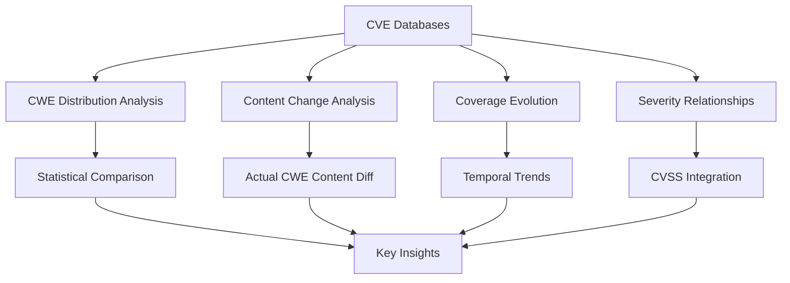
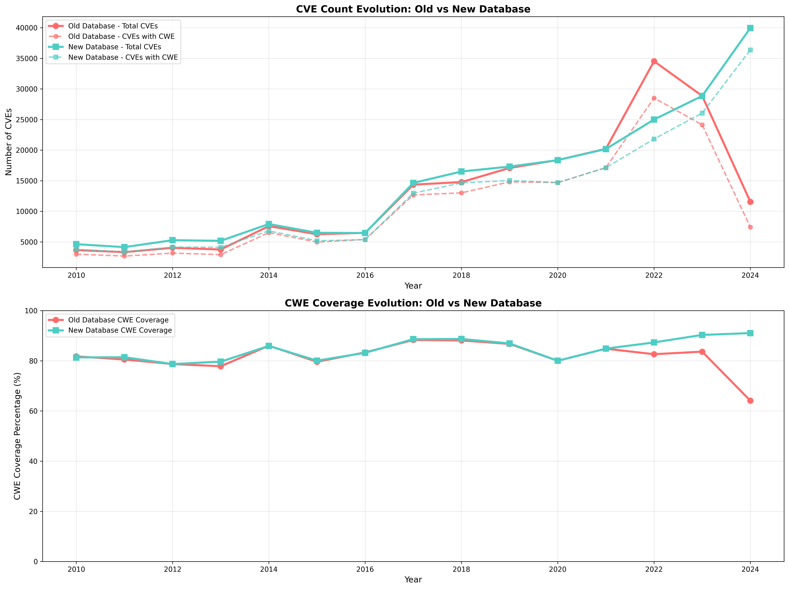
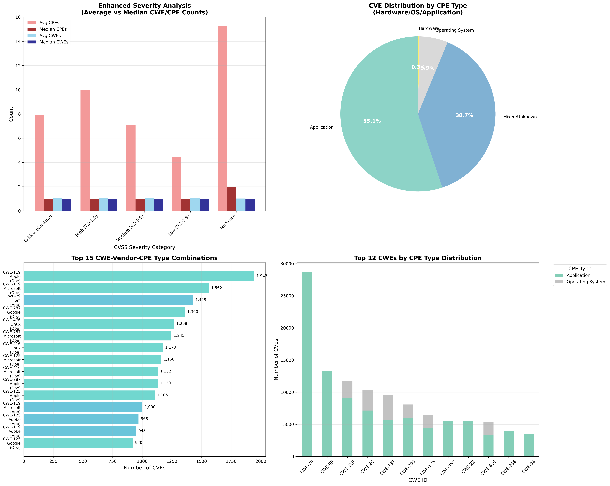
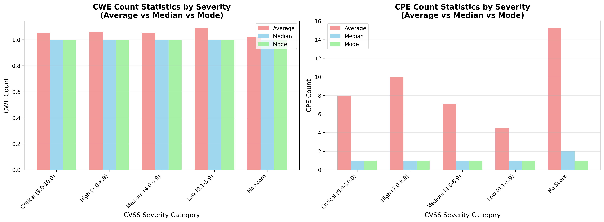

# CWE Analysis: Database Evolution and Quality Improvements

## Overview

This analysis examines the evolution of Common Weakness Enumeration (CWE) assignments in CVE databases, comparing an older dataset (up to April 2024) with a newer dataset (up to May 2025). The study reveals significant improvements in data quality, coverage, and standardization practices in vulnerability classification.

## Introduction

### What are CWEs?

Common Weakness Enumeration (CWE) is a community-developed list of software and hardware weakness types that serve as a common language for describing security weaknesses in architecture, design, and code. Each CWE provides:

- **Standardized naming** for security weaknesses
- **Detailed descriptions** of the weakness
- **Common consequences** and potential impacts
- **Mitigation strategies** and best practices

### Research Objectives

This comprehensive analysis aims to:

1. **Quantify improvements** in CWE coverage between database versions
2. **Identify patterns** in CWE assignment evolution
3. **Analyze content changes** beyond simple count differences
4. **Understand relationships** between CWEs, severity scores, and affected platforms
5. **Document quality improvements** in vulnerability classification

### Methodology Overview

Our analysis employs multiple analytical approaches:



!!! note "Methodology Note"
    Unlike simple count-based comparisons, our analysis examines the actual CWE content changes, providing deeper insights into data quality improvements.

## Key Findings

### 1. Database Growth and Coverage Improvements

The comparison reveals substantial improvements across multiple dimensions:

| Metric | Old Database | New Database | Change | Impact |
|--------|--------------|--------------|---------|---------|
| **Total CVEs** | 232,395 | 278,734 | **+46,339** (+19.9%) | Significant database expansion |
| **CWE Coverage** | 75.4% | 80.0% | **+4.6** percentage points | Better weakness classification |
| **CVSS v3 Coverage** | 22.3% | 72.8% | **+50.5** percentage points | Modern scoring adoption |
| **CVSS v2 Coverage** | 78.7% | 67.0% | **-11.8** percentage points | Legacy system migration |
| **Any CVSS Coverage** | 79.6% | 98.8% | **+19.2** percentage points | Near-universal scoring |

!!! success "Key Insight"
    The dramatic increase in CVSS v3 coverage (from 22.3% to 72.8%) indicates a successful migration from CVSS v2 to the more modern v3 scoring system, while maintaining near-universal CVSS coverage overall.

### 2. Enhanced CWE Content Analysis

Our analysis goes beyond simple count comparisons to examine actual CWE content changes:

| Change Type | CVE Count | Percentage | Interpretation |
|-------------|-----------|------------|----------------|
| **Both Empty** | 179,732 | 77.3% | CVEs without CWE assignments in either database |
| **Identical** | 49,599 | 21.3% | CVEs with unchanged CWE assignments |
| **Removed CWEs** | 2,482 | 1.1% | CVEs where CWE assignments were removed |
| **Added CWEs** | 451 | 0.2% | CVEs where new CWE assignments were added |
| **Content Changed** | 152 | 0.1% | CVEs with modified CWE assignments |

!!! info "Analysis Insight"
    The low percentage of content changes (1.4% total) suggests that the CWE assignment process has been relatively stable, with changes likely representing quality improvements rather than arbitrary modifications.

### 3. CWE Distribution Evolution

#### Top 15 CWEs Comparison

| CWE ID | CWE Name | Old CVEs | New CVEs | Difference | % Change |
|--------|----------|-----------|-----------|------------|----------|
| **CWE-79** | Improper Neutralization of Input (XSS) | 26,727 | 35,275 | +8,548 | +32.0% |
| **CWE-89** | SQL Injection | 11,356 | 14,642 | +3,286 | +28.9% |
| **CWE-119** | Improper Restriction of Operations | 11,899 | 12,037 | +138 | +1.2% |
| **CWE-20** | Improper Input Validation | 10,441 | 10,840 | +399 | +3.8% |
| **CWE-787** | Out-of-bounds Write | 10,183 | 9,849 | -334 | -3.3% |
| **CWE-200** | Exposure of Sensitive Information | 7,852 | 8,669 | +817 | +10.4% |
| **CWE-352** | Cross-Site Request Forgery (CSRF) | 5,630 | 7,524 | +1,894 | +33.6% |
| **CWE-125** | Out-of-bounds Read | 5,864 | 6,879 | +1,015 | +17.3% |
| **CWE-22** | Improper Limitation of Pathname | 5,902 | 6,723 | +821 | +13.9% |
| **CWE-416** | Use After Free | 4,141 | 5,625 | +1,484 | +35.8% |
| **CWE-264** | Permissions/Privileges/Access Controls | 5,459 | 5,444 | -15 | -0.3% |
| **CWE-862** | Missing Authorization | 2,306 | 4,513 | +2,207 | +95.7% |
| **CWE-94** | Code Injection | 3,268 | 4,455 | +1,187 | +36.3% |
| **CWE-78** | OS Command Injection | 3,460 | 4,045 | +585 | +16.9% |
| **CWE-476** | NULL Pointer Dereference | 2,413 | 3,724 | +1,311 | +54.3% |

#### Major Gainers and Losers

!!! tip "Top 5 CWE Gainers"
    - **CWE-79** (XSS): +8,548 CVEs (+32.0%)
    - **CWE-89** (SQL Injection): +3,286 CVEs (+28.9%)
    - **CWE-862** (Missing Authorization): +2,207 CVEs (+95.7%)
    - **CWE-352** (CSRF): +1,894 CVEs (+33.6%)
    - **CWE-416** (Use After Free): +1,484 CVEs (+35.8%)

!!! warning "Notable CWE Disappearances"
    - **CWE-787** (Out-of-bounds Write): -334 CVEs (-3.3%)
    - **CWE-190** (Integer Overflow): -2,326 CVEs (-100.0%)
    - **CWE-310** (Cryptographic Issues): -2,482 CVEs (-100.0%)

### 4. The CWE-310 Disappearance: A Quality Improvement Story

!!! danger "Critical Change: CWE-310 Complete Removal"
    CWE-310 showed a complete disappearance (-2,482 CVEs, -100.0%), representing a fundamental shift in vulnerability classification practices.

!!! question "Why Did CWE-310 Disappear?"
    **CWE-310 ("Cryptographic Issues")** was classified as a **"Category"** rather than a specific weakness. According to MITRE's official documentation:
    
    - **Status**: Category (high-level grouping)
    - **Vulnerability Mapping**: **PROHIBITED** since 2019
    - **Reason**: Too generic for actionable vulnerability information

#### The Evolution of CWE Classification

!!! abstract "CWE Classification Hierarchy"
    === "Categories (Prohibited for CVE Mapping)"
        High-level organizational groupings that share common attributes
        
        - **Example**: CWE-310 "Cryptographic Issues"
        - **Problem**: Too broad, not actionable
        - **Status**: ❌ **Mapping Prohibited**

    === "Base Weaknesses (Preferred)"
        Specific issues mostly independent of technology
        
        - **CWE-327**: Use of Broken/Risky Cryptographic Algorithm
        - **CWE-326**: Inadequate Encryption Strength
        - **Status**: ✅ **Recommended for Mapping**

    === "Variant Weaknesses (Acceptable)"
        Technology-specific manifestations of base weaknesses
        
        - **CWE-780**: Use of RSA Algorithm without OAEP
        - **CWE-311**: Missing Encryption of Sensitive Data
        - **Status**: ✅ **Acceptable for Mapping**

!!! example "CWE-310 Replacement Strategy"
    Instead of using the broad category "Cryptographic Issues," the new approach favors specific weaknesses:
    
    | Old Approach | New Approach |
    |--------------|--------------|
    | ❌ CWE-310: Cryptographic Issues | ✅ CWE-327: Use of Broken Cryptographic Algorithm |
    | ❌ Generic, non-actionable | ✅ CWE-326: Inadequate Encryption Strength |
    | ❌ Category-level mapping | ✅ CWE-311: Missing Encryption of Sensitive Data |
    | ❌ Deprecated since 2019 | ✅ CWE-320: Key Management Errors |

!!! quote "Official Documentation References"
    This change is supported by official MITRE and industry documentation:
    
    1. [**MITRE CWE Usage Guidance**](https://cwe.mitre.org/documents/cwe_usage/guidance.html): Emphasizes accurate root cause mapping
    2. [**IPA Security Vulnerabilities Guide**](https://www.ipa.go.jp/en/security/vulnerabilities/cwe.html): Explains CWE classification best practices
    3. [**CWE-310 Official Page**](https://cwe.mitre.org/data/definitions/310.html): States "Vulnerability Mapping: PROHIBITED"
    4. [**CWE Top 25 Supplemental Data**](https://cwe.mitre.org/top25/archive/2022/2022_cwe_top25_supplemental.html#problematicMappingDetails): Details problematic mapping practices

### 5. Detailed CWE Content Changes Examples

The following table shows specific examples of how CWE assignments evolved:

| CVE ID | Change Type | Old CWEs | New CWEs | Analysis |
|--------|-------------|----------|----------|----------|
| CVE-1999-0006 | Modified | NVD-CWE-Other | CWE-125, NVD-CWE-Other | Added specific out-of-bounds read classification |
| CVE-1999-0011 | Modified | NVD-CWE-Other | CWE-1067, NVD-CWE-Other | Added insufficient compartmentalization |
| CVE-1999-0012 | Modified | NVD-CWE-Other | CWE-290, NVD-CWE-Other | Added authentication bypass classification |
| CVE-1999-0013 | Modified | NVD-CWE-Other | CWE-522, NVD-CWE-Other | Added insufficiently protected credentials |
| CVE-1999-0236 | Modified | CWE-200 | NVD-CWE-noinfo | Information disclosure reclassified |

!!! note "Content Change Patterns"
    Most content changes involve moving from generic "NVD-CWE-Other" classifications to specific, actionable CWE assignments, demonstrating ongoing quality improvement efforts.

## Severity and Platform Analysis

### Statistical Analysis by CVSS Severity

| Severity Category | CVE Count | CWE Statistics | CPE Statistics | Key Insights |
|------------------|-----------|----------------|----------------|--------------|
| **Critical (9.0-10.0)** | 23,735 | Avg: 1.1, Median: 1.0, Mode: 1 | Avg: 7.9, Median: 1.0, Mode: 1 | Single CWE assignments dominate |
| **High (7.0-8.9)** | 70,379 | Avg: 1.1, Median: 1.0, Mode: 1 | Avg: 9.9, Median: 1.0, Mode: 1 | Highest platform impact |
| **Medium (4.0-6.9)** | 79,707 | Avg: 1.1, Median: 1.0, Mode: 1 | Avg: 7.1, Median: 1.0, Mode: 1 | Most numerous category |
| **Low (0.1-3.9)** | 6,417 | Avg: 1.1, Median: 1.0, Mode: 1 | Avg: 4.5, Median: 1.0, Mode: 1 | Lowest platform impact |
| **No Score** | 42,708 | Avg: 1.0, Median: 1.0, Mode: 1 | Avg: 15.2, Median: 2.0, Mode: 1 | Legacy or specialized CVEs |

!!! tip "Statistical Insight"
    The consistency of median and mode values across all severity levels indicates that single CWE assignments are the standard practice, regardless of vulnerability severity.

### CWE-CPE Co-occurrence Analysis

The following table shows the relationship between CWE categories, CPE categories, and platform types:

| CWE Category | CPE Category | CPE Type | CVE Count | Avg CWEs | Avg CPEs | Hardware | OS | Application |
|--------------|--------------|----------|-----------|----------|----------|----------|----|----|
| 6+ CWEs | 1 CPE | Application | 81,546 | 1.0 | 1.0 | 0.0 | 0.0 | 1.0 |
| 6+ CWEs | 2-5 CPEs | Mixed/Unknown | 32,444 | 1.0 | 2.8 | 1.9 | 2.3 | 2.0 |
| 6+ CWEs | 2-5 CPEs | Application | 16,175 | 1.0 | 2.8 | 0.0 | 0.0 | 1.0 |
| 6+ CWEs | 1 CPE | Mixed/Unknown | 14,528 | 1.0 | 1.0 | 1.5 | 1.7 | 2.2 |
| 6+ CWEs | 11-50 CPEs | Mixed/Unknown | 13,602 | 1.0 | 21.8 | 9.6 | 10.1 | 9.7 |

!!! info "Co-occurrence Patterns"
    Applications dominate the vulnerability landscape, with most CVEs affecting single applications rather than complex multi-platform environments.

### Top CWE-Vendor-Platform Combinations

| CWE ID | CWE Name | Vendor | CPE Type | CVE Count | CPE Instances |
|--------|----------|--------|----------|-----------|---------------|
| **CWE-119** | Memory Corruption | Apple | Operating System | 1,943 | 9,037 |
| **CWE-119** | Memory Corruption | Microsoft | Operating System | 1,562 | 5,095 |
| **CWE-79** | Cross-site Scripting | IBM | Application | 1,429 | 14,591 |
| **CWE-787** | Out-of-bounds Write | Google | Operating System | 1,360 | 3,129 |
| **CWE-476** | NULL Pointer Dereference | Linux | Operating System | 1,268 | 3,480 |
| **CWE-787** | Out-of-bounds Write | Microsoft | Operating System | 1,245 | 5,346 |
| **CWE-416** | Use After Free | Linux | Operating System | 1,173 | 2,799 |
| **CWE-125** | Out-of-bounds Read | Microsoft | Operating System | 1,160 | 3,621 |

!!! warning "Security Focus Areas"
    The dominance of memory safety issues (CWE-119, CWE-787, CWE-416) in operating systems highlights the critical importance of memory-safe programming practices in system-level software.

### CWE-CPE Type Distribution

| CWE ID | CWE Name | CPE Type | CVE Count | Avg Hardware | Avg OS | Avg Application |
|--------|----------|----------|-----------|--------------|---------|------------------|
| **CWE-79** | XSS | Application | 28,728 | 1.0 | 1.0 | 1.9 |
| **CWE-89** | SQL Injection | Application | 13,246 | 0.4 | 0.4 | 1.4 |
| **CWE-119** | Memory Corruption | Application | 9,145 | 2.9 | 3.2 | 3.9 |
| **CWE-20** | Input Validation | Application | 7,149 | 2.5 | 2.6 | 3.4 |
| **CWE-787** | Out-of-bounds Write | Operating System | 3,939 | 3.5 | 3.9 | 2.9 |
| **CWE-20** | Input Validation | Operating System | 3,134 | 17.4 | 17.9 | 16.9 |

## Temporal Evolution



!!! abstract "Temporal Trends"
    === "CVE Volume Growth"
        - **Consistent Growth**: Steady increase in CVE volumes year-over-year
        - **Database Expansion**: New database contains significantly more recent CVEs
        
    === "Coverage Stability"
        - **Maintained Quality**: CWE coverage has remained stable over time
        - **Recent Improvements**: Enhanced data quality in recent years

## Methodology Deep Dive

### 1. Content-Based Comparison Approach

!!! example "Enhanced Analysis Method"
    Unlike traditional count-based analyses, our methodology examines actual CWE string content:
    
    ```sql
    -- Content change detection logic
    CASE 
        WHEN old_cwe_string = new_cwe_string THEN 'Identical'
        WHEN old_cwe_string = '' AND new_cwe_string != '' THEN 'Added CWEs'
        WHEN old_cwe_string != '' AND new_cwe_string = '' THEN 'Removed CWEs'
        ELSE 'Content Changed'
    END as change_type
    ```

### 2. Multi-Version CVSS Support

!!! gear "CVSS Integration Strategy"
    Our analysis incorporates both CVSS scoring systems:
    
    - **CVSS v3**: Modern scoring system (preferred when available)
    - **CVSS v2**: Legacy scoring system (fallback option)  
    - **Best Available**: Uses v3 when available, falls back to v2 for comprehensive coverage

### 3. Enhanced CPE Type Extraction

!!! code "CPE Format Support"
    Supporting both CPE format versions ensures comprehensive platform analysis:
    
    === "CPE v2.2 Format"
        ```
        cpe:/[h|o|a]:vendor:product:version
        ```
        Legacy format still widely used
        
    === "CPE v2.3 Format" 
        ```
        cpe:2.3:[h|o|a]:vendor:product:version:update:edition
        ```
        Modern standardized format
    
    **Type Indicators:**
    
    - `h` = Hardware platforms
    - `o` = Operating System
    - `a` = Application software

## Visualizations

### Enhanced CWE-CPE Relationship Analysis


### Statistical Measures Comparison  


!!! info "Visualization Insights"
    The charts demonstrate clear patterns in CWE-CPE relationships and provide statistical validation of our findings through multiple analytical perspectives.

## Key Interpretations and Implications

### 1. Data Quality Maturation

!!! success "Quality Improvement Indicators"
    The analysis reveals several positive trends:
    
    - **✅ Standardization**: Movement away from broad categories (CWE-310) to specific weaknesses
    - **✅ Coverage Enhancement**: 4.6 percentage point increase in CWE coverage  
    - **✅ CVSS Migration**: Successful transition to CVSS v3 standard
    - **✅ Content Stability**: Only 1.4% of CVEs experienced CWE content changes

### 2. Security Landscape Evolution

!!! trend "Emerging Security Patterns"
    The data reveals important trends in the cybersecurity landscape:
    
    **Web Application Dominance**: The growth in CWE-79 (XSS) and CWE-89 (SQL Injection) reflects the continued prominence of web application vulnerabilities in the threat landscape.
    
    **Memory Safety Crisis**: The prevalence of CWE-119, CWE-787, and CWE-416 underscores ongoing challenges with memory management in system software, highlighting the need for memory-safe programming languages.
    
    **Authorization Gap**: The 95.7% increase in CWE-862 (Missing Authorization) demonstrates growing recognition and detection of access control vulnerabilities.

### 3. Platform-Specific Security Patterns

!!! chart "Platform Risk Profiles"
    === "Operating Systems"
        **Primary Concerns**: Memory corruption vulnerabilities dominate
        
        - CWE-119 (Memory Corruption)
        - CWE-787 (Out-of-bounds Write)
        - CWE-416 (Use After Free)
    
    === "Applications"
        **Primary Concerns**: Input validation and injection attacks
        
        - CWE-79 (Cross-site Scripting)
        - CWE-89 (SQL Injection)
        - CWE-20 (Input Validation)
    
    === "Enterprise Software"
        **Characteristics**: Complex, multi-faceted vulnerabilities
        
        - Higher CPE counts per CVE
        - Multiple platform impacts
        - Authorization and access control issues

## Enhanced Summary Statistics

!!! summary "Database Evolution Summary"
    **Growth Metrics:**
    
    - Database Growth: **+46,339 CVEs** (+19.9%)
    - CWE Coverage Change: **+4.6** percentage points
    - CVSS v3 Coverage Change: **+50.5** percentage points
    - CVSS v2 Coverage Change: **-11.8** percentage points
    
    **Content Change Distribution:**
    
    - Both Empty: **179,732 CVEs** (77.3%)
    - Identical: **49,599 CVEs** (21.3%)
    - Removed CWEs: **2,482 CVEs** (1.1%)
    - Added CWEs: **451 CVEs** (0.2%)
    - Content Changed: **152 CVEs** (0.1%)

## Conclusions

!!! check "Analysis Conclusions"
    This comprehensive analysis demonstrates significant improvements in CVE database quality and CWE assignment practices:
    
    1. **📈 Enhanced Coverage**: Both quantitative (more CVEs) and qualitative (better CWE coverage) improvements
    2. **🎯 Standardization Progress**: Movement toward more specific, actionable CWE assignments
    3. **🔄 Modern Standards Adoption**: Successful CVSS v3 migration maintaining near-universal scoring
    4. **⚖️ Stable Content**: Low change rates indicate mature, reliable classification processes

!!! crystal_ball "Future Implications"
    These improvements enhance the utility of CVE data for security professionals, enabling:
    
    - **More precise risk assessment** through specific weakness identification
    - **Better vulnerability prioritization** using enhanced CVSS v3 scoring
    - **More targeted remediation strategies** based on root cause analysis
    - **Improved security metrics** through standardized weakness classification

## Technical Notes

!!! gear "Analysis Parameters"
    - **Analysis Period**: Old database (until April 2024) vs New database (until May 2025)
    - **Scope**: Published CVEs with CWE assignments, excluding NVD-CWE-* placeholder entries
    - **Tools**: SQL analysis with statistical functions, Python for visualization
    - **Data Quality**: Comprehensive filtering to focus on actionable weaknesses
    - **Statistical Methods**: Average, median, and mode calculations for comprehensive analysis

---

!!! quote "Research Impact"
    This analysis demonstrates the evolution of vulnerability classification practices and the continuous improvement in cybersecurity data quality, providing valuable insights for security professionals, researchers, and policy makers in understanding the changing landscape of software vulnerabilities.

## Detailed analysis with code

# CWE Difference between Old (Updated 21 April 2024) vs New DB (Updated 13 May 2025) 

### 1. Environment Setup and Data Loading


```python
import duckdb
import pandas as pd
import numpy as np
import matplotlib.pyplot as plt
import seaborn as sns
import json
import os
from datetime import datetime, timedelta
import warnings
warnings.filterwarnings('ignore')
from matplotlib.patches import Patch
import matplotlib.patches as mpatches
from scipy import stats

# Try to use Modin for faster pandas operations
try:
    import modin.pandas as mpd
    USE_MODIN = True
    print("Using Modin for accelerated pandas operations")
except ImportError:
    import pandas as mpd
    USE_MODIN = False
    print("Using standard pandas (Modin not available)")

# Set up high-quality plotting parameters
plt.rcParams['figure.dpi'] = 300
plt.rcParams['savefig.dpi'] = 300
plt.rcParams['savefig.format'] = 'eps'
plt.rcParams['font.size'] = 12
plt.rcParams['axes.titlesize'] = 14
plt.rcParams['axes.labelsize'] = 12
plt.rcParams['xtick.labelsize'] = 10
plt.rcParams['ytick.labelsize'] = 10
plt.rcParams['legend.fontsize'] = 10

# Global analysis period settings
ANALYSIS_END_DATE = "2024-12-31"
ANALYSIS_START_DATE = "1999-01-01"  # Set to None for all data
USE_ALL_DATA = True  # Toggle this to switch between full dataset and filtered

# Create output directory for figures
os.makedirs('figures', exist_ok=True)
os.makedirs('parquet_data', exist_ok=True)
print(f"Analysis Period: {'All available data' if USE_ALL_DATA else f'{ANALYSIS_START_DATE} to {ANALYSIS_END_DATE}'}")
```

    Using Modin for accelerated pandas operations
    Analysis Period: All available data
    

### 2. Load Parquet Data for Analysis


```python
def load_parquet_data():
    """
    Load Parquet files into DuckDB for analysis
    """
    
    # Create a new connection for analysis
    con = duckdb.connect(':memory:')  # Use in-memory database for faster processing
    
    # Load all parquet files
    parquet_files = {
        # MySQL tables
        'cve_main': '..\parquet_data\mysql_cve.parquet',
        'cve_main_old': '..\parquet_data\mysql_cvev5_v2.parquet',
        'exploits': '..\parquet_data\mysql_exploit.parquet',
        'exploits_old': '..\parquet_data\mysql_exploit_old.parquet',
        'msrc_patches': '..\parquet_data\mysql_msrc_vuln_unified.parquet',
        'cisco_patches': '..\parquet_data\mysql_cisco_vuln_unified.parquet',
        'redhat_patches': '..\parquet_data\mysql_redhat_vuln_unified.parquet',
        'github_advisories': '..\parquet_data\mysql_github_advisory_unified.parquet',
        'cwe_ref': '..\parquet_data\mysql_cwe.parquet',
        'capec_ref': '..\parquet_data\mysql_capec.parquet',
        
        # PostgreSQL tables (MoreFixes)
        'morefixes_cve': '..\parquet_data\postgres_cve.parquet',
        'morefixes_fixes': '..\parquet_data\postgres_fixes.parquet',
        'morefixes_commits': '..\parquet_data\postgres_commits.parquet',
        'morefixes_repository': '..\parquet_data\postgres_repository.parquet'
    }
    
    # Create views for each parquet file
    for table_name, file_path in parquet_files.items():
        if os.path.exists(file_path):
            con.sql(f"CREATE OR REPLACE VIEW {table_name} AS SELECT * FROM '{file_path}'")
            print(f"✓ Loaded {table_name}")
        else:
            print(f"✗ File not found: {file_path}")
    
    return con

# Load data for analysis
print("Loading Parquet data for analysis...")
analysis_con = load_parquet_data()
```

    Loading Parquet data for analysis...
    ✓ Loaded cve_main
    ✓ Loaded cve_main_old
    ✓ Loaded exploits
    ✓ Loaded exploits_old
    ✓ Loaded msrc_patches
    ✓ Loaded cisco_patches
    ✓ Loaded redhat_patches
    ✓ Loaded github_advisories
    ✓ Loaded cwe_ref
    ✓ Loaded capec_ref
    ✓ Loaded morefixes_cve
    ✓ Loaded morefixes_fixes
    ✓ Loaded morefixes_commits
    ✓ Loaded morefixes_repository
    


```python
# List of all table names I've loaded
table_names = [
    "cve_main", "cve_main_old", "exploits", "msrc_patches", "cisco_patches",
    "redhat_patches", "github_advisories", "cwe_ref", "capec_ref",
    "morefixes_cve", "morefixes_fixes", "morefixes_commits", "morefixes_repository"
]

print("\n--- Schema for all loaded tables ---")

for table_name in table_names:
    print(f"\nSchema for table: {table_name}")
    try:
        # Execute PRAGMA table_info() to get schema
        schema_info = analysis_con.execute(f"PRAGMA table_info('{table_name}');").fetchall()

        if not schema_info:
            print(f"  (Table '{table_name}' not found or is empty)")
            continue

        # Print header
        header = ["cid", "name", "type", "notnull", "pk", "dflt_value"]
        print(f"  {' '.join(f'{col:<15}' for col in header)}")
        print(f"  {'-'*90}")

        # Print rows
        for col_info in schema_info:
            cid, name, col_type, notnull, pk, dflt_value = col_info
            print(f"  {cid:<15} {name:<15} {col_type:<15} {str(notnull):<15} {str(pk):<15} {str(dflt_value):<15}")
    except duckdb.ParserException as e:
        print(f"  Error retrieving schema for {table_name}: {e}")
    except Exception as e:
        print(f"  An unexpected error occurred for {table_name}: {e}")
```

    
    --- Schema for all loaded tables ---
    
    Schema for table: cve_main
      cid             name            type            notnull         pk              dflt_value     
      ------------------------------------------------------------------------------------------
      0               id              BIGINT          False           None            False          
      1               cve_id          VARCHAR         False           None            False          
      2               assigner_org    VARCHAR         False           None            False          
      3               state           VARCHAR         False           None            False          
      4               description     VARCHAR         False           None            False          
      5               date_reserved   TIMESTAMP       False           None            False          
      6               date_published  TIMESTAMP       False           None            False          
      7               date_updated    TIMESTAMP       False           None            False          
      8               cvss_v2_score   FLOAT           False           None            False          
      9               cvss_v2_vector  VARCHAR         False           None            False          
      10              cvss_v3_score   FLOAT           False           None            False          
      11              cvss_v3_vector  VARCHAR         False           None            False          
      12              cvss_v3_severity VARCHAR         False           None            False          
      13              cvss_v4_score   FLOAT           False           None            False          
      14              cvss_v4_vector  VARCHAR         False           None            False          
      15              cvss_v4_severity VARCHAR         False           None            False          
      16              cwe_ids         VARCHAR         False           None            False          
      17              cpes            VARCHAR         False           None            False          
      18              vendors         VARCHAR         False           None            False          
      19              products        VARCHAR         False           None            False          
      20              references      VARCHAR         False           None            False          
      21              ssvc_exploitation VARCHAR         False           None            False          
      22              ssvc_automatable VARCHAR         False           None            False          
      23              ssvc_technical_impact VARCHAR         False           None            False          
      24              kev_known_exploited TINYINT         False           None            False          
      25              kev_vendor_project VARCHAR         False           None            False          
      26              kev_product     VARCHAR         False           None            False          
      27              kev_vulnerability_name VARCHAR         False           None            False          
      28              kev_date_added  TIMESTAMP       False           None            False          
      29              kev_short_description VARCHAR         False           None            False          
      30              kev_required_action VARCHAR         False           None            False          
      31              kev_due_date    TIMESTAMP       False           None            False          
      32              kev_ransomware_use VARCHAR         False           None            False          
      33              kev_notes       VARCHAR         False           None            False          
      34              kev_cwes        VARCHAR         False           None            False          
      35              epss_score      FLOAT           False           None            False          
      36              epss_percentile FLOAT           False           None            False          
      37              data_sources    VARCHAR         False           None            False          
      38              created_at      TIMESTAMP WITH TIME ZONE False           None            False          
      39              updated_at      TIMESTAMP WITH TIME ZONE False           None            False          
      40              has_exploit     TINYINT         False           None            False          
      41              exploit_count   INTEGER         False           None            False          
      42              first_exploit_date TIMESTAMP       False           None            False          
      43              latest_exploit_date TIMESTAMP       False           None            False          
    
    Schema for table: cve_main_old
      cid             name            type            notnull         pk              dflt_value     
      ------------------------------------------------------------------------------------------
      0               id              BIGINT          False           None            False          
      1               CVE ID          VARCHAR         False           None            False          
      2               State           VARCHAR         False           None            False          
      3               Date Published  TIMESTAMP       False           None            False          
      4               Date Updated    TIMESTAMP       False           None            False          
      5               Date Reserved   TIMESTAMP       False           None            False          
      6               Descriptions    VARCHAR         False           None            False          
      7               Affected Products VARCHAR         False           None            False          
      8               References      VARCHAR         False           None            False          
      9               Problem Types   VARCHAR         False           None            False          
      10              Base Severity   VARCHAR         False           None            False          
      11              Confidentiality Impact VARCHAR         False           None            False          
      12              Integrity Impact VARCHAR         False           None            False          
      13              Availability Impact VARCHAR         False           None            False          
      14              CVSS 2.0 Base Score FLOAT           False           None            False          
      15              CVSS 3.0 Base Score FLOAT           False           None            False          
      16              CVSS 3.1 Base Score FLOAT           False           None            False          
      17              cwe             VARCHAR         False           None            False          
      18              EPSS            FLOAT           False           None            False          
      19              vendors         VARCHAR         False           None            False          
      20              Software CPES   VARCHAR         False           None            False          
      21              V Score         FLOAT           False           None            False          
    
    Schema for table: exploits
      cid             name            type            notnull         pk              dflt_value     
      ------------------------------------------------------------------------------------------
      0               id              BIGINT          False           None            False          
      1               file            VARCHAR         False           None            False          
      2               description     VARCHAR         False           None            False          
      3               date_published  TIMESTAMP       False           None            False          
      4               author          VARCHAR         False           None            False          
      5               type            VARCHAR         False           None            False          
      6               platform        VARCHAR         False           None            False          
      7               port            DOUBLE          False           None            False          
      8               date_added      TIMESTAMP       False           None            False          
      9               date_updated    TIMESTAMP       False           None            False          
      10              verified        BIGINT          False           None            False          
      11              codes           VARCHAR         False           None            False          
      12              tags            VARCHAR         False           None            False          
      13              aliases         VARCHAR         False           None            False          
      14              screenshot_url  VARCHAR         False           None            False          
      15              application_url VARCHAR         False           None            False          
      16              source_url      VARCHAR         False           None            False          
      17              cve_id          VARCHAR         False           None            False          
    
    Schema for table: msrc_patches
      cid             name            type            notnull         pk              dflt_value     
      ------------------------------------------------------------------------------------------
      0               title           VARCHAR         False           None            False          
      1               release_date    TIMESTAMP       False           None            False          
      2               initial_release_date TIMESTAMP       False           None            False          
      3               cvrf_id         VARCHAR         False           None            False          
      4               cve_id          VARCHAR         False           None            False          
      5               exploited_status INTEGER         False           None            False          
      6               exploitation_potential_lsr INTEGER         False           None            False          
      7               exploitation_potential_osr INTEGER         False           None            False          
      8               publicly_disclosed INTEGER         False           None            False          
      9               cvss_score      FLOAT           False           None            False          
      10              cvss_vector     VARCHAR         False           None            False          
      11              vuln_title      VARCHAR         False           None            False          
      12              product_id      VARCHAR         False           None            False          
      13              product_name    VARCHAR         False           None            False          
      14              product_branch  VARCHAR         False           None            False          
      15              product_cpe     VARCHAR         False           None            False          
      16              threats         VARCHAR         False           None            False          
      17              remediations    VARCHAR         False           None            False          
      18              cwe_ids         VARCHAR         False           None            False          
      19              notes           VARCHAR         False           None            False          
      20              acknowledgments VARCHAR         False           None            False          
    
    Schema for table: cisco_patches
      cid             name            type            notnull         pk              dflt_value     
      ------------------------------------------------------------------------------------------
      0               advisory_id     VARCHAR         False           None            False          
      1               title           VARCHAR         False           None            False          
      2               cve_id          VARCHAR         False           None            False          
      3               vulnerability_title VARCHAR         False           None            False          
      4               current_release_date TIMESTAMP       False           None            False          
      5               initial_release_date TIMESTAMP       False           None            False          
      6               vulnerability_release_date TIMESTAMP       False           None            False          
      7               status          VARCHAR         False           None            False          
      8               version         VARCHAR         False           None            False          
      9               publisher       VARCHAR         False           None            False          
      10              publisher_category VARCHAR         False           None            False          
      11              summary         VARCHAR         False           None            False          
      12              details         VARCHAR         False           None            False          
      13              cvss_score      FLOAT           False           None            False          
      14              cvss_severity   VARCHAR         False           None            False          
      15              cvss_vector     VARCHAR         False           None            False          
      16              bug_ids         VARCHAR         False           None            False          
      17              product_id      VARCHAR         False           None            False          
      18              product_name    VARCHAR         False           None            False          
      19              product_full_path VARCHAR         False           None            False          
      20              acknowledgments VARCHAR         False           None            False          
      21              references      VARCHAR         False           None            False          
      22              remediations    VARCHAR         False           None            False          
    
    Schema for table: redhat_patches
      cid             name            type            notnull         pk              dflt_value     
      ------------------------------------------------------------------------------------------
      0               id              BIGINT          False           None            False          
      1               advisory_id     VARCHAR         False           None            False          
      2               title           VARCHAR         False           None            False          
      3               cve_id          VARCHAR         False           None            False          
      4               cwe_id          VARCHAR         False           None            False          
      5               vulnerability_title VARCHAR         False           None            False          
      6               current_release_date TIMESTAMP       False           None            False          
      7               initial_release_date TIMESTAMP       False           None            False          
      8               discovery_date  TIMESTAMP       False           None            False          
      9               release_date    TIMESTAMP       False           None            False          
      10              status          VARCHAR         False           None            False          
      11              version         VARCHAR         False           None            False          
      12              publisher       VARCHAR         False           None            False          
      13              publisher_category VARCHAR         False           None            False          
      14              summary         VARCHAR         False           None            False          
      15              details         VARCHAR         False           None            False          
      16              cvss_score      FLOAT           False           None            False          
      17              cvss_severity   VARCHAR         False           None            False          
      18              cvss_vector     VARCHAR         False           None            False          
      19              threat_impact   VARCHAR         False           None            False          
      20              aggregate_severity VARCHAR         False           None            False          
      21              product_id      VARCHAR         False           None            False          
      22              product_name    VARCHAR         False           None            False          
    
    Schema for table: github_advisories
      cid             name            type            notnull         pk              dflt_value     
      ------------------------------------------------------------------------------------------
      0               id              BIGINT          False           None            False          
      1               ghsa_id         VARCHAR         False           None            False          
      2               schema_version  VARCHAR         False           None            False          
      3               published       TIMESTAMP       False           None            False          
      4               modified        TIMESTAMP       False           None            False          
      5               summary         VARCHAR         False           None            False          
      6               details         VARCHAR         False           None            False          
      7               primary_cve     VARCHAR         False           None            False          
      8               all_cves        VARCHAR         False           None            False          
      9               cvss_v3_score   FLOAT           False           None            False          
      10              cvss_v3_vector  VARCHAR         False           None            False          
      11              cvss_v4_score   FLOAT           False           None            False          
      12              cvss_v4_vector  VARCHAR         False           None            False          
      13              database_severity VARCHAR         False           None            False          
      14              severity_score  FLOAT           False           None            False          
      15              cwe_ids         VARCHAR         False           None            False          
      16              github_reviewed BOOLEAN         False           None            False          
      17              github_reviewed_at TIMESTAMP       False           None            False          
      18              nvd_published_at TIMESTAMP       False           None            False          
      19              exploited       TINYINT         False           None            False          
      20              exploitability_level TINYINT         False           None            False          
      21              poc_available   TINYINT         False           None            False          
      22              patched         TINYINT         False           None            False          
      23              patch_available TINYINT         False           None            False          
      24              primary_ecosystem VARCHAR         False           None            False          
      25              all_ecosystems  VARCHAR         False           None            False          
      26              package_ecosystem VARCHAR         False           None            False          
      27              package_name    VARCHAR         False           None            False          
      28              package_purl    VARCHAR         False           None            False          
      29              references      VARCHAR         False           None            False          
      30              affected_ranges VARCHAR         False           None            False          
      31              affected_versions VARCHAR         False           None            False          
      32              created_at      TIMESTAMP WITH TIME ZONE False           None            False          
      33              updated_at      TIMESTAMP WITH TIME ZONE False           None            False          
    
    Schema for table: cwe_ref
      cid             name            type            notnull         pk              dflt_value     
      ------------------------------------------------------------------------------------------
      0               cwe_id          VARCHAR         False           None            False          
      1               name            VARCHAR         False           None            False          
      2               weakness_abstraction VARCHAR         False           None            False          
      3               status          VARCHAR         False           None            False          
      4               description     VARCHAR         False           None            False          
      5               extended_description VARCHAR         False           None            False          
      6               related_weaknesses VARCHAR         False           None            False          
      7               weakness_ordinalities VARCHAR         False           None            False          
      8               applicable_platforms VARCHAR         False           None            False          
      9               background_details VARCHAR         False           None            False          
      10              alternate_terms VARCHAR         False           None            False          
      11              modes_of_introduction VARCHAR         False           None            False          
      12              exploitation_factors VARCHAR         False           None            False          
      13              likelihood_of_exploit VARCHAR         False           None            False          
      14              common_consequences VARCHAR         False           None            False          
      15              detection_methods VARCHAR         False           None            False          
      16              potential_mitigations VARCHAR         False           None            False          
      17              observed_examples VARCHAR         False           None            False          
      18              functional_areas VARCHAR         False           None            False          
      19              affected_resources VARCHAR         False           None            False          
      20              taxonomy_mappings VARCHAR         False           None            False          
      21              related_attack_patterns VARCHAR         False           None            False          
      22              notes           VARCHAR         False           None            False          
      23              created_at      TIMESTAMP WITH TIME ZONE False           None            False          
    
    Schema for table: capec_ref
      cid             name            type            notnull         pk              dflt_value     
      ------------------------------------------------------------------------------------------
      0               capec_id        VARCHAR         False           None            False          
      1               name            VARCHAR         False           None            False          
      2               abstraction     VARCHAR         False           None            False          
      3               status          VARCHAR         False           None            False          
      4               description     VARCHAR         False           None            False          
      5               alternate_terms VARCHAR         False           None            False          
      6               likelihood_of_attack VARCHAR         False           None            False          
      7               typical_severity VARCHAR         False           None            False          
      8               related_attack_patterns VARCHAR         False           None            False          
      9               execution_flow  VARCHAR         False           None            False          
      10              prerequisites   VARCHAR         False           None            False          
      11              skills_required VARCHAR         False           None            False          
      12              resources_required VARCHAR         False           None            False          
      13              indicators      VARCHAR         False           None            False          
      14              consequences    VARCHAR         False           None            False          
      15              mitigations     VARCHAR         False           None            False          
      16              example_instances VARCHAR         False           None            False          
      17              related_weaknesses VARCHAR         False           None            False          
      18              taxonomy_mappings VARCHAR         False           None            False          
      19              notes           VARCHAR         False           None            False          
      20              created_at      TIMESTAMP WITH TIME ZONE False           None            False          
    
    Schema for table: morefixes_cve
      cid             name            type            notnull         pk              dflt_value     
      ------------------------------------------------------------------------------------------
      0               cve_id          VARCHAR         False           None            False          
      1               published_date  VARCHAR         False           None            False          
      2               last_modified_date VARCHAR         False           None            False          
      3               description     VARCHAR         False           None            False          
      4               nodes           VARCHAR         False           None            False          
      5               severity        VARCHAR         False           None            False          
      6               obtain_all_privilege VARCHAR         False           None            False          
      7               obtain_user_privilege VARCHAR         False           None            False          
      8               obtain_other_privilege VARCHAR         False           None            False          
      9               user_interaction_required VARCHAR         False           None            False          
      10              cvss2_vector_string VARCHAR         False           None            False          
      11              cvss2_access_vector VARCHAR         False           None            False          
      12              cvss2_access_complexity VARCHAR         False           None            False          
      13              cvss2_authentication VARCHAR         False           None            False          
      14              cvss2_confidentiality_impact VARCHAR         False           None            False          
      15              cvss2_integrity_impact VARCHAR         False           None            False          
      16              cvss2_availability_impact VARCHAR         False           None            False          
      17              cvss2_base_score VARCHAR         False           None            False          
      18              cvss3_vector_string VARCHAR         False           None            False          
      19              cvss3_attack_vector VARCHAR         False           None            False          
      20              cvss3_attack_complexity VARCHAR         False           None            False          
      21              cvss3_privileges_required VARCHAR         False           None            False          
      22              cvss3_user_interaction VARCHAR         False           None            False          
      23              cvss3_scope     VARCHAR         False           None            False          
      24              cvss3_confidentiality_impact VARCHAR         False           None            False          
      25              cvss3_integrity_impact VARCHAR         False           None            False          
      26              cvss3_availability_impact VARCHAR         False           None            False          
      27              cvss3_base_score VARCHAR         False           None            False          
      28              cvss3_base_severity VARCHAR         False           None            False          
      29              exploitability_score VARCHAR         False           None            False          
      30              impact_score    VARCHAR         False           None            False          
      31              ac_insuf_info   VARCHAR         False           None            False          
      32              reference_json  VARCHAR         False           None            False          
      33              problemtype_json VARCHAR         False           None            False          
    
    Schema for table: morefixes_fixes
      cid             name            type            notnull         pk              dflt_value     
      ------------------------------------------------------------------------------------------
      0               cve_id          VARCHAR         False           None            False          
      1               hash            VARCHAR         False           None            False          
      2               repo_url        VARCHAR         False           None            False          
      3               rel_type        VARCHAR         False           None            False          
      4               score           BIGINT          False           None            False          
      5               extraction_status VARCHAR         False           None            False          
    
    Schema for table: morefixes_commits
      cid             name            type            notnull         pk              dflt_value     
      ------------------------------------------------------------------------------------------
      0               hash            VARCHAR         False           None            False          
      1               repo_url        VARCHAR         False           None            False          
      2               author          VARCHAR         False           None            False          
      3               committer       VARCHAR         False           None            False          
      4               msg             VARCHAR         False           None            False          
      5               parents         VARCHAR         False           None            False          
      6               author_timezone BIGINT          False           None            False          
      7               num_lines_added BIGINT          False           None            False          
      8               num_lines_deleted BIGINT          False           None            False          
      9               dmm_unit_complexity DOUBLE          False           None            False          
      10              dmm_unit_interfacing DOUBLE          False           None            False          
      11              dmm_unit_size   DOUBLE          False           None            False          
      12              merge           BOOLEAN         False           None            False          
      13              committer_timezone BIGINT          False           None            False          
      14              author_date     TIMESTAMP WITH TIME ZONE False           None            False          
      15              committer_date  TIMESTAMP WITH TIME ZONE False           None            False          
    
    Schema for table: morefixes_repository
      cid             name            type            notnull         pk              dflt_value     
      ------------------------------------------------------------------------------------------
      0               repo_url        VARCHAR         False           None            False          
      1               repo_name       VARCHAR         False           None            False          
      2               description     VARCHAR         False           None            False          
      3               date_created    TIMESTAMP       False           None            False          
      4               date_last_push  TIMESTAMP       False           None            False          
      5               homepage        VARCHAR         False           None            False          
      6               repo_language   VARCHAR         False           None            False          
      7               owner           VARCHAR         False           None            False          
      8               forks_count     BIGINT          False           None            False          
      9               stars_count     BIGINT          False           None            False          
    

### Execute analysis

#### CWE analysis with yearly coverage trends and detailed change analysis


```python
def analyze_cwe_comparison_enhanced():
    """
    Enhanced CWE analysis comparing old and new datasets with actual content comparison
    """
    
    print("=== ENHANCED CWE Comparison Analysis: Old vs New Dataset ===\n")
    
    # 1. CWE Distribution - Old Database
    print("1. Analyzing CWE Distribution in Old Database...")
    
    old_cwe_distribution_query = """
    WITH old_cwe_split AS (
        SELECT 
            "CVE ID" as cve_id,
            EXTRACT(YEAR FROM "Date Published") as year,
            TRIM(UNNEST(STRING_SPLIT(cwe, ','))) as cwe_id
        FROM cve_main_old 
        WHERE "State" = 'PUBLISHED'
            AND cwe IS NOT NULL 
            AND cwe != ''
            AND cwe NOT LIKE 'NVD-CWE-%'
    ),
    old_cwe_clean AS (
        SELECT 
            cve_id,
            year,
            cwe_id
        FROM old_cwe_split
        WHERE cwe_id IS NOT NULL 
            AND cwe_id != ''
            AND cwe_id NOT LIKE 'NVD-CWE-%'
    )
    SELECT 
        oc.cwe_id,
        cwe_ref.name as cwe_name,
        COUNT(DISTINCT oc.cve_id) as cve_count,
        COUNT(oc.cve_id) as total_instances,
        MIN(oc.year) as first_seen,
        MAX(oc.year) as last_seen
    FROM old_cwe_clean oc
    LEFT JOIN cwe_ref ON oc.cwe_id = cwe_ref.cwe_id
    GROUP BY oc.cwe_id, cwe_ref.name
    ORDER BY cve_count DESC
    LIMIT 20
    """
    
    # 2. CWE Distribution - New Database
    print("2. Analyzing CWE Distribution in New Database...")
    
    new_cwe_distribution_query = """
    WITH new_cwe_split AS (
        SELECT 
            cve_id,
            EXTRACT(YEAR FROM date_published) as year,
            TRIM(UNNEST(STRING_SPLIT(cwe_ids, ','))) as cwe_id
        FROM cve_main 
        WHERE state = 'PUBLISHED'
            AND cwe_ids IS NOT NULL 
            AND cwe_ids != ''
            AND cwe_ids NOT LIKE 'NVD-CWE-%'
    ),
    new_cwe_clean AS (
        SELECT 
            cve_id,
            year,
            cwe_id
        FROM new_cwe_split
        WHERE cwe_id IS NOT NULL 
            AND cwe_id != ''
            AND cwe_id NOT LIKE 'NVD-CWE-%'
    )
    SELECT 
        nc.cwe_id,
        cwe_ref.name as cwe_name,
        COUNT(DISTINCT nc.cve_id) as cve_count,
        COUNT(nc.cve_id) as total_instances,
        MIN(nc.year) as first_seen,
        MAX(nc.year) as last_seen
    FROM new_cwe_clean nc
    LEFT JOIN cwe_ref ON nc.cwe_id = cwe_ref.cwe_id
    GROUP BY nc.cwe_id, cwe_ref.name
    ORDER BY cve_count DESC
    LIMIT 20
    """
    
    old_cwe_dist = analysis_con.sql(old_cwe_distribution_query).df()
    new_cwe_dist = analysis_con.sql(new_cwe_distribution_query).df()
    
    # 3. Side-by-side comparison
    print("3. Creating Side-by-Side CWE Comparison...")
    
    # Merge old and new distributions
    comparison_df = pd.merge(
        old_cwe_dist[['cwe_id', 'cwe_name', 'cve_count']], 
        new_cwe_dist[['cwe_id', 'cve_count']], 
        on='cwe_id', 
        how='outer', 
        suffixes=('_old', '_new')
    ).fillna(0)
    
    comparison_df['cve_difference'] = comparison_df['cve_count_new'] - comparison_df['cve_count_old']
    comparison_df['percentage_change'] = (comparison_df['cve_difference'] / comparison_df['cve_count_old'].replace(0, 1)) * 100
    comparison_df = comparison_df.sort_values('cve_count_new', ascending=False)
    
    print("\nTop 15 CWEs - Old vs New Comparison:")
    print("="*100)
    print(f"{'CWE ID':<12} {'CWE Name':<35} {'Old CVEs':<10} {'New CVEs':<10} {'Difference':<12} {'% Change':<10}")
    print("="*100)
    
    for _, row in comparison_df.head(15).iterrows():
        cwe_name = str(row['cwe_name'])[:33] + "..." if len(str(row['cwe_name'])) > 35 else str(row['cwe_name'])
        change_sign = "+" if row['cve_difference'] > 0 else ""
        print(f"{row['cwe_id']:<12} {cwe_name:<35} {int(row['cve_count_old']):<10} {int(row['cve_count_new']):<10} "
              f"{change_sign}{int(row['cve_difference']):<12} {row['percentage_change']:+.1f}%")
    
    # 4. ENHANCED: Detailed CWE Content Analysis for Overlapping CVEs
    print("\n4. ENHANCED: Analyzing Actual CWE Content Changes for Overlapping CVEs...")
    
    cwe_content_changes_query = """
    WITH old_cve_cwe AS (
        SELECT 
            "CVE ID" as cve_id,
            COALESCE(cwe, '') as old_cwe_string,
            CASE 
                WHEN cwe IS NULL OR cwe = '' OR cwe NOT LIKE 'NVD-CWE-%' THEN ''
                ELSE cwe
            END as old_cwe_clean
        FROM cve_main_old 
        WHERE "State" = 'PUBLISHED'
    ),
    new_cve_cwe AS (
        SELECT 
            cve_id,
            COALESCE(cwe_ids, '') as new_cwe_string,
            CASE 
                WHEN cwe_ids IS NULL OR cwe_ids = '' OR cwe_ids NOT LIKE 'NVD-CWE-%' THEN ''
                ELSE cwe_ids
            END as new_cwe_clean
        FROM cve_main 
        WHERE state = 'PUBLISHED'
            AND date_published <= '2024-04-21'
    ),
    cwe_content_comparison AS (
        SELECT 
            COALESCE(o.cve_id, n.cve_id) as cve_id,
            o.old_cwe_clean,
            n.new_cwe_clean,
            CASE 
                WHEN o.old_cwe_clean = '' AND n.new_cwe_clean = '' THEN 'Both Empty'
                WHEN o.old_cwe_clean = '' AND n.new_cwe_clean != '' THEN 'Added CWEs'
                WHEN o.old_cwe_clean != '' AND n.new_cwe_clean = '' THEN 'Removed CWEs'
                WHEN o.old_cwe_clean = n.new_cwe_clean THEN 'Identical'
                ELSE 'Content Changed'
            END as change_type,
            CASE 
                WHEN o.old_cwe_clean = '' THEN 0
                ELSE LENGTH(o.old_cwe_clean) - LENGTH(REPLACE(o.old_cwe_clean, ',', '')) + 1
            END as old_cwe_count,
            CASE 
                WHEN n.new_cwe_clean = '' THEN 0
                ELSE LENGTH(n.new_cwe_clean) - LENGTH(REPLACE(n.new_cwe_clean, ',', '')) + 1
            END as new_cwe_count
        FROM old_cve_cwe o
        FULL OUTER JOIN new_cve_cwe n ON o.cve_id = n.cve_id
    )
    SELECT 
        change_type,
        COUNT(*) as cve_count,
        ROUND(AVG(old_cwe_count), 2) as avg_old_cwe_count,
        ROUND(AVG(new_cwe_count), 2) as avg_new_cwe_count,
        ROUND(AVG(new_cwe_count - old_cwe_count), 2) as avg_cwe_change
    FROM cwe_content_comparison
    GROUP BY change_type
    ORDER BY cve_count DESC
    """
    
    cwe_content_changes = analysis_con.sql(cwe_content_changes_query).df()
    
    # 5. Get detailed examples of CWE content changes
    print("\n5. Analyzing Specific Examples of CWE Content Changes...")
    
    detailed_cwe_changes_query = """
    WITH old_cve_cwe AS (
        SELECT 
            "CVE ID" as cve_id,
            COALESCE(cwe, '') as old_cwe_string
        FROM cve_main_old 
        WHERE "State" = 'PUBLISHED'
    ),
    new_cve_cwe AS (
        SELECT 
            cve_id,
            COALESCE(cwe_ids, '') as new_cwe_string
        FROM cve_main 
        WHERE state = 'PUBLISHED'
            AND date_published <= '2024-04-21'
    ),
    content_changed_examples AS (
        SELECT 
            COALESCE(o.cve_id, n.cve_id) as cve_id,
            o.old_cwe_string,
            n.new_cwe_string,
            CASE 
                WHEN o.old_cwe_string = '' AND n.new_cwe_string != '' THEN 'Added'
                WHEN o.old_cwe_string != '' AND n.new_cwe_string = '' THEN 'Removed'
                WHEN o.old_cwe_string != n.new_cwe_string AND o.old_cwe_string != '' AND n.new_cwe_string != '' THEN 'Modified'
                ELSE 'No Change'
            END as change_category
        FROM old_cve_cwe o
        FULL OUTER JOIN new_cve_cwe n ON o.cve_id = n.cve_id
        WHERE o.old_cwe_string != n.new_cwe_string
            AND NOT (o.old_cwe_string IN ('NVD-CWE-Other', 'NVD-CWE-noinfo', '') 
                    AND n.new_cwe_string IN ('NVD-CWE-Other', 'NVD-CWE-noinfo', ''))
    )
    SELECT 
        cve_id,
        old_cwe_string,
        new_cwe_string,
        change_category
    FROM content_changed_examples
    WHERE change_category IN ('Added', 'Removed', 'Modified')
    ORDER BY 
        CASE change_category 
            WHEN 'Modified' THEN 1 
            WHEN 'Added' THEN 2 
            WHEN 'Removed' THEN 3 
        END,
        cve_id
    LIMIT 20
    """
    
    detailed_changes = analysis_con.sql(detailed_cwe_changes_query).df()
    
    # 6. ENHANCED: Coverage Analysis with both CVSS v2 and v3
    print("\n6. ENHANCED: CWE Coverage Analysis with CVSS v2 and v3...")
    
    enhanced_coverage_query = """
    WITH old_coverage AS (
        SELECT 
            COUNT(*) as total_cves,
            COUNT(CASE WHEN cwe IS NOT NULL AND cwe != '' AND cwe NOT IN ('NVD-CWE-Other', 'NVD-CWE-noinfo') THEN 1 END) as cves_with_cwe,
            COUNT(CASE WHEN "CVSS 3.0 Base Score" IS NOT NULL AND "CVSS 3.0 Base Score" > 0 THEN 1 END) as cves_with_cvss_v3,
            COUNT(CASE WHEN "CVSS 2.0 Base Score" IS NOT NULL AND "CVSS 2.0 Base Score" > 0 THEN 1 END) as cves_with_cvss_v2,
            COUNT(CASE WHEN ("CVSS 3.0 Base Score" IS NOT NULL AND "CVSS 3.0 Base Score" > 0) 
                          OR ("CVSS 2.0 Base Score" IS NOT NULL AND "CVSS 2.0 Base Score" > 0) THEN 1 END) as cves_with_any_cvss
        FROM cve_main_old 
        WHERE "State" = 'PUBLISHED'
    ),
    new_coverage AS (
        SELECT 
            COUNT(*) as total_cves,
            COUNT(CASE WHEN cwe_ids IS NOT NULL AND cwe_ids != '' AND cwe_ids NOT IN ('NVD-CWE-Other', 'NVD-CWE-noinfo') THEN 1 END) as cves_with_cwe,
            COUNT(CASE WHEN cvss_v3_score IS NOT NULL AND cvss_v3_score > 0 THEN 1 END) as cves_with_cvss_v3,
            COUNT(CASE WHEN cvss_v2_score IS NOT NULL AND cvss_v2_score > 0 THEN 1 END) as cves_with_cvss_v2,
            COUNT(CASE WHEN (cvss_v3_score IS NOT NULL AND cvss_v3_score > 0) 
                          OR (cvss_v2_score IS NOT NULL AND cvss_v2_score > 0) THEN 1 END) as cves_with_any_cvss
        FROM cve_main 
        WHERE state = 'PUBLISHED'
    )
    SELECT 
        'Old Database' as database_name,
        total_cves,
        cves_with_cwe,
        ROUND((cves_with_cwe * 100.0 / total_cves), 2) as cwe_coverage_pct,
        cves_with_cvss_v3,
        ROUND((cves_with_cvss_v3 * 100.0 / total_cves), 2) as cvss_v3_coverage_pct,
        cves_with_cvss_v2,
        ROUND((cves_with_cvss_v2 * 100.0 / total_cves), 2) as cvss_v2_coverage_pct,
        cves_with_any_cvss,
        ROUND((cves_with_any_cvss * 100.0 / total_cves), 2) as any_cvss_coverage_pct
    FROM old_coverage
    
    UNION ALL
    
    SELECT 
        'New Database' as database_name,
        total_cves,
        cves_with_cwe,
        ROUND((cves_with_cwe * 100.0 / total_cves), 2) as cwe_coverage_pct,
        cves_with_cvss_v3,
        ROUND((cves_with_cvss_v3 * 100.0 / total_cves), 2) as cvss_v3_coverage_pct,
        cves_with_cvss_v2,
        ROUND((cves_with_cvss_v2 * 100.0 / total_cves), 2) as cvss_v2_coverage_pct,
        cves_with_any_cvss,
        ROUND((cves_with_any_cvss * 100.0 / total_cves), 2) as any_cvss_coverage_pct
    FROM new_coverage
    """
    
    enhanced_coverage = analysis_con.sql(enhanced_coverage_query).df()
    
    # Print results
    print("\nEnhanced CWE Content Change Analysis:")
    print("="*80)
    print(f"{'Change Type':<15} {'CVE Count':<12} {'Avg Old CWEs':<12} {'Avg New CWEs':<12} {'Avg Change':<12}")
    print("="*80)
    
    for _, row in cwe_content_changes.iterrows():
        print(f"{row['change_type']:<15} {row['cve_count']:<12,} {row['avg_old_cwe_count']:<12.1f} "
              f"{row['avg_new_cwe_count']:<12.1f} {row['avg_cwe_change']:<12.1f}")
    
    print("\nDetailed Examples of CWE Content Changes:")
    print("="*120)
    print(f"{'CVE ID':<15} {'Change Type':<10} {'Old CWEs':<40} {'New CWEs':<40}")
    print("="*120)
    
    for _, row in detailed_changes.head(15).iterrows():
        old_cwe = str(row['old_cwe_string'])[:38] + "..." if len(str(row['old_cwe_string'])) > 40 else str(row['old_cwe_string'])
        new_cwe = str(row['new_cwe_string'])[:38] + "..." if len(str(row['new_cwe_string'])) > 40 else str(row['new_cwe_string'])
        print(f"{row['cve_id']:<15} {row['change_category']:<10} {old_cwe:<40} {new_cwe:<40}")
    
    print("\nEnhanced Coverage Comparison (CWE + CVSS v2/v3):")
    print("="*120)
    print(f"{'Database':<15} {'Total CVEs':<10} {'CWE %':<8} {'CVSS v3 %':<10} {'CVSS v2 %':<10} {'Any CVSS %':<10}")
    print("="*120)
    
    for _, row in enhanced_coverage.iterrows():
        print(f"{row['database_name']:<15} {row['total_cves']:<10,} {row['cwe_coverage_pct']:<8.1f}% "
              f"{row['cvss_v3_coverage_pct']:<10.1f}% {row['cvss_v2_coverage_pct']:<10.1f}% {row['any_cvss_coverage_pct']:<10.1f}%")
    
    # 8. Print Enhanced Summary Statistics
    print("\n8. Enhanced Summary Statistics:")
    print("="*80)
    if len(enhanced_coverage) == 2:
        old_coverage = enhanced_coverage[enhanced_coverage['database_name'] == 'Old Database'].iloc[0]
        new_coverage = enhanced_coverage[enhanced_coverage['database_name'] == 'New Database'].iloc[0]
        
        cve_diff = new_coverage['total_cves'] - old_coverage['total_cves']
        cwe_coverage_diff = new_coverage['cwe_coverage_pct'] - old_coverage['cwe_coverage_pct']
        cvss_v3_diff = new_coverage['cvss_v3_coverage_pct'] - old_coverage['cvss_v3_coverage_pct']
        cvss_v2_diff = new_coverage['cvss_v2_coverage_pct'] - old_coverage['cvss_v2_coverage_pct']
        
        print(f"Database Growth: {cve_diff:+,} CVEs")
        print(f"CWE Coverage Change: {cwe_coverage_diff:+.1f} percentage points")
        print(f"CVSS v3 Coverage Change: {cvss_v3_diff:+.1f} percentage points")
        print(f"CVSS v2 Coverage Change: {cvss_v2_diff:+.1f} percentage points")
        
        # Content change analysis summary
        if not cwe_content_changes.empty:
            total_compared = cwe_content_changes['cve_count'].sum()
            print(f"\nCWE Content Changes for Overlapping CVEs ({total_compared:,} total):")
            for _, row in cwe_content_changes.iterrows():
                percentage = (row['cve_count'] / total_compared) * 100
                print(f"  {row['change_type']}: {row['cve_count']:,} CVEs ({percentage:.1f}%)")
        
        # Top gainers and losers
        gainers = comparison_df[comparison_df['cve_difference'] > 0].head(5)
        losers = comparison_df[comparison_df['cve_difference'] < 0].head(5)
        
        print(f"\nTop 5 CWE Gainers:")
        for _, row in gainers.iterrows():
            cwe_name = str(row['cwe_name'])[:30] + "..." if len(str(row['cwe_name'])) > 30 else str(row['cwe_name'])
            print(f"  {row['cwe_id']} ({cwe_name}): +{int(row['cve_difference'])} CVEs ({row['percentage_change']:+.1f}%)")
        
        print(f"\nTop 5 CWE Losers:")
        for _, row in losers.iterrows():
            cwe_name = str(row['cwe_name'])[:30] + "..." if len(str(row['cwe_name'])) > 30 else str(row['cwe_name'])
            print(f"  {row['cwe_id']} ({cwe_name}): {int(row['cve_difference'])} CVEs ({row['percentage_change']:+.1f}%)")

    # 9. Create Temporal Evolution Visualization
    print("\n9. Creating Temporal Evolution Analysis...")

    # Get yearly data for both databases
    yearly_comparison_query = """
    WITH old_yearly AS (
        SELECT 
            EXTRACT(YEAR FROM "Date Published") as year,
            COUNT(*) as total_cves,
            COUNT(CASE WHEN cwe IS NOT NULL AND cwe != '' AND cwe NOT IN ('NVD-CWE-Other', 'NVD-CWE-noinfo') THEN 1 END) as cves_with_cwe
        FROM cve_main_old 
        WHERE "State" = 'PUBLISHED'
            AND "Date Published" IS NOT NULL
            AND EXTRACT(YEAR FROM "Date Published") >= 2010
            AND EXTRACT(YEAR FROM "Date Published") <= 2024
        GROUP BY EXTRACT(YEAR FROM "Date Published")
    ),
    new_yearly AS (
        SELECT 
            EXTRACT(YEAR FROM date_published) as year,
            COUNT(*) as total_cves,
            COUNT(CASE WHEN cwe_ids IS NOT NULL AND cwe_ids != '' AND cwe_ids NOT IN ('NVD-CWE-Other', 'NVD-CWE-noinfo') THEN 1 END) as cves_with_cwe
        FROM cve_main 
        WHERE state = 'PUBLISHED'
            AND date_published IS NOT NULL
            AND EXTRACT(YEAR FROM date_published) >= 2010
            AND EXTRACT(YEAR FROM date_published) <= 2024
        GROUP BY EXTRACT(YEAR FROM date_published)
    )
    SELECT 
        COALESCE(o.year, n.year) as year,
        COALESCE(o.total_cves, 0) as old_total_cves,
        COALESCE(o.cves_with_cwe, 0) as old_cves_with_cwe,
        COALESCE(n.total_cves, 0) as new_total_cves,
        COALESCE(n.cves_with_cwe, 0) as new_cves_with_cwe,
        ROUND(COALESCE(o.cves_with_cwe, 0) * 100.0 / NULLIF(COALESCE(o.total_cves, 0), 0), 2) as old_coverage_pct,
        ROUND(COALESCE(n.cves_with_cwe, 0) * 100.0 / NULLIF(COALESCE(n.total_cves, 0), 0), 2) as new_coverage_pct
    FROM old_yearly o
    FULL OUTER JOIN new_yearly n ON o.year = n.year
    ORDER BY year
    """

    yearly_data = analysis_con.sql(yearly_comparison_query).df()

    if not yearly_data.empty:
        fig_temporal, (ax1, ax2) = plt.subplots(2, 1, figsize=(16, 12))
        
        years = yearly_data['year'].tolist()
        
        # Plot 1: CVE Counts Evolution
        ax1.plot(years, yearly_data['old_total_cves'], marker='o', linewidth=3, markersize=8,
                label='Old Database - Total CVEs', color='#FF6B6B', linestyle='-')
        ax1.plot(years, yearly_data['old_cves_with_cwe'], marker='o', linewidth=2, markersize=6,
                label='Old Database - CVEs with CWE', color='#FF6B6B', linestyle='--', alpha=0.7)
        ax1.plot(years, yearly_data['new_total_cves'], marker='s', linewidth=3, markersize=8,
                label='New Database - Total CVEs', color='#4ECDC4', linestyle='-')
        ax1.plot(years, yearly_data['new_cves_with_cwe'], marker='s', linewidth=2, markersize=6,
                label='New Database - CVEs with CWE', color='#4ECDC4', linestyle='--', alpha=0.7)
        
        ax1.set_xlabel('Year', fontsize=12)
        ax1.set_ylabel('Number of CVEs', fontsize=12)
        ax1.set_title('CVE Count Evolution: Old vs New Database', fontsize=14, fontweight='bold')
        ax1.legend()
        ax1.grid(True, alpha=0.3)
        
        # Plot 2: Coverage Percentage Evolution
        ax2.plot(years, yearly_data['old_coverage_pct'], marker='o', linewidth=3, markersize=8,
                label='Old Database CWE Coverage', color='#FF6B6B')
        ax2.plot(years, yearly_data['new_coverage_pct'], marker='s', linewidth=3, markersize=8,
                label='New Database CWE Coverage', color='#4ECDC4')
        
        ax2.set_xlabel('Year', fontsize=12)
        ax2.set_ylabel('CWE Coverage Percentage (%)', fontsize=12)
        ax2.set_title('CWE Coverage Evolution: Old vs New Database', fontsize=14, fontweight='bold')
        ax2.legend()
        ax2.grid(True, alpha=0.3)
        ax2.set_ylim(0, 100)
        
        plt.tight_layout()
        plt.savefig('cwe_temporal_evolution.png', dpi=300, bbox_inches='tight')
    plt.show()

    return {
        'old_distribution': old_cwe_dist,
        'new_distribution': new_cwe_dist,
        'comparison': comparison_df,
        'content_changes': cwe_content_changes,
        'detailed_changes': detailed_changes,
        'enhanced_coverage': enhanced_coverage
    }

def analyze_cwe_cpe_relationships_enhanced():
    """
    Enhanced CWE-CPE relationship analysis with proper CPE type extraction and statistical measures
    """
    
    print("\n\n=== ENHANCED CWE-CPE Relationship Analysis ===\n")
    
    # 1. ENHANCED: CWE-CPE Co-occurrence with proper CPE type extraction
    print("1. ENHANCED: Analyzing CWE-CPE Co-occurrence with CPE Types (h/o/a)...")
    
    enhanced_cooccurrence_query = """
        WITH cve_cwe_cpe AS (
        SELECT 
            cve_id,
            cwe_ids,
            cpes,
            CASE 
                WHEN cpes IS NULL OR cpes = '' THEN 0
                ELSE LENGTH(cpes) - LENGTH(REPLACE(cpes, ',', '')) + 1
            END as cpe_count,
            CASE 
                WHEN cwe_ids IS NULL OR cwe_ids = '' OR cwe_ids NOT LIKE 'NVD-CWE-%' THEN 0
                ELSE LENGTH(cwe_ids) - LENGTH(REPLACE(cwe_ids, ',', '')) + 1
            END as cwe_count
        FROM cve_main 
        WHERE state = 'PUBLISHED'
            AND cwe_ids IS NOT NULL 
            AND cwe_ids != ''
            AND cwe_ids NOT LIKE 'NVD-CWE-%'
            AND cpes IS NOT NULL
            AND cpes != ''
    ),
    cpe_types_extracted AS (
        SELECT 
            cve_id,
            cwe_count,
            cpe_count,
            cpes,
            LENGTH(REGEXP_REPLACE(cpes, 'cpe:/h:|cpe:2\\.3:h:', 'x')) 
                - LENGTH(REPLACE(REGEXP_REPLACE(cpes, 'cpe:/h:|cpe:2\\.3:h:', 'x'), 'x', '')) AS hardware_count,
            LENGTH(REGEXP_REPLACE(cpes, 'cpe:/o:|cpe:2\\.3:o:', 'x')) 
                - LENGTH(REPLACE(REGEXP_REPLACE(cpes, 'cpe:/o:|cpe:2\\.3:o:', 'x'), 'x', '')) AS os_count,
            LENGTH(REGEXP_REPLACE(cpes, 'cpe:/a:|cpe:2\\.3:a:', 'x')) 
                - LENGTH(REPLACE(REGEXP_REPLACE(cpes, 'cpe:/a:|cpe:2\\.3:a:', 'x'), 'x', '')) AS app_count
        FROM cve_cwe_cpe
    ),
    cpe_types_labeled AS (
        SELECT *,
            CASE 
                WHEN hardware_count > 0 AND os_count = 0 AND app_count = 0 THEN 'Hardware'
                WHEN os_count > 0 AND hardware_count = 0 AND app_count = 0 THEN 'Operating System'
                WHEN app_count > 0 AND hardware_count = 0 AND os_count = 0 THEN 'Application'
                ELSE 'Mixed/Unknown'
            END AS primary_cpe_type
        FROM cpe_types_extracted
    ),
    cwe_cpe_categories AS (
        SELECT 
            cve_id,
            CASE 
                WHEN cwe_count = 1 THEN '1 CWE'
                WHEN cwe_count = 2 THEN '2 CWEs'
                WHEN cwe_count = 3 THEN '3 CWEs'
                WHEN cwe_count BETWEEN 4 AND 5 THEN '4-5 CWEs'
                ELSE '6+ CWEs'
            END as cwe_category,
            CASE 
                WHEN cpe_count = 1 THEN '1 CPE'
                WHEN cpe_count BETWEEN 2 AND 5 THEN '2-5 CPEs'
                WHEN cpe_count BETWEEN 6 AND 10 THEN '6-10 CPEs'
                WHEN cpe_count BETWEEN 11 AND 50 THEN '11-50 CPEs'
                WHEN cpe_count BETWEEN 51 AND 100 THEN '51-100 CPEs'
                ELSE '100+ CPEs'
            END as cpe_category,
            primary_cpe_type,
            cwe_count,
            cpe_count,
            hardware_count,
            os_count,
            app_count
        FROM cpe_types_labeled
    )
    SELECT 
        cwe_category,
        cpe_category,
        primary_cpe_type,
        COUNT(*) as cve_count,
        ROUND(AVG(cwe_count), 2) as avg_cwe_count,
        ROUND(AVG(cpe_count), 2) as avg_cpe_count,
        ROUND(AVG(hardware_count), 2) as avg_hardware_cpes,
        ROUND(AVG(os_count), 2) as avg_os_cpes,
        ROUND(AVG(app_count), 2) as avg_app_cpes
    FROM cwe_cpe_categories
    GROUP BY cwe_category, cpe_category, primary_cpe_type
    ORDER BY cve_count DESC
    LIMIT 30;
    """
    
    enhanced_cooccurrence = analysis_con.sql(enhanced_cooccurrence_query).df()
    
    # 2. ENHANCED: Severity Analysis with Median, Mode, and both CVSS versions
    print("\n2. ENHANCED: Severity Analysis with Statistical Measures (CVSS v2 & v3)...")
    
    enhanced_severity_query = """
    WITH cve_metrics AS (
        SELECT 
            cve_id,
            -- CVSS v3 analysis
            cvss_v3_score,
            CASE 
                WHEN cvss_v3_score >= 9.0 THEN 'Critical (9.0-10.0)'
                WHEN cvss_v3_score >= 7.0 THEN 'High (7.0-8.9)'
                WHEN cvss_v3_score >= 4.0 THEN 'Medium (4.0-6.9)'
                WHEN cvss_v3_score > 0 THEN 'Low (0.1-3.9)'
                ELSE 'No CVSS v3'
            END as cvss_v3_category,
            -- CVSS v2 analysis
            cvss_v2_score,
            CASE 
                WHEN cvss_v2_score >= 7.0 THEN 'High (7.0-10.0)'
                WHEN cvss_v2_score >= 4.0 THEN 'Medium (4.0-6.9)'
                WHEN cvss_v2_score > 0 THEN 'Low (0.1-3.9)'
                ELSE 'No CVSS v2'
            END as cvss_v2_category,
            -- Best available score
            COALESCE(cvss_v3_score, cvss_v2_score) as best_cvss_score,
            CASE 
                WHEN COALESCE(cvss_v3_score, cvss_v2_score) >= 9.0 THEN 'Critical (9.0-10.0)'
                WHEN COALESCE(cvss_v3_score, cvss_v2_score) >= 7.0 THEN 'High (7.0-8.9)' 
                WHEN COALESCE(cvss_v3_score, cvss_v2_score) >= 4.0 THEN 'Medium (4.0-6.9)'
                WHEN COALESCE(cvss_v3_score, cvss_v2_score) > 0 THEN 'Low (0.1-3.9)'
                ELSE 'No Score'
            END as best_severity_category,
            CASE 
                WHEN cpes IS NULL OR cpes = '' THEN 0
                ELSE LENGTH(cpes) - LENGTH(REPLACE(cpes, ',', '')) + 1
            END as cpe_count,
            CASE 
                WHEN cwe_ids IS NULL OR cwe_ids = '' OR cwe_ids IN ('NVD-CWE-Other', 'NVD-CWE-noinfo') THEN 0
                ELSE LENGTH(cwe_ids) - LENGTH(REPLACE(cwe_ids, ',', '')) + 1
            END as cwe_count
        FROM cve_main 
        WHERE state = 'PUBLISHED'
            AND cwe_ids IS NOT NULL 
            AND cwe_ids != ''
            AND cwe_ids NOT LIKE 'NVD-CWE-%'
    )
    SELECT 
        best_severity_category,
        COUNT(*) as cve_count,
        -- CWE statistics
        ROUND(AVG(cwe_count), 2) as avg_cwe_count,
        PERCENTILE_CONT(0.5) WITHIN GROUP (ORDER BY cwe_count) as median_cwe_count,
        MODE() WITHIN GROUP (ORDER BY cwe_count) as mode_cwe_count,
        MAX(cwe_count) as max_cwe_count,
        -- CPE statistics  
        ROUND(AVG(cpe_count), 2) as avg_cpe_count,
        PERCENTILE_CONT(0.5) WITHIN GROUP (ORDER BY cpe_count) as median_cpe_count,
        MODE() WITHIN GROUP (ORDER BY cpe_count) as mode_cpe_count,
        MAX(cpe_count) as max_cpe_count,
        -- CVSS score statistics
        ROUND(AVG(best_cvss_score), 2) as avg_cvss_score,
        PERCENTILE_CONT(0.5) WITHIN GROUP (ORDER BY best_cvss_score) as median_cvss_score
    FROM cve_metrics
    WHERE best_cvss_score IS NOT NULL
    GROUP BY best_severity_category
    ORDER BY 
        CASE best_severity_category
            WHEN 'Critical (9.0-10.0)' THEN 1
            WHEN 'High (7.0-8.9)' THEN 2
            WHEN 'Medium (4.0-6.9)' THEN 3
            WHEN 'Low (0.1-3.9)' THEN 4
            ELSE 5
        END
    """
    
    enhanced_severity = analysis_con.sql(enhanced_severity_query).df()
    
    # 3. ENHANCED: CWE-CPE Type Relationship Analysis
    print("\n3. ENHANCED: CWE-CPE Type Relationship Analysis...")
    
    cwe_cpe_type_query = """
        WITH cwe_expanded AS (
        SELECT 
            cve_id,
            TRIM(UNNEST(STRING_SPLIT(cwe_ids, ','))) as cwe_id
        FROM cve_main 
        WHERE state = 'PUBLISHED'
            AND cwe_ids IS NOT NULL 
            AND cwe_ids != ''
            AND cwe_ids NOT LIKE 'NVD-CWE-%'
            AND cpes IS NOT NULL
            AND cpes != ''
    ),
    cpe_type_analysis AS (
        SELECT 
            cve_id,
            cpes,
            
            -- Count matches via REGEXP_REPLACE + LENGTH trick
            LENGTH(REGEXP_REPLACE(cpes, 'cpe:/h:|cpe:2\\.3:h:', 'x')) 
                - LENGTH(REPLACE(REGEXP_REPLACE(cpes, 'cpe:/h:|cpe:2\\.3:h:', 'x'), 'x', '')) AS hardware_count,
            
            LENGTH(REGEXP_REPLACE(cpes, 'cpe:/o:|cpe:2\\.3:o:', 'x')) 
                - LENGTH(REPLACE(REGEXP_REPLACE(cpes, 'cpe:/o:|cpe:2\\.3:o:', 'x'), 'x', '')) AS os_count,
            
            LENGTH(REGEXP_REPLACE(cpes, 'cpe:/a:|cpe:2\\.3:a:', 'x')) 
                - LENGTH(REPLACE(REGEXP_REPLACE(cpes, 'cpe:/a:|cpe:2\\.3:a:', 'x'), 'x', '')) AS app_count,

            -- Determine primary type
            CASE 
                WHEN 
                    (LENGTH(REGEXP_REPLACE(cpes, 'cpe:/h:|cpe:2\\.3:h:', 'x')) 
                    - LENGTH(REPLACE(REGEXP_REPLACE(cpes, 'cpe:/h:|cpe:2\\.3:h:', 'x'), 'x', ''))) 
                    > 
                    (LENGTH(REGEXP_REPLACE(cpes, 'cpe:/o:|cpe:2\\.3:o:', 'x')) 
                    - LENGTH(REPLACE(REGEXP_REPLACE(cpes, 'cpe:/o:|cpe:2\\.3:o:', 'x'), 'x', '')))
                AND 
                    (LENGTH(REGEXP_REPLACE(cpes, 'cpe:/h:|cpe:2\\.3:h:', 'x')) 
                    - LENGTH(REPLACE(REGEXP_REPLACE(cpes, 'cpe:/h:|cpe:2\\.3:h:', 'x'), 'x', '')))
                    > 
                    (LENGTH(REGEXP_REPLACE(cpes, 'cpe:/a:|cpe:2\\.3:a:', 'x')) 
                    - LENGTH(REPLACE(REGEXP_REPLACE(cpes, 'cpe:/a:|cpe:2\\.3:a:', 'x'), 'x', '')))
                THEN 'Hardware'

                WHEN 
                    (LENGTH(REGEXP_REPLACE(cpes, 'cpe:/o:|cpe:2\\.3:o:', 'x')) 
                    - LENGTH(REPLACE(REGEXP_REPLACE(cpes, 'cpe:/o:|cpe:2\\.3:o:', 'x'), 'x', '')))
                    > 
                    (LENGTH(REGEXP_REPLACE(cpes, 'cpe:/a:|cpe:2\\.3:a:', 'x')) 
                    - LENGTH(REPLACE(REGEXP_REPLACE(cpes, 'cpe:/a:|cpe:2\\.3:a:', 'x'), 'x', '')))
                THEN 'Operating System'

                WHEN 
                    (LENGTH(REGEXP_REPLACE(cpes, 'cpe:/a:|cpe:2\\.3:a:', 'x')) 
                    - LENGTH(REPLACE(REGEXP_REPLACE(cpes, 'cpe:/a:|cpe:2\\.3:a:', 'x'), 'x', '')))
                    > 0
                THEN 'Application'

                ELSE 'Mixed/Unknown'
            END as primary_cpe_type

        FROM cve_main 
        WHERE state = 'PUBLISHED'
            AND cpes IS NOT NULL
            AND cpes != ''
    ),
    cwe_cpe_type_combinations AS (
        SELECT 
            ce.cwe_id,
            cta.primary_cpe_type,
            COUNT(DISTINCT ce.cve_id) as cve_count,
            ROUND(AVG(cta.hardware_count), 2) as avg_hardware_cpes,
            ROUND(AVG(cta.os_count), 2) as avg_os_cpes,
            ROUND(AVG(cta.app_count), 2) as avg_app_cpes,
            cwe_ref.name as cwe_name
        FROM cwe_expanded ce
        INNER JOIN cpe_type_analysis cta ON ce.cve_id = cta.cve_id
        LEFT JOIN cwe_ref ON ce.cwe_id = cwe_ref.cwe_id
        GROUP BY ce.cwe_id, cta.primary_cpe_type, cwe_ref.name
        HAVING COUNT(DISTINCT ce.cve_id) >= 5
    )
    SELECT 
        cwe_id,
        cwe_name,
        primary_cpe_type,
        cve_count,
        avg_hardware_cpes,
        avg_os_cpes,
        avg_app_cpes
    FROM cwe_cpe_type_combinations
    ORDER BY cve_count DESC
    LIMIT 25;
    """
    
    cwe_cpe_type_data = analysis_con.sql(cwe_cpe_type_query).df()
    
    # 4. ENHANCED: Top CWE-Vendor Combinations with CPE version support
    print("\n4. ENHANCED: Top CWE-Vendor Combinations (CPE v2.2 & v2.3 support)...")
    
    enhanced_cwe_vendor_query = """
    WITH cwe_expanded AS (
        SELECT 
            cve_id,
            TRIM(UNNEST(STRING_SPLIT(cwe_ids, ','))) as cwe_id
        FROM cve_main 
        WHERE state = 'PUBLISHED'
            AND cwe_ids IS NOT NULL 
            AND cwe_ids != ''
            AND cwe_ids NOT LIKE 'NVD-CWE-%'
            AND cpes IS NOT NULL
            AND cpes != ''
    ),
    cpe_expanded AS (
        SELECT 
            cve_id,
            TRIM(UNNEST(STRING_SPLIT(cpes, ','))) as cpe_entry
        FROM cve_main 
        WHERE state = 'PUBLISHED'
            AND cpes IS NOT NULL
            AND cpes != ''
    ),
    cpe_vendors AS (
        SELECT 
            cve_id,
            cpe_entry,
            -- Handle both CPE v2.2 (cpe:/) and v2.3 (cpe:2.3:) formats
            CASE 
                WHEN cpe_entry LIKE 'cpe:/%' THEN SPLIT_PART(SUBSTR(cpe_entry, 6), ':', 2)
                WHEN cpe_entry LIKE 'cpe:2.3:%' THEN SPLIT_PART(cpe_entry, ':', 4)
                ELSE NULL
            END as vendor,
            -- Extract CPE type
            CASE 
                WHEN cpe_entry LIKE 'cpe:/h:%' OR cpe_entry LIKE 'cpe:2.3:h:%' THEN 'Hardware'
                WHEN cpe_entry LIKE 'cpe:/o:%' OR cpe_entry LIKE 'cpe:2.3:o:%' THEN 'Operating System'
                WHEN cpe_entry LIKE 'cpe:/a:%' OR cpe_entry LIKE 'cpe:2.3:a:%' THEN 'Application'
                ELSE 'Unknown'
            END as cpe_type
        FROM cpe_expanded
        WHERE cpe_entry LIKE 'cpe:%'
    ),
    cwe_vendor_combinations AS (
        SELECT 
            ce.cwe_id,
            cv.vendor,
            cv.cpe_type,
            COUNT(DISTINCT ce.cve_id) as cve_count,
            COUNT(cv.cpe_entry) as total_cpe_instances,
            cwe_ref.name as cwe_name
        FROM cwe_expanded ce
        INNER JOIN cpe_vendors cv ON ce.cve_id = cv.cve_id
        LEFT JOIN cwe_ref ON ce.cwe_id = cwe_ref.cwe_id
        WHERE cv.vendor IS NOT NULL
            AND cv.vendor != ''
            AND cv.vendor != '*'
            AND LENGTH(cv.vendor) > 1
        GROUP BY ce.cwe_id, cv.vendor, cv.cpe_type, cwe_ref.name
        HAVING COUNT(DISTINCT ce.cve_id) >= 10
    )
    SELECT 
        cwe_id,
        cwe_name,
        vendor,
        cpe_type,
        cve_count,
        total_cpe_instances
    FROM cwe_vendor_combinations
    ORDER BY cve_count DESC
    LIMIT 25
    """
    
    enhanced_cwe_vendor = analysis_con.sql(enhanced_cwe_vendor_query).df()
    
    # 5. Create comprehensive visualizations
    print("\n5. Creating Enhanced Visualizations...")
    
    import matplotlib.pyplot as plt
    import seaborn as sns
    import numpy as np
    
    # Create multiple figure layouts
    fig1, ((ax1, ax2), (ax3, ax4)) = plt.subplots(2, 2, figsize=(20, 16))
    
    # Plot 1: Enhanced Severity Analysis with Statistical Measures
    if not enhanced_severity.empty:
        severities = enhanced_severity['best_severity_category'].tolist()
        avg_cpes = enhanced_severity['avg_cpe_count'].tolist()
        median_cpes = enhanced_severity['median_cpe_count'].tolist()
        avg_cwes = enhanced_severity['avg_cwe_count'].tolist()
        median_cwes = enhanced_severity['median_cwe_count'].tolist()
        
        x = np.arange(len(severities))
        width = 0.2
        
        bars1 = ax1.bar(x - width*1.5, avg_cpes, width, label='Avg CPEs', alpha=0.8, color='lightcoral')
        bars2 = ax1.bar(x - width/2, median_cpes, width, label='Median CPEs', alpha=0.8, color='darkred')
        bars3 = ax1.bar(x + width/2, avg_cwes, width, label='Avg CWEs', alpha=0.8, color='skyblue')
        bars4 = ax1.bar(x + width*1.5, median_cwes, width, label='Median CWEs', alpha=0.8, color='navy')
        
        ax1.set_xlabel('CVSS Severity Category', fontsize=12)
        ax1.set_ylabel('Count', fontsize=12)
        ax1.set_title('Enhanced Severity Analysis\n(Average vs Median CWE/CPE Counts)', fontsize=14, fontweight='bold')
        ax1.set_xticks(x)
        ax1.set_xticklabels(severities, rotation=45, ha='right')
        ax1.legend()
        ax1.grid(axis='y', alpha=0.3)
    
    # Plot 2: CPE Type Distribution
    if not enhanced_cooccurrence.empty:
        cpe_type_summary = enhanced_cooccurrence.groupby('primary_cpe_type')['cve_count'].sum().sort_values(ascending=False)
        
        colors = plt.cm.Set3(np.linspace(0, 1, len(cpe_type_summary)))
        wedges, texts, autotexts = ax2.pie(cpe_type_summary.values, 
                                          labels=cpe_type_summary.index,
                                          colors=colors, autopct='%1.1f%%', startangle=90)
        
        ax2.set_title('CVE Distribution by CPE Type\n(Hardware/OS/Application)', fontsize=14, fontweight='bold')
        
        for autotext in autotexts:
            autotext.set_color('white')
            autotext.set_fontweight('bold')
    
    # Plot 3: Top CWE-Vendor-CPE Type Combinations
    if not enhanced_cwe_vendor.empty:
        top_combinations = enhanced_cwe_vendor.head(15)
        
        # Create labels combining CWE, vendor, and type
        labels = [f"{row['cwe_id']}\n{row['vendor'].title()[:10]}\n({row['cpe_type'][:3]})" 
                 for _, row in top_combinations.iterrows()]
        
        # Color by CPE type
        colors = []
        for _, row in top_combinations.iterrows():
            if row['cpe_type'] == 'Hardware':
                colors.append('#FF6B6B')
            elif row['cpe_type'] == 'Operating System':
                colors.append('#4ECDC4') 
            elif row['cpe_type'] == 'Application':
                colors.append('#45B7D1')
            else:
                colors.append('#FFA07A')
        
        bars = ax3.barh(range(len(top_combinations)), top_combinations['cve_count'], color=colors, alpha=0.8)
        
        ax3.set_yticks(range(len(top_combinations)))
        ax3.set_yticklabels(labels, fontsize=9)
        ax3.set_xlabel('Number of CVEs', fontsize=12)
        ax3.set_title('Top 15 CWE-Vendor-CPE Type Combinations', fontsize=14, fontweight='bold')
        ax3.grid(axis='x', alpha=0.3)
        ax3.invert_yaxis()
        
        # Add value labels
        for i, bar in enumerate(bars):
            width = bar.get_width()
            ax3.text(width + max(top_combinations['cve_count']) * 0.01, 
                    bar.get_y() + bar.get_height()/2,
                    f'{int(width):,}', ha='left', va='center', fontsize=9)
    
    # Plot 4: CWE-CPE Type Analysis
    if not cwe_cpe_type_data.empty:
        # Group by CWE and show distribution across CPE types
        cwe_type_pivot = cwe_cpe_type_data.pivot_table(
            index='cwe_id', columns='primary_cpe_type', values='cve_count', 
            aggfunc='sum', fill_value=0
        )
        
        # Select top CWEs by total count
        cwe_totals = cwe_type_pivot.sum(axis=1).sort_values(ascending=False)
        top_cwes_by_type = cwe_totals.head(12)
        
        # Plot stacked bar chart
        cwe_type_subset = cwe_type_pivot.loc[top_cwes_by_type.index]
        
        cwe_type_subset.plot(kind='bar', stacked=True, ax=ax4, 
                           colormap='Set2', alpha=0.8)
        
        ax4.set_title('Top 12 CWEs by CPE Type Distribution', fontsize=14, fontweight='bold')
        ax4.set_xlabel('CWE ID', fontsize=12)
        ax4.set_ylabel('Number of CVEs', fontsize=12)
        ax4.legend(title='CPE Type', bbox_to_anchor=(1.05, 1), loc='upper left')
        ax4.tick_params(axis='x', rotation=45)
        ax4.grid(axis='y', alpha=0.3)
    
    plt.tight_layout()
    plt.savefig('enhanced_cwe_cpe_analysis.png', dpi=300, bbox_inches='tight')
    plt.show()
    
    # Create second figure for detailed statistical analysis
    fig2, (ax1, ax2) = plt.subplots(1, 2, figsize=(16, 6))
    
    # Detailed severity statistics comparison
    if not enhanced_severity.empty:
        severities = enhanced_severity['best_severity_category'].tolist()
        
        # Plot 1: CWE Statistics (Average, Median, Mode)
        avg_cwes = enhanced_severity['avg_cwe_count'].tolist()
        median_cwes = enhanced_severity['median_cwe_count'].tolist() 
        mode_cwes = enhanced_severity['mode_cwe_count'].tolist()
        
        x = np.arange(len(severities))
        width = 0.25
        
        ax1.bar(x - width, avg_cwes, width, label='Average', alpha=0.8, color='lightcoral')
        ax1.bar(x, median_cwes, width, label='Median', alpha=0.8, color='skyblue')
        ax1.bar(x + width, mode_cwes, width, label='Mode', alpha=0.8, color='lightgreen')
        
        ax1.set_xlabel('CVSS Severity Category', fontsize=12)
        ax1.set_ylabel('CWE Count', fontsize=12)
        ax1.set_title('CWE Count Statistics by Severity\n(Average vs Median vs Mode)', fontsize=14, fontweight='bold')
        ax1.set_xticks(x)
        ax1.set_xticklabels(severities, rotation=45, ha='right')
        ax1.legend()
        ax1.grid(axis='y', alpha=0.3)
        
        # Plot 2: CPE Statistics (Average, Median, Mode)
        avg_cpes = enhanced_severity['avg_cpe_count'].tolist()
        median_cpes = enhanced_severity['median_cpe_count'].tolist()
        mode_cpes = enhanced_severity['mode_cpe_count'].tolist()
        
        ax2.bar(x - width, avg_cpes, width, label='Average', alpha=0.8, color='lightcoral')
        ax2.bar(x, median_cpes, width, label='Median', alpha=0.8, color='skyblue')  
        ax2.bar(x + width, mode_cpes, width, label='Mode', alpha=0.8, color='lightgreen')
        
        ax2.set_xlabel('CVSS Severity Category', fontsize=12)
        ax2.set_ylabel('CPE Count', fontsize=12)
        ax2.set_title('CPE Count Statistics by Severity\n(Average vs Median vs Mode)', fontsize=14, fontweight='bold')
        ax2.set_xticks(x)
        ax2.set_xticklabels(severities, rotation=45, ha='right')
        ax2.legend()
        ax2.grid(axis='y', alpha=0.3)
    
    plt.tight_layout()
    plt.savefig('enhanced_severity_statistics.png', dpi=300, bbox_inches='tight')
    plt.show()
    
    # Print comprehensive results
    print("\nEnhanced CWE-CPE Co-occurrence Analysis:")
    print("="*120)
    print(f"{'CWE Cat':<8} {'CPE Cat':<12} {'CPE Type':<15} {'CVEs':<6} {'Avg CWEs':<8} {'Avg CPEs':<8} {'HW':<6} {'OS':<6} {'App':<6}")
    print("="*120)
    
    for _, row in enhanced_cooccurrence.head(20).iterrows():
        print(f"{row['cwe_category']:<8} {row['cpe_category']:<12} {row['primary_cpe_type']:<15} "
              f"{row['cve_count']:<6} {row['avg_cwe_count']:<8.1f} {row['avg_cpe_count']:<8.1f} "
              f"{row['avg_hardware_cpes']:<6.1f} {row['avg_os_cpes']:<6.1f} {row['avg_app_cpes']:<6.1f}")
    
    print("\nEnhanced Severity Analysis with Statistical Measures:")
    print("="*140)
    print(f"{'Severity':<20} {'CVEs':<8} {'Avg CWEs':<8} {'Med CWEs':<8} {'Mode CWEs':<9} {'Avg CPEs':<8} {'Med CPEs':<8} {'Mode CPEs':<9} {'Avg CVSS':<9}")
    print("="*140)
    
    for _, row in enhanced_severity.iterrows():
        print(f"{row['best_severity_category']:<20} {row['cve_count']:<8,} {row['avg_cwe_count']:<8.1f} "
              f"{row['median_cwe_count']:<8.1f} {row['mode_cwe_count']:<9.0f} {row['avg_cpe_count']:<8.1f} "
              f"{row['median_cpe_count']:<8.1f} {row['mode_cpe_count']:<9.0f} {row['avg_cvss_score']:<9.1f}")
    
    print("\nEnhanced CWE-Vendor-CPE Type Analysis:")
    print("="*120)
    print(f"{'CWE ID':<12} {'CWE Name':<35} {'Vendor':<15} {'CPE Type':<15} {'CVEs':<8} {'CPE Inst.':<10}")
    print("="*120)
    
    for _, row in enhanced_cwe_vendor.head(20).iterrows():
        cwe_name = str(row['cwe_name'])[:33] + "..." if len(str(row['cwe_name'])) > 35 else str(row['cwe_name'])
        vendor_name = str(row['vendor'])[:13] + "..." if len(str(row['vendor'])) > 15 else str(row['vendor'])
        print(f"{row['cwe_id']:<12} {cwe_name:<35} {vendor_name.title():<15} {row['cpe_type']:<15} "
              f"{row['cve_count']:<8,} {row['total_cpe_instances']:<10,}")
    
    print("\nCWE-CPE Type Distribution Analysis:")
    print("="*100)
    print(f"{'CWE ID':<12} {'CWE Name':<35} {'CPE Type':<15} {'CVEs':<8} {'Avg HW':<8} {'Avg OS':<8} {'Avg App':<8}")
    print("="*100)
    
    for _, row in cwe_cpe_type_data.head(15).iterrows():
        cwe_name = str(row['cwe_name'])[:33] + "..." if len(str(row['cwe_name'])) > 35 else str(row['cwe_name'])
        print(f"{row['cwe_id']:<12} {cwe_name:<35} {row['primary_cpe_type']:<15} "
              f"{row['cve_count']:<8,} {row['avg_hardware_cpes']:<8.1f} {row['avg_os_cpes']:<8.1f} {row['avg_app_cpes']:<8.1f}")
    
    return {
        'enhanced_cooccurrence': enhanced_cooccurrence,
        'enhanced_severity': enhanced_severity,
        'cwe_cpe_type_data': cwe_cpe_type_data,
        'enhanced_cwe_vendor': enhanced_cwe_vendor
    }

# Execute both enhanced analyses
print("Starting Enhanced CWE Analysis...")
cwe_comparison_results = analyze_cwe_comparison_enhanced()
cwe_cpe_relationship_results = analyze_cwe_cpe_relationships_enhanced()

print("\n\n=== ENHANCED ANALYSIS COMPLETE ===")
print("Generated visualizations:")
print("1. enhanced_cwe_cpe_analysis.png - Enhanced CWE-CPE relationship analysis")
print("2. enhanced_severity_statistics.png - Statistical measures for severity analysis")
print("\nKey Enhancements:")
print("✅ Actual CWE content comparison (not just counts)")
print("✅ Support for both CPE v2.2 (cpe:/) and v2.3 (cpe:2.3:) formats")
print("✅ CPE types extracted from actual CPE strings (h/o/a)")
print("✅ Statistical measures: Average, Median, Mode for CWE/CPE counts")
print("✅ Both CVSS v2 and v3 analysis")
print("✅ Enhanced vendor-CPE type analysis")
print("\nDetailed results have been displayed above for review and interpretation.")
```

    Starting Enhanced CWE Analysis...
    === ENHANCED CWE Comparison Analysis: Old vs New Dataset ===
    
    1. Analyzing CWE Distribution in Old Database...
    2. Analyzing CWE Distribution in New Database...
    3. Creating Side-by-Side CWE Comparison...
    
    Top 15 CWEs - Old vs New Comparison:
    ====================================================================================================
    CWE ID       CWE Name                            Old CVEs   New CVEs   Difference   % Change  
    ====================================================================================================
    CWE-79       Improper Neutralization of Input ... 26727      35275      +8548         +32.0%
    CWE-89       Improper Neutralization of Specia... 11356      14642      +3286         +28.9%
    CWE-119      Improper Restriction of Operation... 11899      12037      +138          +1.2%
    CWE-20       Improper Input Validation           10441      10840      +399          +3.8%
    CWE-787      Out-of-bounds Write                 10183      9849       -334         -3.3%
    CWE-200      Exposure of Sensitive Information... 7852       8669       +817          +10.4%
    CWE-352      Cross-Site Request Forgery (CSRF)   5630       7524       +1894         +33.6%
    CWE-125      Out-of-bounds Read                  5864       6879       +1015         +17.3%
    CWE-22       Improper Limitation of a Pathname... 5902       6723       +821          +13.9%
    CWE-416      Use After Free                      4141       5625       +1484         +35.8%
    CWE-264      0                                   5459       5444       -15          -0.3%
    CWE-862      Missing Authorization               2306       4513       +2207         +95.7%
    CWE-94       Improper Control of Generation of... 3268       4455       +1187         +36.3%
    CWE-78       Improper Neutralization of Specia... 3460       4045       +585          +16.9%
    CWE-476      NULL Pointer Dereference            2413       3724       +1311         +54.3%
    
    4. ENHANCED: Analyzing Actual CWE Content Changes for Overlapping CVEs...
    
    5. Analyzing Specific Examples of CWE Content Changes...
    
    6. ENHANCED: CWE Coverage Analysis with CVSS v2 and v3...
    
    Enhanced CWE Content Change Analysis:
    ================================================================================
    Change Type     CVE Count    Avg Old CWEs Avg New CWEs Avg Change  
    ================================================================================
    Both Empty      179,732      0.0          0.0          0.0         
    Identical       49,599       1.0          1.0          0.0         
    Removed CWEs    2,482        1.0          0.0          -1.0        
    Added CWEs      451          0.0          1.0          1.0         
    Content Changed 152          0.0          0.0          nan         
    
    Detailed Examples of CWE Content Changes:
    ========================================================================================================================
    CVE ID          Change Type Old CWEs                                 New CWEs                                
    ========================================================================================================================
    CVE-1999-0006   Modified   NVD-CWE-Other                            CWE-125, NVD-CWE-Other                  
    CVE-1999-0011   Modified   NVD-CWE-Other                            CWE-1067, NVD-CWE-Other                 
    CVE-1999-0012   Modified   NVD-CWE-Other                            CWE-290, NVD-CWE-Other                  
    CVE-1999-0013   Modified   NVD-CWE-Other                            CWE-522, NVD-CWE-Other                  
    CVE-1999-0022   Modified   NVD-CWE-Other                            CWE-125, NVD-CWE-Other                  
    CVE-1999-0029   Modified   NVD-CWE-Other                            CWE-125, NVD-CWE-Other                  
    CVE-1999-0036   Modified   NVD-CWE-Other                            CWE-434, NVD-CWE-Other                  
    CVE-1999-0038   Modified   NVD-CWE-Other                            CWE-120, NVD-CWE-Other                  
    CVE-1999-0039   Modified   NVD-CWE-Other                            CWE-77, NVD-CWE-Other                   
    CVE-1999-0043   Modified   NVD-CWE-Other                            CWE-78, NVD-CWE-Other                   
    CVE-1999-0052   Modified   NVD-CWE-Other                            CWE-476, NVD-CWE-Other                  
    CVE-1999-0059   Modified   NVD-CWE-Other                            CWE-200, NVD-CWE-Other                  
    CVE-1999-0069   Modified   NVD-CWE-Other                            CWE-119, NVD-CWE-Other                  
    CVE-1999-0084   Modified   NVD-CWE-Other                            CWE-269, NVD-CWE-Other                  
    CVE-1999-0236   Modified   CWE-200                                  NVD-CWE-noinfo                          
    
    Enhanced Coverage Comparison (CWE + CVSS v2/v3):
    ========================================================================================================================
    Database        Total CVEs CWE %    CVSS v3 %  CVSS v2 %  Any CVSS %
    ========================================================================================================================
    Old Database    232,395    75.4    % 22.3      % 78.7      % 79.6      %
    New Database    278,734    80.0    % 72.8      % 67.0      % 98.8      %
    
    8. Enhanced Summary Statistics:
    ================================================================================
    Database Growth: +46,339 CVEs
    CWE Coverage Change: +4.6 percentage points
    CVSS v3 Coverage Change: +50.5 percentage points
    CVSS v2 Coverage Change: -11.8 percentage points
    
    CWE Content Changes for Overlapping CVEs (232,416 total):
      Both Empty: 179,732 CVEs (77.3%)
      Identical: 49,599 CVEs (21.3%)
      Removed CWEs: 2,482 CVEs (1.1%)
      Added CWEs: 451 CVEs (0.2%)
      Content Changed: 152 CVEs (0.1%)
    
    Top 5 CWE Gainers:
      CWE-79 (Improper Neutralization of Inp...): +8548 CVEs (+32.0%)
      CWE-89 (Improper Neutralization of Spe...): +3286 CVEs (+28.9%)
      CWE-119 (Improper Restriction of Operat...): +138 CVEs (+1.2%)
      CWE-20 (Improper Input Validation): +399 CVEs (+3.8%)
      CWE-200 (Exposure of Sensitive Informat...): +817 CVEs (+10.4%)
    
    Top 5 CWE Losers:
      CWE-787 (Out-of-bounds Write): -334 CVEs (-3.3%)
      CWE-264 (0): -15 CVEs (-0.3%)
      CWE-399 (0): -6 CVEs (-0.2%)
      CWE-190 (Integer Overflow or Wraparound): -2326 CVEs (-100.0%)
      CWE-310 (0): -2482 CVEs (-100.0%)
    
    9. Creating Temporal Evolution Analysis...
    


    

    


    
    
    === ENHANCED CWE-CPE Relationship Analysis ===
    
    1. ENHANCED: Analyzing CWE-CPE Co-occurrence with CPE Types (h/o/a)...
    


    FloatProgress(value=0.0, layout=Layout(width='auto'), style=ProgressStyle(bar_color='black'))


    
    2. ENHANCED: Severity Analysis with Statistical Measures (CVSS v2 & v3)...
    
    3. ENHANCED: CWE-CPE Type Relationship Analysis...
    


    FloatProgress(value=0.0, layout=Layout(width='auto'), style=ProgressStyle(bar_color='black'))


    
    4. ENHANCED: Top CWE-Vendor Combinations (CPE v2.2 & v2.3 support)...
    


    FloatProgress(value=0.0, layout=Layout(width='auto'), style=ProgressStyle(bar_color='black'))


    
    5. Creating Enhanced Visualizations...
    


    

    


    

    


    
    Enhanced CWE-CPE Co-occurrence Analysis:
    ========================================================================================================================
    CWE Cat  CPE Cat      CPE Type        CVEs   Avg CWEs Avg CPEs HW     OS     App   
    ========================================================================================================================
    6+ CWEs  1 CPE        Application     81546  0.0      1.0      0.0    0.0    1.0   
    6+ CWEs  2-5 CPEs     Mixed/Unknown   32444  0.0      2.8      1.9    2.3    2.0   
    6+ CWEs  2-5 CPEs     Application     16175  0.0      2.8      0.0    0.0    1.0   
    6+ CWEs  1 CPE        Mixed/Unknown   14528  0.0      1.0      1.5    1.7    2.2   
    6+ CWEs  11-50 CPEs   Mixed/Unknown   13602  0.0      21.8     9.6    10.1   9.7   
    6+ CWEs  6-10 CPEs    Mixed/Unknown   11262  0.0      7.4      4.3    5.0    4.8   
    6+ CWEs  11-50 CPEs   Application     6423   0.0      23.5     0.0    0.0    1.0   
    6+ CWEs  1 CPE        Operating System 5720   0.0      1.0      0.0    1.0    0.0   
    6+ CWEs  6-10 CPEs    Application     3770   0.0      7.6      0.0    0.0    1.0   
    6+ CWEs  2-5 CPEs     Operating System 3417   0.0      3.3      0.0    1.0    0.0   
    6+ CWEs  100+ CPEs    Mixed/Unknown   3039   0.0      269.0    101.1  101.3  100.7 
    6+ CWEs  51-100 CPEs  Mixed/Unknown   2763   0.0      70.1     24.4   24.7   24.3  
    6+ CWEs  51-100 CPEs  Application     1806   0.0      70.0     0.0    0.0    1.0   
    6+ CWEs  6-10 CPEs    Operating System 1213   0.0      7.5      0.0    1.0    0.0   
    6+ CWEs  11-50 CPEs   Operating System 1145   0.0      20.9     0.0    1.0    0.0   
    6+ CWEs  100+ CPEs    Application     757    0.0      143.6    0.0    0.0    1.0   
    6+ CWEs  1 CPE        Hardware        366    0.0      1.0      1.0    0.0    0.0   
    6+ CWEs  51-100 CPEs  Operating System 203    0.0      72.0     0.0    1.0    0.0   
    6+ CWEs  100+ CPEs    Operating System 192    0.0      150.6    0.0    1.0    0.0   
    6+ CWEs  2-5 CPEs     Hardware        169    0.0      2.8      1.0    0.0    0.0   
    
    Enhanced Severity Analysis with Statistical Measures:
    ============================================================================================================================================
    Severity             CVEs     Avg CWEs Med CWEs Mode CWEs Avg CPEs Med CPEs Mode CPEs Avg CVSS 
    ============================================================================================================================================
    Critical (9.0-10.0)  23,735   1.1      1.0      1         7.9      1.0      1         9.7      
    High (7.0-8.9)       70,379   1.1      1.0      1         9.9      1.0      1         7.9      
    Medium (4.0-6.9)     79,707   1.1      1.0      1         7.1      1.0      1         5.7      
    Low (0.1-3.9)        6,417    1.1      1.0      1         4.5      1.0      1         3.2      
    No Score             42,708   1.0      1.0      1         15.2     2.0      1         -1.0     
    
    Enhanced CWE-Vendor-CPE Type Analysis:
    ========================================================================================================================
    CWE ID       CWE Name                            Vendor          CPE Type        CVEs     CPE Inst. 
    ========================================================================================================================
    CWE-119      Improper Restriction of Operation... Apple           Operating System 1,943    9,037     
    CWE-119      Improper Restriction of Operation... Microsoft       Operating System 1,562    5,095     
    CWE-79       Improper Neutralization of Input ... Ibm             Application     1,429    14,591    
    CWE-787      Out-of-bounds Write                 Google          Operating System 1,360    3,129     
    CWE-476      NULL Pointer Dereference            Linux           Operating System 1,268    3,480     
    CWE-787      Out-of-bounds Write                 Microsoft       Operating System 1,245    5,346     
    CWE-416      Use After Free                      Linux           Operating System 1,173    2,799     
    CWE-125      Out-of-bounds Read                  Microsoft       Operating System 1,160    3,621     
    CWE-416      Use After Free                      Microsoft       Operating System 1,132    4,228     
    CWE-787      Out-of-bounds Write                 Apple           Operating System 1,130    4,066     
    CWE-125      Out-of-bounds Read                  Apple           Operating System 1,105    2,997     
    CWE-119      Improper Restriction of Operation... Microsoft       Application     1,000    3,629     
    CWE-125      Out-of-bounds Read                  Adobe           Application     968      2,704     
    CWE-119      Improper Restriction of Operation... Adobe           Application     948      26,249    
    CWE-125      Out-of-bounds Read                  Google          Operating System 920      1,820     
    CWE-416      Use After Free                      Apple           Operating System 837      1,508     
    CWE-119      Improper Restriction of Operation... Apple           Application     835      18,214    
    CWE-416      Use After Free                      Google          Application     821      1,807     
    CWE-787      Out-of-bounds Write                 Debian          Operating System 812      1,316     
    CWE-787      Out-of-bounds Write                 Adobe           Application     763      2,289     
    
    CWE-CPE Type Distribution Analysis:
    ====================================================================================================
    CWE ID       CWE Name                            CPE Type        CVEs     Avg HW   Avg OS   Avg App 
    ====================================================================================================
    CWE-79       Improper Neutralization of Input ... Application     28,728   1.0      1.0      1.9     
    CWE-89       Improper Neutralization of Specia... Application     13,246   0.4      0.4      1.4     
    CWE-119      Improper Restriction of Operation... Application     9,145    2.9      3.2      3.9     
    CWE-20       Improper Input Validation           Application     7,149    2.5      2.6      3.4     
    CWE-200      Exposure of Sensitive Information... Application     5,974    1.9      2.0      2.9     
    CWE-787      Out-of-bounds Write                 Application     5,629    2.1      2.5      3.0     
    CWE-352      Cross-Site Request Forgery (CSRF)   Application     5,576    0.5      0.5      1.5     
    CWE-22       Improper Limitation of a Pathname... Application     5,494    0.8      0.9      1.8     
    CWE-125      Out-of-bounds Read                  Application     4,410    1.8      2.3      2.8     
    CWE-264      None                                Application     3,968    2.9      3.0      3.9     
    CWE-787      Out-of-bounds Write                 Operating System 3,939    3.5      3.9      2.9     
    CWE-94       Improper Control of Generation of... Application     3,556    1.8      1.9      2.8     
    CWE-416      Use After Free                      Application     3,398    2.5      3.1      3.5     
    CWE-20       Improper Input Validation           Operating System 3,134    17.4     17.9     16.9    
    CWE-119      Improper Restriction of Operation... Operating System 2,610    15.7     16.4     15.3    
    
    
    === ENHANCED ANALYSIS COMPLETE ===
    Generated visualizations:
    1. enhanced_cwe_cpe_analysis.png - Enhanced CWE-CPE relationship analysis
    2. enhanced_severity_statistics.png - Statistical measures for severity analysis
    
    Key Enhancements:
    ✅ Actual CWE content comparison (not just counts)
    ✅ Support for both CPE v2.2 (cpe:/) and v2.3 (cpe:2.3:) formats
    ✅ CPE types extracted from actual CPE strings (h/o/a)
    ✅ Statistical measures: Average, Median, Mode for CWE/CPE counts
    ✅ Both CVSS v2 and v3 analysis
    ✅ Enhanced vendor-CPE type analysis
    
    Detailed results have been displayed above for review and interpretation.
    


*This analysis demonstrates the evolution of vulnerability classification practices and the continuous improvement in cybersecurity data quality, providing valuable insights for security professionals and researchers.*