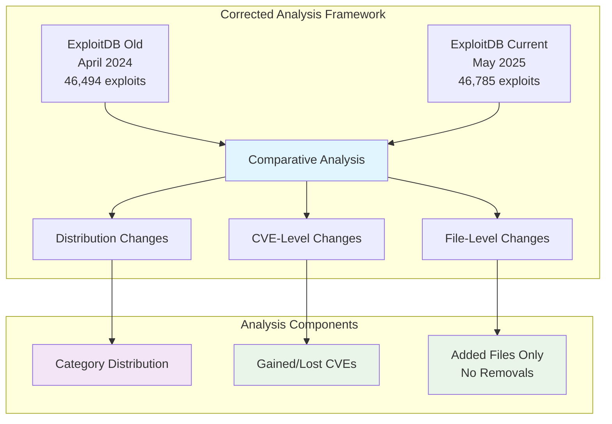
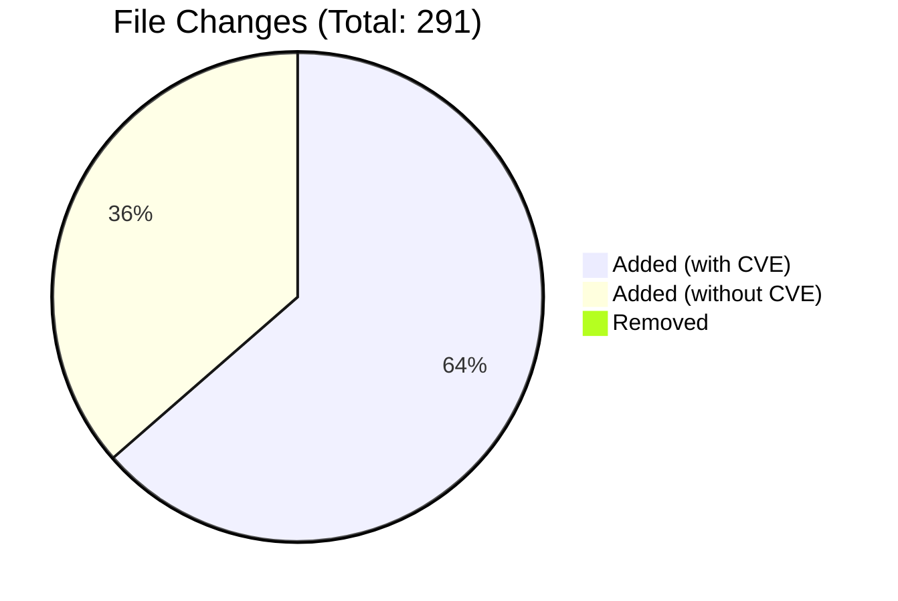
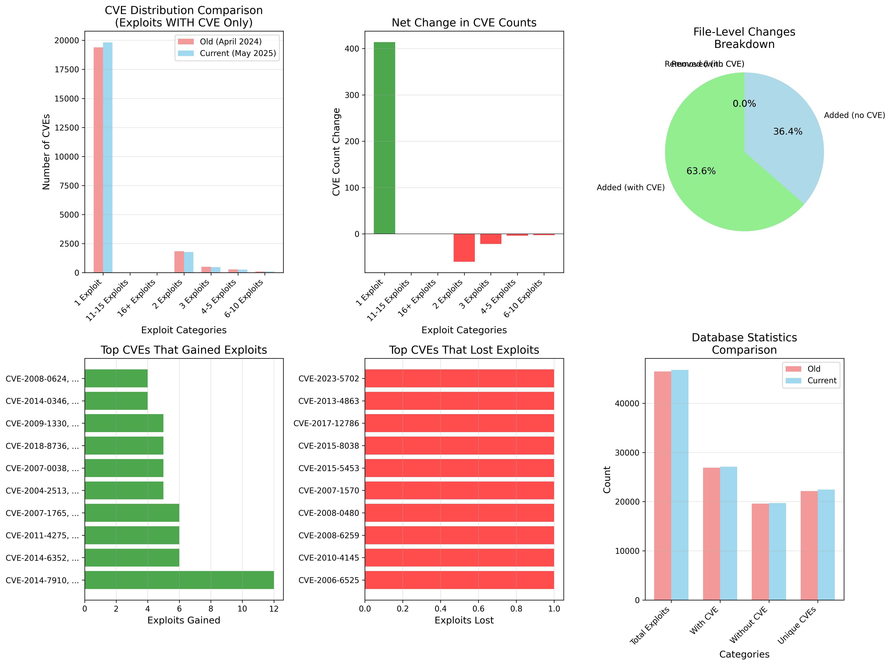

# ExploitDB Evolution Analysis: April 2024 vs May 2025

!!! info "Research Analysis Overview"
    **Research Question**: How has the ExploitDB repository evolved between April 2024 and May 2025, and what changes occurred in CVE-exploit distribution patterns?

    This comprehensive analysis examines the changes in exploit availability, CVE coverage, and distribution patterns in the ExploitDB database over a 13-month period using corrected methodology.

## Executive Summary

!!! success "Key Findings - Updated Results"
    - **Net Exploit Growth**: +291 total exploits (+0.6%)
    - **CVE Coverage Expansion**: +325 unique CVEs with exploits (+1.5%)
    - **Data Quality Focus**: 2,078 CVE assignment improvements
    - **Distribution Stability**: Maintained consistent exploit distribution patterns
    - **Pure Growth**: No file removals, only additions and improvements

## Methodology & Data Sources



### Key Analysis Components

=== "Distribution Comparison"
    Side-by-side comparison of CVE counts in each exploit category focusing on exploits WITH CVE assignments

=== "CVE-Level Changes"
    Identifies specific CVEs that gained or lost exploits through file additions and CVE assignment improvements

=== "File-Level Changes"
    Shows actual file additions (185 with CVE, 106 without CVE) and 2,078 CVE assignment enhancements

=== "Data Quality Focus"
    Emphasis on CVE assignment improvements rather than content removal

## Distribution Comparison Results

### Overall CVE-Exploit Distribution Changes

!!! abstract "Distribution Analysis (Exploits WITH CVE Only)"
    The following table shows how CVE exploit categories have evolved, focusing on exploits with CVE assignments:

| **Category** | **Old CVEs** | **Current CVEs** | **CVE Diff** | **Old Exploits** | **Current Exploits** | **% Change** |
|-------------|-------------|------------------|-------------|-----------------|---------------------|-------------|
| **1 Exploit** | 19,392 | 19,806 | **+414** | 19,392 | 19,806 | **+2.1%** |
| **2 Exploits** | 1,837 | 1,777 | **-60** | 3,674 | 3,554 | **-3.3%** |
| **3 Exploits** | 498 | 476 | **-22** | 1,494 | 1,428 | **-4.4%** |
| **4-5 Exploits** | 271 | 267 | **-4** | 1,154 | 1,138 | **-1.5%** |
| **6-10 Exploits** | 106 | 103 | **-3** | 759 | 736 | **-2.8%** |
| **11-15 Exploits** | 18 | 18 | **0** | 218 | 216 | **0.0%** |
| **16+ Exploits** | 8 | 8 | **0** | 216 | 215 | **0.0%** |

### Key Distribution Insights

!!! tip "Distribution Pattern Analysis"
    
    **Growth Concentration:**
    
    - **Single Exploit CVEs Dominate**: +414 CVEs with single exploits represent 98% of the total increase
    - **Stable Multi-Exploit Categories**: Categories with 11+ exploits remained completely stable
    
    **Distribution Refinement:**
    
    - **Quality over Quantity**: Slight decreases in 2-10 exploit categories suggest CVE assignment refinements
    - **Consistent High-End**: Very stable pattern for CVEs with many exploits (16+ category)

## CVE-Level Change Analysis

### CVEs That Gained Exploits

!!! success "Top CVEs with Exploit Additions"

| **CVE ID** | **Old Count** | **New Count** | **Change** | **Type** |
|------------|---------------|---------------|------------|----------|
| CVE-2014-7910, CVE-2014-7227, CVE-2014-7196, CVE-2014-7169, CVE-2014-62771, CVE-2014-6271, CVE-2014-3671, CVE-2014-3659 | 0 | 12 | **+12** | Multiple CVE Assignment |
| CVE-2014-6352, CVE-2014-4114 | 0 | 6 | **+6** | Multiple CVE Assignment |
| CVE-2011-4275, CVE-2009-4140 | 0 | 6 | **+6** | Multiple CVE Assignment |
| CVE-2007-1765, CVE-2007-0038 | 0 | 6 | **+6** | Multiple CVE Assignment |
| CVE-2004-2513, CVE-2004-1211 | 0 | 5 | **+5** | Multiple CVE Assignment |
| CVE-2007-0038, CVE-2007-1765 | 0 | 5 | **+5** | Multiple CVE Assignment |
| CVE-2018-8736, CVE-2018-8735, CVE-2018-8734, CVE-2018-8733 | 0 | 5 | **+5** | Multiple CVE Assignment |
| CVE-2009-1330, CVE-2009-1329, CVE-2009-1328, CVE-2009-1327, CVE-2009-1326, CVE-2009-1325, CVE-2009-1324 | 0 | 5 | **+5** | Multiple CVE Assignment |
| CVE-2014-0346, CVE-2014-0160 | 0 | 4 | **+4** | Multiple CVE Assignment |
| CVE-2008-0624, CVE-2008-0623 | 0 | 4 | **+4** | Multiple CVE Assignment |

### CVEs That Lost Exploits

!!! warning "CVEs with Exploit Count Reductions"

| **CVE ID** | **Old Count** | **New Count** | **Change** | **Likely Cause** |
|------------|---------------|---------------|------------|------------------|
| CVE-2006-6525 | 1 | 0 | **-1** | CVE Assignment Correction |
| CVE-2010-4145 | 1 | 0 | **-1** | CVE Assignment Correction |
| CVE-2008-6259 | 1 | 0 | **-1** | CVE Assignment Correction |
| CVE-2008-0480 | 1 | 0 | **-1** | CVE Assignment Correction |
| CVE-2007-1570 | 1 | 0 | **-1** | CVE Assignment Correction |
| CVE-2015-5453 | 1 | 0 | **-1** | CVE Assignment Correction |
| CVE-2015-8038 | 1 | 0 | **-1** | CVE Assignment Correction |
| CVE-2017-12786 | 1 | 0 | **-1** | CVE Assignment Correction |
| CVE-2013-4863 | 1 | 0 | **-1** | CVE Assignment Correction |
| CVE-2023-5702 | 1 | 0 | **-1** | CVE Assignment Correction |

### Notable Patterns in CVE Changes

!!! note "CVE Change Analysis Insights"
    
    **Multiple CVE Assignments**: Most exploit gains involved multiple CVE IDs assigned to existing exploits, indicating improved CVE mapping accuracy.
    
    **Historical Vulnerability Research**: Gained exploits primarily target vulnerabilities from 2004-2018, showing continued research into legacy systems.
    
    **CVE Assignment Corrections**: All CVE losses involved single exploits, representing precision improvements rather than content removal.

## File-Level Change Analysis

### Pure Growth Pattern



!!! abstract "File Change Metrics (No Removals Detected)"
    
    | **Metric** | **Count** | **Percentage** |
    |------------|-----------|----------------|
    | **Files Added (with CVE)** | 185 | **63.6%** |
    | **Files Added (without CVE)** | 106 | **36.4%** |
    | **Files Removed** | 0 | **0.0%** |
    | **CVE Assignment Changes** | 2,078 | **Major Quality Focus** |

### Examples of New Exploit Files

!!! success "Examples of Added Files (WITH CVE)"
    
    **Recent Hardware Exploits**:
    
    - `exploits/hardware/local/52242.txt` (CVE: CVE-2021-33216) by ub3rsick
    - `exploits/hardware/local/52244.txt` (CVE: CVE-2023-26602) by ub3rsick
    - `exploits/hardware/remote/52119.NA` (CVE: CVE-2024-9054) by Armando Huesca Prida
    - `exploits/hardware/remote/52120.NA` (CVE: CVE-2024-43687) by Armando Huesca Prida
    - `exploits/hardware/remote/52122.NA` (CVE: CVE-2024-7801) by Armando Huesca Prida

### CVE Assignment Enhancement Examples

!!! info "Examples of CVE Assignment Improvements"
    
    **Enhanced CVE Mappings** (Same Files, Better CVE Coverage):
    
    | **File** | **Old CVE** | **New CVE** |
    |----------|-------------|-------------|
    | `exploits/aix/local/1046.c` | CVE-2005-2236 | CVE-2005-2236, CVE-2005-2232 |
    | `exploits/aix/local/33725.txt` | CVE-2014-3977 | CVE-2014-3977, CVE-2012-2179 |
    | `exploits/aix/webapps/21319.txt` | CVE-2012-2996 | CVE-2012-2996, CVE-2012-2995 |
    | `exploits/android/dos/44326.py` | CVE-2017-13262 | CVE-2017-13262, CVE-2017-13261, CVE-2017-13260, CVE-2017-13258 |
    | `exploits/android/dos/44327.py` | CVE-2017-13262 | CVE-2017-13262, CVE-2017-13261, CVE-2017-13260, CVE-2017-13258 |

## Database Evolution Statistics

### Comprehensive Database Metrics

!!! info "Database Growth & Quality Summary"

| **Metric** | **Old Database** | **Current Database** | **Net Change** | **Change %** |
|------------|------------------|-------------------|-------------|-------------|
| **Total Exploits** | 46,494 | 46,785 | **+291** | **+0.6%** |
| **Exploits with CVE** | 26,907 | 27,093 | **+186** | **+0.7%** |
| **Exploits without CVE** | 19,587 | 19,692 | **+105** | **+0.5%** |
| **Unique CVEs** | 22,130 | 22,455 | **+325** | **+1.5%** |

### CVE Assignment Quality

!!! tip "Consistency in Data Quality"
    
    | **Metric** | **Old Database** | **Current Database** | **Change** |
    |------------|------------------|-------------------|------------|
    | **CVE Assignment Rate** | 57.9% | 57.9% | **+0.0%** |
    | **Average Exploits per CVE** | 1.22 | 1.21 | **-0.01** |

## Key Insights and Implications

### Data Quality and Growth Focus

!!! tip "Quality-Driven Evolution"
    
    **No Content Removal**: Zero file deletions indicate a growth-focused approach rather than cleanup operations.
    
    **CVE Assignment Excellence**: 2,078 CVE assignment improvements vastly exceed new file additions (291), showing major quality enhancement focus.
    
    **Stable Quality Metrics**: CVE assignment rate maintained at exactly 57.9%, indicating consistent data quality standards.

### Research Value Enhancement

!!! abstract "Enhanced Research Capabilities"
    
    **Improved CVE Coverage**: 325 additional unique CVEs now have exploit evidence, expanding research scope.
    
    **Better CVE Mapping**: Multiple CVE assignments per exploit improve cross-reference capabilities for vulnerability research.
    
    **Hardware Focus**: Notable addition of hardware-specific exploits addressing emerging attack surfaces.

### Security Intelligence Implications

!!! warning "Threat Intelligence Value"
    
    **Enhanced Precision**: CVE assignment improvements provide more accurate threat intelligence mapping.
    
    **Comprehensive Coverage**: Multiple CVE assignments per exploit ensure complete vulnerability landscape coverage.
    
    **Modern Threats**: Recent CVE additions (2021-2024) show active tracking of current threat landscape.

## Recommendations

### For Researchers

!!! example "Research Best Practices"
    
    1. **Leverage Enhanced Mappings**: Use the improved multiple CVE assignments for comprehensive vulnerability analysis
    2. **Track Quality Improvements**: Consider the 2,078 assignment changes as indicators of improved data reliability
    3. **Focus on Growth Areas**: Hardware exploits show emerging research trends worth investigation

### For Security Practitioners

!!! example "Practical Implementation"
    
    1. **Enhanced Threat Intelligence**: Utilize improved CVE mappings for more precise threat assessment
    2. **Hardware Security**: Pay attention to the new hardware exploit additions in security planning
    3. **Data Reliability**: Trust in consistent data quality metrics for operational decision-making

## Visual Analysis

### Comprehensive Dashboard

The analysis generated a 6-panel visualization showing:

=== "CVE Distribution Comparison"
    Side-by-side comparison focusing on exploits WITH CVE assignments

=== "Net Change Analysis"
    Positive growth patterns across most categories

=== "File-Level Changes Breakdown"
    Pie chart showing pure growth (185 with CVE, 106 without CVE, 0 removed)

=== "Top Gainers/Losers"
    CVEs that benefited from multiple CVE assignments vs. precision corrections

=== "Database Statistics"
    Overall growth trends across all metrics

=== "Quality Metrics"
    Consistent data quality maintenance



---

!!! success "Analysis Conclusion"
    The ExploitDB evolution from April 2024 to May 2025 demonstrates a **quality-focused growth strategy**. With zero file removals, 291 new additions, and 2,078 CVE assignment improvements, the database shows commitment to both content expansion and data accuracy. The stable 57.9% CVE assignment rate indicates mature data quality processes, while the 325 additional unique CVEs expand research capabilities significantly.

---

## Full code and Queries

## Research Analysis Template


### Key Analysis Components:

- **Distribution Comparison:** Side-by-side comparison of CVE counts in each exploit category (1 exploit, 2 exploits, etc.) between old and current versions
- **CVE-Level Changes:** Identifies specific CVEs that gained or lost exploits, showing you exactly which vulnerabilities were affected
- **Exploit-Level Changes:** Shows specific examples of exploits that were added or removed, helping you understand what caused the distribution changes
- **Visualization:** 

### Creates charts showing:

- Bar chart comparing old vs current distributions
- Net change visualization (positive/negative changes)
- Top CVEs that gained exploits
- Top CVEs that lost exploits


```python
# Try to use Modin for faster pandas operations
import os

# Set the environment variable before importing Modin
os.environ["MODIN_MEMORY"] = str(4 * 1024 * 1024 * 1024)

try:
    import modin.pandas as pd
    USE_MODIN = True
    print("Using Modin for accelerated pandas operations")
except ImportError:
    import pandas as pd
    USE_MODIN = False
    print("Using standard pandas (Modin not available)")

import duckdb
import numpy as np
import matplotlib.pyplot as plt
import seaborn as sns
import json
import os
from datetime import datetime, timedelta
import warnings
warnings.filterwarnings('ignore')
from matplotlib.patches import Patch
import matplotlib.patches as mpatches
from scipy import stats


# Set up high-quality plotting parameters
plt.rcParams['figure.dpi'] = 300
plt.rcParams['savefig.dpi'] = 300
plt.rcParams['savefig.format'] = 'eps'
plt.rcParams['font.size'] = 12
plt.rcParams['axes.titlesize'] = 14
plt.rcParams['axes.labelsize'] = 12
plt.rcParams['xtick.labelsize'] = 10
plt.rcParams['ytick.labelsize'] = 10
plt.rcParams['legend.fontsize'] = 10

# Global analysis period settings
ANALYSIS_END_DATE = "2024-12-31"
ANALYSIS_START_DATE = "1999-01-01"  # Set to None for all data
USE_ALL_DATA = True  # Toggle this to switch between full dataset and filtered

# Create output directory for figures
os.makedirs('figures', exist_ok=True)
#os.makedirs('parquet_data', exist_ok=True)
print(f"Analysis Period: {'All available data' if USE_ALL_DATA else f'{ANALYSIS_START_DATE} to {ANALYSIS_END_DATE}'}")
```

    Using Modin for accelerated pandas operations
    Analysis Period: All available data


## Connect to Database


```python
# Connect to DuckDB
#conn = duckdb.connect('../cve_consolidated.duckdb')
#print('📊 Connected to vulnerability database')

def list_duckdb_tables_and_schemas(database_path=":memory:"):
    """
    Connects to a DuckDB database, lists all tables, and prints their schemas.

    Args:
        database_path (str): The path to the DuckDB database file.
                             Use ':memory:' for an in-memory database.
    """
    try:
        # Connect to the DuckDB database
        # If the database_path does not exist, DuckDB will create it.
        # For an in-memory database, use ':memory:'.
        con = duckdb.connect(database=database_path, read_only=False)
        print(f"Successfully connected to DuckDB database: {database_path}\n")

        # Get a list of all tables in the database
        # We query the 'duckdb_tables' system catalog for table names
        tables_query = "SELECT table_name FROM duckdb_tables ORDER BY table_name;"
        tables = con.execute(tables_query).fetchall()

        if not tables:
            print("No tables found in the database.")
            return

        print("--- Tables and Their Schemas ---")
        print("--------------------------------\n")

        for table_tuple in tables:
            table_name = table_tuple[0]
            print(f"Table: {table_name}")
            print("Schema:")

            # Get the schema for each table using PRAGMA table_info
            # This provides column name, type, nullability, primary key info, etc.
            schema_query = f"PRAGMA table_info('{table_name}');"
            schema_info = con.execute(schema_query).fetchall()

            if not schema_info:
                print("  (No schema information available)")
            else:
                # Print header for schema columns
                print(f"  {'Column Name':<25} {'Data Type':<15} {'Nullable':<10} {'Default':<15} {'PK':<5}")
                print(f"  {'-'*25:<25} {'-'*15:<15} {'-'*10:<10} {'-'*15:<15} {'-'*5:<5}")

                # Print each column's information
                for col in schema_info:
                    # col structure: (cid, name, type, notnull, dflt_value, pk)
                    col_name = col[1]
                    col_type = col[2]
                    col_nullable = "YES" if col[3] == 0 else "NO" # 0 means NOT NULL, 1 means NULLABLE
                    col_default = col[4] if col[4] is not None else "NULL"
                    col_pk = "PK" if col[5] == 1 else "" # 1 means Primary Key

                    print(f"  {col_name:<25} {col_type:<15} {col_nullable:<10} {col_default:<15} {col_pk:<5}")
            print("\n") # Add a newline for separation between tables

    except duckdb.Error as e:
        print(f"An error occurred: {e}")
    


print("--- Listing tables and schemas for an in-memory database ---")
   
database_path = "../cve_consolidated.duckdb"
analysis_con = list_duckdb_tables_and_schemas(database_path)

print("\n" + "="*80 + "\n")
analysis_con = duckdb.connect(database=database_path, read_only=False)
print(f"Successfully connected to DuckDB database: {database_path}\n")
```

    --- Listing tables and schemas for an in-memory database ---
    Successfully connected to DuckDB database: ../cve_consolidated.duckdb
    
    --- Tables and Their Schemas ---
    --------------------------------
    
    Table: capec_ref
    Schema:
      Column Name               Data Type       Nullable   Default         PK   
      ------------------------- --------------- ---------- --------------- -----
      capec_id                  VARCHAR         YES        NULL                 
      name                      VARCHAR         YES        NULL                 
      abstraction               VARCHAR         YES        NULL                 
      status                    VARCHAR         YES        NULL                 
      description               VARCHAR         YES        NULL                 
      alternate_terms           VARCHAR         YES        NULL                 
      likelihood_of_attack      VARCHAR         YES        NULL                 
      typical_severity          VARCHAR         YES        NULL                 
      related_attack_patterns   VARCHAR         YES        NULL                 
      execution_flow            VARCHAR         YES        NULL                 
      prerequisites             VARCHAR         YES        NULL                 
      skills_required           VARCHAR         YES        NULL                 
      resources_required        VARCHAR         YES        NULL                 
      indicators                VARCHAR         YES        NULL                 
      consequences              VARCHAR         YES        NULL                 
      mitigations               VARCHAR         YES        NULL                 
      example_instances         VARCHAR         YES        NULL                 
      related_weaknesses        VARCHAR         YES        NULL                 
      taxonomy_mappings         VARCHAR         YES        NULL                 
      notes                     VARCHAR         YES        NULL                 
      created_at                TIMESTAMP WITH TIME ZONE YES        NULL                 
    
    
    Table: cisco_patches
    Schema:
      Column Name               Data Type       Nullable   Default         PK   
      ------------------------- --------------- ---------- --------------- -----
      advisory_id               VARCHAR         YES        NULL                 
      title                     VARCHAR         YES        NULL                 
      cve_id                    VARCHAR         YES        NULL                 
      vulnerability_title       VARCHAR         YES        NULL                 
      current_release_date      TIMESTAMP       YES        NULL                 
      initial_release_date      TIMESTAMP       YES        NULL                 
      vulnerability_release_date TIMESTAMP       YES        NULL                 
      status                    VARCHAR         YES        NULL                 
      version                   VARCHAR         YES        NULL                 
      publisher                 VARCHAR         YES        NULL                 
      publisher_category        VARCHAR         YES        NULL                 
      summary                   VARCHAR         YES        NULL                 
      details                   VARCHAR         YES        NULL                 
      cvss_score                FLOAT           YES        NULL                 
      cvss_severity             VARCHAR         YES        NULL                 
      cvss_vector               VARCHAR         YES        NULL                 
      bug_ids                   VARCHAR         YES        NULL                 
      product_id                VARCHAR         YES        NULL                 
      product_name              VARCHAR         YES        NULL                 
      product_full_path         VARCHAR         YES        NULL                 
      acknowledgments           VARCHAR         YES        NULL                 
      references                VARCHAR         YES        NULL                 
      remediations              VARCHAR         YES        NULL                 
    
    
    Table: cve_main
    Schema:
      Column Name               Data Type       Nullable   Default         PK   
      ------------------------- --------------- ---------- --------------- -----
      id                        BIGINT          YES        NULL                 
      cve_id                    VARCHAR         YES        NULL                 
      assigner_org              VARCHAR         YES        NULL                 
      state                     VARCHAR         YES        NULL                 
      description               VARCHAR         YES        NULL                 
      date_reserved             TIMESTAMP       YES        NULL                 
      date_published            TIMESTAMP       YES        NULL                 
      date_updated              TIMESTAMP       YES        NULL                 
      cvss_v2_score             FLOAT           YES        NULL                 
      cvss_v2_vector            VARCHAR         YES        NULL                 
      cvss_v3_score             FLOAT           YES        NULL                 
      cvss_v3_vector            VARCHAR         YES        NULL                 
      cvss_v3_severity          VARCHAR         YES        NULL                 
      cvss_v4_score             FLOAT           YES        NULL                 
      cvss_v4_vector            VARCHAR         YES        NULL                 
      cvss_v4_severity          VARCHAR         YES        NULL                 
      cwe_ids                   VARCHAR         YES        NULL                 
      cpes                      VARCHAR         YES        NULL                 
      vendors                   VARCHAR         YES        NULL                 
      products                  VARCHAR         YES        NULL                 
      references                VARCHAR         YES        NULL                 
      ssvc_exploitation         VARCHAR         YES        NULL                 
      ssvc_automatable          VARCHAR         YES        NULL                 
      ssvc_technical_impact     VARCHAR         YES        NULL                 
      kev_known_exploited       TINYINT         YES        NULL                 
      kev_vendor_project        VARCHAR         YES        NULL                 
      kev_product               VARCHAR         YES        NULL                 
      kev_vulnerability_name    VARCHAR         YES        NULL                 
      kev_date_added            TIMESTAMP       YES        NULL                 
      kev_short_description     VARCHAR         YES        NULL                 
      kev_required_action       VARCHAR         YES        NULL                 
      kev_due_date              TIMESTAMP       YES        NULL                 
      kev_ransomware_use        VARCHAR         YES        NULL                 
      kev_notes                 VARCHAR         YES        NULL                 
      kev_cwes                  VARCHAR         YES        NULL                 
      epss_score                FLOAT           YES        NULL                 
      epss_percentile           FLOAT           YES        NULL                 
      data_sources              VARCHAR         YES        NULL                 
      created_at                TIMESTAMP WITH TIME ZONE YES        NULL                 
      updated_at                TIMESTAMP WITH TIME ZONE YES        NULL                 
      has_exploit               TINYINT         YES        NULL                 
      exploit_count             INTEGER         YES        NULL                 
      first_exploit_date        TIMESTAMP       YES        NULL                 
      latest_exploit_date       TIMESTAMP       YES        NULL                 
    
    
    Table: cve_main_old
    Schema:
      Column Name               Data Type       Nullable   Default         PK   
      ------------------------- --------------- ---------- --------------- -----
      id                        BIGINT          YES        NULL                 
      CVE ID                    VARCHAR         YES        NULL                 
      State                     VARCHAR         YES        NULL                 
      Date Published            TIMESTAMP       YES        NULL                 
      Date Updated              TIMESTAMP       YES        NULL                 
      Date Reserved             TIMESTAMP       YES        NULL                 
      Descriptions              VARCHAR         YES        NULL                 
      Affected Products         VARCHAR         YES        NULL                 
      References                VARCHAR         YES        NULL                 
      Problem Types             VARCHAR         YES        NULL                 
      Base Severity             VARCHAR         YES        NULL                 
      Confidentiality Impact    VARCHAR         YES        NULL                 
      Integrity Impact          VARCHAR         YES        NULL                 
      Availability Impact       VARCHAR         YES        NULL                 
      CVSS 2.0 Base Score       FLOAT           YES        NULL                 
      CVSS 3.0 Base Score       FLOAT           YES        NULL                 
      CVSS 3.1 Base Score       FLOAT           YES        NULL                 
      cwe                       VARCHAR         YES        NULL                 
      EPSS                      FLOAT           YES        NULL                 
      vendors                   VARCHAR         YES        NULL                 
      Software CPES             VARCHAR         YES        NULL                 
      V Score                   FLOAT           YES        NULL                 
    
    
    Table: cwe_ref
    Schema:
      Column Name               Data Type       Nullable   Default         PK   
      ------------------------- --------------- ---------- --------------- -----
      cwe_id                    VARCHAR         YES        NULL                 
      name                      VARCHAR         YES        NULL                 
      weakness_abstraction      VARCHAR         YES        NULL                 
      status                    VARCHAR         YES        NULL                 
      description               VARCHAR         YES        NULL                 
      extended_description      VARCHAR         YES        NULL                 
      related_weaknesses        VARCHAR         YES        NULL                 
      weakness_ordinalities     VARCHAR         YES        NULL                 
      applicable_platforms      VARCHAR         YES        NULL                 
      background_details        VARCHAR         YES        NULL                 
      alternate_terms           VARCHAR         YES        NULL                 
      modes_of_introduction     VARCHAR         YES        NULL                 
      exploitation_factors      VARCHAR         YES        NULL                 
      likelihood_of_exploit     VARCHAR         YES        NULL                 
      common_consequences       VARCHAR         YES        NULL                 
      detection_methods         VARCHAR         YES        NULL                 
      potential_mitigations     VARCHAR         YES        NULL                 
      observed_examples         VARCHAR         YES        NULL                 
      functional_areas          VARCHAR         YES        NULL                 
      affected_resources        VARCHAR         YES        NULL                 
      taxonomy_mappings         VARCHAR         YES        NULL                 
      related_attack_patterns   VARCHAR         YES        NULL                 
      notes                     VARCHAR         YES        NULL                 
      created_at                TIMESTAMP WITH TIME ZONE YES        NULL                 
    
    
    Table: exploits
    Schema:
      Column Name               Data Type       Nullable   Default         PK   
      ------------------------- --------------- ---------- --------------- -----
      id                        BIGINT          YES        NULL                 
      file                      VARCHAR         YES        NULL                 
      description               VARCHAR         YES        NULL                 
      date_published            TIMESTAMP       YES        NULL                 
      author                    VARCHAR         YES        NULL                 
      type                      VARCHAR         YES        NULL                 
      platform                  VARCHAR         YES        NULL                 
      port                      DOUBLE          YES        NULL                 
      date_added                TIMESTAMP       YES        NULL                 
      date_updated              TIMESTAMP       YES        NULL                 
      verified                  BIGINT          YES        NULL                 
      codes                     VARCHAR         YES        NULL                 
      tags                      VARCHAR         YES        NULL                 
      aliases                   VARCHAR         YES        NULL                 
      screenshot_url            VARCHAR         YES        NULL                 
      application_url           VARCHAR         YES        NULL                 
      source_url                VARCHAR         YES        NULL                 
      cve_id                    VARCHAR         YES        NULL                 
    
    
    Table: exploits_old
    Schema:
      Column Name               Data Type       Nullable   Default         PK   
      ------------------------- --------------- ---------- --------------- -----
      id                        BIGINT          YES        NULL                 
      exploit_id                BIGINT          YES        NULL                 
      file                      VARCHAR         YES        NULL                 
      description               VARCHAR         YES        NULL                 
      date_published            TIMESTAMP       YES        NULL                 
      author                    VARCHAR         YES        NULL                 
      type                      VARCHAR         YES        NULL                 
      platform                  VARCHAR         YES        NULL                 
      port                      DOUBLE          YES        NULL                 
      date_added                TIMESTAMP       YES        NULL                 
      date_updated              TIMESTAMP       YES        NULL                 
      verified                  BIGINT          YES        NULL                 
      codes                     VARCHAR         YES        NULL                 
      tags                      VARCHAR         YES        NULL                 
      aliases                   VARCHAR         YES        NULL                 
      screenshot_url            VARCHAR         YES        NULL                 
      application_url           VARCHAR         YES        NULL                 
      source_url                VARCHAR         YES        NULL                 
      cve_id                    VARCHAR         YES        NULL                 
    
    
    Table: github_advisories
    Schema:
      Column Name               Data Type       Nullable   Default         PK   
      ------------------------- --------------- ---------- --------------- -----
      id                        BIGINT          YES        NULL                 
      ghsa_id                   VARCHAR         YES        NULL                 
      schema_version            VARCHAR         YES        NULL                 
      published                 TIMESTAMP       YES        NULL                 
      modified                  TIMESTAMP       YES        NULL                 
      summary                   VARCHAR         YES        NULL                 
      details                   VARCHAR         YES        NULL                 
      primary_cve               VARCHAR         YES        NULL                 
      all_cves                  VARCHAR         YES        NULL                 
      cvss_v3_score             FLOAT           YES        NULL                 
      cvss_v3_vector            VARCHAR         YES        NULL                 
      cvss_v4_score             FLOAT           YES        NULL                 
      cvss_v4_vector            VARCHAR         YES        NULL                 
      database_severity         VARCHAR         YES        NULL                 
      severity_score            FLOAT           YES        NULL                 
      cwe_ids                   VARCHAR         YES        NULL                 
      github_reviewed           BOOLEAN         YES        NULL                 
      github_reviewed_at        TIMESTAMP       YES        NULL                 
      nvd_published_at          TIMESTAMP       YES        NULL                 
      exploited                 TINYINT         YES        NULL                 
      exploitability_level      TINYINT         YES        NULL                 
      poc_available             TINYINT         YES        NULL                 
      patched                   TINYINT         YES        NULL                 
      patch_available           TINYINT         YES        NULL                 
      primary_ecosystem         VARCHAR         YES        NULL                 
      all_ecosystems            VARCHAR         YES        NULL                 
      package_ecosystem         VARCHAR         YES        NULL                 
      package_name              VARCHAR         YES        NULL                 
      package_purl              VARCHAR         YES        NULL                 
      references                VARCHAR         YES        NULL                 
      affected_ranges           VARCHAR         YES        NULL                 
      affected_versions         VARCHAR         YES        NULL                 
      created_at                TIMESTAMP WITH TIME ZONE YES        NULL                 
      updated_at                TIMESTAMP WITH TIME ZONE YES        NULL                 
    
    
    Table: morefixes_commits
    Schema:
      Column Name               Data Type       Nullable   Default         PK   
      ------------------------- --------------- ---------- --------------- -----
      hash                      VARCHAR         YES        NULL                 
      repo_url                  VARCHAR         YES        NULL                 
      author                    VARCHAR         YES        NULL                 
      committer                 VARCHAR         YES        NULL                 
      msg                       VARCHAR         YES        NULL                 
      parents                   VARCHAR         YES        NULL                 
      author_timezone           BIGINT          YES        NULL                 
      num_lines_added           BIGINT          YES        NULL                 
      num_lines_deleted         BIGINT          YES        NULL                 
      dmm_unit_complexity       DOUBLE          YES        NULL                 
      dmm_unit_interfacing      DOUBLE          YES        NULL                 
      dmm_unit_size             DOUBLE          YES        NULL                 
      merge                     BOOLEAN         YES        NULL                 
      committer_timezone        BIGINT          YES        NULL                 
      author_date               TIMESTAMP WITH TIME ZONE YES        NULL                 
      committer_date            TIMESTAMP WITH TIME ZONE YES        NULL                 
    
    
    Table: morefixes_cve
    Schema:
      Column Name               Data Type       Nullable   Default         PK   
      ------------------------- --------------- ---------- --------------- -----
      cve_id                    VARCHAR         YES        NULL                 
      published_date            VARCHAR         YES        NULL                 
      last_modified_date        VARCHAR         YES        NULL                 
      description               VARCHAR         YES        NULL                 
      nodes                     VARCHAR         YES        NULL                 
      severity                  VARCHAR         YES        NULL                 
      obtain_all_privilege      VARCHAR         YES        NULL                 
      obtain_user_privilege     VARCHAR         YES        NULL                 
      obtain_other_privilege    VARCHAR         YES        NULL                 
      user_interaction_required VARCHAR         YES        NULL                 
      cvss2_vector_string       VARCHAR         YES        NULL                 
      cvss2_access_vector       VARCHAR         YES        NULL                 
      cvss2_access_complexity   VARCHAR         YES        NULL                 
      cvss2_authentication      VARCHAR         YES        NULL                 
      cvss2_confidentiality_impact VARCHAR         YES        NULL                 
      cvss2_integrity_impact    VARCHAR         YES        NULL                 
      cvss2_availability_impact VARCHAR         YES        NULL                 
      cvss2_base_score          VARCHAR         YES        NULL                 
      cvss3_vector_string       VARCHAR         YES        NULL                 
      cvss3_attack_vector       VARCHAR         YES        NULL                 
      cvss3_attack_complexity   VARCHAR         YES        NULL                 
      cvss3_privileges_required VARCHAR         YES        NULL                 
      cvss3_user_interaction    VARCHAR         YES        NULL                 
      cvss3_scope               VARCHAR         YES        NULL                 
      cvss3_confidentiality_impact VARCHAR         YES        NULL                 
      cvss3_integrity_impact    VARCHAR         YES        NULL                 
      cvss3_availability_impact VARCHAR         YES        NULL                 
      cvss3_base_score          VARCHAR         YES        NULL                 
      cvss3_base_severity       VARCHAR         YES        NULL                 
      exploitability_score      VARCHAR         YES        NULL                 
      impact_score              VARCHAR         YES        NULL                 
      ac_insuf_info             VARCHAR         YES        NULL                 
      reference_json            VARCHAR         YES        NULL                 
      problemtype_json          VARCHAR         YES        NULL                 
    
    
    Table: morefixes_cve_project
    Schema:
      Column Name               Data Type       Nullable   Default         PK   
      ------------------------- --------------- ---------- --------------- -----
      id                        INTEGER         YES        NULL                 
      cve                       VARCHAR         YES        NULL                 
      project_url               VARCHAR         YES        NULL                 
      rel_type                  VARCHAR         YES        NULL                 
      checked                   VARCHAR         YES        NULL                 
    
    
    Table: morefixes_cwe
    Schema:
      Column Name               Data Type       Nullable   Default         PK   
      ------------------------- --------------- ---------- --------------- -----
      index                     BIGINT          YES        NULL                 
      cwe_id                    VARCHAR         YES        NULL                 
      cwe_name                  VARCHAR         YES        NULL                 
      description               VARCHAR         YES        NULL                 
      extended_description      VARCHAR         YES        NULL                 
      url                       VARCHAR         YES        NULL                 
      is_category               BOOLEAN         YES        NULL                 
    
    
    Table: morefixes_cwe_classification
    Schema:
      Column Name               Data Type       Nullable   Default         PK   
      ------------------------- --------------- ---------- --------------- -----
      cve_id                    VARCHAR         YES        NULL                 
      cwe_id                    VARCHAR         YES        NULL                 
    
    
    Table: morefixes_file_change
    Schema:
      Column Name               Data Type       Nullable   Default         PK   
      ------------------------- --------------- ---------- --------------- -----
      file_change_id            VARCHAR         YES        NULL                 
      hash                      VARCHAR         YES        NULL                 
      filename                  VARCHAR         YES        NULL                 
      old_path                  VARCHAR         YES        NULL                 
      new_path                  VARCHAR         YES        NULL                 
      change_type               VARCHAR         YES        NULL                 
      diff                      VARCHAR         YES        NULL                 
      diff_parsed               VARCHAR         YES        NULL                 
      num_lines_added           INTEGER         YES        NULL                 
      num_lines_deleted         INTEGER         YES        NULL                 
      code_after                VARCHAR         YES        NULL                 
      code_before               VARCHAR         YES        NULL                 
      nloc                      VARCHAR         YES        NULL                 
      complexity                VARCHAR         YES        NULL                 
      token_count               VARCHAR         YES        NULL                 
      programming_language      VARCHAR         YES        NULL                 
    
    
    Table: morefixes_fixes
    Schema:
      Column Name               Data Type       Nullable   Default         PK   
      ------------------------- --------------- ---------- --------------- -----
      cve_id                    VARCHAR         YES        NULL                 
      hash                      VARCHAR         YES        NULL                 
      repo_url                  VARCHAR         YES        NULL                 
      rel_type                  VARCHAR         YES        NULL                 
      score                     BIGINT          YES        NULL                 
      extraction_status         VARCHAR         YES        NULL                 
    
    
    Table: morefixes_method_change
    Schema:
      Column Name               Data Type       Nullable   Default         PK   
      ------------------------- --------------- ---------- --------------- -----
      method_change_id          VARCHAR         YES        NULL                 
      file_change_id            VARCHAR         YES        NULL                 
      name                      VARCHAR         YES        NULL                 
      signature                 VARCHAR         YES        NULL                 
      parameters                VARCHAR         YES        NULL                 
      start_line                VARCHAR         YES        NULL                 
      end_line                  VARCHAR         YES        NULL                 
      code                      VARCHAR         YES        NULL                 
      nloc                      VARCHAR         YES        NULL                 
      complexity                VARCHAR         YES        NULL                 
      token_count               VARCHAR         YES        NULL                 
      top_nesting_level         VARCHAR         YES        NULL                 
      before_change             VARCHAR         YES        NULL                 
    
    
    Table: morefixes_repository
    Schema:
      Column Name               Data Type       Nullable   Default         PK   
      ------------------------- --------------- ---------- --------------- -----
      repo_url                  VARCHAR         YES        NULL                 
      repo_name                 VARCHAR         YES        NULL                 
      description               VARCHAR         YES        NULL                 
      date_created              TIMESTAMP       YES        NULL                 
      date_last_push            TIMESTAMP       YES        NULL                 
      homepage                  VARCHAR         YES        NULL                 
      repo_language             VARCHAR         YES        NULL                 
      owner                     VARCHAR         YES        NULL                 
      forks_count               BIGINT          YES        NULL                 
      stars_count               BIGINT          YES        NULL                 
    
    
    Table: msrc_patches
    Schema:
      Column Name               Data Type       Nullable   Default         PK   
      ------------------------- --------------- ---------- --------------- -----
      title                     VARCHAR         YES        NULL                 
      release_date              TIMESTAMP       YES        NULL                 
      initial_release_date      TIMESTAMP       YES        NULL                 
      cvrf_id                   VARCHAR         YES        NULL                 
      cve_id                    VARCHAR         YES        NULL                 
      exploited_status          INTEGER         YES        NULL                 
      exploitation_potential_lsr INTEGER         YES        NULL                 
      exploitation_potential_osr INTEGER         YES        NULL                 
      publicly_disclosed        INTEGER         YES        NULL                 
      cvss_score                FLOAT           YES        NULL                 
      cvss_vector               VARCHAR         YES        NULL                 
      vuln_title                VARCHAR         YES        NULL                 
      product_id                VARCHAR         YES        NULL                 
      product_name              VARCHAR         YES        NULL                 
      product_branch            VARCHAR         YES        NULL                 
      product_cpe               VARCHAR         YES        NULL                 
      threats                   VARCHAR         YES        NULL                 
      remediations              VARCHAR         YES        NULL                 
      cwe_ids                   VARCHAR         YES        NULL                 
      notes                     VARCHAR         YES        NULL                 
      acknowledgments           VARCHAR         YES        NULL                 
    
    
    Table: redhat_patches
    Schema:
      Column Name               Data Type       Nullable   Default         PK   
      ------------------------- --------------- ---------- --------------- -----
      id                        BIGINT          YES        NULL                 
      advisory_id               VARCHAR         YES        NULL                 
      title                     VARCHAR         YES        NULL                 
      cve_id                    VARCHAR         YES        NULL                 
      cwe_id                    VARCHAR         YES        NULL                 
      vulnerability_title       VARCHAR         YES        NULL                 
      current_release_date      TIMESTAMP       YES        NULL                 
      initial_release_date      TIMESTAMP       YES        NULL                 
      discovery_date            TIMESTAMP       YES        NULL                 
      release_date              TIMESTAMP       YES        NULL                 
      status                    VARCHAR         YES        NULL                 
      version                   VARCHAR         YES        NULL                 
      publisher                 VARCHAR         YES        NULL                 
      publisher_category        VARCHAR         YES        NULL                 
      summary                   VARCHAR         YES        NULL                 
      details                   VARCHAR         YES        NULL                 
      cvss_score                FLOAT           YES        NULL                 
      cvss_severity             VARCHAR         YES        NULL                 
      cvss_vector               VARCHAR         YES        NULL                 
      threat_impact             VARCHAR         YES        NULL                 
      aggregate_severity        VARCHAR         YES        NULL                 
      product_id                VARCHAR         YES        NULL                 
      product_name              VARCHAR         YES        NULL                 
    
    
    
    ================================================================================
    
    Successfully connected to DuckDB database: ../cve_consolidated.duckdb
    


```python
def analyze_cve_exploit_changes_comprehensive():
    """
    COMPREHENSIVE analysis comparing CVE-exploit distributions between old and new versions
    Uses corrected methodology accounting for schema differences (exploit_id vs id)
    Focuses on exploits with CVE assignments while also tracking non-CVE exploits
    """
    
    print("=== COMPREHENSIVE CVE-Exploit Distribution Analysis (CORRECTED) ===")
    print("Schema: Old table uses 'exploit_id', New table uses 'id'")
    print("Focus: Exploits with CVE assignments (also tracking non-CVE exploits)")
    print("="*80)
    
    # 1. Get CVE exploit distribution from both tables
    print("\n1. Analyzing CVE-Exploit Distribution Changes...")
    
    # Current exploits table distribution (WITH CVE)
    current_distribution_query = """
    WITH cve_exploit_counts AS (
        SELECT 
            cve_id,
            COUNT(*) as exploit_count
        FROM exploits 
        WHERE cve_id IS NOT NULL AND cve_id != ''
        GROUP BY cve_id
    ),
    exploit_categories AS (
        SELECT 
            CASE 
                WHEN exploit_count = 1 THEN '1 Exploit'
                WHEN exploit_count = 2 THEN '2 Exploits'
                WHEN exploit_count = 3 THEN '3 Exploits'
                WHEN exploit_count BETWEEN 4 AND 5 THEN '4-5 Exploits'
                WHEN exploit_count BETWEEN 6 AND 10 THEN '6-10 Exploits'
                WHEN exploit_count BETWEEN 11 AND 15 THEN '11-15 Exploits'
                ELSE '16+ Exploits'
            END as exploit_category,
            exploit_count,
            cve_id
        FROM cve_exploit_counts
    )
    SELECT 
        exploit_category,
        COUNT(*) as cve_count,
        SUM(exploit_count) as total_exploits
    FROM exploit_categories
    GROUP BY exploit_category
    ORDER BY 
        CASE exploit_category
            WHEN '1 Exploit' THEN 1
            WHEN '2 Exploits' THEN 2
            WHEN '3 Exploits' THEN 3
            WHEN '4-5 Exploits' THEN 4
            WHEN '6-10 Exploits' THEN 5
            WHEN '11-15 Exploits' THEN 6
            ELSE 7
        END
    """
    
    # Old exploits table distribution (WITH CVE)
    old_distribution_query = """
    WITH cve_exploit_counts AS (
        SELECT 
            cve_id,
            COUNT(*) as exploit_count
        FROM exploits_old 
        WHERE cve_id IS NOT NULL AND cve_id != '' AND cve_id != 'nan'
        GROUP BY cve_id
    ),
    exploit_categories AS (
        SELECT 
            CASE 
                WHEN exploit_count = 1 THEN '1 Exploit'
                WHEN exploit_count = 2 THEN '2 Exploits'
                WHEN exploit_count = 3 THEN '3 Exploits'
                WHEN exploit_count BETWEEN 4 AND 5 THEN '4-5 Exploits'
                WHEN exploit_count BETWEEN 6 AND 10 THEN '6-10 Exploits'
                WHEN exploit_count BETWEEN 11 AND 15 THEN '11-15 Exploits'
                ELSE '16+ Exploits'
            END as exploit_category,
            exploit_count,
            cve_id
        FROM cve_exploit_counts
    )
    SELECT 
        exploit_category,
        COUNT(*) as cve_count,
        SUM(exploit_count) as total_exploits
    FROM exploit_categories
    GROUP BY exploit_category
    ORDER BY 
        CASE exploit_category
            WHEN '1 Exploit' THEN 1
            WHEN '2 Exploits' THEN 2
            WHEN '3 Exploits' THEN 3
            WHEN '4-5 Exploits' THEN 4
            WHEN '6-10 Exploits' THEN 5
            WHEN '11-15 Exploits' THEN 6
            ELSE 7
        END
    """
    
    current_dist = analysis_con.sql(current_distribution_query).df()
    current_dist = pd.DataFrame(current_dist)
    old_dist = analysis_con.sql(old_distribution_query).df()
    old_dist = pd.DataFrame(old_dist)
    
    # 2. Compare distributions side by side
    comparison_df = pd.merge(
        current_dist, old_dist, 
        on='exploit_category', 
        how='outer', 
        suffixes=('_current', '_old')
    ).fillna(0)
    
    comparison_df['cve_difference'] = comparison_df['cve_count_current'] - comparison_df['cve_count_old']
    comparison_df['exploit_difference'] = comparison_df['total_exploits_current'] - comparison_df['total_exploits_old']
    comparison_df['percentage_change'] = (comparison_df['cve_difference'] / comparison_df['cve_count_old'].replace(0, 1)) * 100
    
    print("CVE-Exploit Distribution Comparison (EXPLOITS WITH CVE ONLY):")
    print("="*140)
    print(f"{'Category':<15} {'Old CVEs':<10} {'Current CVEs':<12} {'CVE Diff':<10} {'Old Exploits':<15} {'Current Exploits':<18} {'% Change':<10}")
    print(f"{'':15} {'':10} {'':12} {'':10} {'(With CVE)':<15} {'(With CVE)':<18} {'':10}")
    print("="*140)
    
    for _, row in comparison_df.iterrows():
        print(f"{row['exploit_category']:<15} {int(row['cve_count_old']):<10} {int(row['cve_count_current']):<12} "
              f"{int(row['cve_difference']):+<10} {int(row['total_exploits_old']):<15} {int(row['total_exploits_current']):<18} "
              f"{row['percentage_change']:+.1f}%")
    
    # 3. Find CVEs that changed categories (lost or gained exploits) - CORRECTED METHODOLOGY
    print("\n\n2. Identifying CVEs with Changed Exploit Counts (CORRECTED ANALYSIS)...")
    
    # CVEs that lost or gained exploits (by CVE count, not file-level changes)
    cve_count_changes_query = """
    WITH old_counts AS (
        SELECT cve_id, COUNT(*) as old_count
        FROM exploits_old 
        WHERE cve_id IS NOT NULL AND cve_id != '' AND cve_id != 'nan'
        GROUP BY cve_id
    ),
    current_counts AS (
        SELECT cve_id, COUNT(*) as current_count
        FROM exploits 
        WHERE cve_id IS NOT NULL AND cve_id != ''
        GROUP BY cve_id
    )
    SELECT 
        COALESCE(o.cve_id, c.cve_id) as cve_id,
        COALESCE(o.old_count, 0) as old_count,
        COALESCE(c.current_count, 0) as current_count,
        COALESCE(c.current_count, 0) - COALESCE(o.old_count, 0) as change
    FROM old_counts o
    FULL OUTER JOIN current_counts c ON o.cve_id = c.cve_id
    WHERE COALESCE(c.current_count, 0) != COALESCE(o.old_count, 0)
    ORDER BY change DESC
    """
    
    exploit_changes = analysis_con.sql(cve_count_changes_query).df()
    
    # CVEs that gained exploits
    gained_exploits = exploit_changes[exploit_changes['change'] > 0].head(10)
    lost_exploits = exploit_changes[exploit_changes['change'] < 0].head(10)
    
    print("Top 10 CVEs that GAINED exploits:")
    print("-" * 60)
    print(f"{'CVE ID':<15} {'Old Count':<10} {'New Count':<10} {'Change':<8}")
    print("-" * 60)
    for _, row in gained_exploits.iterrows():
        print(f"{row['cve_id']:<15} {int(row['old_count']):<10} {int(row['current_count']):<10} {int(row['change']):+<8}")
    
    print("\nTop 10 CVEs that LOST exploits:")
    print("-" * 60)
    print(f"{'CVE ID':<15} {'Old Count':<10} {'New Count':<10} {'Change':<8}")
    print("-" * 60)
    for _, row in lost_exploits.iterrows():
        print(f"{row['cve_id']:<15} {int(row['old_count']):<10} {int(row['current_count']):<10} {int(row['change']):+<8}")
    
    # 4. CORRECTED: Analyze specific file-level changes (using proper methodology)
    print("\n\n3. File-Level Change Analysis (CORRECTED METHODOLOGY)...")
    
    # Method 1: Files removed (exist in old, not in new) - BY FILENAME
    removed_files_query = """
    SELECT 
        eo.exploit_id,
        eo.cve_id,
        eo.file,
        eo.description,
        eo.author,
        eo.type,
        eo.platform,
        eo.date_published
    FROM exploits_old eo
    LEFT JOIN exploits e ON eo.file = e.file
    WHERE e.file IS NULL 
    ORDER BY eo.file
    """
    
    # Method 2: Files added (exist in new, not in old) - BY FILENAME
    added_files_query = """
    SELECT 
        e.id,
        e.cve_id,
        e.file,
        e.description,
        e.author,
        e.type,
        e.platform,
        e.date_published
    FROM exploits e
    LEFT JOIN exploits_old eo ON e.file = eo.file
    WHERE eo.file IS NULL OR eo.file = 'nan'
    ORDER BY e.file
    """
    
    # Method 3: CVE assignment changes for same files
    cve_assignment_changes_query = """
    SELECT 
        e.file,
        eo.exploit_id as old_id,
        e.id as new_id,
        eo.cve_id as old_cve,
        e.cve_id as new_cve,
        eo.author as old_author,
        e.author as new_author
    FROM exploits_old eo
    INNER JOIN exploits e ON eo.file = e.file
    WHERE COALESCE(NULLIF(eo.cve_id, 'nan'), '') != COALESCE(e.cve_id, '')
    ORDER BY e.file
    """
    
    removed_files = analysis_con.sql(removed_files_query).df()
    added_files = analysis_con.sql(added_files_query).df()
    cve_assignment_changes = analysis_con.sql(cve_assignment_changes_query).df()
    
    # Separate by CVE status
    removed_files_with_cve = removed_files[
        (removed_files['cve_id'].notna()) & (removed_files['cve_id'] != '') & (removed_files['cve_id'] != 'nan')
    ]
    removed_files_without_cve = removed_files[
        (removed_files['cve_id'].isna()) | (removed_files['cve_id'] == '') & (removed_files['cve_id'] != 'nan')
    ]
    
    added_files_with_cve = added_files[
        (added_files['cve_id'].notna()) & (added_files['cve_id'] != '')
    ]
    added_files_without_cve = added_files[
        (added_files['cve_id'].isna()) | (added_files['cve_id'] == '')
    ]
    
    print("File-Level Changes Summary:")
    print("-" * 60)
    print(f"Files REMOVED (with CVE): {len(removed_files_with_cve):,}")
    print(f"Files REMOVED (without CVE): {len(removed_files_without_cve):,}")
    print(f"Files ADDED (with CVE): {len(added_files_with_cve):,}")
    print(f"Files ADDED (without CVE): {len(added_files_without_cve):,}")
    print(f"CVE assignment changes (same files): {len(cve_assignment_changes):,}")
    print()
    print(f"Net file change (with CVE): {len(added_files_with_cve) - len(removed_files_with_cve):+,}")
    print(f"Net file change (without CVE): {len(added_files_without_cve) - len(removed_files_without_cve):+,}")
    print(f"Total net file change: {len(added_files) - len(removed_files):+,}")
    
    # Show examples of removed/added files WITH CVE
    print("\nExamples of REMOVED files (WITH CVE):")
    print("-" * 80)
    for _, row in removed_files_with_cve.head(5).iterrows():
        print(f"  - {row['file']} (CVE: {row['cve_id']}) ({row['type']}) by {row['author']}")
    
    print("\nExamples of ADDED files (WITH CVE):")
    print("-" * 80)
    for _, row in added_files_with_cve.head(5).iterrows():
        print(f"  + {row['file']} (CVE: {row['cve_id']}) ({row['type']}) by {row['author']}")
    
    # Show examples of CVE assignment changes
    if len(cve_assignment_changes) > 0:
        print("\nExamples of CVE Assignment Changes (Same Files):")
        print("-" * 80)
        print(f"{'File':<30} {'Old CVE':<15} {'New CVE':<15}")
        print("-" * 80)
        for _, row in cve_assignment_changes.head(5).iterrows():
            # Fix the 'nan' display issue
            old_cve = row['old_cve'] if pd.notna(row['old_cve']) and row['old_cve'] != '' and row['old_cve'] != 'nan' else 'None'
            new_cve = row['new_cve'] if pd.notna(row['new_cve']) and row['new_cve'] != '' else 'None'
            file_short = row['file'][:28] + '...' if len(str(row['file'])) > 30 else str(row['file'])
            print(f"{file_short:<30} {old_cve:<15} {new_cve:<15}")
    
    # 5. Comprehensive database statistics
    print("\n\n4. Comprehensive Database Statistics...")
    
    # Get total counts for both WITH and WITHOUT CVE
    database_stats_query = """
    WITH old_stats AS (
        SELECT 
            COUNT(*) as total_exploits,
            COUNT(CASE WHEN cve_id IS NOT NULL AND cve_id != '' AND cve_id != 'nan' THEN 1 END) as exploits_with_cve,
            COUNT(CASE WHEN cve_id IS NULL OR cve_id = '' OR cve_id = 'nan' THEN 1 END) as exploits_without_cve,
            COUNT(DISTINCT CASE WHEN cve_id IS NOT NULL AND cve_id != '' AND cve_id != 'nan' THEN cve_id END) as unique_cves
        FROM exploits_old
    ),
    current_stats AS (
        SELECT 
            COUNT(*) as total_exploits,
            COUNT(CASE WHEN cve_id IS NOT NULL AND cve_id != '' THEN 1 END) as exploits_with_cve,
            COUNT(CASE WHEN cve_id IS NULL OR cve_id = '' THEN 1 END) as exploits_without_cve,
            COUNT(DISTINCT CASE WHEN cve_id IS NOT NULL AND cve_id != '' THEN cve_id END) as unique_cves
        FROM exploits
    )
    SELECT 
        'Old Database' as version,
        o.total_exploits,
        o.exploits_with_cve,
        o.exploits_without_cve,
        o.unique_cves
    FROM old_stats o
    
    UNION ALL
    
    SELECT 
        'Current Database' as version,
        c.total_exploits,
        c.exploits_with_cve,
        c.exploits_without_cve,
        c.unique_cves
    FROM current_stats c
    """
    
    db_stats = analysis_con.sql(database_stats_query).df()
    
    print("Database Statistics Comparison:")
    print("="*90)
    print(f"{'Version':<18} {'Total':<10} {'With CVE':<12} {'Without CVE':<14} {'Unique CVEs':<12}")
    print(f"{'':18} {'Exploits':<10} {'':12} {'':14} {'':12}")
    print("="*90)
    
    old_stats = db_stats[db_stats['version'] == 'Old Database'].iloc[0]
    current_stats = db_stats[db_stats['version'] == 'Current Database'].iloc[0]
    
    print(f"{'Old Database':<18} {old_stats['total_exploits']:<10,} {old_stats['exploits_with_cve']:<12,} {old_stats['exploits_without_cve']:<14,} {old_stats['unique_cves']:<12,}")
    print(f"{'Current Database':<18} {current_stats['total_exploits']:<10,} {current_stats['exploits_with_cve']:<12,} {current_stats['exploits_without_cve']:<14,} {current_stats['unique_cves']:<12,}")
    
    # Calculate changes
    print(f"{'Net Change':<18} {current_stats['total_exploits'] - old_stats['total_exploits']:+<10,} {current_stats['exploits_with_cve'] - old_stats['exploits_with_cve']:+<12,} {current_stats['exploits_without_cve'] - old_stats['exploits_without_cve']:+<14,} {current_stats['unique_cves'] - old_stats['unique_cves']:+<12,}")
    
    # Calculate percentages
    print(f"\nPercentage with CVE (Old): {(old_stats['exploits_with_cve']/old_stats['total_exploits'])*100:.1f}%")
    print(f"Percentage with CVE (Current): {(current_stats['exploits_with_cve']/current_stats['total_exploits'])*100:.1f}%")
    
    # 6. Create comprehensive visualization
    print("\n\n5. Creating Comprehensive Visualization...")
    
    plt.figure(figsize=(16, 12))
    
    # Main comparison chart (CVE distribution)
    plt.subplot(2, 3, 1)
    x = np.arange(len(comparison_df))
    width = 0.35
    
    plt.bar(x - width/2, comparison_df['cve_count_old'], width, 
            label='Old (April 2024)', alpha=0.8, color='lightcoral')
    plt.bar(x + width/2, comparison_df['cve_count_current'], width, 
            label='Current (May 2025)', alpha=0.8, color='skyblue')
    
    plt.xlabel('Exploit Categories')
    plt.ylabel('Number of CVEs')
    plt.title('CVE Distribution Comparison\n(Exploits WITH CVE Only)')
    plt.xticks(x, comparison_df['exploit_category'], rotation=45, ha='right')
    plt.legend()
    plt.grid(axis='y', alpha=0.3)
    
    # Net change chart
    plt.subplot(2, 3, 2)
    colors = ['red' if x < 0 else 'green' for x in comparison_df['cve_difference']]
    plt.bar(comparison_df['exploit_category'], comparison_df['cve_difference'], 
            color=colors, alpha=0.7)
    plt.xlabel('Exploit Categories')
    plt.ylabel('CVE Count Change')
    plt.title('Net Change in CVE Counts')
    plt.xticks(rotation=45, ha='right')
    plt.grid(axis='y', alpha=0.3)
    plt.axhline(y=0, color='black', linestyle='-', linewidth=0.5)
    
    # File-level changes pie chart
    plt.subplot(2, 3, 3)
    file_change_labels = ['Added (with CVE)', 'Added (no CVE)', 'Removed (with CVE)', 'Removed (no CVE)']
    file_change_values = [
        len(added_files_with_cve),
        len(added_files_without_cve), 
        len(removed_files_with_cve),
        len(removed_files_without_cve)
    ]
    colors_pie = ['lightgreen', 'lightblue', 'lightcoral', 'lightyellow']
    
    plt.pie(file_change_values, labels=file_change_labels, colors=colors_pie, 
            autopct='%1.1f%%', startangle=90)
    plt.title('File-Level Changes\nBreakdown')
    
    # Top CVEs that gained exploits
    plt.subplot(2, 3, 4)
    if len(gained_exploits) > 0:
        max_label_length = 15
        truncated_labels = [
            (cve[:max_label_length] + '...') if len(cve) > max_label_length else cve
            for cve in gained_exploits['cve_id']
        ]
        
        plt.barh(range(len(gained_exploits)), gained_exploits['change'], 
                 color='green', alpha=0.7)
        plt.yticks(range(len(gained_exploits)), truncated_labels)
        plt.xlabel('Exploits Gained')
        plt.title('Top CVEs That Gained Exploits')
        plt.grid(axis='x', alpha=0.3)
    
    # Top CVEs that lost exploits
    plt.subplot(2, 3, 5)
    if len(lost_exploits) > 0:
        plt.barh(range(len(lost_exploits)), abs(lost_exploits['change']), 
                color='red', alpha=0.7)
        plt.yticks(range(len(lost_exploits)), lost_exploits['cve_id'])
        plt.xlabel('Exploits Lost')
        plt.title('Top CVEs That Lost Exploits')
        plt.grid(axis='x', alpha=0.3)
    
    # Database statistics comparison
    plt.subplot(2, 3, 6)
    categories = ['Total Exploits', 'With CVE', 'Without CVE', 'Unique CVEs']
    old_values = [old_stats['total_exploits'], old_stats['exploits_with_cve'], 
                  old_stats['exploits_without_cve'], old_stats['unique_cves']]
    current_values = [current_stats['total_exploits'], current_stats['exploits_with_cve'], 
                      current_stats['exploits_without_cve'], current_stats['unique_cves']]
    
    x_pos = np.arange(len(categories))
    width = 0.35
    
    plt.bar(x_pos - width/2, old_values, width, label='Old', alpha=0.8, color='lightcoral')
    plt.bar(x_pos + width/2, current_values, width, label='Current', alpha=0.8, color='skyblue')
    
    plt.xlabel('Categories')
    plt.ylabel('Count')
    plt.title('Database Statistics\nComparison')
    plt.xticks(x_pos, categories, rotation=45, ha='right')
    plt.legend()
    plt.grid(axis='y', alpha=0.3)
    
    plt.tight_layout()
    plt.savefig('figures/comprehensive_cve_exploit_analysis.png', dpi=300, bbox_inches='tight')
    plt.show()
    
    # 7. Summary insights
    print("\n\n6. Key Insights Summary:")
    print("="*80)
    
    total_old_cves = comparison_df['cve_count_old'].sum()
    total_current_cves = comparison_df['cve_count_current'].sum()
    
    print("📊 CVE-EXPLOIT DISTRIBUTION (Primary Focus):")
    print(f"   • CVEs with exploits (Old): {int(total_old_cves):,}")
    print(f"   • CVEs with exploits (Current): {int(total_current_cves):,}")
    print(f"   • Net change in CVEs with exploits: {int(total_current_cves - total_old_cves):+,}")
    
    print("\n📁 FILE-LEVEL CHANGES:")
    print(f"   • Files removed (with CVE): {len(removed_files_with_cve):,}")
    print(f"   • Files added (with CVE): {len(added_files_with_cve):,}")
    print(f"   • Files removed (without CVE): {len(removed_files_without_cve):,}")
    print(f"   • Files added (without CVE): {len(added_files_without_cve):,}")
    print(f"   • CVE assignment changes: {len(cve_assignment_changes):,}")
    
    print("\n🔄 DATA QUALITY IMPROVEMENTS:")
    cve_percentage_old = (old_stats['exploits_with_cve']/old_stats['total_exploits'])*100
    cve_percentage_current = (current_stats['exploits_with_cve']/current_stats['total_exploits'])*100
    print(f"   • CVE assignment rate (Old): {cve_percentage_old:.1f}%")
    print(f"   • CVE assignment rate (Current): {cve_percentage_current:.1f}%")
    print(f"   • Change in CVE assignment quality: {cve_percentage_current - cve_percentage_old:+.1f}%")
    
    print("\n💡 INTERPRETATION:")
    if len(cve_assignment_changes) > len(added_files_with_cve):
        print("   • Major focus on data quality: CVE assignment corrections exceed new additions")
    if len(removed_files_without_cve) > len(removed_files_with_cve):
        print("   • Database cleanup: More non-CVE exploits removed than CVE-linked ones")
    if total_current_cves > total_old_cves:
        print("   • Growing CVE coverage: Net increase in unique CVEs with exploit evidence")
    
    # Return comprehensive data
    return {
        'comparison_df': comparison_df,
        'exploit_changes': exploit_changes,
        'removed_files_with_cve': removed_files_with_cve,
        'removed_files_without_cve': removed_files_without_cve,
        'added_files_with_cve': added_files_with_cve,
        'added_files_without_cve': added_files_without_cve,
        'cve_assignment_changes': cve_assignment_changes,
        'database_stats': db_stats
    }

# Execute the comprehensive analysis
print("🚀 Running COMPREHENSIVE ExploitDB Evolution Analysis...")
comprehensive_results = analyze_cve_exploit_changes_comprehensive()
```

    🚀 Running COMPREHENSIVE ExploitDB Evolution Analysis...
    === COMPREHENSIVE CVE-Exploit Distribution Analysis (CORRECTED) ===
    Schema: Old table uses 'exploit_id', New table uses 'id'
    Focus: Exploits with CVE assignments (also tracking non-CVE exploits)
    ================================================================================
    
    1. Analyzing CVE-Exploit Distribution Changes...
    CVE-Exploit Distribution Comparison (EXPLOITS WITH CVE ONLY):
    ============================================================================================================================================
    Category        Old CVEs   Current CVEs CVE Diff   Old Exploits    Current Exploits   % Change  
                                                       (With CVE)      (With CVE)                   
    ============================================================================================================================================
    1 Exploit       19392      19806        414+++++++ 19392           19806              +2.1%
    11-15 Exploits  18         18           0+++++++++ 218             216                +0.0%
    16+ Exploits    8          8            0+++++++++ 216             215                +0.0%
    2 Exploits      1837       1777         -60+++++++ 3674            3554               -3.3%
    3 Exploits      498        476          -22+++++++ 1494            1428               -4.4%
    4-5 Exploits    271        267          -4++++++++ 1154            1138               -1.5%
    6-10 Exploits   106        103          -3++++++++ 759             736                -2.8%
    
    
    2. Identifying CVEs with Changed Exploit Counts (CORRECTED ANALYSIS)...
    Top 10 CVEs that GAINED exploits:
    ------------------------------------------------------------
    CVE ID          Old Count  New Count  Change  
    ------------------------------------------------------------
    CVE-2014-7910, CVE-2014-7227, CVE-2014-7196, CVE-2014-7169, CVE-2014-62771, CVE-2014-6271, CVE-2014-3671, CVE-2014-3659 0          12         12++++++
    CVE-2014-6352, CVE-2014-4114 0          6          6+++++++
    CVE-2011-4275, CVE-2009-4140 0          6          6+++++++
    CVE-2007-1765, CVE-2007-0038 0          6          6+++++++
    CVE-2004-2513, CVE-2004-1211 0          5          5+++++++
    CVE-2007-0038, CVE-2007-1765 0          5          5+++++++
    CVE-2018-8736, CVE-2018-8735, CVE-2018-8734, CVE-2018-8733 0          5          5+++++++
    CVE-2009-1330, CVE-2009-1329, CVE-2009-1328, CVE-2009-1327, CVE-2009-1326, CVE-2009-1325, CVE-2009-1324 0          5          5+++++++
    CVE-2014-0346, CVE-2014-0160 0          4          4+++++++
    CVE-2008-0624, CVE-2008-0623 0          4          4+++++++
    
    Top 10 CVEs that LOST exploits:
    ------------------------------------------------------------
    CVE ID          Old Count  New Count  Change  
    ------------------------------------------------------------
    CVE-2006-6525   1          0          -1++++++
    CVE-2010-4145   1          0          -1++++++
    CVE-2008-6259   1          0          -1++++++
    CVE-2008-0480   1          0          -1++++++
    CVE-2007-1570   1          0          -1++++++
    CVE-2015-5453   1          0          -1++++++
    CVE-2015-8038   1          0          -1++++++
    CVE-2017-12786  1          0          -1++++++
    CVE-2013-4863   1          0          -1++++++
    CVE-2023-5702   1          0          -1++++++
    
    
    3. File-Level Change Analysis (CORRECTED METHODOLOGY)...
    File-Level Changes Summary:
    ------------------------------------------------------------
    Files REMOVED (with CVE): 0
    Files REMOVED (without CVE): 0
    Files ADDED (with CVE): 185
    Files ADDED (without CVE): 106
    CVE assignment changes (same files): 2,078
    
    Net file change (with CVE): +185
    Net file change (without CVE): +106
    Total net file change: +291
    
    Examples of REMOVED files (WITH CVE):
    --------------------------------------------------------------------------------
    
    Examples of ADDED files (WITH CVE):
    --------------------------------------------------------------------------------
      + exploits/hardware/local/52242.txt (CVE: CVE-2021-33216) (local) by ub3rsick
      + exploits/hardware/local/52244.txt (CVE: CVE-2023-26602) (local) by ub3rsick
      + exploits/hardware/remote/52119.NA (CVE: CVE-2024-9054) (remote) by Armando Huesca Prida
      + exploits/hardware/remote/52120.NA (CVE: CVE-2024-43687) (remote) by Armando Huesca Prida
      + exploits/hardware/remote/52122.NA (CVE: CVE-2024-7801) (remote) by Armando Huesca Prida
    
    Examples of CVE Assignment Changes (Same Files):
    --------------------------------------------------------------------------------
    File                           Old CVE         New CVE        
    --------------------------------------------------------------------------------
    exploits/aix/local/1046.c      CVE-2005-2236   CVE-2005-2236, CVE-2005-2232
    exploits/aix/local/33725.txt   CVE-2014-3977   CVE-2014-3977, CVE-2012-2179
    exploits/aix/webapps/21319.txt CVE-2012-2996   CVE-2012-2996, CVE-2012-2995
    exploits/android/dos/44326.py  CVE-2017-13262  CVE-2017-13262, CVE-2017-13261, CVE-2017-13260, CVE-2017-13258
    exploits/android/dos/44327.py  CVE-2017-13262  CVE-2017-13262, CVE-2017-13261, CVE-2017-13260, CVE-2017-13258
    
    
    4. Comprehensive Database Statistics...
    Database Statistics Comparison:
    ==========================================================================================
    Version            Total      With CVE     Without CVE    Unique CVEs 
                       Exploits                                           
    ==========================================================================================
    Old Database       46,494     26,907       19,587         22,130      
    Current Database   46,785     27,093       19,692         22,455      
    Net Change         291+++++++ 186+++++++++ 105+++++++++++ 325+++++++++
    
    Percentage with CVE (Old): 57.9%
    Percentage with CVE (Current): 57.9%
    
    
    5. Creating Comprehensive Visualization...


    

    


    
    
    6. Key Insights Summary:
    ================================================================================
    📊 CVE-EXPLOIT DISTRIBUTION (Primary Focus):
       • CVEs with exploits (Old): 22,130
       • CVEs with exploits (Current): 22,455
       • Net change in CVEs with exploits: +325
    
    📁 FILE-LEVEL CHANGES:
       • Files removed (with CVE): 0
       • Files added (with CVE): 185
       • Files removed (without CVE): 0
       • Files added (without CVE): 106
       • CVE assignment changes: 2,078
    
    🔄 DATA QUALITY IMPROVEMENTS:
       • CVE assignment rate (Old): 57.9%
       • CVE assignment rate (Current): 57.9%
       • Change in CVE assignment quality: +0.0%
    
    💡 INTERPRETATION:
       • Major focus on data quality: CVE assignment corrections exceed new additions
       • Growing CVE coverage: Net increase in unique CVEs with exploit evidence


```python

```
