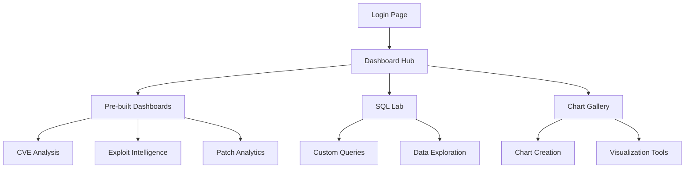

# Superset Analytics Playground

## Interactive Vulnerability Analytics Platform

Welcome to the comprehensive vulnerability analytics platform powered by Apache Superset. This platform provides real-time access to interactive dashboards and exploratory analysis tools for vulnerability lifecycle research.

**🎯 Interactive Analytics Environment**

Explore 280K+ CVEs, 50K+ exploits, and 75K+ patches through dynamic visualizations and real-time queries.

**Platform**: [analytic.ifthreat.com](https://analytic.ifthreat.com)

[**Request Access**](mailto:Eid.Albedah@citystgeorges.ac.uk?subject=Superset%20Access%20Request&body=Hello%2C%0A%0AI%20would%20like%20to%20request%20access%20to%20the%20Apache%20Superset%20analytics%20playground.%0A%0AName%3A%20%0AInstitution%2FOrganization%3A%20%0AReason%20for%20access%3A%20%0A%0AThank%20you%21){ .md-button .md-button--primary }

## Platform Overview

### Real-Time Analytics Capabilities

- :material-chart-line: **Interactive Dashboards**

    Pre-built dashboards for vulnerability trends, vendor comparisons, and lifecycle analysis

- :material-database-search: **Custom Queries**

    SQL Lab for custom analysis and data exploration on the full 25GB dataset

- :material-chart-multiple: **Visualization Library**

    50+ chart types including time-series, statistical distributions, and network graphs

- :material-download: **Data Export**

    Export capabilities for charts, dashboards, and query results

### Access Requirements

!!! info "Access Request Process"
    
    **To gain access to the analytics platform:**
    
    1. **Email Request**: Send to Eid.Albedah@citystgeorges.ac.uk
    2. **Include Information**:
        - Full name and institution
        - Research purpose or analysis needs
        - Intended use case
    3. **Response Time**: 24-48 hours for credential provisioning
    4. **Access Level**: Read-only access to vulnerability database

### Available Dashboard Categories

=== "Research Dashboards"
    
    **CVE Lifecycle Analysis**
    - Annual CVE trends and distributions
    - Multi-vendor response time comparisons
    - Severity-based pattern analysis
    - Geographic and temporal vulnerability patterns
    
    **Exploit Intelligence**
    - Exploit publication timeline tracking
    - CVE-exploit correlation analysis
    - Exploitation rate analysis by vendor
    - Zero-day and N-day exploitation patterns
    
    **Patch Response Analytics**
    - Vendor response time distributions
    - Patch effectiveness analysis
    - Product family vulnerability patterns
    - Critical infrastructure security metrics

=== "Statistical Analysis"
    
    **Advanced Analytics**
    - Survival analysis visualizations
    - Heavy-tailed distribution analysis
    - Correlation matrices and heatmaps
    - Predictive model results and validation
    
    **Time Series Analysis**
    - Seasonal decomposition of vulnerability data
    - Trend analysis and forecasting
    - Change point detection
    - Comparative time series across vendors

=== "Interactive Exploration"
    
    **Data Discovery**
    - Multi-dimensional filtering and drilling
    - Cross-tabulation analysis
    - Dynamic cohort analysis
    - Real-time data exploration
    
    **Custom Visualizations**
    - User-defined chart creation
    - Custom SQL query interface
    - Dashboard customization tools
    - Collaborative analysis features

## Platform Features

### Technical Specifications

**Data Source**: 25GB DuckDB vulnerability database  
**Update Frequency**: Daily incremental updates  
**Query Performance**: Sub-second response for most queries  
**Concurrent Users**: Support for multiple simultaneous users  
**Data Coverage**: 1999-2025 vulnerability data across all major sources

### Security and Privacy

- **Data Protection**: Read-only access prevents data modification
- **User Authentication**: Secure login with individual credentials
- **Audit Logging**: All user activity logged for security monitoring
- **Data Anonymization**: No personal or sensitive information exposed

### Supported Analysis Types

#### Vulnerability Distribution Analysis
- Annual and seasonal vulnerability patterns
- Product and vendor vulnerability rankings
- Geographic distribution of vulnerabilities
- Industry sector vulnerability analysis

#### Temporal Pattern Analysis
- Time-to-disclosure analysis
- Exploit publication timing patterns
- Patch response time distributions
- Lifecycle event correlation analysis

#### Comparative Analysis
- Multi-vendor response comparisons
- Commercial vs. open source patterns
- Severity-based response analysis
- Ecosystem vulnerability patterns

#### Statistical Modeling
- Survival analysis for time-to-event data
- Heavy-tailed distribution fitting
- Correlation and regression analysis
- Predictive model validation

## Getting Started Guide

### Initial Setup

1. **Receive Credentials**: Check email for login credentials after approval
2. **Platform Access**: Navigate to [analytic.ifthreat.com](https://analytic.ifthreat.com)
3. **First Login**: Use provided credentials to log in
4. **Dashboard Tour**: Start with pre-built dashboards for orientation

### Navigation Guide

### Common Use Cases

#### Academic Research
- **Literature Validation**: Verify claims from academic papers
- **Methodology Replication**: Reproduce analysis from published studies
- **Hypothesis Testing**: Explore new research questions with interactive tools
- **Data Export**: Extract data for statistical analysis in R/Python

#### Industry Analysis
- **Vendor Benchmarking**: Compare security response across vendors
- **Risk Assessment**: Analyze vulnerability patterns for risk management
- **Trend Analysis**: Identify emerging vulnerability trends
- **Strategic Planning**: Data-driven security strategy development

#### Policy Research
- **Evidence Collection**: Gather empirical evidence for policy proposals
- **Impact Assessment**: Analyze the effectiveness of existing policies
- **Comparative Analysis**: Compare approaches across different jurisdictions
- **Trend Monitoring**: Track long-term security ecosystem changes

## Technical Support

### Documentation Resources
- **User Guide**: Comprehensive platform documentation available in-platform
- **Video Tutorials**: Screen recordings for common analysis tasks
- **FAQ Section**: Answers to frequently asked questions
- **Best Practices**: Recommended approaches for different analysis types

### Support Channels
- **Email Support**: Eid.Albedah@citystgeorges.ac.uk for technical issues
- **Documentation**: Built-in help system and tutorials
- **Community**: User feedback and feature requests welcome

### Platform Limitations
- **Read-Only Access**: No data modification capabilities
- **Query Limits**: Complex queries may have timeout restrictions
- **Concurrent Sessions**: Limited number of simultaneous users
- **Data Export**: Reasonable limits on data export volume

## Research Applications

### Published Research
This platform has supported analysis for:
- PhD transfer report (2024)
- Conference paper submissions (2025)
- Multi-vendor comparative studies
- Vulnerability lifecycle modeling research

### Collaboration Opportunities
- **Joint Research**: Collaborative analysis projects welcome
- **Data Sharing**: Controlled access for validated research projects
- **Methodology Development**: Platform enhancement based on research needs
- **Publication Support**: Analysis support for academic publications

---

**Platform Access**: [analytic.ifthreat.com](https://analytic.ifthreat.com)  
**Support Contact**: Eid.Albedah@citystgeorges.ac.uk  
**Documentation**: Available in-platform after login

*This interactive analytics platform represents a unique resource for vulnerability research, providing unprecedented access to comprehensive, real-time vulnerability intelligence for academic research, industry analysis, and policy development.*