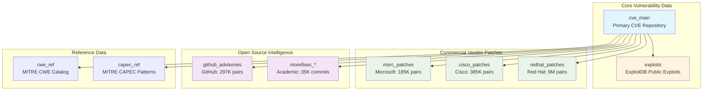
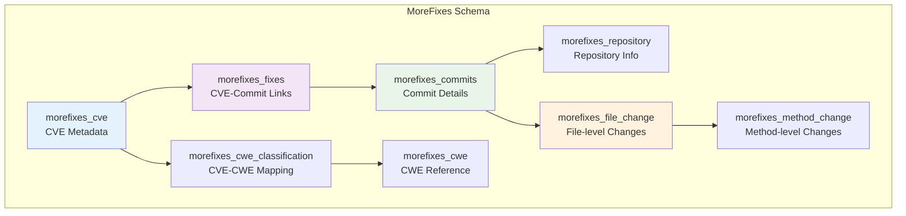
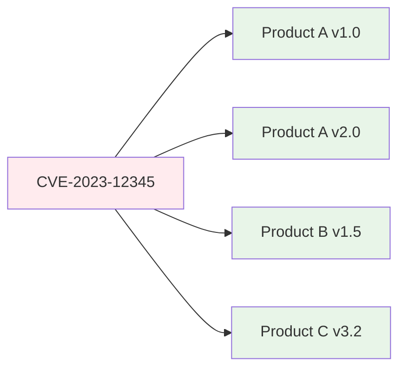
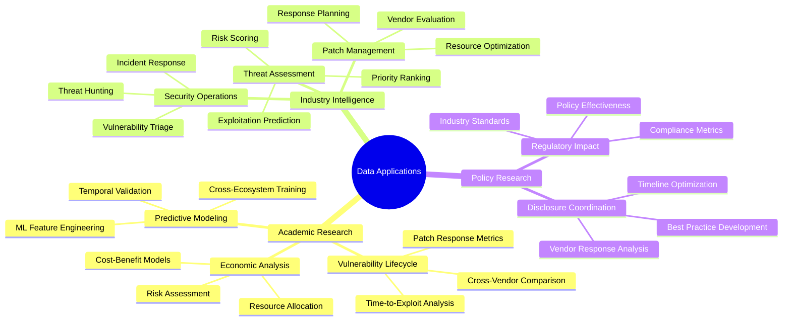

# Data Dictionary and Schema Overview

!!! info "Dataset Overview"
    This documentation describes the schema, sources, and column definitions for all tables in the unified vulnerability database. The goal is to support data analysts in exploring and interpreting complex security datasets. All tables are loaded into a DuckDB database and sourced from trusted industry feeds.

## Database Scale & Statistics

=== "Storage Metrics"
    | Metric | Value |
    |--------|-------|
    | **Uncompressed Size** | 24 GB |
    | **Compressed Size** | 5 GB |
    | **Primary Engine** | DuckDB (Analytical) |
    | **Format** | Columnar Parquet |

=== "Record Distribution"
    ```mermaid
    pie title CVE-Product/Package Pairs Distribution
        "Red Hat (9M)" : 9000000
        "Cisco (385K)" : 385000
        "GitHub (297K)" : 297000
        "Microsoft (185K)" : 185000
        "MoreFixes (35K)" : 35276
    ```

=== "Data Sources"
    **Trusted Industry Feeds**
    
    - **MITRE CVE-V5** & **NVD** - Primary vulnerability data
    - **CISA KEV & SSVC** - Government threat intelligence
    - **ExploitDB** - Community exploit repository
    - **Microsoft MSRC** - Vendor security advisories
    - **Red Hat Security** - Enterprise Linux advisories
    - **Cisco PSIRT** - Network infrastructure advisories
    - **GitHub Security** - Open source package advisories
    - **MoreFixes Academic** - Research-grade fix commits

## Table Overview & Relationships



---

## Core Tables

### `cve_main` - Primary CVE Repository

!!! abstract "Central Vulnerability Database"
    **Sources**: MITRE CVE-V5, NVD, CISA KEV, CISA SSVC, ExploitDB  
    **Primary Key**: `cve_id`  
    **Record Type**: Unique CVE entries

=== "Identification & Status"
    | Column | Type | Description |
    |--------|------|-------------|
    | `id` | Integer | Internal unique identifier |
    | `cve_id` | String | CVE ID from MITRE/NVD (e.g., CVE-2023-12345) |
    | `assigner_org` | String | Organization that assigned the CVE |
    | `state` | String | CVE state: PUBLISHED or REJECTED |
    | `description` | Text | CVE description text |

=== "Temporal Information"
    | Column | Type | Description |
    |--------|------|-------------|
    | `date_reserved` | Date | When the CVE ID was reserved |
    | `date_published` | Date | When the CVE was published |
    | `date_updated` | Date | Last update timestamp |

=== "CVSS Scoring"
    !!! tip "Scoring Priority: v4 → v3 → v2"
        | Column | Type | Description |
        |--------|------|-------------|
        | `cvss_v2_score` | Float | CVSS v2 score (0.0–10.0) |
        | `cvss_v2_vector` | String | Vector string for CVSS v2 |
        | `cvss_v3_score` | Float | CVSS v3 score |
        | `cvss_v3_vector` | String | CVSS v3 vector |
        | `cvss_v3_severity` | String | Severity level (LOW, MEDIUM, HIGH, CRITICAL) |
        | `cvss_v4_score` | Float | CVSS v4 score |
        | `cvss_v4_vector` | String | CVSS v4 vector string |
        | `cvss_v4_severity` | String | CVSS v4 severity classification |

=== "Classification & Intelligence"
    | Column | Type | Description |
    |--------|------|-------------|
    | `cwe_ids` | String | Comma-separated list of CWE IDs |
    | `cpes` | String | Comma-separated CPEs affected |
    | `vendors` | String | Vendors (can be imprecise) |
    | `products` | String | Products (can be imprecise) |
    | `references` | Text | List of external references (URLs) |

=== "CISA Intelligence"
    !!! warning "Government Threat Assessment"
        | Column | Type | Description |
        |--------|------|-------------|
        | `ssvc_exploitation` | String | SSVC status: "active", "poc", or "none" |
        | `ssvc_automatable` | Boolean | Is the issue automatable? |
        | `ssvc_technical_impact` | String | Level of technical impact |
        | `kev_known_exploited` | Boolean | 1 if listed in CISA KEV |
        | `kev_vendor_project` | String | Vendor/project name from KEV |
        | `kev_product` | String | Product name from KEV |
        | `kev_vulnerability_name` | String | Title from CISA KEV advisory |
        | `kev_date_added` | Date | Date added to KEV list |
        | `kev_short_description` | Text | Short description from KEV |
        | `kev_required_action` | String | Recommended mitigation action |
        | `kev_due_date` | Date | Deadline for remediation |
        | `kev_ransomware_use` | Boolean | Indicates ransomware involvement |
        | `kev_notes` | Text | Any notes from KEV advisory |
        | `kev_cwes` | String | Associated CWE(s) in KEV |

=== "Predictive Analytics"
    | Column | Type | Description |
    |--------|------|-------------|
    | `epss_score` | Float | EPSS likelihood score (0-1) |
    | `epss_percentile` | Float | EPSS global percentile |
    | `has_exploit` | Boolean | 1 if exploit exists in ExploitDB |
    | `exploit_count` | Integer | Number of exploits in ExploitDB for this CVE |

=== "System Metadata"
    | Column | Type | Description |
    |--------|------|-------------|
    | `data_sources` | String | Comma-separated source indicators |
    | `created_at` | Timestamp | DB timestamp (ignore) |
    | `updated_at` | Timestamp | DB timestamp (ignore) |
    | `first_exploit_date` | Date | Earliest exploit date (ignore) |
    | `latest_exploit_date` | Date | Latest exploit date (ignore) |

---

### `exploits` - Public Exploit Repository

!!! danger "Threat Intelligence Data"
    **Source**: ExploitDB  
    **Primary Key**: `id`  
    **Foreign Key**: `cve_id` → `cve_main.cve_id`  
    **Record Type**: Individual exploit entries

| Column | Type | Description |
|--------|------|-------------|
| `id` | Integer | Internal ID |
| `file` | String | File name or path to exploit code |
| `description` | Text | Description of the exploit |
| `date_published` | Date | Date of publication in ExploitDB |
| `author` | String | Author of the exploit |
| `type` | String | Exploit type (e.g., local, remote) |
| `platform` | String | Affected platform |
| `port` | Integer | Port used by exploit if applicable |
| `date_added` | Date | When added to DB |
| `date_updated` | Date | Last update to record |
| `verified` | Boolean | 1 if exploit was verified |
| `codes` | Text | Exploit code or snippets |
| `tags` | String | Tags (e.g., webapps, dos) |
| `aliases` | String | Alternative exploit names or IDs |
| `screenshot_url` | String | Screenshot of exploit demo if available |
| `application_url` | String | URL of affected application |
| `source_url` | String | Source reference |
| `cve_id` | String | Related CVE ID |

---

## Commercial Vendor Patches

### `msrc_patches` - Microsoft Security Response Center

!!! note "Microsoft Vendor Intelligence"
    **Source**: Microsoft MSRC (CVRF/CSAF)  
    **Record Type**: CVE-Product pairs  
    **Volume**: 185,000 pairs  
    **Note**: Single advisory may appear multiple times

=== "Advisory Information"
    | Column | Type | Description |
    |--------|------|-------------|
    | `title` | String | Title of the advisory |
    | `release_date` | Date | Official patch release date |
    | `initial_release_date` | Date | Initial release of the advisory |
    | `cvrf_id` | String | Microsoft advisory ID |
    | `cve_id` | String | CVE associated |

=== "Exploitation Assessment"
    | Column | Type | Description |
    |--------|------|-------------|
    | `exploited_status` | Boolean | 1 if exploited |
    | `exploitation_potential_lsr` | String | Exploitation potential - Latest security release |
    | `exploitation_potential_osr` | String | Exploitation potential - Other supported releases |
    | `publicly_disclosed` | Boolean | 1 if publicly disclosed |

=== "Technical Details"
    | Column | Type | Description |
    |--------|------|-------------|
    | `cvss_score` | Float | CVSS score |
    | `cvss_vector` | String | Vector string |
    | `vuln_title` | String | Title of the vulnerability |
    | `cwe_ids` | String | Comma-separated CWE list |

=== "Product Information"
    | Column | Type | Description |
    |--------|------|-------------|
    | `product_id` | String | Internal product ID |
    | `product_name` | String | Human-readable product name |
    | `product_branch` | String | Specific version or release branch |
    | `product_cpe` | String | CPE name for affected software |

=== "Advisory Content"
    | Column | Type | Description |
    |--------|------|-------------|
    | `threats` | Text | Known threats or risks |
    | `remediations` | Text | Mitigations or patch steps |
    | `notes` | Text | Notes from Microsoft |
    | `acknowledgments` | Text | Credit for discovery |

---

### `redhat_patches` - Red Hat Security Advisories

!!! success "Enterprise Linux Intelligence"
    **Source**: Red Hat Security Advisory (CSAF)  
    **Record Type**: CVE-Product pairs  
    **Volume**: 9 million pairs  
    **Coverage**: Official Red Hat + Open Source + Third-party

!!! warning "Product Filtering Required"
    To filter for official Red Hat products, use these keywords in `product_name` or `product_id`:
    
    `rh`, `red hat`, `red-hat`, `rhel`, `enterprise linux`, `baseos`, `appstream`, `openshift`

=== "Advisory Metadata"
    | Column | Type | Description |
    |--------|------|-------------|
    | `id` | Integer | Internal ID |
    | `advisory_id` | String | Red Hat Advisory ID |
    | `title` | String | Title of advisory |
    | `cve_id` | String | CVE associated |
    | `cwe_id` | String | CWE ID |
    | `vulnerability_title` | String | Vulnerability title |

=== "Temporal Information"
    | Column | Type | Description |
    |--------|------|-------------|
    | `current_release_date` | Date | Current release date |
    | `initial_release_date` | Date | First release date |
    | `discovery_date` | Date | When discovered |
    | `release_date` | Date | Full release timeline |

=== "Publication Details"
    | Column | Type | Description |
    |--------|------|-------------|
    | `status` | String | Advisory status |
    | `version` | String | Package version patched |
    | `publisher` | String | "Red Hat" or other originator |
    | `publisher_category` | String | Type of publisher (vendor, third-party, etc.) |

=== "Content & Assessment"
    | Column | Type | Description |
    |--------|------|-------------|
    | `summary` | Text | Summary of advisory |
    | `details` | Text | Detailed description |
    | `cvss_score` | Float | CVSS score |
    | `cvss_severity` | String | Severity rating (LOW–CRITICAL) |
    | `cvss_vector` | String | Vector string |
    | `threat_impact` | String | Description of impact |
    | `aggregate_severity` | String | Aggregated severity level |

=== "Product Information"
    | Column | Type | Description |
    |--------|------|-------------|
    | `product_id` | String | Product ID (e.g. "3AS:openmotif-debuginfo-0:2.2.3") |
    | `product_name` | String | Product name (e.g. "Red Hat Linux 7.1") |

---

### `cisco_patches` - Cisco Product Security

!!! info "Network Infrastructure Intelligence"
    **Source**: Cisco PSIRT (CSAF)  
    **Record Type**: CVE-Product pairs  
    **Volume**: 385,000 pairs

=== "Advisory Metadata"
    | Column | Type | Description |
    |--------|------|-------------|
    | `advisory_id` | String | Cisco Advisory ID |
    | `title` | String | Title of advisory |
    | `cve_id` | String | CVE associated |
    | `vulnerability_title` | String | Vulnerability title |

=== "Temporal Information"
    | Column | Type | Description |
    |--------|------|-------------|
    | `current_release_date` | Date | Latest version date |
    | `initial_release_date` | Date | First published |
    | `vulnerability_release_date` | Date | Actual vulnerability disclosure date |

=== "Publication Details"
    | Column | Type | Description |
    |--------|------|-------------|
    | `status` | String | Advisory status |
    | `version` | String | Advisory version |
    | `publisher` | String | Cisco or partner |
    | `publisher_category` | String | Type of publisher |

=== "Content & Assessment"
    | Column | Type | Description |
    |--------|------|-------------|
    | `summary` | Text | Summary text |
    | `details` | Text | Detailed description |
    | `cvss_score` | Float | CVSS score |
    | `cvss_severity` | String | Severity label |
    | `cvss_vector` | String | Vector string |
    | `bug_ids` | String | Related bug trackers |

=== "Product & References"
    | Column | Type | Description |
    |--------|------|-------------|
    | `product_id` | String | Cisco product ID |
    | `product_name` | String | Human-readable product name |
    | `product_full_path` | String | Full internal path to product |
    | `acknowledgments` | Text | Credits |
    | `references` | Text | External URLs |
    | `remediations` | Text | Steps to fix |

---

## Open Source Intelligence

### `github_advisories` - GitHub Security Database

!!! abstract "Package Ecosystem Intelligence"
    **Source**: GitHub Advisory Database  
    **Record Type**: CVE-Package pairs  
    **Volume**: 297,000 pairs

!!! warning "Enhanced with Inferred Fields"
    Fields marked **(inferred)** are derived using keyword scanning and are not native to GitHub:
    
    - `exploited` - Based on terms like "actively exploited", "attacks observed"
    - `poc_available` - Based on PoC keywords or exploit database references
    - `exploitability_level` - 0–3 scale based on difficulty terms
    - `patched`/`patch_available` - Extracted from JSON `affected.ranges.events`

=== "Advisory Metadata"
    | Column | Type | Description |
    |--------|------|-------------|
    | `id` | Integer | Internal ID |
    | `ghsa_id` | String | GitHub Security Advisory ID (GHSA-...) |
    | `schema_version` | String | Version of advisory schema |
    | `published` | Timestamp | Publish timestamp |
    | `modified` | Timestamp | Last modification timestamp |

=== "Content & Description"
    | Column | Type | Description |
    |--------|------|-------------|
    | `summary` | Text | One-line summary |
    | `details` | Text | Full description |
    | `primary_cve` | String | Main CVE ID |
    | `all_cves` | String | All related CVEs |
    | `references` | Text | List of references (URLs) |

=== "Scoring & Assessment"
    | Column | Type | Description |
    |--------|------|-------------|
    | `cvss_v3_score` | Float | CVSS v3 score |
    | `cvss_v3_vector` | String | CVSS v3 vector |
    | `cvss_v4_score` | Float | CVSS v4 score |
    | `cvss_v4_vector` | String | CVSS v4 vector |
    | `database_severity` | String | Severity category (GitHub-defined) |
    | `severity_score` | Float | Internal numeric score |
    | `cwe_ids` | String | CWE IDs |

=== "Review & Validation"
    | Column | Type | Description |
    |--------|------|-------------|
    | `github_reviewed` | Boolean | Boolean if reviewed by GitHub |
    | `github_reviewed_at` | Timestamp | Timestamp of review |
    | `nvd_published_at` | Timestamp | When added to NVD |

=== "Inferred Intelligence"
    !!! example "ETL-Enhanced Fields"
        | Column | Type | Description |
        |--------|------|-------------|
        | `exploited` | Boolean | 1 if exploitation confirmed **(inferred)** |
        | `exploitability_level` | Integer | 0–3 scale based on inferred difficulty |
        | `poc_available` | Boolean | 1 if PoC or exploit publicly available **(inferred)** |
        | `patched` | Boolean | 1 if patched **(inferred)** |
        | `patch_available` | Boolean | 1 if patch reference is present **(inferred)** |

=== "Package Information"
    | Column | Type | Description |
    |--------|------|-------------|
    | `primary_ecosystem` | String | Primary ecosystem (e.g., npm, pip) |
    | `all_ecosystems` | String | All affected ecosystems |
    | `package_ecosystem` | String | Package ecosystem (npm, pip, etc.) |
    | `package_name` | String | Name of affected package |
    | `package_purl` | String | Package URL identifier (PURL) |
    | `affected_ranges` | String | Version range strings affected |
    | `affected_versions` | String | Specific affected versions |

---

## Academic Research Data

### MoreFixes Dataset Family

!!! success "Academic Research Dataset"
    **Source**: MoreFixes Dataset (JafarAkhondali et al., 2024)  
    **Paper**: [ACM Digital Library](https://dl.acm.org/doi/abs/10.1145/3663533.3664036)  
    **Repository**: [GitHub](https://github.com/JafarAkhondali/Morefixes)  
    **Scale**: 29,203 unique CVEs from 7,238 GitHub projects

!!! info "Dataset Characteristics"
    This dataset contains the largest collection of CVE vulnerability data with fix commits available today:
    
    - **35,276 unique commits** linked to vulnerabilities
    - **39,931 patch commit files** that fixed those vulnerabilities
    - Some patch files couldn't be saved as SQL due to technical constraints



=== "morefixes_cve"
    **CVE Metadata Table**
    
    | Column | Type | Description |
    |--------|------|-------------|
    | `cve_id` | String | CVE ID |
    | `published_date` | Date | CVE publication date |
    | `last_modified_date` | Date | Last modified date |
    | `description` | Text | CVE summary |
    | `nodes` | String | Affected OS/software versions |
    | `severity` | String | Severity level |
    | `obtain_all_privilege` | Boolean | Boolean flag |
    | `obtain_user_privilege` | Boolean | Boolean flag |
    | `obtain_other_privilege` | Boolean | Boolean flag |
    | `user_interaction_required` | Boolean | Boolean flag |
    | `cvss2_vector_string` | String | CVSSv2 vector string |
    | `cvss3_vector_string` | String | CVSSv3 vector string |

=== "morefixes_fixes"
    **CVE-Commit Relationship Table**
    
    | Column | Type | Description |
    |--------|------|-------------|
    | `cve_id` | String | CVE ID |
    | `hash` | String | Commit hash |
    | `repo_url` | String | Git repository URL |
    | `rel_type` | String | Commit relation type |
    | `score` | Integer | Score based on relevance (e.g., 1337) |

=== "morefixes_commits"
    **Commit Details Table**
    
    | Column | Type | Description |
    |--------|------|-------------|
    | `hash` | String | Commit hash |
    | `repo_url` | String | Repository URL |
    | `author` | String | Author name |
    | `msg` | Text | Commit message |
    | `num_lines_added` | Integer | Lines added |
    | `num_lines_deleted` | Integer | Lines deleted |
    | `author_date` | Timestamp | Timestamp |

=== "morefixes_repository"
    **Repository Metadata Table**
    
    | Column | Type | Description |
    |--------|------|-------------|
    | `repo_url` | String | Repository URL |
    | `repo_name` | String | Name of repo |
    | `description` | Text | Short description |
    | `date_created` | Date | When repo created |
    | `date_last_push` | Date | When last pushed |
    | `owner` | String | Owner username |

=== "morefixes_file_change"
    **File-Level Changes Table**
    
    | Column | Type | Description |
    |--------|------|-------------|
    | `file_change_id` | String | Unique ID |
    | `hash` | String | Commit hash |
    | `filename` | String | File name |
    | `change_type` | String | ADD/DELETE/MODIFY |
    | `diff` | Text | Git diff |
    | `code_before` | Text | Code snippet before fix |
    | `code_after` | Text | Code snippet after fix |

=== "morefixes_method_change"
    **Method-Level Changes Table**
    
    | Column | Type | Description |
    |--------|------|-------------|
    | `method_change_id` | String | Unique ID |
    | `file_change_id` | String | FK to file change |
    | `name` | String | Function/method name |
    | `code` | Text | Full method code |
    | `complexity` | Integer | Cyclomatic complexity |

=== "morefixes_cwe_classification"
    **CVE-CWE Mapping Table**
    
    | Column | Type | Description |
    |--------|------|-------------|
    | `cve_id` | String | CVE ID |
    | `cwe_id` | String | CWE ID |

=== "morefixes_cwe"
    **CWE Reference Table**
    
    | Column | Type | Description |
    |--------|------|-------------|
    | `cwe_id` | String | CWE ID |
    | `cwe_name` | String | Name of weakness |
    | `description` | Text | Short description |
    | `is_category` | Boolean | Boolean |

---

## Reference Tables

### `cwe_ref` - Common Weakness Enumeration

!!! tip "MITRE CWE Knowledge Base"
    **Source**: MITRE CWE  
    **Primary Key**: `cwe_id`  
    **Usage**: Weakness classification and pattern analysis

=== "Core Information"
    | Column | Type | Description |
    |--------|------|-------------|
    | `cwe_id` | String | Unique identifier for the CWE entry (e.g., CWE-79) |
    | `name` | String | Short title of the weakness (e.g., Cross-site Scripting) |
    | `weakness_abstraction` | String | Generalization level: Base, Variant, Class, etc. |
    | `status` | String | Current status: Draft, Incomplete, Deprecated, etc. |
    | `description` | Text | Brief description of the weakness |
    | `extended_description` | Text | Full textual explanation including implications, context, examples |

=== "Relationships & Classification"
    | Column | Type | Description |
    |--------|------|-------------|
    | `related_weaknesses` | String | List of associated or parent/child CWE IDs |
    | `weakness_ordinalities` | String | Ordering of weakness by nature or relevance |
    | `applicable_platforms` | String | Technology platforms (e.g., Web, IoT, Mobile) |
    | `background_details` | Text | Additional background for understanding |
    | `alternate_terms` | String | Other names or aliases for this weakness |

=== "Development & Security"
    | Column | Type | Description |
    |--------|------|-------------|
    | `modes_of_introduction` | Text | How the weakness typically arises in development |
    | `exploitation_factors` | Text | Factors affecting how this weakness can be exploited |
    | `likelihood_of_exploit` | String | Qualitative probability of exploitation (e.g., High, Medium) |
    | `common_consequences` | Text | Typical impacts such as DoS, Data Disclosure |

=== "Detection & Mitigation"
    | Column | Type | Description |
    |--------|------|-------------|
    | `detection_methods` | Text | How the weakness is typically detected (e.g., SAST) |
    | `potential_mitigations` | Text | Recommended mitigation techniques |
    | `observed_examples` | Text | CVE examples linked to this weakness |

=== "Taxonomy & Resources"
    | Column | Type | Description |
    |--------|------|-------------|
    | `functional_areas` | String | Functional areas affected, such as Authentication |
    | `affected_resources` | String | System elements affected (e.g., Database, Web Layer) |
    | `taxonomy_mappings` | Text | Linked taxonomies such as OWASP Top 10 |
    | `related_attack_patterns` | String | CAPEC IDs related to the weakness |
    | `notes` | Text | Editorial or historical notes |
    | `created_at` | Timestamp | Timestamp of record creation |

!!! example "Example CWE Entry"
    | cwe_id | name | weakness_abstraction | status | description |
    |--------|------|---------------------|--------|-------------|
    | CWE-79 | Improper Neutralization of Input | Variant | Complete | The software does not neutralize or incorrectly neutralizes user-controllable input before it is placed in output that is used as a web page that is served to other users. |

---

### `capec_ref` - Common Attack Pattern Enumeration

!!! warning "MITRE CAPEC Attack Patterns"
    **Source**: MITRE CAPEC  
    **Primary Key**: `capec_id`  
    **Usage**: Attack methodology analysis and CWE correlation

=== "Core Information"
    | Column | Type | Description |
    |--------|------|-------------|
    | `capec_id` | String | Unique CAPEC identifier (e.g., CAPEC-1) |
    | `name` | String | Name of the attack pattern (e.g., Accessing Functionality Not Properly Constrained by ACLs) |
    | `abstraction` | String | Abstraction level (Standard, Meta, etc.) |
    | `status` | String | Entry status (e.g., Draft, Complete) |
    | `description` | Text | Brief description of the attack pattern |
    | `alternate_terms` | String | Other terms used for the same pattern |

=== "Risk Assessment"
    | Column | Type | Description |
    |--------|------|-------------|
    | `likelihood_of_attack` | String | Qualitative assessment (e.g., High, Medium) |
    | `typical_severity` | String | Expected severity if the attack is successful (e.g., High) |
    | `related_attack_patterns` | Text | List of CAPEC relationships (e.g., ChildOf, CanPrecede) |

=== "Attack Methodology"
    | Column | Type | Description |
    |--------|------|-------------|
    | `execution_flow` | Text | Sequence of actions for attack execution |
    | `prerequisites` | Text | Conditions required for the attack to succeed |
    | `skills_required` | Text | Skill level necessary for an attacker |
    | `resources_required` | Text | Tools or resources an attacker needs |

=== "Detection & Defense"
    | Column | Type | Description |
    |--------|------|-------------|
    | `indicators` | Text | Observable signs of this attack pattern |
    | `consequences` | Text | Potential impacts on confidentiality, integrity, availability |
    | `mitigations` | Text | Recommendations to prevent or mitigate the attack |

=== "Examples & Relationships"
    | Column | Type | Description |
    |--------|------|-------------|
    | `example_instances` | Text | Known real-world examples of this pattern |
    | `related_weaknesses` | String | CWE IDs related to this CAPEC pattern |
    | `taxonomy_mappings` | Text | External taxonomy associations (e.g., ATT&CK) |
    | `notes` | Text | Editorial, contextual, or historical notes |
    | `created_at` | Timestamp | Timestamp of record creation |

!!! example "Example CAPEC Entry"
    | capec_id | name | abstraction | status | description |
    |----------|------|-------------|--------|-------------|
    | CAPEC-1 | Accessing Functionality Not Properly Constrained by ACLs | Standard | Draft | Attackers access web functionality not protected by ACLs due to misconfiguration or missing access control. This can lead to privilege escalation or unauthorized actions. |

---

## Data Quality & Processing Notes

### Important Data Considerations

!!! warning "Critical Data Quality Notes"

=== "Missing Values & Scoring"
    **CVSS and EPSS Handling**
    
    - If any `cvss_*_score` or `epss_score`/`epss_percentile` value is `-1`, this indicates the score was **not available** from the source
    - Use priority ordering: CVSS v4 → v3 → v2 for analysis
    - EPSS scores range from 0-1 (probability of exploitation)

=== "Temporal Data Limitations"
    **Exploitation Timeline Constraints**
    
    - **Primary temporal data**: Only found in `exploits` table (`date_published` from ExploitDB)
    - **Other datasets**: Lack explicit timestamps for when exploitation was observed
    - **`kev_date_added`**: Reflects when CISA became aware of exploit, **not when exploitation began**
    - **Analysis impact**: Limited ability to create precise exploitation timelines

=== "Product Filtering Requirements"
    **Red Hat Product Classification**
    
    To ensure only **official Red Hat products** are selected from `redhat_patches`, filter using these keywords in `product_name` or `product_id`:
    
    ```sql
    WHERE (
        LOWER(product_name) REGEXP '(rh|red.hat|red-hat|rhel|enterprise.linux|baseos|appstream|openshift)'
        OR LOWER(product_id) REGEXP '(rh|red.hat|red-hat|rhel|enterprise.linux|baseos|appstream|openshift)'
    )
    ```

=== "Enhanced Field Methodology"
    **GitHub Advisory Inferred Fields**
    
    The following fields in `github_advisories` are **not native** to GitHub but derived via ETL keyword detection:
    
    | Field | Detection Method | Confidence Level |
    |-------|------------------|------------------|
    | `exploited` | Keywords: "actively exploited", "attacks observed", "exploitation detected" | Medium |
    | `poc_available` | References to ExploitDB, PoC repositories, demonstration code | High |
    | `exploitability_level` | Terms: "trivial", "complex", difficulty indicators (0-3 scale) | Low-Medium |
    | `patched` | JSON parsing of `affected.ranges.events` for "fixed" events | High |
    | `patch_available` | Presence of patch references, fix commits, or remediation links | High |

### Record Duplication Patterns

!!! info "Expected Duplication Scenarios"

**CVE-Product/Package Pairs**

All vendor patch tables contain **intentional duplication** where a single CVE affects multiple products:



**Examples of legitimate duplication:**
- **Microsoft**: Single advisory covering multiple Windows versions
- **Red Hat**: CVE affecting multiple RHEL releases and packages
- **Cisco**: Network vulnerability across multiple router models
- **GitHub**: Package vulnerability affecting multiple ecosystem versions

### Dataset Comparison Guidelines

!!! abstract "Ecosystem Context Considerations"

=== "Commercial vs Open Source Patches"
    **Different Data Contexts - Do Not Directly Compare**
    
    **Commercial Vendor Patches** (`msrc_patches`, `cisco_patches`, filtered `redhat_patches`):
    - Vendor-provided security advisories
    - Formal patch release processes
    - Coordinated disclosure timelines
    - Commercial support obligations
    
    **Open Source Intelligence** (`github_advisories`, `morefixes_*`, unfiltered `redhat_patches`):
    - Community-driven fix processes
    - Package manager ecosystems (npm, PyPI, Maven)
    - Variable disclosure coordination
    - Diverse fix quality and timing

=== "Analytical Considerations"
    **Appropriate Comparison Strategies**
    
    ✅ **Valid Comparisons:**
    - Commercial vendors against each other (Microsoft vs Cisco vs Red Hat official)
    - Open source ecosystems against each other (npm vs PyPI packages)
    - Temporal trends within the same ecosystem
    - Severity distributions within vendor categories
    
    ❌ **Invalid Comparisons:**
    - Direct commercial vs open source response times
    - Package fix times vs enterprise patch cycles
    - Mixed ecosystem aggregated metrics
    - Cross-ecosystem severity correlations without context

### Query Performance & Optimization

!!! tip "Database Query Guidelines"

=== "Recommended Query Patterns"
    **Optimized for Analytical Workloads**
    
    ```sql
    -- Efficient temporal analysis with proper indexing
    SELECT 
        EXTRACT(YEAR FROM date_published) as year,
        COUNT(*) as cve_count,
        AVG(cvss_v3_score) as avg_severity
    FROM cve_main 
    WHERE date_published >= '2020-01-01'
        AND cvss_v3_score > 0
    GROUP BY 1
    ORDER BY 1;
    
    -- Multi-vendor patch comparison with proper filtering
    WITH vendor_patches AS (
        SELECT cve_id, release_date, 'Microsoft' as vendor 
        FROM msrc_patches
        UNION ALL
        SELECT cve_id, current_release_date, 'Cisco' 
        FROM cisco_patches
        UNION ALL
        SELECT cve_id, current_release_date, 'RedHat'
        FROM redhat_patches 
        WHERE LOWER(product_name) REGEXP 'rhel|enterprise.linux'
    )
    SELECT vendor, COUNT(*) as patch_count
    FROM vendor_patches
    GROUP BY vendor;
    ```

=== "Performance Considerations"
    **DuckDB Optimization Tips**
    
    - **Columnar Advantage**: Aggregate queries perform exceptionally well
    - **Date Filtering**: Always use date ranges to limit scan scope
    - **String Operations**: REGEXP operations are optimized but still costly
    - **JOIN Performance**: Foreign key relationships are well-optimized
    - **Memory Usage**: Large text fields (descriptions, details) impact memory

### Research Applications & Use Cases



### Data Validation & Quality Assurance

!!! success "Quality Framework"

=== "Automated Validation"
    **ETL Quality Checks**
    
    - **Schema Validation**: Data type and constraint verification
    - **Referential Integrity**: Foreign key relationship validation
    - **Temporal Consistency**: Date sequence and range validation
    - **Duplicate Detection**: Cross-source duplicate identification
    - **Completeness Checks**: Required field population validation

=== "Manual Review Process"
    **Human Quality Assurance**
    
    - **Sample Validation**: Random record verification against sources
    - **Edge Case Analysis**: Unusual pattern investigation
    - **Source Reconciliation**: Cross-reference with original sources
    - **Domain Expert Review**: Security professional validation
    - **Update Verification**: Change tracking and validation

=== "Known Limitations"
    **Acknowledged Data Constraints**
    
    | Limitation | Impact | Mitigation Strategy |
    |------------|---------|---------------------|
    | **Temporal Gaps** | Limited exploitation timeline precision | Use available data with clear disclaimers |
    | **Inferred Fields** | Potential false positives in GitHub data | Validate with additional sources |
    | **Vendor Variations** | Inconsistent advisory formats | Normalize during analysis |
    | **Scale Differences** | Varying data volumes across sources | Use proportional analysis methods |
    | **Update Latency** | Daily update cycles | Account for freshness in analysis |

---

!!! abstract "Data Dictionary Summary"
    This comprehensive data dictionary provides the foundation for advanced vulnerability research across commercial and open source ecosystems. The unified schema enables sophisticated analysis while maintaining awareness of data quality considerations and appropriate usage patterns.

    **Key Takeaways:**
    
    - **Scale**: 24GB uncompressed, 5GB compressed with millions of CVE-product pairs
    - **Sources**: Trusted industry feeds with proper attribution and validation
    - **Quality**: Rigorous ETL processes with automated and manual validation
    - **Flexibility**: Supports both academic research and practical security applications
    - **Limitations**: Clear documentation of constraints and appropriate usage

---