# ETL Pipeline Documentation

## Overview

The data collection and processing for this research is managed through a comprehensive ETL (Extract, Transform, Load) pipeline hosted in a dedicated GitHub repository. The pipeline consists of modular components for each data source, enabling systematic and reproducible data collection across the vulnerability ecosystem.

## Pipeline Repository

**Repository**: [vulnerability-lifecycle-analysis](https://github.com/EID-ALBEDAH/vulnerability-lifecycle-analysis)  
**License**: MIT License  
**Language**: Python with Jupyter Notebooks  
**Dependencies**: Managed via `requirements.txt`

## Architecture Overview

The ETL pipeline follows a modular design where each data source has its own dedicated collection module. This approach ensures:

- **Source Isolation**: Issues with one source don't affect others
- **Independent Scheduling**: Different update frequencies per source
- **Maintainability**: Clear separation of concerns
- **Scalability**: Easy addition of new data sources

```mermaid
graph TB
    subgraph "ETL Repository Structure"
        A[📂 cve/] --> A1[cve_cwe_capec_etl.ipynb]
        B[📂 msrc/] --> B1[msrc_etl.ipynb]
        C[📂 cisco/] --> C1[cisco_psirt_etl.ipynb]
        D[📂 redhat/] --> D1[redhat_etl_optimized.ipynb]
        E[📂 github_advisory/] --> E1[github_adv_etl.ipynb]
        F[📂 morefixes/] --> F1[morefixes_exploratory.ipynb]
    end
    
    subgraph "Documentation"
        G[📂 docs/] --> G1[methodology.md]
        G --> G2[data_sources.md]
        G --> G3[api_documentation.md]
        G --> G4[troubleshooting.md]
    end
    
    subgraph "Target Database"
        H[DuckDB Database]
        I[Normalized Schema]
        J[Quality Checks]
    end
    
    A1 --> H
    B1 --> H
    C1 --> H
    D1 --> H
    E1 --> H
    F1 --> H
    
    H --> I
    I --> J
```



## Pipeline Components

### 1. CVE Core Data Pipeline
**Module**: `cve/cve_cwe_capec_etl.ipynb`  
**Purpose**: Enhanced CVE-V5 + NVD + CISA KEV + EPSS integration  
**Sources**: NVD, MITRE, CISA KEV, FIRST EPSS

**Key Features**:
- **Multi-source integration**: Combines official CVE data with threat intelligence
- **EPSS enrichment**: Adds exploitation probability scores
- **KEV mapping**: Identifies known exploited vulnerabilities
- **CWE/CAPEC linking**: Complete weakness and attack pattern relationships

**Data Flow**:


### 2. Microsoft Security Pipeline
**Module**: `msrc/msrc_etl.ipynb`  
**Purpose**: Microsoft Security Response Center data collection  
**Source**: MSRC CVRF v3 API

**Key Features**:
- **Real-time collection**: Direct API integration for latest advisories
- **Product mapping**: Detailed Microsoft product family classification
- **Exploitation status**: Microsoft's assessment of exploitation likelihood
- **Patch timeline**: Comprehensive patch release tracking

**API Integration**:
- **Endpoint**: Microsoft Security Update API
- **Authentication**: API key required
- **Rate Limiting**: 100 requests/minute
- **Format**: CVRF/CSAF structured data

### 3. Cisco Security Pipeline
**Module**: `cisco/cisco_psirt_etl.ipynb`  
**Purpose**: Cisco Product Security Incident Response Team data  
**Source**: Cisco PSIRT CSAF API

**Key Features**:
- **Infrastructure focus**: Network and security device vulnerabilities
- **Advisory parsing**: Structured CSAF advisory processing
- **Product classification**: Cisco product family mapping
- **Severity mapping**: Cisco-specific severity classifications

### 4. Red Hat Security Pipeline
**Module**: `redhat/redhat_etl_optimized.ipynb`  
**Purpose**: Red Hat Enterprise Linux security advisories  
**Source**: Red Hat CSAF security feeds

**Key Features**:
- **Enterprise focus**: RHEL and ecosystem security data
- **Product filtering**: Automated filtering for official Red Hat products
- **Upstream correlation**: Links to upstream project vulnerabilities
- **Severity assessment**: Red Hat's impact analysis


### 5. GitHub Advisory Pipeline
**Module**: `github_advisory/github_adv_etl.ipynb`  
**Purpose**: Open source security advisory collection  
**Source**: GitHub Security Advisory Database

**Key Features**:
- **Ecosystem coverage**: npm, PyPI, RubyGems, Maven, NuGet
- **Community integration**: GitHub community and Dependabot data
- **Enhanced analysis**: Inferred exploitation and patch status
- **Version tracking**: Detailed affected version ranges

**Enhanced Fields**:
- **Exploitation inference**: Keyword-based exploitation status detection
- **PoC detection**: Proof-of-concept availability assessment
- **Exploitability scoring**: 0-3 complexity scale
- **Patch status**: Derived from version range analysis

### 6. MoreFixes Integration
**Module**: `morefixes/morefixes_exploratory.ipynb`  
**Purpose**: Academic fix dataset integration and analysis  
**Source**: MoreFixes research dataset (JafarAkhondali et al., 2024)

**Key Features**:
- **Code-level analysis**: File and method-level fix examination
- **Developer perspective**: Time-to-fix from development viewpoint
- **Repository analysis**: Cross-repository fix pattern analysis
- **Validation framework**: Academic methodology compliance

**Research Applications**:
- **Fix complexity analysis**: Understanding fix effort and complexity
- **Developer behavior**: Analysis of fix patterns and timelines
- **Methodology validation**: Comparing research approaches


## Data Quality Framework

### Validation Procedures

1. **Schema Validation**
   ```python
   # Example validation check
   def validate_cve_format(cve_id):
       pattern = r'^CVE-\d{4}-\d{4,}$'
       return re.match(pattern, cve_id) is not None
   ```

2. **Cross-source Validation**
   - CVE ID consistency across sources
   - Duplicate detection and resolution
   - Reference validation

### Quality Metrics

| Pipeline Component | Data Quality Score | Completeness | Last Validation |
|-------------------|-------------------|--------------|-----------------|
| CVE Core | 98.5% | 99.2% | 2025-05-13 |
| MSRC | 96.8% | 94.5% | 2025-05-13 |
| Cisco | 94.2% | 89.7% | 2025-05-13 |
| Red Hat | 95.6% | 91.3% | 2025-05-13 |
| GitHub | 87.9% | 85.4% | 2025-05-13 |
| MoreFixes | 92.1% | 88.6% | 2024-03-15 |

## Setup and Usage

### Prerequisites
```bash
# Clone the repository
git clone https://github.com/EID-ALBEDAH/vulnerability-lifecycle-analysis.git
cd vulnerability-lifecycle-analysis

# Install dependencies
pip install -r requirements.txt

# Configure API keys (see README.md)
cp config.example.py config.py
# Edit config.py with your API keys
```

### Running Individual Pipelines
```bash
# Example: Run Microsoft MSRC pipeline
cd msrc/
jupyter notebook msrc_etl.ipynb

# Or run programmatically
python -m nbconvert --execute msrc_etl.ipynb
```

### Complete Pipeline Execution
```bash
# Run all pipelines in sequence
python run_all_pipelines.py

# Or use the makefile
make collect-all-data
```

## Integration with Research Database

### Data Flow to Research Database


### Loading Process
1. **Extract**: Individual pipeline execution
2. **Transform**: Data normalization and validation
3. **Load**: DuckDB database population
4. **Validate**: Quality checks and relationship building
5. **Index**: Performance optimization for analysis queries

## Maintenance and Updates

### Update Schedule
- **Daily**: CVE, MSRC, Red Hat, GitHub, Cisco
- **Weekly**: ExploitDB, quality validation
- **Monthly**: MoreFixes analysis updates
- **Quarterly**: Full pipeline review and optimization

### Monitoring
- **Automated health checks**: Daily pipeline status validation
- **Data quality monitoring**: Continuous quality metric tracking
- **Error alerting**: Automated notification for pipeline failures
- **Performance monitoring**: Execution time and resource usage tracking

## Research Reproducibility

### Version Control
- **Pipeline versioning**: Git tags for major pipeline versions
- **Data versioning**: Timestamped data snapshots
- **Dependency management**: Pinned package versions in requirements.txt

### Documentation Standards
- **Code documentation**: Comprehensive inline documentation
- **Methodology transparency**: Detailed process documentation
- **Change logging**: Complete change history and rationale

### Replication Support
- **Setup guides**: Step-by-step installation instructions
- **Sample data**: Subset data for testing and validation
- **Validation scripts**: Automated checks for successful replication

---

**Repository Access**: [https://github.com/EID-ALBEDAH/vulnerability-lifecycle-analysis](https://github.com/EID-ALBEDAH/vulnerability-lifecycle-analysis)

*This ETL pipeline represents a systematic approach to multi-source vulnerability data collection, ensuring data quality, reproducibility, and research validity across commercial and open source security ecosystems.*