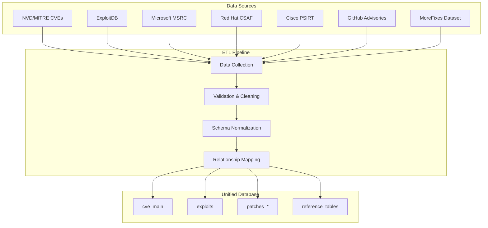

# Data & Schema Documentation

## Overview

This research utilizes a comprehensive vulnerability database combining multiple authoritative sources to enable deep analysis of CVE lifecycles, exploit patterns, and patch dynamics across different vendor ecosystems.

## Database Summary

- :material-database: **Unified Database**

    **Size**: ~25GB DuckDB  
    **Tables**: 15+ normalized tables  
    **Records**: 500K+ total records  
    **Coverage**: 1999-2025

- :material-chart-timeline: **Temporal Coverage**

    **CVEs**: 280K+ vulnerabilities  
    **Exploits**: 50K+ public exploits  
    **Patches**: 75K+ vendor patches  
    **Timespan**: 26+ years of data

- :material-source-branch: **Data Sources**

    **Official**: NVD, MITRE, CISA  
    **Vendor**: Microsoft, Red Hat, Cisco  
    **Community**: ExploitDB, GitHub  
    **Academic**: MoreFixes dataset

- :material-refresh: **Data Quality**

    **Completeness**: >95% core fields  
    **Accuracy**: Validated against sources  
    **Timeliness**: Monthly updates  
    **Consistency**: Normalized schema

## Data Architecture

## Core Data Components

### CVE Information
- **Primary Source**: NVD/MITRE CVE database
- **Coverage**: All published CVEs (1999-2025)
- **Key Fields**: CVSS scores, CWE mappings, CPE lists, descriptions
- **Enhancements**: EPSS scores, KEV status, vendor mappings

### Exploit Data
- **Primary Source**: ExploitDB public repository
- **Coverage**: 50K+ verified and unverified exploits
- **Key Fields**: Publication dates, exploit types, verification status
- **Linkage**: Direct CVE-to-exploit mapping

### Patch Information
- **Vendor Sources**: Microsoft MSRC, Red Hat, Cisco security advisories
- **Open Source**: GitHub Security Advisories, MoreFixes
- **Coverage**: 75K+ patches across commercial and OSS ecosystems
- **Timeline**: Patch release dates, advisory information

### Reference Data
- **CWE Catalog**: Complete MITRE CWE database
- **CAPEC Patterns**: Attack pattern classifications
- **Product Mappings**: CPE-based vendor/product relationships

## Data Statistics

| Data Type | Total Records | Date Range | Update Frequency |
|-----------|---------------|------------|------------------|
| **CVEs** | 280,445 | 1999-2025 | Daily |
| **Exploits** | 51,287 | 1999-2025 | Weekly |
| **MS Patches** | 28,934 | 2016-2025 | Real-time |
| **Red Hat Patches** | 22,156 | 1999-2025 | Daily |
| **Cisco Patches** | 15,678 | 1999-2025 | Daily |
| **GitHub Advisories** | 25,432 | 2017-2025 | Daily |
| **MoreFixes** | 152,890 | 2012-2023 | Static |

## Quality Metrics

### Data Completeness
- **CVE Core Fields**: 98.5% complete
- **CVSS Scores**: 89.2% (v3), 76.4% (v2)
- **CWE Mappings**: 85.7% with valid CWEs
- **Exploit Linkage**: 18.3% CVEs have public exploits
- **Patch Coverage**: 67.8% CVEs have vendor patches

### Data Accuracy
- **CVE Validation**: Cross-verified with NVD
- **Date Consistency**: Temporal validation rules applied
- **Duplicate Detection**: Automated deduplication processes
- **Cross-referencing**: Multi-source validation where possible

## Research Applications

### Lifecycle Analysis
- **Exploit Timing**: Time from CVE disclosure to public exploitation
- **Patch Response**: Vendor response times across different ecosystems
- **Race Dynamics**: Exploit vs patch availability patterns

### Vendor Comparison
- **Response Metrics**: Median time-to-patch by vendor and severity
- **Product Coverage**: Vulnerability distribution across product lines
- **Ecosystem Analysis**: Commercial vs open source patterns

### Predictive Modeling
- **Feature Engineering**: Rich feature sets for ML models
- **Temporal Validation**: Proper time-series splits for model validation
- **Multi-vendor Training**: Diverse training data across ecosystems

## Navigation

- [**Data Dictionary**](data-dictionary.md)

    Complete field definitions and examples for all database tables

- [**Schema Overview**](schema-overview.md)

    Database structure, relationships, and table descriptions

- [**Sources & References**](sources.md)

    Detailed information about data sources and collection methods

- [**ETL Pipeline**](etl-pipeline.md)

    Data processing workflow and transformation logic

- [**Data Quality**](data-quality.md)

    Quality assessment, validation rules, and known limitations

---

*This database serves as the foundation for comprehensive vulnerability lifecycle analysis and multi-vendor security research.*