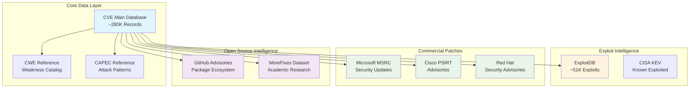
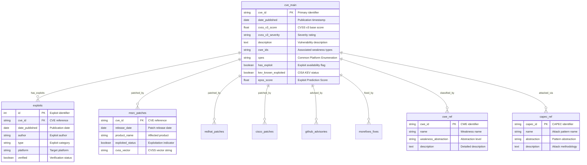
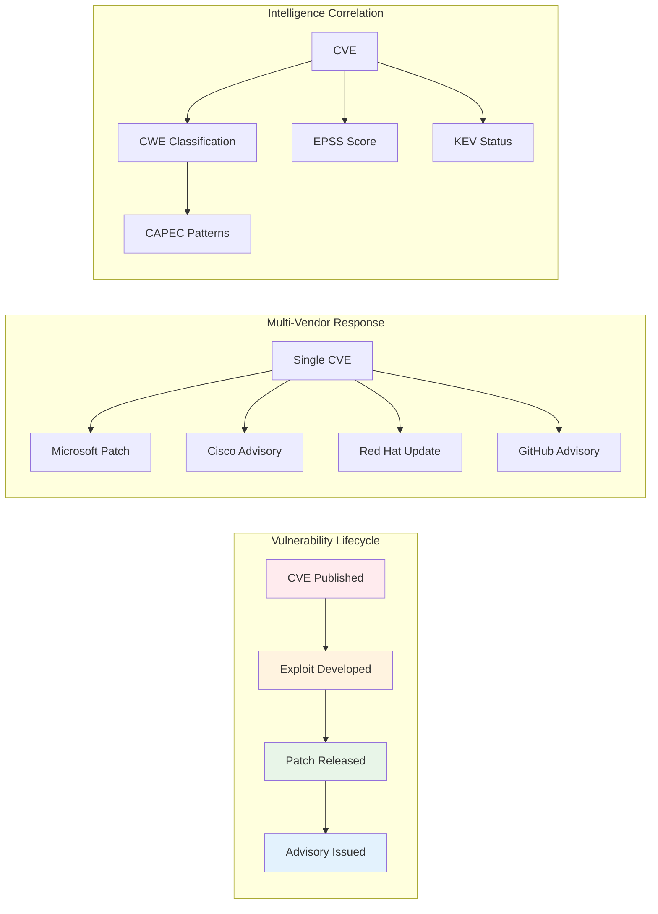
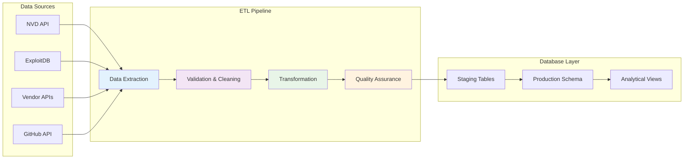
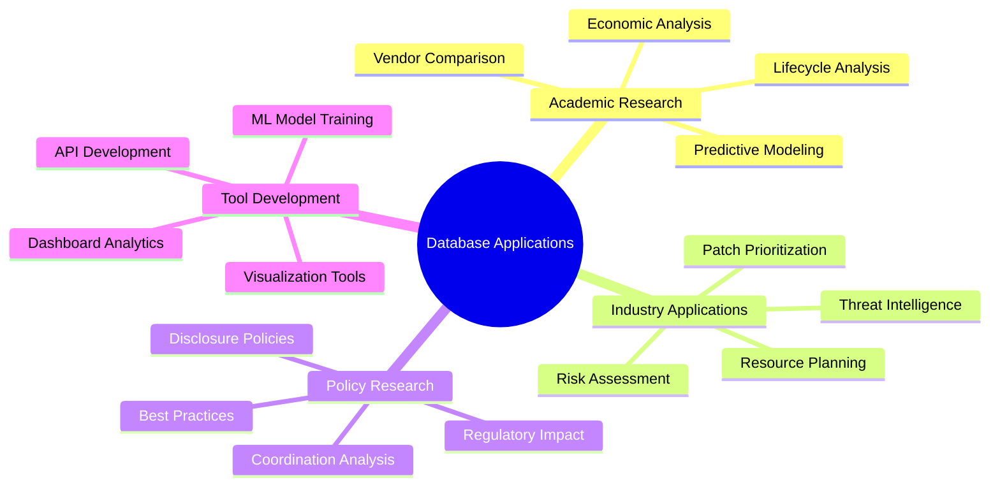

# Database Schema Overview

!!! info "Schema Purpose"
    The vulnerability database follows a normalized relational schema designed to support comprehensive lifecycle analysis across multiple vendor ecosystems. The schema enables efficient querying of complex relationships between vulnerabilities, exploits, patches, and metadata.

## Architecture Overview



## Core Schema Design

!!! tip "Entity Relationship Model"
    The following diagram illustrates the core relationships between database entities:



## Database Statistics

=== "Core Metrics"
    | Component | Count | Storage |
    |-----------|-------|---------|
    | **CVE Records** | ~280,000 | 2 GB |
    | **Exploit Entries** | ~51,000 | 0.1 GB |
    | **Patch Records** | ~180,000 | 16 GB |
    | **Advisory Entries** | ~95,000 | 3.2 GB |
    | **Reference Data** | ~15,000 | 450 MB |


=== "Temporal Coverage"
    ```mermaid
    timeline
        title Database Temporal Coverage
        section Historical
            1999-2009 : Early CVE Records
                      : Foundation Data
        section Growth Period  
            2010-2019 : Expanded Coverage
                      : Multi-vendor Integration
        section Modern Era
            2020-2025 : Comprehensive Dataset
                      : Real-time Updates
                      : Advanced Analytics
    ```

## Table Categories

### 1. Core Vulnerability Tables

!!! abstract "Primary Data Repository"
    
    #### `cve_main` - Central CVE Repository
    
    **Purpose**: Central repository for all CVE information with enhanced metadata  
    **Primary Key**: `cve_id`  
    **Record Count**: ~280,000  
    **Update Frequency**: Daily
    
    === "Core Fields"
        **Identifiers**
        
        - `cve_id` - Primary CVE identifier
        - `assigner_org` - Assigning organization
        - `state` - CVE state (PUBLISHED, RESERVED, etc.)
        
        **Temporal Information**
        
        - `date_reserved` - Initial reservation timestamp
        - `date_published` - Public disclosure date
        - `date_updated` - Last modification timestamp
        
        **Scoring & Severity**
        
        - `cvss_v2_score`, `cvss_v3_score`, `cvss_v4_score` - CVSS scores
        - `epss_score` - Exploit Prediction Scoring System
        - `kev_known_exploited` - CISA Known Exploited Vulnerabilities flag
    
    === "Classification"
        **Weakness Classification**
        
        - `cwe_ids` - Associated Common Weakness Enumeration IDs
        - `cpes` - Common Platform Enumeration strings
        - `vendors` - Affected vendor list
        - `products` - Affected product list
        
        **Enhanced Metadata**
        
        - `has_exploit` - Exploit availability indicator
        - `ssvc_exploitation` - CISA SSVC exploitation status
        - `complexity_level` - Exploitation complexity assessment

### 2. Exploit Intelligence Tables

!!! warning "Threat Intelligence Layer"

    #### `exploits` - Public Exploit Repository
    
    **Source**: ExploitDB and security research community  
    **Primary Key**: `id`  
    **Foreign Key**: `cve_id` → `cve_main.cve_id`  
    **Record Count**: ~51,000
    
    === "Exploit Metadata"
        **Classification Fields**
        
        - `type` - Exploit category (local, remote, web application, etc.)
        - `platform` - Target platform (Windows, Linux, multiple, etc.)
        - `tags` - Descriptive tags for categorization
        
        **Quality Indicators**
        
        - `verified` - Community verification status
        - `author` - Original researcher/author
        - `codes` - Programming language used
    
    === "Content & Documentation"
        **Technical Details**
        
        - `description` - Detailed exploit description
        - `screenshot_url` - Visual proof of concept
        - `file_path` - Local storage path
        
        **Temporal Tracking**
        
        - `date_published` - Original publication date
        - `date_added` - Database ingestion date
        - `date_updated` - Last modification timestamp

### 3. Commercial Vendor Patches

=== "Microsoft MSRC"
    !!! note "Microsoft Security Response Center"
        
        **Table**: `msrc_patches`  
        **Source**: Microsoft CVRF/CSAF security advisories  
        **Coverage**: Microsoft product ecosystem  
        **Update Frequency**: Weekly (Patch Tuesday + out-of-band)
        
        **Key Features**:
        
        - `release_date` - Official patch release timestamp
        - `product_name` - Specific Microsoft product affected
        - `exploited_status` - Microsoft's exploitation assessment
        - `cvss_vector` - Microsoft-provided CVSS vector
        - `kb_article` - Knowledge Base article reference

=== "Cisco PSIRT"
    !!! note "Cisco Product Security Incident Response Team"
        
        **Table**: `cisco_patches`  
        **Source**: Cisco PSIRT CSAF advisories  
        **Coverage**: Cisco network infrastructure and security products  
        **Update Frequency**: As-needed security advisories
        
        **Key Features**:
        
        - `current_release_date` - Advisory publication date
        - `product_name` - Cisco product line identification
        - `bug_ids` - Internal Cisco bug tracking identifiers
        - `base_score` - Cisco-assessed CVSS base score

=== "Red Hat Security"
    !!! note "Red Hat Security Advisories"
        
        **Table**: `redhat_patches`  
        **Source**: Red Hat CSAF security advisories  
        **Coverage**: RHEL and ecosystem products (filtered for official Red Hat)  
        **Update Frequency**: Regular security advisory releases
        
        **Key Features**:
        
        - `current_release_date` - Security advisory timestamp
        - `product_name` - Red Hat product identification
        - `aggregate_severity` - Red Hat severity assessment
        - `cve_list` - Associated CVE identifiers

### 4. Open Source Intelligence

=== "GitHub Security Database"
    !!! success "Community-Driven Intelligence"
        
        **Table**: `github_advisories`  
        **Source**: GitHub Advisory Database  
        **Coverage**: Open source package ecosystems (npm, PyPI, Maven, etc.)  
        **Record Count**: ~95,000
        
        **Enhanced Fields**:
        
        - `published` - Advisory publication timestamp
        - `package_ecosystem` - Package manager ecosystem
        - `affected_versions` - Version range specifications
        - `patched` - Inferred patch availability status
        - `exploited` - Inferred exploitation status (keyword-based)

=== "MoreFixes Academic Dataset"
    !!! abstract "Research-Grade Fix Data"
        
        **Tables**: `morefixes_fixes`, `morefixes_commits`, `morefixes_repository`  
        **Source**: MoreFixes research project (JafarAkhondali et al., 2024)  
        **Coverage**: Code-level fixes across GitHub repositories
        
        **Analytical Value**:
        
        - Commit-level fix analysis
        - Repository metadata correlation
        - Academic validation of fix effectiveness

### 5. Reference and Classification

!!! tip "Knowledge Base Layer"

    #### `cwe_ref` - Common Weakness Enumeration
    
    **Purpose**: Complete MITRE CWE catalog with hierarchical relationships  
    **Primary Key**: `cwe_id`  
    **Record Count**: ~1,000 weakness types
    
    === "Classification Hierarchy"
        **Abstraction Levels**
        
        - **Base**: Specific implementation weaknesses
        - **Variant**: Detailed variations of base weaknesses  
        - **Class**: General categories of weaknesses
        - **Category**: High-level groupings
        
        **Status Tracking**
        
        - Draft, Incomplete, Complete, Deprecated
        - Maintenance status and update history

    #### `capec_ref` - Common Attack Pattern Enumeration
    
    **Purpose**: MITRE CAPEC attack pattern catalog  
    **Primary Key**: `capec_id`  
    **Usage**: Attack methodology analysis and CWE correlation

## Data Relationships & Analytics

### Primary Relationship Patterns



### Advanced Query Patterns

!!! example "Lifecycle Analysis Query"
    
    ```sql
    -- CVE-to-Exploit-to-Patch timeline analysis
    WITH lifecycle_analysis AS (
        SELECT 
            cm.cve_id,
            cm.date_published as cve_date,
            e.date_published as exploit_date,
            mp.release_date as patch_date,
            cm.cvss_v3_score,
            cm.epss_score,
            DATE_DIFF('day', cm.date_published, e.date_published) as days_to_exploit,
            DATE_DIFF('day', e.date_published, mp.release_date) as exploit_to_patch_days
        FROM cve_main cm
        LEFT JOIN exploits e ON cm.cve_id = e.cve_id
        LEFT JOIN msrc_patches mp ON cm.cve_id = mp.cve_id
        WHERE cm.date_published >= '2020-01-01'
          AND cm.cvss_v3_score >= 7.0
    )
    SELECT 
        CASE 
            WHEN days_to_exploit <= 7 THEN 'Rapid Exploitation'
            WHEN days_to_exploit <= 30 THEN 'Standard Timeline'
            ELSE 'Delayed Exploitation'
        END as exploitation_pattern,
        COUNT(*) as vulnerability_count,
        AVG(exploit_to_patch_days) as avg_patch_response_time,
        PERCENTILE_CONT(0.5) WITHIN GROUP (ORDER BY epss_score) as median_epss
    FROM lifecycle_analysis
    WHERE days_to_exploit IS NOT NULL
    GROUP BY 1
    ORDER BY avg_patch_response_time;
    ```

!!! example "Multi-Vendor Response Comparison"
    
    ```sql
    -- Vendor response time comparison with statistical analysis
    WITH unified_patches AS (
        SELECT 
            cve_id, 
            release_date as patch_date, 
            'Microsoft' as vendor,
            'Commercial' as ecosystem
        FROM msrc_patches
        
        UNION ALL
        
        SELECT 
            cve_id, 
            current_release_date, 
            'RedHat',
            'Open Source'
        FROM redhat_patches
        
        UNION ALL
        
        SELECT 
            cve_id, 
            current_release_date, 
            'Cisco',
            'Commercial'
        FROM cisco_patches
    ),
    response_metrics AS (
        SELECT 
            up.vendor,
            up.ecosystem,
            DATE_DIFF('day', cm.date_published, up.patch_date) as response_days,
            cm.cvss_v3_score,
            cm.kev_known_exploited
        FROM unified_patches up
        JOIN cve_main cm ON up.cve_id = cm.cve_id
        WHERE up.patch_date IS NOT NULL
          AND cm.date_published IS NOT NULL
          AND DATE_DIFF('day', cm.date_published, up.patch_date) BETWEEN 0 AND 365
    )
    SELECT 
        vendor,
        ecosystem,
        COUNT(*) as total_patches,
        ROUND(AVG(response_days), 1) as avg_response_days,
        ROUND(PERCENTILE_CONT(0.5) WITHIN GROUP (ORDER BY response_days), 1) as median_response_days,
        ROUND(STDDEV(response_days), 1) as response_std_dev,
        COUNT(CASE WHEN kev_known_exploited = true THEN 1 END) as kev_vulnerabilities,
        ROUND(AVG(CASE WHEN kev_known_exploited = true THEN response_days END), 1) as avg_kev_response
    FROM response_metrics
    GROUP BY vendor, ecosystem
    ORDER BY median_response_days;
    ```

## Performance & Scalability

### Database Technology Stack

!!! info "Technical Infrastructure"
    
    === "Storage Engine"
        **Primary**: DuckDB (Analytical Focus)
        
        - **Advantages**: Columnar storage, analytical optimizations
        - **Size**: ~5GB compressed, ~24GB uncompressed
        - **Format**: Parquet-based columnar format
        - **Backup Strategy**: Daily incremental, weekly full backups
    
    === "Query Performance"
        **Optimization Characteristics**
        
        - **Typical Queries**: Sub-second response for standard analysis
        - **Complex Analytics**: Multi-table joins complete within 5-15 seconds
        - **Aggregations**: Optimized for temporal and categorical grouping
        - **Indexing**: Strategic indexing on temporal and categorical fields

### ETL & Data Pipeline



!!! warning "Data Quality Framework"
    
    **Validation Layers**:
    
    1. **Schema Validation**: Data type and constraint checking
    2. **Referential Integrity**: Foreign key relationship validation
    3. **Business Logic**: Domain-specific validation rules
    4. **Temporal Consistency**: Date range and sequence validation
    5. **Duplicate Detection**: Cross-source duplicate identification

## Research Applications

### Supported Analysis Frameworks

=== "Temporal Analysis"
    !!! example "Time-Based Research"
        
        **Vulnerability Disclosure Patterns**
        
        - Publication timing analysis across vendors
        - Seasonal and annual disclosure trends
        - Coordination timeline assessment
        
        **Exploit Development Dynamics**
        
        - Time-to-exploit measurement and prediction
        - Exploitation probability modeling
        - Weaponization timeline analysis
        
        **Patch Response Analysis**
        
        - Vendor response time comparison
        - Emergency vs. regular patch cycles
        - Cross-ecosystem coordination analysis

=== "Vendor Ecosystem Analysis"
    !!! example "Multi-Vendor Research"
        
        **Response Time Metrics**
        
        - Comparative patch deployment analysis
        - Severity-based response prioritization
        - Resource allocation efficiency
        
        **Product Coverage Analysis**
        
        - Vulnerability distribution across product lines
        - Market share correlation with vulnerability counts
        - Product lifecycle impact on security response

=== "Predictive Modeling"
    !!! example "Machine Learning Applications"
        
        **Feature Engineering**
        
        - Temporal feature extraction for ML models
        - Cross-vendor feature correlation analysis
        - Composite risk scoring development
        
        **Validation Frameworks**
        
        - Temporal validation to prevent data leakage
        - Cross-vendor validation for model generalization
        - Multi-ecosystem training dataset construction

### Research Output Capabilities



---

!!! success "Schema Validation"
    *This comprehensive schema design supports advanced vulnerability research across commercial and open source ecosystems while maintaining data quality, query performance, and analytical flexibility for both academic research and practical applications.*

---