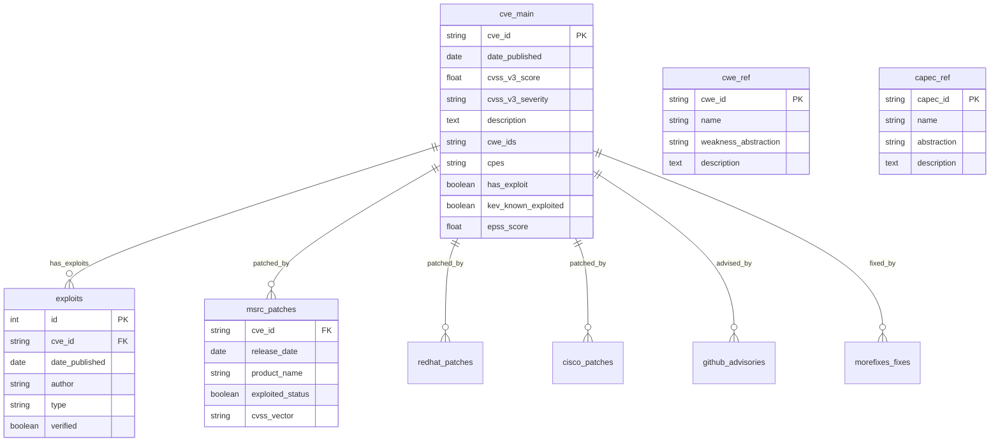

# Database Schema Overview

## Architecture Overview

The vulnerability database follows a normalized relational schema designed to support comprehensive lifecycle analysis across multiple vendor ecosystems. The schema enables efficient querying of complex relationships between vulnerabilities, exploits, patches, and metadata.

## Core Schema Design



## Table Categories

### 1. Core Vulnerability Tables

#### `cve_main` - Primary CVE Repository
**Purpose**: Central repository for all CVE information with enhanced metadata  
**Primary Key**: `cve_id`  
**Record Count**: ~280K  
**Key Relationships**: Links to all exploit and patch tables

**Core Fields**:
- **Identifiers**: `cve_id`, `assigner_org`, `state`
- **Temporal**: `date_reserved`, `date_published`, `date_updated`
- **Scoring**: `cvss_v2_score`, `cvss_v3_score`, `cvss_v4_score`
- **Classification**: `cwe_ids`, `cpes`, `vendors`, `products`
- **Enrichment**: `epss_score`, `kev_known_exploited`, `has_exploit`

### 2. Exploit Information Tables

#### `exploits` - Public Exploit Repository
**Purpose**: ExploitDB public exploit information  
**Primary Key**: `id`  
**Foreign Key**: `cve_id` → `cve_main.cve_id`  
**Record Count**: ~51K

**Key Features**:
- **Temporal Tracking**: `date_published`, `date_added`, `date_updated`
- **Classification**: `type`, `platform`, `tags`
- **Verification**: `verified` status flag
- **Content**: `codes`, `description`, `screenshot_url`

### 3. Patch Information Tables

#### Commercial Vendor Patches

**`msrc_patches` - Microsoft Security Response Center**
- **Source**: Microsoft CVRF/CSAF advisories
- **Coverage**: Microsoft product ecosystem
- **Key Fields**: `release_date`, `product_name`, `exploited_status`
- **Relationships**: CVE-Product pairs (one-to-many)

**`cisco_patches` - Cisco Product Security**
- **Source**: Cisco PSIRT CSAF advisories
- **Coverage**: Cisco network infrastructure products
- **Key Fields**: `current_release_date`, `product_name`, `bug_ids`

**`redhat_patches` - Red Hat Security Advisories**
- **Source**: Red Hat CSAF security advisories
- **Coverage**: RHEL and ecosystem products (filtered for official Red Hat)
- **Key Fields**: `current_release_date`, `product_name`, `aggregate_severity`

#### Open Source Patches

**`github_advisories` - GitHub Security Database**
- **Source**: GitHub Advisory Database
- **Coverage**: Open source package ecosystems
- **Key Fields**: `published`, `package_ecosystem`, `affected_versions`
- **Enhancement**: Inferred fields for `patched`, `exploited` status

**`morefixes_*` - Academic Fix Dataset**
- **Source**: MoreFixes research project (JafarAkhondali et al., 2024)
- **Coverage**: Code-level fixes across repositories
- **Tables**: `morefixes_fixes`, `morefixes_commits`, `morefixes_repository`

### 4. Reference and Classification Tables

#### `cwe_ref` - Common Weakness Enumeration
**Purpose**: Complete MITRE CWE catalog with detailed descriptions  
**Primary Key**: `cwe_id`  
**Usage**: Classification and pattern analysis

**Key Classifications**:
- **Abstraction Levels**: Base, Variant, Class, Category
- **Status**: Draft, Incomplete, Complete, Deprecated
- **Relationships**: Parent-child CWE mappings

#### `capec_ref` - Common Attack Pattern Enumeration
**Purpose**: MITRE CAPEC attack pattern catalog  
**Primary Key**: `capec_id`  
**Usage**: Attack methodology analysis and CWE correlation

## Data Relationships

### Primary Relationships

1. **CVE → Exploits** (One-to-Many)
   - Single CVE can have multiple public exploits
   - Temporal analysis of exploitation patterns
   - Verification status tracking

2. **CVE → Patches** (One-to-Many)
   - Single CVE may be patched by multiple vendors
   - Different patch timelines across ecosystems
   - Product-specific patch information

3. **CVE → CWE** (Many-to-Many)
   - CVEs can map to multiple weakness types
   - CWE co-occurrence analysis
   - Weakness pattern evolution

### Cross-Table Analytics

#### Lifecycle Analysis Queries
```sql
-- Example: CVE-to-Exploit-to-Patch timeline
SELECT 
    cm.cve_id,
    cm.date_published as cve_date,
    e.date_published as exploit_date,
    mp.release_date as patch_date,
    DATE_DIFF('day', cm.date_published, e.date_published) as days_to_exploit,
    DATE_DIFF('day', e.date_published, mp.release_date) as exploit_to_patch_days
FROM cve_main cm
LEFT JOIN exploits e ON cm.cve_id = e.cve_id
LEFT JOIN msrc_patches mp ON cm.cve_id = mp.cve_id
WHERE cm.date_published >= '2020-01-01';
```

#### Multi-Vendor Patch Comparison
```sql
-- Example: Vendor response time comparison
WITH unified_patches AS (
    SELECT cve_id, release_date as patch_date, 'Microsoft' as vendor FROM msrc_patches
    UNION ALL
    SELECT cve_id, current_release_date, 'RedHat' FROM redhat_patches
    UNION ALL
    SELECT cve_id, current_release_date, 'Cisco' FROM cisco_patches
)
SELECT 
    vendor,
    MEDIAN(DATE_DIFF('day', cm.date_published, up.patch_date)) as median_response_days
FROM unified_patches up
JOIN cve_main cm ON up.cve_id = cm.cve_id
GROUP BY vendor;
```

## Schema Design Principles

### 1. Normalization Strategy
- **3NF Compliance**: Eliminates data redundancy while maintaining query performance
- **Denormalized Fields**: Strategic denormalization for common analysis patterns
- **Composite Keys**: Where natural relationships require multi-column keys

### 2. Temporal Consistency
- **UTC Timestamps**: All dates stored in UTC for consistency
- **Granularity**: Day-level precision for most temporal analysis
- **Null Handling**: Explicit handling of unknown or unavailable dates

### 3. Scalability Considerations
- **Indexing Strategy**: Optimized for common query patterns
- **Partitioning**: Logical partitioning by time periods for large table management
- **Query Optimization**: Schema designed for analytical workload patterns

### 4. Data Quality Framework
- **Constraint Validation**: Database-level constraints for data integrity
- **Referential Integrity**: Foreign key relationships where appropriate
- **Data Types**: Appropriate typing for analytical operations

## Storage and Performance

### Database Technology
- **Engine**: DuckDB (analytical focus)
- **Size**: ~25GB compressed
- **Format**: Columnar storage for analytical queries
- **Backup**: Daily incremental backups

### Query Performance
- **Typical Queries**: Sub-second response for common analysis patterns
- **Complex Analytics**: Multi-table joins complete within seconds
- **Aggregations**: Optimized for temporal and categorical grouping

### Data Loading
- **ETL Frequency**: Daily updates for most sources
- **Incremental Loading**: Only new/changed records processed
- **Data Validation**: Automated quality checks during loading

## Research Applications

### Supported Analysis Types

1. **Temporal Analysis**
   - Vulnerability disclosure patterns
   - Exploit publication timing
   - Patch response analysis

2. **Vendor Comparison**
   - Response time metrics
   - Product coverage analysis
   - Ecosystem vulnerability patterns

3. **Weakness Analysis**
   - CWE distribution patterns
   - Co-occurrence analysis
   - Evolution of weakness types

4. **Predictive Modeling**
   - Feature engineering for ML models
   - Temporal validation frameworks
   - Multi-vendor training datasets

---

*This schema design supports comprehensive vulnerability research across commercial and open source ecosystems while maintaining data quality and query performance.*