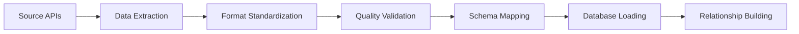

# Data Sources & References

## Overview

This research integrates data from multiple authoritative sources to create a comprehensive view of vulnerability lifecycles. Each source provides unique perspectives on different aspects of the security ecosystem, from official vulnerability disclosures to community-driven exploit development and vendor patch responses.

## Primary Data Sources

### Official Vulnerability Databases

#### 1. National Vulnerability Database (NVD)
**Provider**: NIST (National Institute of Standards and Technology)  
**URL**: [https://nvd.nist.gov/](https://nvd.nist.gov/)  
**Coverage**: All published CVEs with NIST analysis  
**Data Retrieved**: CVE details, CVSS scores, CWE mappings, CPE lists, references

<strong>Data Quality</strong>: High - Official government source

**Key Attributes**:
- **Comprehensiveness**: Complete CVE coverage since 1999
- **Standardization**: Structured CVSS scoring and classification
- **Timeliness**: Regular updates with detailed analysis
- **Authority**: Primary reference for vulnerability research

**API Access**: NVD Data Feeds and REST API  
**Update Frequency**: Daily incremental updates  
**Rate Limits**: 5 requests per 30 seconds (public), 50 requests per 30 seconds (with API key)

#### 2. MITRE CVE Database
**Provider**: MITRE Corporation  
**URL**: [https://cve.mitre.org/](https://cve.mitre.org/)  
**Coverage**: CVE assignments and initial disclosures  
**Data Retrieved**: CVE IDs, initial descriptions, assignment dates

<strong>Data Quality</strong>: High - CVE assignment authority

**Key Attributes**:
- **Authority**: Official CVE numbering authority
- **Timeliness**: First source for new CVE assignments
- **Coverage**: All CVE assignments since program inception
- **Integration**: CVE-5 JSON format for structured data

#### 3. CISA Known Exploited Vulnerabilities (KEV)
**Provider**: Cybersecurity and Infrastructure Security Agency  
**URL**: [https://www.cisa.gov/known-exploited-vulnerabilities-catalog](https://www.cisa.gov/known-exploited-vulnerabilities-catalog)  
**Coverage**: CVEs with confirmed active exploitation  
**Data Retrieved**: KEV status, exploitation evidence, required actions

<strong>Data Quality</strong>: High - Government threat intelligence

**Key Attributes**:
- **Actionability**: CVEs requiring immediate attention
- **Evidence-based**: Confirmed exploitation in the wild
- **Policy Impact**: Used for federal cybersecurity directives
- **Timeline**: Required action deadlines for federal agencies

### Exploit Databases

#### 4. Exploit Database (ExploitDB)
**Provider**: Offensive Security  
**URL**: [https://www.exploit-db.com/](https://www.exploit-db.com/)  
**Coverage**: Public exploit code and proof-of-concepts  
**Data Retrieved**: Exploit code, publication dates, authors, verification status

<strong>Data Quality</strong>: Medium - Community-contributed content

**Key Attributes**:
- **Community-driven**: Researcher and practitioner contributions
- **Practical Focus**: Working exploit code and techniques
- **Verification**: Manual review process for submissions
- **Coverage**: 50K+ exploits dating back to 1999

**Data Collection**:
- **Method**: Git repository cloning and parsing
- **Format**: Structured text files with metadata
- **Frequency**: Weekly synchronization
- **Validation**: Cross-reference with CVE assignments

### Commercial Vendor Sources

#### 5. Microsoft Security Response Center (MSRC)
**Provider**: Microsoft Corporation  
**URL**: [https://msrc.microsoft.com/](https://msrc.microsoft.com/)  
**Coverage**: Microsoft product security advisories and patches  
**Data Retrieved**: Security bulletins, patch information, exploitation status

<strong>Data Quality</strong>: High - First-party vendor data

**API Details**:
- **Format**: CVRF (Common Vulnerability Reporting Framework) / CSAF
- **Endpoint**: MSRC Security Update API
- **Authentication**: API key required for programmatic access
- **Rate Limits**: 100 requests per minute

**Data Coverage**:
- **Products**: Windows, Office, .NET, Azure services
- **Timeline**: 2016-present with comprehensive coverage
- **Metadata**: Exploitability index, severity ratings, affected versions

#### 6. Red Hat Security Advisories
**Provider**: Red Hat Inc.  
**URL**: [https://access.redhat.com/security/](https://access.redhat.com/security/)  
**Coverage**: Red Hat Enterprise Linux and ecosystem security advisories  
**Data Retrieved**: RHSA advisories, patch information, CVE mappings

<strong>Data Quality</strong>: High - Enterprise vendor source

**Data Characteristics**:
- **Format**: CSAF (Common Security Advisory Framework)
- **Scope**: RHEL, OpenShift, middleware products
- **Filtering**: Official Red Hat products only (excludes third-party packages)
- **Timeline**: 2016-present for systematic collection

**Collection Notes**:
- **Product Filtering**: Applied keywords (rh, red hat, rhel, enterprise linux, baseos, appstream, openshift)
- **Deduplication**: Cross-referenced with upstream projects
- **Classification**: Distinguished from community packages

#### 7. Cisco Product Security Incident Response Team (PSIRT)
**Provider**: Cisco Systems Inc.  
**URL**: [https://sec.cloudapps.cisco.com/security/center/publicationListing.x](https://sec.cloudapps.cisco.com/security/center/publicationListing.x)  
**Coverage**: Cisco network infrastructure and software security advisories  
**Data Retrieved**: Security advisories, patch information, workarounds

<strong>Data Quality</strong>: High - Network infrastructure focus

**Data Characteristics**:
- **Format**: CSAF security advisories
- **Products**: Routers, switches, security appliances, software
- **Severity**: Cisco-specific severity classifications
- **Timeline**: 2016-present systematic collection

### Open Source and Community Sources

#### 8. GitHub Security Advisory Database
**Provider**: GitHub Inc.  
**URL**: [https://github.com/advisories](https://github.com/advisories)  
**Coverage**: Open source package vulnerabilities and advisories  
**Data Retrieved**: Package advisories, affected versions, patch status

<strong>Data Quality</strong>: Medium - Community and automated contributions

**Key Features**:
- **Ecosystem Coverage**: npm, PyPI, RubyGems, Maven, NuGet, Composer
- **Integration**: Direct GitHub integration for vulnerability management
- **Automated Detection**: Dependabot and security research integration
- **Review Process**: Community review and GitHub curation

**Enhanced Fields** (Research-Added):
- **Exploited Status**: Inferred from description keywords
- **PoC Availability**: Detection of proof-of-concept references
- **Exploitability Level**: 0-3 scale based on complexity indicators
- **Patch Status**: Derived from affected version ranges

#### 9. MoreFixes Dataset
**Provider**: Academic Research (JafarAkhondali et al., 2024)  
**Paper**: "MoreFixes: A Large-Scale Dataset of CVE Fix Commits"  
**URL**: [https://github.com/JafarAkhondali/Morefixes](https://github.com/JafarAkhondali/Morefixes)  
**Coverage**: Code-level vulnerability fixes across open source repositories

<strong>Data Quality</strong>: Medium - Academic research validation

**Dataset Characteristics**:
- **Scope**: 150K+ fix commits across multiple repositories
- **Methodology**: Systematic commit analysis and CVE mapping
- **Granularity**: File-level and method-level change analysis
- **Validation**: Manual verification of CVE-commit relationships

**Research Applications**:
- **Code Analysis**: Understanding fix patterns and complexity
- **Developer Perspective**: Time-to-fix analysis from development viewpoint
- **Methodology Validation**: Comparing vendor vs. developer timelines

### Reference and Classification Sources

#### 10. Common Weakness Enumeration (CWE)
**Provider**: MITRE Corporation  
**URL**: [https://cwe.mitre.org/](https://cwe.mitre.org/)  
**Coverage**: Comprehensive weakness classification system  
**Data Retrieved**: CWE definitions, relationships, examples

**Usage in Research**:
- **Pattern Analysis**: Vulnerability type distribution and trends
- **Co-occurrence Studies**: Relationships between weakness types
- **Predictive Features**: CWE patterns as ML model inputs

#### 11. Common Attack Pattern Enumeration and Classification (CAPEC)
**Provider**: MITRE Corporation  
**URL**: [https://capec.mitre.org/](https://capec.mitre.org/)  
**Coverage**: Attack pattern catalog and methodology descriptions  
**Data Retrieved**: Attack patterns, techniques, relationships

**Research Applications**:
- **Attack Methodology**: Understanding exploitation techniques
- **CWE Relationships**: Mapping weaknesses to attack patterns
- **Threat Modeling**: Attack surface analysis

## Data Collection Methodology

### Automated Collection Pipeline

### Collection Frequency

| Source | Collection Method | Frequency | Last Updated |
|--------|------------------|-----------|--------------|
| NVD | REST API | Daily | 2025-05-13 |
| MITRE CVE | JSON Downloads | Daily | 2025-05-13 |
| CISA KEV | JSON Feed | Daily | 2025-05-13 |
| ExploitDB | Git Repository | Weekly | 2025-05-13 |
| MSRC | CSAF API | Real-time | 2025-05-13 |
| Red Hat | CSAF Feeds | Daily | 2025-05-13 |
| Cisco | CSAF API | Daily | 2025-05-13 |
| GitHub | GraphQL API | Daily | 2025-05-13 |
| MoreFixes | Static Dataset | One-time | 2024-03-15 |

### Data Quality Assurance

#### Validation Procedures

1. **Temporal Consistency**
   - Date range validation (1999-2025)
   - Logical date ordering (disclosure → exploit → patch)
   - Missing date handling strategies

2. **Cross-Source Validation**
   - CVE ID format validation
   - Duplicate detection across sources
   - Consistency checks between related records

3. **Data Completeness**
   - Required field validation
   - Null value analysis and handling
   - Coverage gap identification

4. **Referential Integrity**
   - Foreign key relationship validation
   - Orphaned record detection
   - Cross-table consistency checks

#### Known Limitations

1. **Temporal Gaps**
   - Some sources lack historical data before 2016
   - Inconsistent date granularity across sources
   - Potential delays in vendor disclosure timelines

2. **Coverage Limitations**
   - ExploitDB represents only public exploits
   - Vendor sources limited to their product ecosystems
   - Open source data may have quality variations

3. **Classification Challenges**
   - Inconsistent CWE mapping across sources
   - Vendor-specific severity classifications
   - Evolving classification standards over time

## Data Usage Guidelines

### Attribution Requirements

When using this integrated dataset, please acknowledge:

1. **Primary Sources**: Cite original data providers (NVD, MITRE, vendor sources)
2. **Academic Sources**: Reference MoreFixes paper (JafarAkhondali et al., 2024)
3. **Integration Work**: Acknowledge data integration and enhancement efforts

### Ethical Considerations

1. **Responsible Disclosure**: No exploitation of vulnerabilities for research
2. **Privacy Protection**: No personal information collection or use
3. **Legal Compliance**: Adherence to terms of service for all data sources

### Research Applications

This integrated dataset supports:

- **Academic Research**: Vulnerability lifecycle and ecosystem analysis
- **Industry Analysis**: Vendor response comparisons and benchmarking
- **Policy Research**: Evidence-based cybersecurity policy development
- **Tool Development**: Security tool enhancement and validation

---

*This comprehensive data integration enables unprecedented analysis of vulnerability ecosystems across commercial and open source environments.*