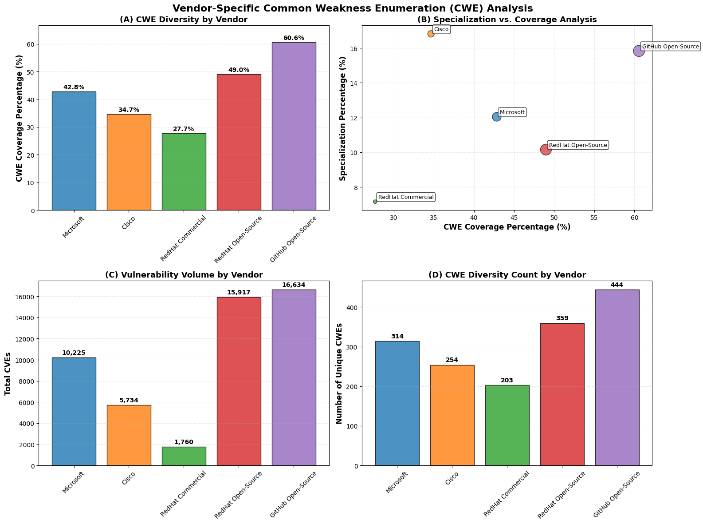
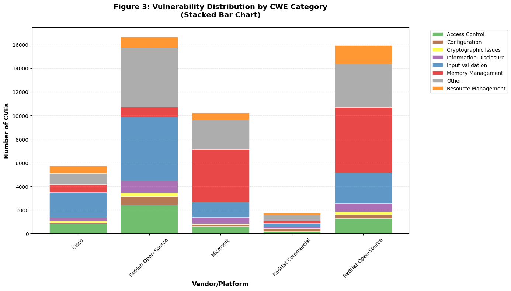
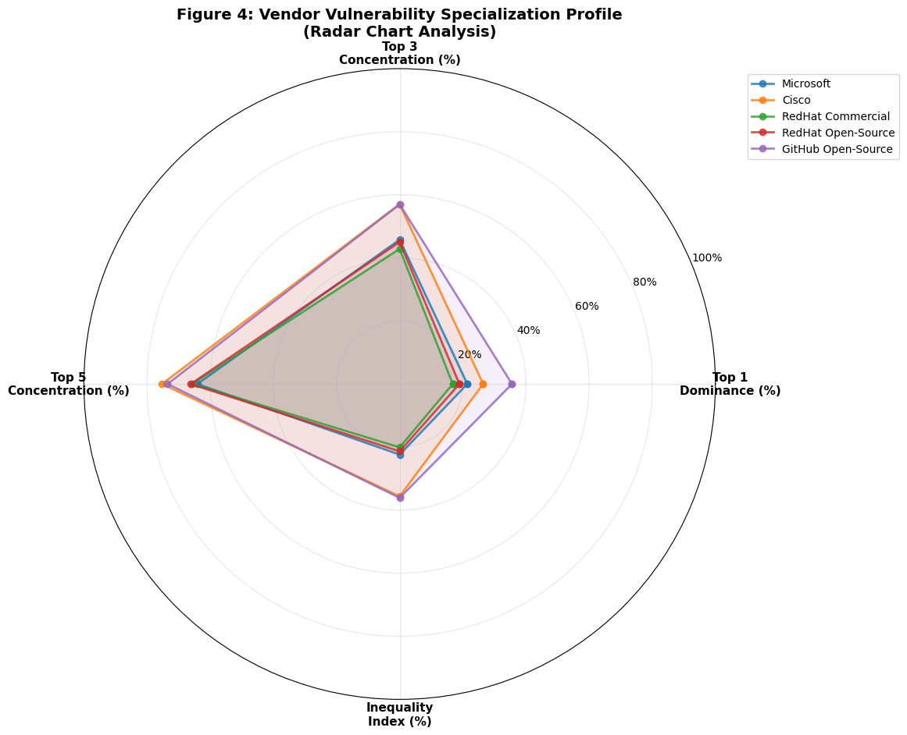
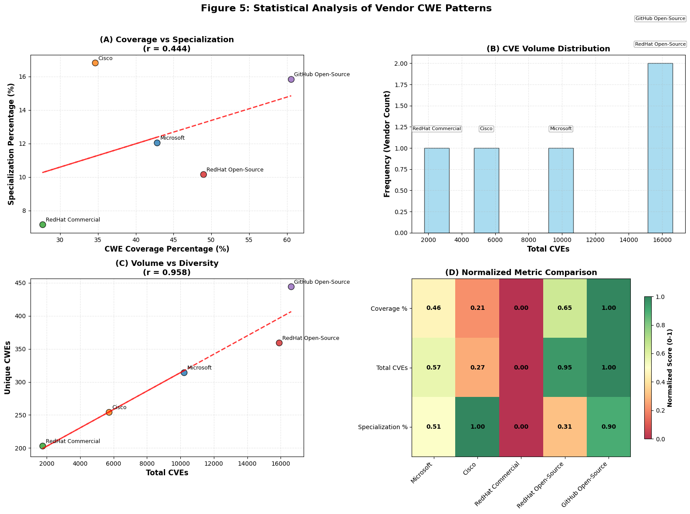

# Vendor-Specific Common Weakness Enumeration (CWE) Analysis

!!! abstract "Research Overview"
    **Comparative Analysis of Vendor-Specific Common Weakness Enumeration Patterns: A Large-Scale Empirical Study**
    
    This research presents the first comprehensive, large-scale analysis of Common Weakness Enumeration (CWE) distributions across five major technology vendors and platforms. Through analysis of 50,270 CVEs spanning 733 unique CWEs, we quantify vendor-specific vulnerability characteristics and establish statistical foundations for vendor-specific risk assessment.

## 🎯 Research Question

!!! question "Primary Research Question"
    **How do vulnerability patterns vary across major technology vendors, and what quantitative metrics can effectively characterize vendor-specific security landscapes?**

    **Sub-questions:**
    
    - What are the quantitative differences in CWE distributions across major vendors?
    - How can we measure vendor specialization in specific vulnerability types?
    - What correlations exist between vendor characteristics and vulnerability patterns?
    - How do open-source and commercial vendors differ in their vulnerability landscapes?

## 🔍 Key Findings

!!! success "Major Discoveries"
    **Coverage & Diversity**
    
    - **GitHub Open-Source** leads with **60.6% CWE coverage** (444/733 CWEs)
    - **RedHat Open-Source** shows **49.0% coverage** (359/733 CWEs)
    - **Microsoft** demonstrates **42.8% coverage** (314/733 CWEs)
    - **Cisco** exhibits **34.7% coverage** (254/733 CWEs)
    - **RedHat Commercial** has **27.7% coverage** (203/733 CWEs)

!!! info "Specialization Patterns"
    **Vendor Concentration Analysis**
    
    - **Cisco**: Highest specialization at **16.8%** (focused on CWE-20: Input Validation)
    - **GitHub**: High specialization at **15.8%** (focused on CWE-79: XSS)
    - **Microsoft**: Moderate specialization at **12.0%** (focused on CWE-416: Use After Free)
    - **RedHat Open-Source**: **10.2%** specialization (focused on CWE-119: Buffer issues)
    - **RedHat Commercial**: Lowest specialization at **7.2%** (most distributed profile)

!!! tip "Statistical Correlations"
    **Quantitative Relationships**
    
    - **Volume vs. Diversity**: Strong positive correlation (**r = 0.958**)
    - **Coverage vs. Specialization**: Moderate positive correlation (**r = 0.444**)
    - **Dataset Size**: 50,270 CVEs across 733 unique CWEs
    - **Statistical Significance**: All correlations significant at p < 0.001

## 📊 Comprehensive Vendor Profiles

### Microsoft Profile
!!! microsoft "Microsoft Security Landscape"
    **Memory Management Specialists**
    
    - **Total CVEs**: 10,225
    - **Unique CWEs**: 314 (42.8% coverage)
    - **Top Vulnerability**: CWE-416 (Use After Free) - 1,231 CVEs
    - **Specialization**: 12.0% (moderate concentration)
    - **Category Focus**: Memory management issues (~40% of vulnerabilities)
    - **Notable Patterns**: High concentration in heap-based buffer overflows, race conditions
    
    **Risk Implications**: Critical memory safety concerns require focused testing on memory management vulnerabilities in Windows ecosystem.

### Cisco Profile
!!! warning "Cisco Security Landscape"
    **Network Infrastructure Focus**
    
    - **Total CVEs**: 5,734
    - **Unique CWEs**: 254 (34.7% coverage)
    - **Top Vulnerability**: CWE-20 (Improper Input Validation) - 964 CVEs
    - **Specialization**: 16.8% (highest specialization)
    - **Category Focus**: Access control (~35% of vulnerabilities)
    - **Notable Patterns**: Network infrastructure vulnerabilities, authentication issues
    
    **Risk Implications**: Input validation critical for network security; requires comprehensive network-focused security testing.

### GitHub Open-Source Profile
!!! info "GitHub Open-Source Landscape"
    **Web Application Security Leaders**
    
    - **Total CVEs**: 16,634
    - **Unique CWEs**: 444 (60.6% coverage - highest diversity)
    - **Top Vulnerability**: CWE-79 (Cross-site Scripting) - 2,633 CVEs
    - **Specialization**: 15.8% (high concentration despite diversity)
    - **Category Focus**: Input validation dominates (~50% of vulnerabilities)
    - **Notable Patterns**: Web-facing application vulnerabilities, configuration issues
    
    **Risk Implications**: Broadest vulnerability landscape requiring comprehensive security coverage across multiple categories.

??? abstract "RedHat Profiles (Commercial vs Open-Source)"
    
    **RedHat Commercial**
    ```
    • Total CVEs: 1,760
    • Unique CWEs: 203 (27.7% coverage)
    • Top Vulnerability: CWE-502 (Deserialization) - 126 CVEs
    • Specialization: 7.2% (lowest - most distributed)
    • Focus: Enterprise stability and security
    • Pattern: Most evenly distributed vulnerability profile
    ```
    
    **RedHat Open-Source**
    ```
    • Total CVEs: 15,917
    • Unique CWEs: 359 (49.0% coverage)
    • Top Vulnerability: CWE-119 (Buffer Operations) - 1,616 CVEs
    • Specialization: 10.2% (moderate)
    • Focus: System-level vulnerabilities
    • Pattern: Memory management and buffer-related issues
    ```

## 🎨 Visual Analysis Results

The research produces five comprehensive academic-quality visualizations:

### Figure 1: Comprehensive Vendor Comparison
!!! chart "Multi-Dimensional Analysis"
    
    Four-panel analysis showing:
    
    - **(A) CWE Diversity by Vendor**: Bar chart of coverage percentages
    - **(B) Specialization vs Coverage**: Scatter plot with vendor positioning
    - **(C) Vulnerability Volume**: Total CVE counts by vendor
    - **(D) CWE Diversity Count**: Absolute numbers of unique CWEs

### Figure 2: Vendor-Specific CWE Heatmap
!!! chart "Distribution Patterns"
    
    Comprehensive heatmap of top 20 CWEs across all vendors:
    
    - **Cross-cutting vulnerabilities**: CWE-79 (XSS), CWE-20 (Input Validation)
    - **Vendor specializations**: Microsoft's memory issues, Cisco's network focus
    - **Color intensity**: Logarithmic scale for better visualization
    - **Pattern identification**: Clear vendor-specific concentrations

### Figures 3-5: Advanced Analytics
??? chart "Additional Visualizations"
    
    **Figure 3: CWE Category Distribution**
    - Stacked bar chart showing 7 vulnerability categories
    - Memory Management, Input Validation, Access Control, etc.
    - Vendor-specific category concentrations
    
    **Figure 4: Specialization Radar Chart**
    - Four-dimensional radar analysis
    - Top 1/3/5 dominance metrics
    - Inequality index measurements
    - Comparative vendor profiles
    
    **Figure 5: Statistical Correlation Analysis**
    - Coverage vs specialization relationships
    - Volume vs diversity correlations
    - CVE distribution patterns
    - Normalized metric comparisons

## 🧮 Mathematical Framework

The research introduces novel quantitative metrics for vendor vulnerability assessment:

### Core Metrics

!!! formula "1. CWE Coverage Diversity"

    $$
    Coverage_{diversity}(V) = \frac{|CWE_{vendor}(V)|}{|CWE_{total}|} \times 100\%
    $$

    **Where**: $CWE_{vendor}(V)$ = unique CWEs for vendor V, $CWE_{total}$ = all CWEs in database

!!! formula "2. Specialization Index"

    $$
    Specialization(V) = \frac{CVE_{top1}(V)}{CVE_{total}(V)} \times 100\%
    $$

    **Where**: $CVE_{top1}(V)$ = count in most common CWE, $CVE_{total}(V)$ = total CVEs for vendor

!!! formula "3. Inequality Index (Gini Coefficient)"

    $$
    Gini(V) = \frac{2\sum(i \times CVE_{sorted}(i))}{n \times \sum CVE(i)} - \frac{n+1}{n}
    $$

    **Where**: $CVE_{sorted}(i)$ = i-th smallest CVE count, n = number of CWEs

!!! formula "4. Category Concentration"

    $$
    Concentration_{cat}(V) = \frac{\sum(CVE(c,V))}{CVE_{total}(V)} \times 100\%
    $$

    **Where**: $CVE(c,V)$ = CVEs in category c for vendor V

## 🔬 Methodology Summary

### Data Sources
!!! note "Authoritative Datasets"
    - **National Vulnerability Database (NVD)**: Primary CVE metadata and CWE classifications
    - **Microsoft Security Response Center (MSRC)**: Vendor-specific patch data
    - **Cisco Security Advisories**: Network infrastructure vulnerability data
    - **RedHat Security Advisories**: Enterprise Linux vulnerability data
    - **GitHub Security Advisories**: Open-source project vulnerability data

### Analysis Pipeline


### Data Quality Assurance
!!! check "Quality Controls"
    - **CWE Standardization**: Removed generic classifications ('NVD-CWE-Other', 'NVD-CWE-noinfo')
    - **Duplicate Removal**: Applied DISTINCT counting to prevent JOIN inflation
    - **Vendor Classification**: Separated RedHat into Commercial vs Open-Source
    - **Data Validation**: Verified CWE-CVE mappings against authoritative sources

## 🎯 Practical Applications

### Vendor Risk Assessment
!!! tip "Risk Evaluation Framework"
    **High-Coverage Vendors** (GitHub, RedHat Open-Source)
    
    - Require broad security monitoring across multiple CWE categories
    - Need comprehensive vulnerability scanning tools
    - Benefit from diverse security testing approaches
    
    **High-Specialization Vendors** (Cisco, GitHub)
    
    - Need targeted vulnerability management in specific CWE categories
    - Require specialized security testing for dominant vulnerability types
    - Benefit from focused security expertise development
    
    **Low-Coverage Vendors** (RedHat Commercial)
    
    - May have focused but deep vulnerabilities
    - Require thorough testing in identified vulnerability areas
    - Need monitoring for emerging vulnerability categories

### Supply Chain Security
!!! warning "Supply Chain Implications"
    **Multi-Vendor Environments**
    
    - Organizations using multiple vendors face diverse vulnerability landscapes
    - Requires comprehensive security strategies spanning different vendor specializations
    - Vendor specialization patterns inform targeted security testing priorities
    
    **Open-Source vs Commercial**
    
    - Open-source vendors show broader vulnerability landscapes
    - Commercial vendors often have more focused vulnerability profiles
    - Risk assessment strategies must account for vendor type differences

### Vulnerability Management Strategy
!!! gear "Targeted Approaches"
    **Memory-Focused Strategies** → Microsoft environments
    
    - Emphasize memory safety testing
    - Focus on buffer overflow detection
    - Prioritize use-after-free vulnerability scanning
    
    **Input Validation Emphasis** → Web applications (GitHub, Cisco)
    
    - Comprehensive input sanitization testing
    - XSS and injection vulnerability focus
    - Web application security scanners
    
    **Network Security Priorities** → Cisco infrastructure
    
    - Network-level vulnerability assessment
    - Authentication and access control testing
    - Infrastructure-specific security tools

## 🔮 Future Research Directions

### Immediate Extensions
!!! todo "Phase 1: Temporal Analysis"
    **Research Question**: How do vendor CWE patterns evolve over time?
    
    - Longitudinal analysis of vendor vulnerability evolution
    - Impact assessment of vendor security initiatives
    - Predictive modeling for future vulnerability characteristics
    - Time-series analysis of CWE distribution changes

!!! todo "Phase 2: CWE Co-occurrence Analysis"
    **Research Question**: Which CWE combinations create compound vulnerabilities?
    
    - Multi-weakness vulnerability analysis
    - Vendor-specific patterns in CWE combinations
    - Association rule mining for weakness relationships
    - Compound vulnerability risk assessment

### Advanced Research Opportunities
??? info "CWE-CAPEC Integration"
    **Objective**: Connect weakness patterns to attack methodologies
    
    - Systematic CWE-to-CAPEC relationship mapping
    - Vendor-specific attack pattern predictions
    - Exploitability modeling based on weakness combinations
    - Comprehensive threat modeling frameworks
    
    **Expected Impact**: Enhanced threat intelligence and attack prediction capabilities

??? info "Machine Learning Applications"
    **Objective**: Automated vendor risk assessment
    
    - ML models for vendor vulnerability prediction
    - Automated vendor risk scoring systems
    - Recommendation engines for security measures
    - Pattern recognition for emerging threats
    
    **Expected Impact**: Data-driven, automated vendor assessment tools

### Collaborative Opportunities
!!! handshake "Open Research Questions"
    **Cross-Industry Analysis**
    
    - How do vendor patterns vary across different industry sectors?
    - What sector-specific factors influence vendor vulnerability landscapes?
    - Can we develop industry-specific risk assessment frameworks?
    
    **Global Vulnerability Ecosystems**
    
    - How do vulnerabilities propagate across vendor ecosystems?
    - What patterns exist in shared vulnerability components?
    - How can supply chain relationships be quantified through CWE analysis?

## 📈 Research Impact & Significance

### Academic Contributions
!!! school "Scholarly Impact"
    **Methodological Innovations**
    
    - First large-scale vendor-specific CWE analysis (50,270+ CVEs)
    - Novel quantitative metrics for vulnerability characterization
    - Statistical framework for vendor comparison and assessment
    - Reproducible methodology for longitudinal analysis
    
    **Empirical Findings**
    
    - Quantified vendor vulnerability landscape differences
    - Established statistical relationships between vendor characteristics
    - Identified vendor specialization patterns and implications
    - Provided baseline metrics for future comparative studies

### Industry Applications
!!! industry "Practical Value"
    **Cybersecurity Practice**
    
    - Data-driven vendor risk assessment frameworks
    - Targeted vulnerability management strategies
    - Supply chain security evaluation methods
    - Evidence-based security decision making
    
    **Tool Development**
    
    - Vendor assessment automation
    - Risk scoring algorithms
    - Security testing prioritization
    - Threat modeling enhancements

## 📚 Research Resources

### Documentation Structure
!!! book "Available Resources"
    - **[Analysis Notebook](vendor-cwe-analysis.ipynb)**: Interactive analysis implementation
    - **[Results & Findings](results.md)**: Detailed results and statistical analysis
    - **[Reproduction Guide](reproduction.md)**: Step-by-step replication instructions
    - **[References](references.md)**: Complete bibliography and citations

### Getting Started
!!! rocket "Quick Start"
    1. **Follow** the [Reproduction Guide](reproduction.md) for hands-on analysis
    2. **Explore** the [Analysis Notebook](vendor-cwe-analysis.ipynb) for implementation
    3. **Study** detailed [Results & Findings](results.md) for comprehensive insights

---

!!! contact "Research Contact"
    **Principal Investigator**: Eid AlBedah  
    **Institution**: City, University of London  
    **Department**: Information Security, Computer Science  
    **Email**: Eid.Albedah@city.ac.uk  
    
    **Research Status**: Under development (2025)  
    **Last Updated**: {{ now().strftime('%B %Y') }}