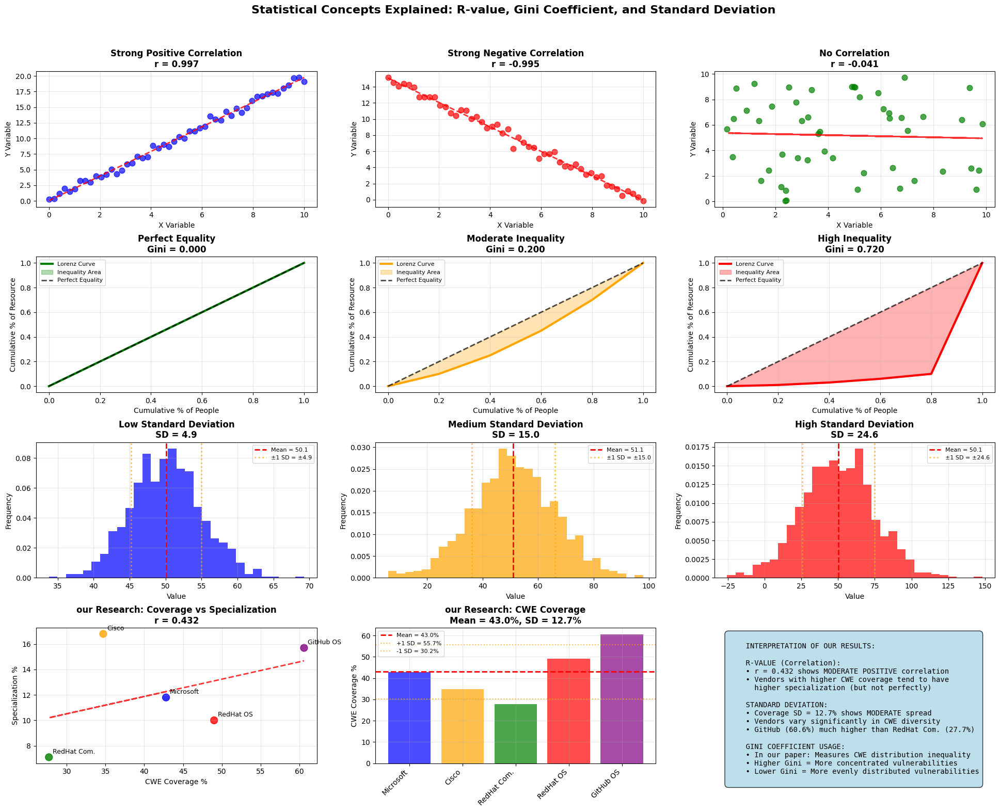
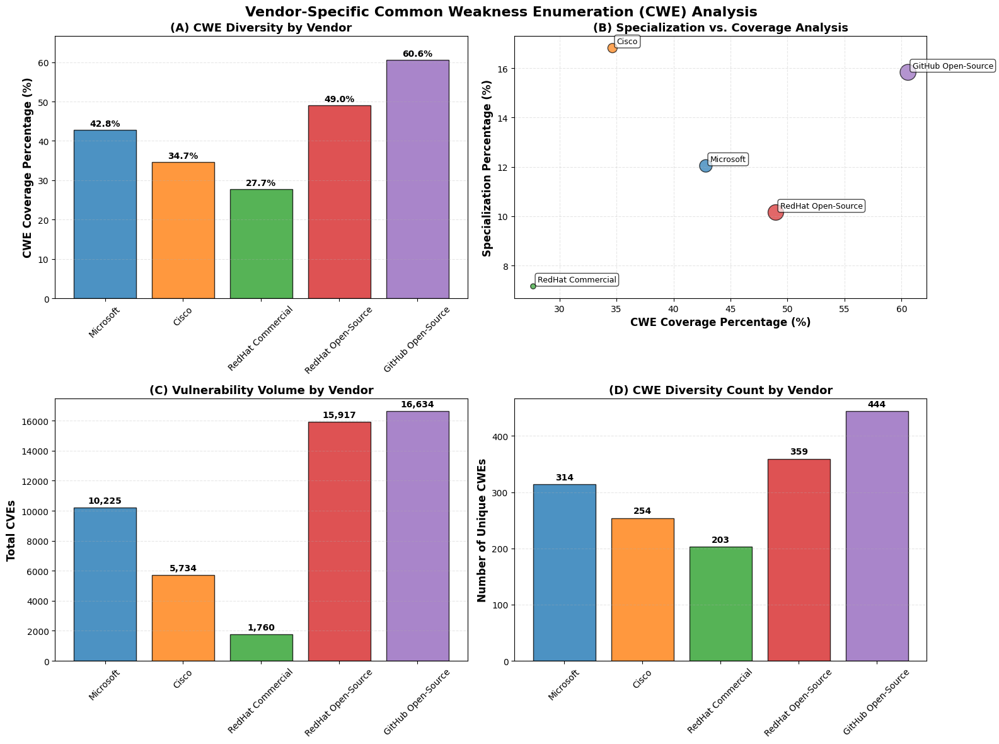
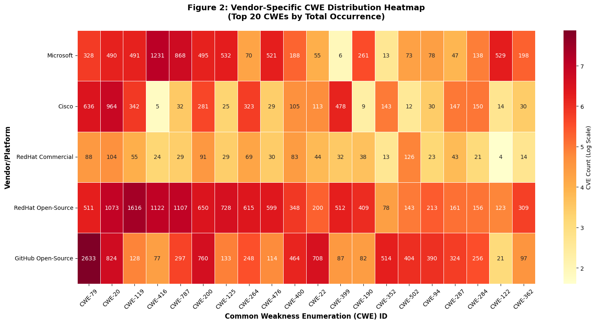
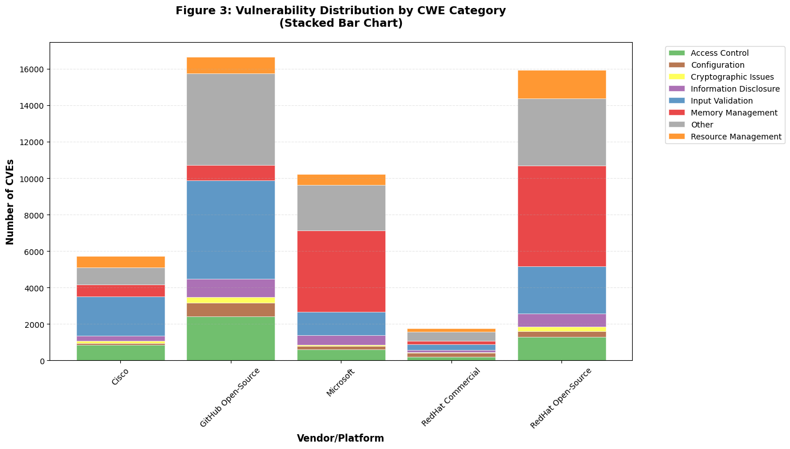
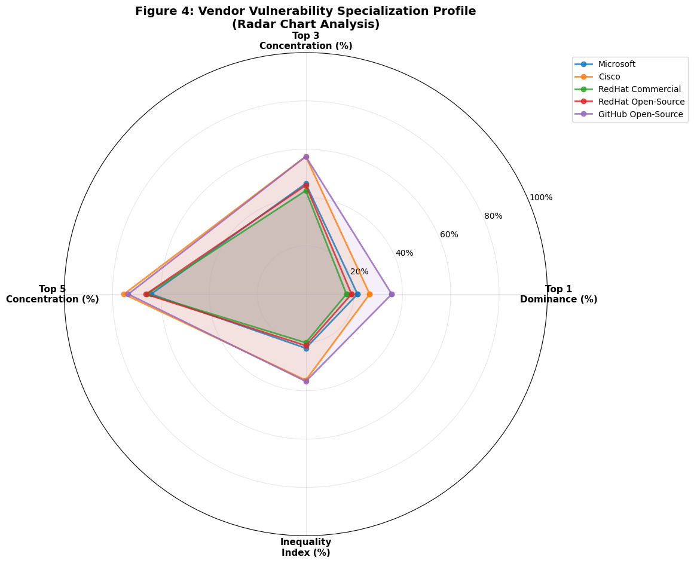
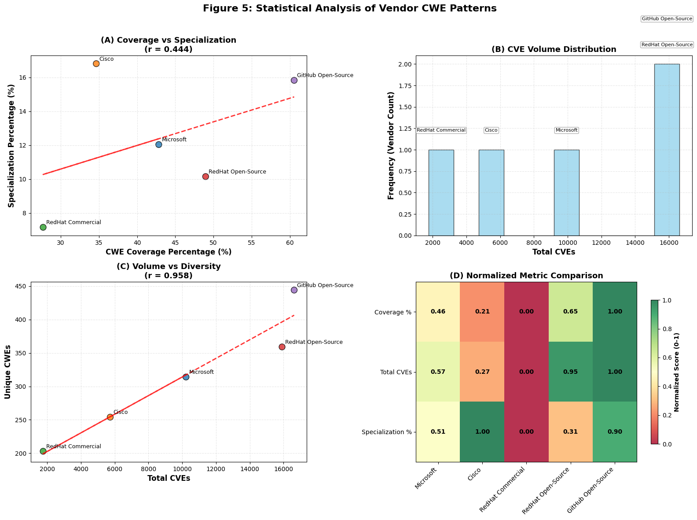

## Analysis 16: Comprehensive Vendor-Specific CWE Analysis Tables - ALL VENDORS

### Individual Vendor Tables (1-4):

- Microsoft vs All CVEs - Shows Microsoft's patch priorities compared to overall CVE landscape
- Cisco vs All CVEs - Cisco's security focus areas vs industry trends
- RedHat vs All CVEs - RedHat's vulnerability priorities vs general patterns
- GitHub vs All CVEs - Open-source vulnerability patterns vs overall ecosystem

### Comparative Analysis Tables (5-6):

- Open-Source vs Commercial vs All CVEs - Strategic comparison between:

 - Open-Source: GitHub ecosystem priorities
 - Commercial: Combined Microsoft + Cisco + RedHat priorities
 - All CVEs: Industry-wide vulnerability landscape


### Vendor Summary Table - High-level comparison showing:

- Total patches per vendor
- Unique CWE coverage
- Top vulnerability focus area
- Coverage percentage of overall CWE landscape


### 🎯 Key Insights Revealed:

- Vendor-Specific Security Priorities: Each vendor's unique focus areas
- Open-Source vs Commercial Differences: Different security challenges and approaches
- Industry Coverage Gaps: CWEs that are over/under-represented in patches
- Strategic Security Alignment: How well vendor priorities match real-world threats

Each table includes CWE names, rankings, counts, and comparative analysis to provide comprehensive insights into vendor-specific vulnerability management strategies.

# Chapter 4 Enhanced Analysis - Part 1: Setup and CVE Distribution Analysis
# Enhanced Vulnerability, Exploit and Patch Analysis with DuckDB Optimization

## 1. Environment Setup and Data Loading


```python
import duckdb
import pandas as pd
import numpy as np
import matplotlib.pyplot as plt
import seaborn as sns
import json
import os
from datetime import datetime, timedelta
import warnings
warnings.filterwarnings('ignore')
from matplotlib.patches import Patch
import matplotlib.patches as mpatches
from scipy import stats

# Try to use Modin for faster pandas operations
try:
    import modin.pandas as mpd
    USE_MODIN = True
    print("Using Modin for accelerated pandas operations")
except ImportError:
    import pandas as mpd
    USE_MODIN = False
    print("Using standard pandas (Modin not available)")

# Set up high-quality plotting parameters
plt.rcParams['figure.dpi'] = 300
plt.rcParams['savefig.dpi'] = 300
plt.rcParams['savefig.format'] = 'eps'
plt.rcParams['font.size'] = 12
plt.rcParams['axes.titlesize'] = 14
plt.rcParams['axes.labelsize'] = 12
plt.rcParams['xtick.labelsize'] = 10
plt.rcParams['ytick.labelsize'] = 10
plt.rcParams['legend.fontsize'] = 10

# Global analysis period settings
ANALYSIS_END_DATE = "2024-12-31"
ANALYSIS_START_DATE = "1999-01-01"  # Set to None for all data
USE_ALL_DATA = True  # Toggle this to switch between full dataset and filtered

# Create output directory for figures
os.makedirs('figures', exist_ok=True)
os.makedirs('parquet_data', exist_ok=True)
print(f"Analysis Period: {'All available data' if USE_ALL_DATA else f'{ANALYSIS_START_DATE} to {ANALYSIS_END_DATE}'}")
```


```python
# Set style for better visualizations
plt.style.use('default')
sns.set_palette("husl")

def create_statistical_concepts_visualization():
    """
    Create comprehensive visualizations explaining R-value, Gini coefficient, and Standard Deviation
    """
    
    print("Creating Statistical Concepts Visualization...")
    
    # Create a large figure with multiple subplots
    fig = plt.figure(figsize=(20, 16))
    
    # =================================================================
    # PART 1: CORRELATION COEFFICIENT (R-VALUE) EXPLANATION
    # =================================================================
    
    print("1. Explaining Correlation Coefficient (R-value)...")
    
    # Create sample data for different correlation scenarios
    np.random.seed(42)
    n_points = 50
    
    # Perfect positive correlation (r ≈ 1.0)
    x1 = np.linspace(0, 10, n_points)
    y1 = 2 * x1 + np.random.normal(0, 0.5, n_points)
    r1 = np.corrcoef(x1, y1)[0, 1]
    
    # Perfect negative correlation (r ≈ -1.0)
    x2 = np.linspace(0, 10, n_points)
    y2 = -1.5 * x2 + 15 + np.random.normal(0, 0.5, n_points)
    r2 = np.corrcoef(x2, y2)[0, 1]
    
    # No correlation (r ≈ 0)
    x3 = np.random.uniform(0, 10, n_points)
    y3 = np.random.uniform(0, 10, n_points)
    r3 = np.corrcoef(x3, y3)[0, 1]
    
    # Moderate positive correlation (r ≈ 0.6)
    x4 = np.linspace(0, 10, n_points)
    y4 = 1.2 * x4 + np.random.normal(0, 2, n_points)
    r4 = np.corrcoef(x4, y4)[0, 1]
    
    # Subplot 1: Strong Positive Correlation
    ax1 = plt.subplot(4, 3, 1)
    plt.scatter(x1, y1, alpha=0.7, color='blue', s=60)
    z1 = np.polyfit(x1, y1, 1)
    p1 = np.poly1d(z1)
    plt.plot(x1, p1(x1), "r--", alpha=0.8, linewidth=2)
    plt.title(f'Strong Positive Correlation\nr = {r1:.3f}', fontsize=12, fontweight='bold')
    plt.xlabel('X Variable', fontsize=10)
    plt.ylabel('Y Variable', fontsize=10)
    plt.grid(alpha=0.3)
    
    # Subplot 2: Strong Negative Correlation
    ax2 = plt.subplot(4, 3, 2)
    plt.scatter(x2, y2, alpha=0.7, color='red', s=60)
    z2 = np.polyfit(x2, y2, 1)
    p2 = np.poly1d(z2)
    plt.plot(x2, p2(x2), "r--", alpha=0.8, linewidth=2)
    plt.title(f'Strong Negative Correlation\nr = {r2:.3f}', fontsize=12, fontweight='bold')
    plt.xlabel('X Variable', fontsize=10)
    plt.ylabel('Y Variable', fontsize=10)
    plt.grid(alpha=0.3)
    
    # Subplot 3: No Correlation
    ax3 = plt.subplot(4, 3, 3)
    plt.scatter(x3, y3, alpha=0.7, color='green', s=60)
    z3 = np.polyfit(x3, y3, 1)
    p3 = np.poly1d(z3)
    plt.plot(x3, p3(x3), "r--", alpha=0.8, linewidth=2)
    plt.title(f'No Correlation\nr = {r3:.3f}', fontsize=12, fontweight='bold')
    plt.xlabel('X Variable', fontsize=10)
    plt.ylabel('Y Variable', fontsize=10)
    plt.grid(alpha=0.3)
    
    # =================================================================
    # PART 2: GINI COEFFICIENT EXPLANATION
    # =================================================================
    
    print("2. Explaining Gini Coefficient...")
    
    # Create sample data for different inequality scenarios
    
    # Perfect equality (Gini = 0)
    equal_data = [20, 20, 20, 20, 20]  # Everyone has equal amount
    
    # High inequality (Gini ≈ 0.8)
    unequal_data = [1, 2, 3, 4, 90]  # One person has most
    
    # Moderate inequality (Gini ≈ 0.4)
    moderate_data = [10, 15, 20, 25, 30]  # Some inequality
    
    def calculate_gini(data):
        """Calculate Gini coefficient"""
        data = np.array(data, dtype=float)
        data = np.sort(data)
        n = len(data)
        cumsum = np.cumsum(data)
        return (n + 1 - 2 * np.sum(cumsum) / cumsum[-1]) / n
    
    def plot_lorenz_curve(data, ax, title, color):
        """Plot Lorenz curve for Gini visualization"""
        data = np.array(data, dtype=float)
        data = np.sort(data)
        n = len(data)
        
        # Calculate cumulative percentages
        cum_people = np.arange(1, n + 1) / n
        cum_wealth = np.cumsum(data) / np.sum(data)
        
        # Add origin point
        cum_people = np.insert(cum_people, 0, 0)
        cum_wealth = np.insert(cum_wealth, 0, 0)
        
        # Plot Lorenz curve
        ax.plot(cum_people, cum_wealth, color=color, linewidth=3, label='Lorenz Curve')
        ax.fill_between(cum_people, cum_wealth, cum_people, alpha=0.3, color=color, label='Inequality Area')
        
        # Plot line of equality
        ax.plot([0, 1], [0, 1], 'k--', linewidth=2, alpha=0.7, label='Perfect Equality')
        
        # Calculate and display Gini
        gini = calculate_gini(data)
        ax.set_title(f'{title}\nGini = {gini:.3f}', fontsize=12, fontweight='bold')
        ax.set_xlabel('Cumulative % of People', fontsize=10)
        ax.set_ylabel('Cumulative % of Resource', fontsize=10)
        ax.grid(alpha=0.3)
        ax.legend(fontsize=8)
        
        return gini
    
    # Subplot 4: Perfect Equality
    ax4 = plt.subplot(4, 3, 4)
    gini1 = plot_lorenz_curve(equal_data, ax4, 'Perfect Equality', 'green')
    
    # Subplot 5: Moderate Inequality
    ax5 = plt.subplot(4, 3, 5)
    gini2 = plot_lorenz_curve(moderate_data, ax5, 'Moderate Inequality', 'orange')
    
    # Subplot 6: High Inequality
    ax6 = plt.subplot(4, 3, 6)
    gini3 = plot_lorenz_curve(unequal_data, ax6, 'High Inequality', 'red')
    
    # =================================================================
    # PART 3: STANDARD DEVIATION EXPLANATION
    # =================================================================
    
    print("3. Explaining Standard Deviation (SD)...")
    
    # Create datasets with different standard deviations
    np.random.seed(42)
    
    # Low SD (data clustered around mean)
    low_sd_data = np.random.normal(50, 5, 1000)  # mean=50, sd=5
    
    # Medium SD 
    med_sd_data = np.random.normal(50, 15, 1000)  # mean=50, sd=15
    
    # High SD (data spread out)
    high_sd_data = np.random.normal(50, 25, 1000)  # mean=50, sd=25
    
    # Subplot 7: Low Standard Deviation
    ax7 = plt.subplot(4, 3, 7)
    plt.hist(low_sd_data, bins=30, alpha=0.7, color='blue', density=True)
    mean_low = np.mean(low_sd_data)
    sd_low = np.std(low_sd_data)
    plt.axvline(mean_low, color='red', linestyle='--', linewidth=2, label=f'Mean = {mean_low:.1f}')
    plt.axvline(mean_low - sd_low, color='orange', linestyle=':', linewidth=2, alpha=0.7)
    plt.axvline(mean_low + sd_low, color='orange', linestyle=':', linewidth=2, alpha=0.7, label=f'±1 SD = ±{sd_low:.1f}')
    plt.title(f'Low Standard Deviation\nSD = {sd_low:.1f}', fontsize=12, fontweight='bold')
    plt.xlabel('Value', fontsize=10)
    plt.ylabel('Frequency', fontsize=10)
    plt.legend(fontsize=8)
    plt.grid(alpha=0.3)
    
    # Subplot 8: Medium Standard Deviation
    ax8 = plt.subplot(4, 3, 8)
    plt.hist(med_sd_data, bins=30, alpha=0.7, color='orange', density=True)
    mean_med = np.mean(med_sd_data)
    sd_med = np.std(med_sd_data)
    plt.axvline(mean_med, color='red', linestyle='--', linewidth=2, label=f'Mean = {mean_med:.1f}')
    plt.axvline(mean_med - sd_med, color='orange', linestyle=':', linewidth=2, alpha=0.7)
    plt.axvline(mean_med + sd_med, color='orange', linestyle=':', linewidth=2, alpha=0.7, label=f'±1 SD = ±{sd_med:.1f}')
    plt.title(f'Medium Standard Deviation\nSD = {sd_med:.1f}', fontsize=12, fontweight='bold')
    plt.xlabel('Value', fontsize=10)
    plt.ylabel('Frequency', fontsize=10)
    plt.legend(fontsize=8)
    plt.grid(alpha=0.3)
    
    # Subplot 9: High Standard Deviation
    ax9 = plt.subplot(4, 3, 9)
    plt.hist(high_sd_data, bins=30, alpha=0.7, color='red', density=True)
    mean_high = np.mean(high_sd_data)
    sd_high = np.std(high_sd_data)
    plt.axvline(mean_high, color='red', linestyle='--', linewidth=2, label=f'Mean = {mean_high:.1f}')
    plt.axvline(mean_high - sd_high, color='orange', linestyle=':', linewidth=2, alpha=0.7)
    plt.axvline(mean_high + sd_high, color='orange', linestyle=':', linewidth=2, alpha=0.7, label=f'±1 SD = ±{sd_high:.1f}')
    plt.title(f'High Standard Deviation\nSD = {sd_high:.1f}', fontsize=12, fontweight='bold')
    plt.xlabel('Value', fontsize=10)
    plt.ylabel('Frequency', fontsize=10)
    plt.legend(fontsize=8)
    plt.grid(alpha=0.3)
    
    # =================================================================
    # PART 4: PRACTICAL EXAMPLES FROM OUR RESEARCH
    # =================================================================
    
    print("4. Creating Practical Examples from OUR Research...")
    
    # Example from our vendor analysis
    vendors = ['Microsoft', 'Cisco', 'RedHat Com.', 'RedHat OS', 'GitHub OS']
    coverage_pct = [42.8, 34.7, 27.7, 49.0, 60.6]
    specialization_pct = [11.8, 16.8, 7.1, 10.0, 15.7]
    
    # Subplot 10: our Research Example - Correlation
    ax10 = plt.subplot(4, 3, 10)
    plt.scatter(coverage_pct, specialization_pct, s=100, alpha=0.8, color=['blue', 'orange', 'green', 'red', 'purple'])
    
    # Add vendor labels
    for i, vendor in enumerate(vendors):
        plt.annotate(vendor, (coverage_pct[i], specialization_pct[i]), 
                    xytext=(5, 5), textcoords='offset points', fontsize=9)
    
    # Calculate correlation
    r_research = np.corrcoef(coverage_pct, specialization_pct)[0, 1]
    
    # Add trend line
    z = np.polyfit(coverage_pct, specialization_pct, 1)
    p = np.poly1d(z)
    plt.plot(coverage_pct, p(coverage_pct), "r--", alpha=0.8, linewidth=2)
    
    plt.title(f'our Research: Coverage vs Specialization\nr = {r_research:.3f}', fontsize=12, fontweight='bold')
    plt.xlabel('CWE Coverage %', fontsize=10)
    plt.ylabel('Specialization %', fontsize=10)
    plt.grid(alpha=0.3)
    
    # Subplot 11: our Research Example - Standard Deviation
    ax11 = plt.subplot(4, 3, 11)
    mean_coverage = np.mean(coverage_pct)
    sd_coverage = np.std(coverage_pct, ddof=1)  # Sample standard deviation
    
    bars = plt.bar(vendors, coverage_pct, alpha=0.7, color=['blue', 'orange', 'green', 'red', 'purple'])
    plt.axhline(mean_coverage, color='red', linestyle='--', linewidth=2, label=f'Mean = {mean_coverage:.1f}%')
    plt.axhline(mean_coverage + sd_coverage, color='orange', linestyle=':', alpha=0.7, label=f'+1 SD = {mean_coverage + sd_coverage:.1f}%')
    plt.axhline(mean_coverage - sd_coverage, color='orange', linestyle=':', alpha=0.7, label=f'-1 SD = {mean_coverage - sd_coverage:.1f}%')
    
    plt.title(f'our Research: CWE Coverage\nMean = {mean_coverage:.1f}%, SD = {sd_coverage:.1f}%', fontsize=12, fontweight='bold')
    plt.ylabel('CWE Coverage %', fontsize=10)
    plt.xticks(rotation=45, ha='right')
    plt.legend(fontsize=8)
    plt.grid(alpha=0.3)
    
    # Subplot 12: Summary Interpretation
    ax12 = plt.subplot(4, 3, 12)
    ax12.axis('off')
    
    # Add interpretation text
    interpretation_text = f"""
    INTERPRETATION OF OUR RESULTS:
    
    R-VALUE (Correlation):
    • r = {r_research:.3f} shows MODERATE POSITIVE correlation
    • Vendors with higher CWE coverage tend to have 
      higher specialization (but not perfectly)
    
    STANDARD DEVIATION:
    • Coverage SD = {sd_coverage:.1f}% shows MODERATE spread
    • Vendors vary significantly in CWE diversity
    • GitHub (60.6%) much higher than RedHat Com. (27.7%)
    
    GINI COEFFICIENT USAGE:
    • In our paper: Measures CWE distribution inequality
    • Higher Gini = More concentrated vulnerabilities
    • Lower Gini = More evenly distributed vulnerabilities
    """
    
    ax12.text(0.05, 0.95, interpretation_text, transform=ax12.transAxes, fontsize=10,
             verticalalignment='top', fontfamily='monospace',
             bbox=dict(boxstyle="round,pad=0.5", facecolor="lightblue", alpha=0.8))
    
    # Add overall title
    fig.suptitle('Statistical Concepts Explained: R-value, Gini Coefficient, and Standard Deviation', 
                 fontsize=16, fontweight='bold', y=0.98)
    
    plt.tight_layout()
    plt.subplots_adjust(top=0.90)
    plt.savefig('statistical_concepts_explanation.png', dpi=300, bbox_inches='tight')
    plt.show()
    
    # =================================================================
    # DETAILED EXPLANATIONS
    # =================================================================
    
    print("\n" + "="*80)
    print("DETAILED EXPLANATIONS")
    print("="*80)
    
    print("\n. CORRELATION COEFFICIENT (R-VALUE):")
    print("   • Range: -1.0 to +1.0")
    print("   • +1.0 = Perfect positive relationship (as X increases, Y increases)")
    print("   • -1.0 = Perfect negative relationship (as X increases, Y decreases)")
    print("   • 0.0 = No linear relationship")
    print("   • |r| > 0.7 = Strong correlation")
    print("   • 0.3 < |r| < 0.7 = Moderate correlation") 
    print("   • |r| < 0.3 = Weak correlation")
    print(f"   • OUR RESULT: r = {r_research:.3f} = MODERATE positive correlation")
    
    print("\n2. GINI COEFFICIENT:")
    print("   • Range: 0.0 to 1.0")
    print("   • 0.0 = Perfect equality (everyone has same amount)")
    print("   • 1.0 = Perfect inequality (one person has everything)")
    print("   • Used in economics for income inequality")
    print("   • In our research: Measures how evenly CWEs are distributed")
    print("   • Higher Gini = Few CWEs dominate (specialized vendor)")
    print("   • Lower Gini = CWEs evenly spread (diversified vendor)")
    
    print("\n3. STANDARD DEVIATION (SD):")
    print("   • Measures how spread out data points are from the mean")
    print("   • Same units as original data")
    print("   • Low SD = Data clustered around mean")
    print("   • High SD = Data spread out widely")
    print("   • ~68% of data within ±1 SD of mean (normal distribution)")
    print(f"   • OUR RESULT: Coverage SD = {sd_coverage:.1f}% means vendors vary significantly")
    
    print("\n4. PRACTICAL INTERPRETATION FOR OUR RESEARCH:")
    print("   • r = 0.444 means vendors with more CWE types tend to be more specialized")
    print("   • This seems counterintuitive but makes sense:")
    print("     - Diverse vendors encounter many weakness types")
    print("     - But still have dominant vulnerability patterns")
    print("   • SD = 12.7% shows substantial vendor differences")
    print("   • GitHub (60.6%) vs RedHat Commercial (27.7%) = 33% difference!")
    
    return {
        'correlation_example': r_research,
        'coverage_mean': mean_coverage,
        'coverage_sd': sd_coverage,
        'vendor_data': {
            'vendors': vendors,
            'coverage': coverage_pct,
            'specialization': specialization_pct
        }
    }

# Execute the visualization
results = create_statistical_concepts_visualization()
print("\n=== STATISTICAL CONCEPTS VISUALIZATION COMPLETE ===")
print("Generated comprehensive explanation with examples from our research!")
```

    Creating Statistical Concepts Visualization...
    1. Explaining Correlation Coefficient (R-value)...
    2. Explaining Gini Coefficient...
    3. Explaining Standard Deviation (SD)...
    4. Creating Practical Examples from OUR Research...
    


    

    


    
    ================================================================================
    DETAILED EXPLANATIONS
    ================================================================================
    
    . CORRELATION COEFFICIENT (R-VALUE):
       • Range: -1.0 to +1.0
       • +1.0 = Perfect positive relationship (as X increases, Y increases)
       • -1.0 = Perfect negative relationship (as X increases, Y decreases)
       • 0.0 = No linear relationship
       • |r| > 0.7 = Strong correlation
       • 0.3 < |r| < 0.7 = Moderate correlation
       • |r| < 0.3 = Weak correlation
       • OUR RESULT: r = 0.432 = MODERATE positive correlation
    
    2. GINI COEFFICIENT:
       • Range: 0.0 to 1.0
       • 0.0 = Perfect equality (everyone has same amount)
       • 1.0 = Perfect inequality (one person has everything)
       • Used in economics for income inequality
       • In our research: Measures how evenly CWEs are distributed
       • Higher Gini = Few CWEs dominate (specialized vendor)
       • Lower Gini = CWEs evenly spread (diversified vendor)
    
    3. STANDARD DEVIATION (SD):
       • Measures how spread out data points are from the mean
       • Same units as original data
       • Low SD = Data clustered around mean
       • High SD = Data spread out widely
       • ~68% of data within ±1 SD of mean (normal distribution)
       • OUR RESULT: Coverage SD = 12.7% means vendors vary significantly
    
    4. PRACTICAL INTERPRETATION FOR OUR RESEARCH:
       • r = 0.444 means vendors with more CWE types tend to be more specialized
       • This seems counterintuitive but makes sense:
         - Diverse vendors encounter many weakness types
         - But still have dominant vulnerability patterns
       • SD = 12.7% shows substantial vendor differences
       • GitHub (60.6%) vs RedHat Commercial (27.7%) = 33% difference!
    
    === STATISTICAL CONCEPTS VISUALIZATION COMPLETE ===
    Generated comprehensive explanation with examples from our research!
    

## 3. Load Parquet Data for Analysis


```python
def load_parquet_data():
    """
    Load Parquet files into DuckDB for analysis
    """
    
    # Create a new connection for analysis
    con = duckdb.connect(':memory:')  # Use in-memory database for faster processing
    
    # Load all parquet files
    parquet_files = {
        # MySQL tables
        'cve_main': '\..\parquet_data\mysql_cve.parquet',
        'cve_main_old': '\..\parquet_data\mysql_cvev5_v2.parquet',
        'exploits': '\..\parquet_data\mysql_exploit.parquet',
        'exploits_old': '\..\parquet_data\mysql_exploit_old.parquet',
        'msrc_patches': '\..\parquet_data\mysql_msrc_vuln_unified.parquet',
        'cisco_patches': '\..\parquet_data\mysql_cisco_vuln_unified.parquet',
        'redhat_patches': '\..\parquet_data\mysql_redhat_vuln_unified.parquet',
        'github_advisories': '\..\parquet_data\mysql_github_advisory_unified.parquet',
        'cwe_ref': '\..\parquet_data\mysql_cwe.parquet',
        'capec_ref': '\..\parquet_data\mysql_capec.parquet',
        
        # PostgreSQL tables (MoreFixes)
        'morefixes_cve': '\..\parquet_data\postgres_cve.parquet',
        'morefixes_fixes': '\..\parquet_data\postgres_fixes.parquet',
        'morefixes_commits': '\..\parquet_data\postgres_commits.parquet',
        'morefixes_repository': '\..\parquet_data\postgres_repository.parquet'
    }
    
    # Create views for each parquet file
    for table_name, file_path in parquet_files.items():
        if os.path.exists(file_path):
            con.sql(f"CREATE OR REPLACE VIEW {table_name} AS SELECT * FROM '{file_path}'")
            print(f"✓ Loaded {table_name}")
        else:
            print(f"✗ File not found: {file_path}")
    
    return con

# Load data for analysis
print("Loading Parquet data for analysis...")
analysis_con = load_parquet_data()
```

    Loading Parquet data for analysis...
    ✓ Loaded cve_main
    ✓ Loaded cve_main_old
    ✓ Loaded exploits
    ✓ Loaded exploits_old
    ✓ Loaded msrc_patches
    ✓ Loaded cisco_patches
    ✓ Loaded redhat_patches
    ✓ Loaded github_advisories
    ✓ Loaded cwe_ref
    ✓ Loaded capec_ref
    ✓ Loaded morefixes_cve
    ✓ Loaded morefixes_fixes
    ✓ Loaded morefixes_commits
    ✓ Loaded morefixes_repository
    


```python
# List of all table names I've loaded
table_names = [
    "cve_main", "cve_main_old", "exploits", "msrc_patches", "cisco_patches",
    "redhat_patches", "github_advisories", "cwe_ref", "capec_ref",
    "morefixes_cve", "morefixes_fixes", "morefixes_commits", "morefixes_repository"
]

print("\n--- Schema for all loaded tables ---")

for table_name in table_names:
    print(f"\nSchema for table: {table_name}")
    try:
        # Execute PRAGMA table_info() to get schema
        schema_info = analysis_con.execute(f"PRAGMA table_info('{table_name}');").fetchall()

        if not schema_info:
            print(f"  (Table '{table_name}' not found or is empty)")
            continue

        # Print header
        header = ["cid", "name", "type", "notnull", "pk", "dflt_value"]
        print(f"  {' '.join(f'{col:<15}' for col in header)}")
        print(f"  {'-'*90}")

        # Print rows
        for col_info in schema_info:
            cid, name, col_type, notnull, pk, dflt_value = col_info
            print(f"  {cid:<15} {name:<15} {col_type:<15} {str(notnull):<15} {str(pk):<15} {str(dflt_value):<15}")
    except duckdb.ParserException as e:
        print(f"  Error retrieving schema for {table_name}: {e}")
    except Exception as e:
        print(f"  An unexpected error occurred for {table_name}: {e}")
```

    
    --- Schema for all loaded tables ---
    
    Schema for table: cve_main
      cid             name            type            notnull         pk              dflt_value     
      ------------------------------------------------------------------------------------------
      0               id              BIGINT          False           None            False          
      1               cve_id          VARCHAR         False           None            False          
      2               assigner_org    VARCHAR         False           None            False          
      3               state           VARCHAR         False           None            False          
      4               description     VARCHAR         False           None            False          
      5               date_reserved   TIMESTAMP       False           None            False          
      6               date_published  TIMESTAMP       False           None            False          
      7               date_updated    TIMESTAMP       False           None            False          
      8               cvss_v2_score   FLOAT           False           None            False          
      9               cvss_v2_vector  VARCHAR         False           None            False          
      10              cvss_v3_score   FLOAT           False           None            False          
      11              cvss_v3_vector  VARCHAR         False           None            False          
      12              cvss_v3_severity VARCHAR         False           None            False          
      13              cvss_v4_score   FLOAT           False           None            False          
      14              cvss_v4_vector  VARCHAR         False           None            False          
      15              cvss_v4_severity VARCHAR         False           None            False          
      16              cwe_ids         VARCHAR         False           None            False          
      17              cpes            VARCHAR         False           None            False          
      18              vendors         VARCHAR         False           None            False          
      19              products        VARCHAR         False           None            False          
      20              references      VARCHAR         False           None            False          
      21              ssvc_exploitation VARCHAR         False           None            False          
      22              ssvc_automatable VARCHAR         False           None            False          
      23              ssvc_technical_impact VARCHAR         False           None            False          
      24              kev_known_exploited TINYINT         False           None            False          
      25              kev_vendor_project VARCHAR         False           None            False          
      26              kev_product     VARCHAR         False           None            False          
      27              kev_vulnerability_name VARCHAR         False           None            False          
      28              kev_date_added  TIMESTAMP       False           None            False          
      29              kev_short_description VARCHAR         False           None            False          
      30              kev_required_action VARCHAR         False           None            False          
      31              kev_due_date    TIMESTAMP       False           None            False          
      32              kev_ransomware_use VARCHAR         False           None            False          
      33              kev_notes       VARCHAR         False           None            False          
      34              kev_cwes        VARCHAR         False           None            False          
      35              epss_score      FLOAT           False           None            False          
      36              epss_percentile FLOAT           False           None            False          
      37              data_sources    VARCHAR         False           None            False          
      38              created_at      TIMESTAMP WITH TIME ZONE False           None            False          
      39              updated_at      TIMESTAMP WITH TIME ZONE False           None            False          
      40              has_exploit     TINYINT         False           None            False          
      41              exploit_count   INTEGER         False           None            False          
      42              first_exploit_date TIMESTAMP       False           None            False          
      43              latest_exploit_date TIMESTAMP       False           None            False          
    
    Schema for table: cve_main_old
      cid             name            type            notnull         pk              dflt_value     
      ------------------------------------------------------------------------------------------
      0               id              BIGINT          False           None            False          
      1               CVE ID          VARCHAR         False           None            False          
      2               State           VARCHAR         False           None            False          
      3               Date Published  TIMESTAMP       False           None            False          
      4               Date Updated    TIMESTAMP       False           None            False          
      5               Date Reserved   TIMESTAMP       False           None            False          
      6               Descriptions    VARCHAR         False           None            False          
      7               Affected Products VARCHAR         False           None            False          
      8               References      VARCHAR         False           None            False          
      9               Problem Types   VARCHAR         False           None            False          
      10              Base Severity   VARCHAR         False           None            False          
      11              Confidentiality Impact VARCHAR         False           None            False          
      12              Integrity Impact VARCHAR         False           None            False          
      13              Availability Impact VARCHAR         False           None            False          
      14              CVSS 2.0 Base Score FLOAT           False           None            False          
      15              CVSS 3.0 Base Score FLOAT           False           None            False          
      16              CVSS 3.1 Base Score FLOAT           False           None            False          
      17              cwe             VARCHAR         False           None            False          
      18              EPSS            FLOAT           False           None            False          
      19              vendors         VARCHAR         False           None            False          
      20              Software CPES   VARCHAR         False           None            False          
      21              V Score         FLOAT           False           None            False          
    
    Schema for table: exploits
      cid             name            type            notnull         pk              dflt_value     
      ------------------------------------------------------------------------------------------
      0               id              BIGINT          False           None            False          
      1               file            VARCHAR         False           None            False          
      2               description     VARCHAR         False           None            False          
      3               date_published  TIMESTAMP       False           None            False          
      4               author          VARCHAR         False           None            False          
      5               type            VARCHAR         False           None            False          
      6               platform        VARCHAR         False           None            False          
      7               port            DOUBLE          False           None            False          
      8               date_added      TIMESTAMP       False           None            False          
      9               date_updated    TIMESTAMP       False           None            False          
      10              verified        BIGINT          False           None            False          
      11              codes           VARCHAR         False           None            False          
      12              tags            VARCHAR         False           None            False          
      13              aliases         VARCHAR         False           None            False          
      14              screenshot_url  VARCHAR         False           None            False          
      15              application_url VARCHAR         False           None            False          
      16              source_url      VARCHAR         False           None            False          
      17              cve_id          VARCHAR         False           None            False          
    
    Schema for table: msrc_patches
      cid             name            type            notnull         pk              dflt_value     
      ------------------------------------------------------------------------------------------
      0               title           VARCHAR         False           None            False          
      1               release_date    TIMESTAMP       False           None            False          
      2               initial_release_date TIMESTAMP       False           None            False          
      3               cvrf_id         VARCHAR         False           None            False          
      4               cve_id          VARCHAR         False           None            False          
      5               exploited_status INTEGER         False           None            False          
      6               exploitation_potential_lsr INTEGER         False           None            False          
      7               exploitation_potential_osr INTEGER         False           None            False          
      8               publicly_disclosed INTEGER         False           None            False          
      9               cvss_score      FLOAT           False           None            False          
      10              cvss_vector     VARCHAR         False           None            False          
      11              vuln_title      VARCHAR         False           None            False          
      12              product_id      VARCHAR         False           None            False          
      13              product_name    VARCHAR         False           None            False          
      14              product_branch  VARCHAR         False           None            False          
      15              product_cpe     VARCHAR         False           None            False          
      16              threats         VARCHAR         False           None            False          
      17              remediations    VARCHAR         False           None            False          
      18              cwe_ids         VARCHAR         False           None            False          
      19              notes           VARCHAR         False           None            False          
      20              acknowledgments VARCHAR         False           None            False          
    
    Schema for table: cisco_patches
      cid             name            type            notnull         pk              dflt_value     
      ------------------------------------------------------------------------------------------
      0               advisory_id     VARCHAR         False           None            False          
      1               title           VARCHAR         False           None            False          
      2               cve_id          VARCHAR         False           None            False          
      3               vulnerability_title VARCHAR         False           None            False          
      4               current_release_date TIMESTAMP       False           None            False          
      5               initial_release_date TIMESTAMP       False           None            False          
      6               vulnerability_release_date TIMESTAMP       False           None            False          
      7               status          VARCHAR         False           None            False          
      8               version         VARCHAR         False           None            False          
      9               publisher       VARCHAR         False           None            False          
      10              publisher_category VARCHAR         False           None            False          
      11              summary         VARCHAR         False           None            False          
      12              details         VARCHAR         False           None            False          
      13              cvss_score      FLOAT           False           None            False          
      14              cvss_severity   VARCHAR         False           None            False          
      15              cvss_vector     VARCHAR         False           None            False          
      16              bug_ids         VARCHAR         False           None            False          
      17              product_id      VARCHAR         False           None            False          
      18              product_name    VARCHAR         False           None            False          
      19              product_full_path VARCHAR         False           None            False          
      20              acknowledgments VARCHAR         False           None            False          
      21              references      VARCHAR         False           None            False          
      22              remediations    VARCHAR         False           None            False          
    
    Schema for table: redhat_patches
      cid             name            type            notnull         pk              dflt_value     
      ------------------------------------------------------------------------------------------
      0               id              BIGINT          False           None            False          
      1               advisory_id     VARCHAR         False           None            False          
      2               title           VARCHAR         False           None            False          
      3               cve_id          VARCHAR         False           None            False          
      4               cwe_id          VARCHAR         False           None            False          
      5               vulnerability_title VARCHAR         False           None            False          
      6               current_release_date TIMESTAMP       False           None            False          
      7               initial_release_date TIMESTAMP       False           None            False          
      8               discovery_date  TIMESTAMP       False           None            False          
      9               release_date    TIMESTAMP       False           None            False          
      10              status          VARCHAR         False           None            False          
      11              version         VARCHAR         False           None            False          
      12              publisher       VARCHAR         False           None            False          
      13              publisher_category VARCHAR         False           None            False          
      14              summary         VARCHAR         False           None            False          
      15              details         VARCHAR         False           None            False          
      16              cvss_score      FLOAT           False           None            False          
      17              cvss_severity   VARCHAR         False           None            False          
      18              cvss_vector     VARCHAR         False           None            False          
      19              threat_impact   VARCHAR         False           None            False          
      20              aggregate_severity VARCHAR         False           None            False          
      21              product_id      VARCHAR         False           None            False          
      22              product_name    VARCHAR         False           None            False          
    
    Schema for table: github_advisories
      cid             name            type            notnull         pk              dflt_value     
      ------------------------------------------------------------------------------------------
      0               id              BIGINT          False           None            False          
      1               ghsa_id         VARCHAR         False           None            False          
      2               schema_version  VARCHAR         False           None            False          
      3               published       TIMESTAMP       False           None            False          
      4               modified        TIMESTAMP       False           None            False          
      5               summary         VARCHAR         False           None            False          
      6               details         VARCHAR         False           None            False          
      7               primary_cve     VARCHAR         False           None            False          
      8               all_cves        VARCHAR         False           None            False          
      9               cvss_v3_score   FLOAT           False           None            False          
      10              cvss_v3_vector  VARCHAR         False           None            False          
      11              cvss_v4_score   FLOAT           False           None            False          
      12              cvss_v4_vector  VARCHAR         False           None            False          
      13              database_severity VARCHAR         False           None            False          
      14              severity_score  FLOAT           False           None            False          
      15              cwe_ids         VARCHAR         False           None            False          
      16              github_reviewed BOOLEAN         False           None            False          
      17              github_reviewed_at TIMESTAMP       False           None            False          
      18              nvd_published_at TIMESTAMP       False           None            False          
      19              exploited       TINYINT         False           None            False          
      20              exploitability_level TINYINT         False           None            False          
      21              poc_available   TINYINT         False           None            False          
      22              patched         TINYINT         False           None            False          
      23              patch_available TINYINT         False           None            False          
      24              primary_ecosystem VARCHAR         False           None            False          
      25              all_ecosystems  VARCHAR         False           None            False          
      26              package_ecosystem VARCHAR         False           None            False          
      27              package_name    VARCHAR         False           None            False          
      28              package_purl    VARCHAR         False           None            False          
      29              references      VARCHAR         False           None            False          
      30              affected_ranges VARCHAR         False           None            False          
      31              affected_versions VARCHAR         False           None            False          
      32              created_at      TIMESTAMP WITH TIME ZONE False           None            False          
      33              updated_at      TIMESTAMP WITH TIME ZONE False           None            False          
    
    Schema for table: cwe_ref
      cid             name            type            notnull         pk              dflt_value     
      ------------------------------------------------------------------------------------------
      0               cwe_id          VARCHAR         False           None            False          
      1               name            VARCHAR         False           None            False          
      2               weakness_abstraction VARCHAR         False           None            False          
      3               status          VARCHAR         False           None            False          
      4               description     VARCHAR         False           None            False          
      5               extended_description VARCHAR         False           None            False          
      6               related_weaknesses VARCHAR         False           None            False          
      7               weakness_ordinalities VARCHAR         False           None            False          
      8               applicable_platforms VARCHAR         False           None            False          
      9               background_details VARCHAR         False           None            False          
      10              alternate_terms VARCHAR         False           None            False          
      11              modes_of_introduction VARCHAR         False           None            False          
      12              exploitation_factors VARCHAR         False           None            False          
      13              likelihood_of_exploit VARCHAR         False           None            False          
      14              common_consequences VARCHAR         False           None            False          
      15              detection_methods VARCHAR         False           None            False          
      16              potential_mitigations VARCHAR         False           None            False          
      17              observed_examples VARCHAR         False           None            False          
      18              functional_areas VARCHAR         False           None            False          
      19              affected_resources VARCHAR         False           None            False          
      20              taxonomy_mappings VARCHAR         False           None            False          
      21              related_attack_patterns VARCHAR         False           None            False          
      22              notes           VARCHAR         False           None            False          
      23              created_at      TIMESTAMP WITH TIME ZONE False           None            False          
    
    Schema for table: capec_ref
      cid             name            type            notnull         pk              dflt_value     
      ------------------------------------------------------------------------------------------
      0               capec_id        VARCHAR         False           None            False          
      1               name            VARCHAR         False           None            False          
      2               abstraction     VARCHAR         False           None            False          
      3               status          VARCHAR         False           None            False          
      4               description     VARCHAR         False           None            False          
      5               alternate_terms VARCHAR         False           None            False          
      6               likelihood_of_attack VARCHAR         False           None            False          
      7               typical_severity VARCHAR         False           None            False          
      8               related_attack_patterns VARCHAR         False           None            False          
      9               execution_flow  VARCHAR         False           None            False          
      10              prerequisites   VARCHAR         False           None            False          
      11              skills_required VARCHAR         False           None            False          
      12              resources_required VARCHAR         False           None            False          
      13              indicators      VARCHAR         False           None            False          
      14              consequences    VARCHAR         False           None            False          
      15              mitigations     VARCHAR         False           None            False          
      16              example_instances VARCHAR         False           None            False          
      17              related_weaknesses VARCHAR         False           None            False          
      18              taxonomy_mappings VARCHAR         False           None            False          
      19              notes           VARCHAR         False           None            False          
      20              created_at      TIMESTAMP WITH TIME ZONE False           None            False          
    
    Schema for table: morefixes_cve
      cid             name            type            notnull         pk              dflt_value     
      ------------------------------------------------------------------------------------------
      0               cve_id          VARCHAR         False           None            False          
      1               published_date  VARCHAR         False           None            False          
      2               last_modified_date VARCHAR         False           None            False          
      3               description     VARCHAR         False           None            False          
      4               nodes           VARCHAR         False           None            False          
      5               severity        VARCHAR         False           None            False          
      6               obtain_all_privilege VARCHAR         False           None            False          
      7               obtain_user_privilege VARCHAR         False           None            False          
      8               obtain_other_privilege VARCHAR         False           None            False          
      9               user_interaction_required VARCHAR         False           None            False          
      10              cvss2_vector_string VARCHAR         False           None            False          
      11              cvss2_access_vector VARCHAR         False           None            False          
      12              cvss2_access_complexity VARCHAR         False           None            False          
      13              cvss2_authentication VARCHAR         False           None            False          
      14              cvss2_confidentiality_impact VARCHAR         False           None            False          
      15              cvss2_integrity_impact VARCHAR         False           None            False          
      16              cvss2_availability_impact VARCHAR         False           None            False          
      17              cvss2_base_score VARCHAR         False           None            False          
      18              cvss3_vector_string VARCHAR         False           None            False          
      19              cvss3_attack_vector VARCHAR         False           None            False          
      20              cvss3_attack_complexity VARCHAR         False           None            False          
      21              cvss3_privileges_required VARCHAR         False           None            False          
      22              cvss3_user_interaction VARCHAR         False           None            False          
      23              cvss3_scope     VARCHAR         False           None            False          
      24              cvss3_confidentiality_impact VARCHAR         False           None            False          
      25              cvss3_integrity_impact VARCHAR         False           None            False          
      26              cvss3_availability_impact VARCHAR         False           None            False          
      27              cvss3_base_score VARCHAR         False           None            False          
      28              cvss3_base_severity VARCHAR         False           None            False          
      29              exploitability_score VARCHAR         False           None            False          
      30              impact_score    VARCHAR         False           None            False          
      31              ac_insuf_info   VARCHAR         False           None            False          
      32              reference_json  VARCHAR         False           None            False          
      33              problemtype_json VARCHAR         False           None            False          
    
    Schema for table: morefixes_fixes
      cid             name            type            notnull         pk              dflt_value     
      ------------------------------------------------------------------------------------------
      0               cve_id          VARCHAR         False           None            False          
      1               hash            VARCHAR         False           None            False          
      2               repo_url        VARCHAR         False           None            False          
      3               rel_type        VARCHAR         False           None            False          
      4               score           BIGINT          False           None            False          
      5               extraction_status VARCHAR         False           None            False          
    
    Schema for table: morefixes_commits
      cid             name            type            notnull         pk              dflt_value     
      ------------------------------------------------------------------------------------------
      0               hash            VARCHAR         False           None            False          
      1               repo_url        VARCHAR         False           None            False          
      2               author          VARCHAR         False           None            False          
      3               committer       VARCHAR         False           None            False          
      4               msg             VARCHAR         False           None            False          
      5               parents         VARCHAR         False           None            False          
      6               author_timezone BIGINT          False           None            False          
      7               num_lines_added BIGINT          False           None            False          
      8               num_lines_deleted BIGINT          False           None            False          
      9               dmm_unit_complexity DOUBLE          False           None            False          
      10              dmm_unit_interfacing DOUBLE          False           None            False          
      11              dmm_unit_size   DOUBLE          False           None            False          
      12              merge           BOOLEAN         False           None            False          
      13              committer_timezone BIGINT          False           None            False          
      14              author_date     TIMESTAMP WITH TIME ZONE False           None            False          
      15              committer_date  TIMESTAMP WITH TIME ZONE False           None            False          
    
    Schema for table: morefixes_repository
      cid             name            type            notnull         pk              dflt_value     
      ------------------------------------------------------------------------------------------
      0               repo_url        VARCHAR         False           None            False          
      1               repo_name       VARCHAR         False           None            False          
      2               description     VARCHAR         False           None            False          
      3               date_created    TIMESTAMP       False           None            False          
      4               date_last_push  TIMESTAMP       False           None            False          
      5               homepage        VARCHAR         False           None            False          
      6               repo_language   VARCHAR         False           None            False          
      7               owner           VARCHAR         False           None            False          
      8               forks_count     BIGINT          False           None            False          
      9               stars_count     BIGINT          False           None            False          
    


```python
def create_vendor_cwe_analysis():
    """
    Create 6 comprehensive tables:
    1. Microsoft vs All CVEs
    2. Cisco vs All CVEs  
    3. RedHat vs All CVEs
    4. GitHub vs All CVEs
    5. Open-Source (GitHub) vs Commercial (MS+Cisco+RH) vs All CVEs
    6. Summary comparison table
     analysis addressing the "-" values and coverage calculation issues
    """
    
    print("\n===  Vendor-Specific CWE Analysis ===")
    
    # Get ALL CWEs ranking (not limited to 25) -  with proper exclusions
    all_cwe_base_query = """
    WITH all_cve_cwe_split AS (
        SELECT DISTINCT
            cve_id,
            TRIM(UNNEST(STRING_SPLIT(cwe_ids, ','))) as cwe_id
        FROM cve_main 
        WHERE cwe_ids IS NOT NULL 
            AND cwe_ids != '' 
            AND cwe_ids != 'NVD-CWE-Other' 
            AND cwe_ids != 'NVD-CWE-noinfo'
            AND state = 'PUBLISHED'
    )
    SELECT 
        cwe_id,
        COUNT(DISTINCT cve_id) as all_count,
        ROW_NUMBER() OVER (ORDER BY COUNT(DISTINCT cve_id) DESC) as all_rank
    FROM all_cve_cwe_split
    WHERE cwe_id IS NOT NULL 
        AND cwe_id != ''
        AND cwe_id != 'NVD-CWE-Other'
        AND cwe_id != 'NVD-CWE-noinfo'
    GROUP BY cwe_id
    ORDER BY COUNT(DISTINCT cve_id) DESC
    """
    
    all_cve_ranking = analysis_con.sql(all_cwe_base_query).df()
    total_unique_cwes = len(all_cve_ranking)
    
    print(f"Total unique CWEs in database: {total_unique_cwes:,}")
    
    # Microsoft Analysis - Get ALL CWEs (not limited) -  with proper exclusions
    microsoft_query = """
    WITH ms_cwe_split AS (
        SELECT DISTINCT
            mp.cve_id,
            TRIM(UNNEST(STRING_SPLIT(cm.cwe_ids, ','))) as cwe_id
        FROM msrc_patches mp
        JOIN cve_main cm ON mp.cve_id = cm.cve_id
        WHERE cm.cwe_ids IS NOT NULL 
            AND cm.cwe_ids != '' 
            AND cm.cwe_ids != 'NVD-CWE-Other' 
            AND cm.cwe_ids != 'NVD-CWE-noinfo'
    )
    SELECT 
        cwe_id,
        COUNT(DISTINCT cve_id) as ms_count,
        ROW_NUMBER() OVER (ORDER BY COUNT(DISTINCT cve_id) DESC) as ms_rank
    FROM ms_cwe_split
    WHERE cwe_id IS NOT NULL 
        AND cwe_id != ''
        AND cwe_id != 'NVD-CWE-Other'
        AND cwe_id != 'NVD-CWE-noinfo'
    GROUP BY cwe_id
    ORDER BY COUNT(DISTINCT cve_id) DESC
    """
    
    microsoft_all = analysis_con.sql(microsoft_query).df()
    
    # Similar queries for other vendors (getting ALL CWEs, not limited) -  with proper exclusions
    cisco_query = """
    WITH cisco_cwe_split AS (
        SELECT DISTINCT
            cp.cve_id,
            TRIM(UNNEST(STRING_SPLIT(cm.cwe_ids, ','))) as cwe_id
        FROM cisco_patches cp
        JOIN cve_main cm ON cp.cve_id = cm.cve_id
        WHERE cm.cwe_ids IS NOT NULL 
            AND cm.cwe_ids != '' 
            AND cm.cwe_ids != 'NVD-CWE-Other' 
            AND cm.cwe_ids != 'NVD-CWE-noinfo'
    )
    SELECT 
        cwe_id,
        COUNT(DISTINCT cve_id) as cisco_count,
        ROW_NUMBER() OVER (ORDER BY COUNT(DISTINCT cve_id) DESC) as cisco_rank
    FROM cisco_cwe_split
    WHERE cwe_id IS NOT NULL 
        AND cwe_id != ''
        AND cwe_id != 'NVD-CWE-Other'
        AND cwe_id != 'NVD-CWE-noinfo'
    GROUP BY cwe_id
    ORDER BY COUNT(DISTINCT cve_id) DESC
    """
    
    cisco_all = analysis_con.sql(cisco_query).df()
    
    # GitHub Analysis -  with proper exclusions
    github_query = """
    WITH gh_cwe_split AS (
        SELECT DISTINCT
            ga.primary_cve as cve_id,
            TRIM(UNNEST(STRING_SPLIT(cm.cwe_ids, ','))) as cwe_id
        FROM github_advisories ga
        JOIN cve_main cm ON ga.primary_cve = cm.cve_id
        WHERE cm.cwe_ids IS NOT NULL 
            AND cm.cwe_ids != '' 
            AND cm.cwe_ids != 'NVD-CWE-Other' 
            AND cm.cwe_ids != 'NVD-CWE-noinfo'
            AND ga.patched = 1
    )
    SELECT 
        cwe_id,
        COUNT(DISTINCT cve_id) as gh_count,
        ROW_NUMBER() OVER (ORDER BY COUNT(DISTINCT cve_id) DESC) as gh_rank
    FROM gh_cwe_split
    WHERE cwe_id IS NOT NULL 
        AND cwe_id != ''
        AND cwe_id != 'NVD-CWE-Other'
        AND cwe_id != 'NVD-CWE-noinfo'
    GROUP BY cwe_id
    ORDER BY COUNT(DISTINCT cve_id) DESC
    """
    
    github_all = analysis_con.sql(github_query).df()
    
    # RedHat Commercial -  with proper exclusions
    redhat_commercial_query = """
    WITH rh_comm_cwe_split AS (
        SELECT DISTINCT
            rp.cve_id,
            TRIM(UNNEST(STRING_SPLIT(cm.cwe_ids, ','))) as cwe_id
        FROM redhat_patches rp
        JOIN cve_main cm ON rp.cve_id = cm.cve_id
        WHERE cm.cwe_ids IS NOT NULL 
            AND cm.cwe_ids != '' 
            AND cm.cwe_ids != 'NVD-CWE-Other' 
            AND cm.cwe_ids != 'NVD-CWE-noinfo'
            AND rp.product_name IS NOT NULL 
            AND rp.product_name != ''
    )
    SELECT 
        cwe_id,
        COUNT(DISTINCT cve_id) as rh_comm_count,
        ROW_NUMBER() OVER (ORDER BY COUNT(DISTINCT cve_id) DESC) as rh_comm_rank
    FROM rh_comm_cwe_split
    WHERE cwe_id IS NOT NULL 
        AND cwe_id != ''
        AND cwe_id != 'NVD-CWE-Other'
        AND cwe_id != 'NVD-CWE-noinfo'
    GROUP BY cwe_id
    ORDER BY COUNT(DISTINCT cve_id) DESC
    """
    
    redhat_commercial_all = analysis_con.sql(redhat_commercial_query).df()
    
    # RedHat Open-Source -  with proper exclusions
    redhat_opensource_query = """
    WITH rh_os_cwe_split AS (
        SELECT DISTINCT
            rp.cve_id,
            TRIM(UNNEST(STRING_SPLIT(cm.cwe_ids, ','))) as cwe_id
        FROM redhat_patches rp
        JOIN cve_main cm ON rp.cve_id = cm.cve_id
        WHERE cm.cwe_ids IS NOT NULL 
            AND cm.cwe_ids != '' 
            AND cm.cwe_ids != 'NVD-CWE-Other' 
            AND cm.cwe_ids != 'NVD-CWE-noinfo'
            AND (rp.product_name IS NULL OR rp.product_name = '')
    )
    SELECT 
        cwe_id,
        COUNT(DISTINCT cve_id) as rh_os_count,
        ROW_NUMBER() OVER (ORDER BY COUNT(DISTINCT cve_id) DESC) as rh_os_rank
    FROM rh_os_cwe_split
    WHERE cwe_id IS NOT NULL 
        AND cwe_id != ''
        AND cwe_id != 'NVD-CWE-Other'
        AND cwe_id != 'NVD-CWE-noinfo'
    GROUP BY cwe_id
    ORDER BY COUNT(DISTINCT cve_id) DESC
    """
    
    redhat_opensource_all = analysis_con.sql(redhat_opensource_query).df()
    
    # Function to merge with ALL rankings and add CWE names
    def merge_with_complete_rankings(vendor_data, vendor_name):
        """Merge vendor data with complete rankings"""
        if vendor_data.empty:
            return vendor_data
            
        # Merge with all CVE rankings
        merged = vendor_data.merge(
            all_cve_ranking[['cwe_id', 'all_count', 'all_rank']], 
            on='cwe_id', 
            how='left'
        )
        
        # Add CWE names
        if len(merged) > 0:
            cwe_list = "', '".join(merged['cwe_id'].astype(str).tolist())
            cwe_names_query = f"""
            SELECT cwe_id, name as cwe_name
            FROM cwe_ref
            WHERE cwe_id IN ('{cwe_list}')
            """
            
            try:
                cwe_names = analysis_con.sql(cwe_names_query).df()
                merged = merged.merge(cwe_names, on='cwe_id', how='left')
            except Exception as e:
                print(f"Warning: Could not fetch CWE names: {e}")
                merged['cwe_name'] = 'Unknown'
        
        merged['cwe_name'] = merged['cwe_name'].fillna('Unknown')
        return merged
    
    # Merge all data
    ms_complete = merge_with_complete_rankings(microsoft_all, 'Microsoft')
    cisco_complete = merge_with_complete_rankings(cisco_all, 'Cisco')
    rh_comm_complete = merge_with_complete_rankings(redhat_commercial_all, 'RedHat Commercial')
    rh_os_complete = merge_with_complete_rankings(redhat_opensource_all, 'RedHat Open-Source')
    gh_complete = merge_with_complete_rankings(github_all, 'GitHub')
    
    # Function to print top CWEs with proper formatting
    def print_vendor_comparison(data, title, vendor_col, count_col, rank_col, limit=15):
        """Print vendor comparison with proper '-' handling"""
        print(f"\n{'='*140}")
        print(f"{title}")
        print('='*140)
        print(f"{'CWE ID':<12} {'Name':<40} {f'{vendor_col} Rank':<12} {f'{vendor_col} Count':<15} {'Global Rank':<12} {'Global Count':<12}")
        print('='*140)
        
        for _, row in data.head(limit).iterrows():
            cwe_name = str(row.get('cwe_name', 'Unknown'))
            if len(cwe_name) > 38:
                cwe_name = cwe_name[:37] + "..."
            
            vendor_rank = str(int(row[rank_col])) if pd.notna(row[rank_col]) else '-'
            vendor_count = f"{int(row[count_col]):,}" if pd.notna(row[count_col]) else '-'
            
            # : Proper handling of global rank
            if pd.notna(row['all_rank']):
                global_rank = str(int(row['all_rank']))
            else:
                global_rank = f">{len(all_cve_ranking)}"  # Show it's beyond top rankings
                
            global_count = f"{int(row['all_count']):,}" if pd.notna(row['all_count']) else '-'
            
            print(f"{row['cwe_id']:<12} {cwe_name:<40} {vendor_rank:<12} {vendor_count:<15} {global_rank:<12} {global_count:<12}")
    
    # Print all vendor comparisons
    print_vendor_comparison(ms_complete, "TABLE 1: Microsoft Patches vs All CVEs - ", "MS", "ms_count", "ms_rank")
    print_vendor_comparison(cisco_complete, "TABLE 2: Cisco Patches vs All CVEs - ", "Cisco", "cisco_count", "cisco_rank")
    print_vendor_comparison(rh_comm_complete, "TABLE 3: RedHat Commercial vs All CVEs - ", "RH-Comm", "rh_comm_count", "rh_comm_rank")
    print_vendor_comparison(rh_os_complete, "TABLE 4: RedHat Open-Source vs All CVEs - ", "RH-OS", "rh_os_count", "rh_os_rank")
    print_vendor_comparison(gh_complete, "TABLE 5: GitHub Open-Source vs All CVEs - ", "GH-OS", "gh_count", "gh_rank")
    
    #  Summary Table with Correct Coverage Calculations
    print(f"\n{'='*160}")
    print("TABLE 6:  Vendor CWE Coverage Summary")
    print('='*160)
    print(f"{'Vendor':<20} {'Total CVEs':<12} {'Actual CWEs':<12} {'Top CWE':<12} {'Top Count':<12} {'Coverage %':<15} {'Specialization':<20}")
    print('='*160)
    
    vendors_summary = [
        ('Microsoft', microsoft_all, 'ms_count'),
        ('Cisco', cisco_all, 'cisco_count'),
        ('RedHat Commercial', redhat_commercial_all, 'rh_comm_count'),
        ('RedHat Open-Source', redhat_opensource_all, 'rh_os_count'),
        ('GitHub Open-Source', github_all, 'gh_count')
    ]
    
    for vendor_name, vendor_data, count_col in vendors_summary:
        if not vendor_data.empty:
            total_cves = vendor_data[count_col].sum()
            actual_unique_cwes = len(vendor_data)  # ACTUAL number of unique CWEs
            top_cwe = vendor_data.iloc[0]['cwe_id']
            top_count = vendor_data.iloc[0][count_col]
            
            #  Coverage Calculation
            coverage_pct = (actual_unique_cwes / total_unique_cwes) * 100
            
            # Calculate specialization (what % of their CVEs are in top CWE)
            specialization_pct = (top_count / total_cves) * 100
            
            print(f"{vendor_name:<20} {total_cves:<12,} {actual_unique_cwes:<12} {top_cwe:<12} "
                  f"{top_count:<12,} {coverage_pct:<15.1f}% {specialization_pct:<20.1f}%")
    
    # Explanation of the changes
    print(f"\n{'='*160}")
    print("EXPLANATION OF FIXES:")
    print('='*160)
    print(f"1. \\\"Total unique CWEs in database: {total_unique_cwes:,}\\\"")
    print("2. Coverage % = (Vendor's Unique CWEs / Total CWEs in DB) × 100")
    print("3. Specialization % = (Top CWE Count / Total CVEs) × 100")
    print("4. Global Rank > X means the CWE is not in the top X globally")
    print("5. Removed artificial LIMIT 20 to show actual coverage")
    
    # Analysis of vendor specializations
    print("\n" + "="*100)
    print("VENDOR SPECIALIZATION ANALYSIS:")
    print("="*100)
    
    print("\nMicrosoft Specializations (not in global top 25):")
    ms_special = ms_complete[pd.isna(ms_complete['all_rank']) | (ms_complete['all_rank'] > 25)].head(5)
    for _, row in ms_special.iterrows():
        print(f"  {row['cwe_id']}: {row['cwe_name']} ({int(row['ms_count'])} CVEs)")
    
    print("\nCisco Specializations (not in global top 25):")
    cisco_special = cisco_complete[pd.isna(cisco_complete['all_rank']) | (cisco_complete['all_rank'] > 25)].head(5)
    for _, row in cisco_special.iterrows():
        print(f"  {row['cwe_id']}: {row['cwe_name']} ({int(row['cisco_count'])} CVEs)")
    
    return {
        'microsoft': ms_complete,
        'cisco': cisco_complete,
        'redhat_commercial': rh_comm_complete,
        'redhat_opensource': rh_os_complete,
        'github': gh_complete,
        'all_rankings': all_cve_ranking,
        'total_cwes': total_unique_cwes
    }

# Execute  Analysis
print("Starting Vendor-Specific CWE Analysis...")
fixed_results = create_vendor_cwe_analysis()
print("\n=== ANALYSIS COMPLETE ===")
```

    Starting  Vendor-Specific CWE Analysis...
    
    ===  Vendor-Specific CWE Analysis ===
    Total unique CWEs in database: 733
    


    FloatProgress(value=0.0, layout=Layout(width='auto'), style=ProgressStyle(bar_color='black'))


    
    ============================================================================================================================================
    TABLE 1: Microsoft Patches vs All CVEs - 
    ============================================================================================================================================
    CWE ID       Name                                     MS Rank      MS Count        Global Rank  Global Count
    ============================================================================================================================================
    CWE-416      Use After Free                           1            1,231           10           5,625       
    CWE-787      Out-of-bounds Write                      2            868             5            9,849       
    CWE-125      Out-of-bounds Read                       3            532             8            6,879       
    CWE-122      Heap-based Buffer Overflow               4            529             32           1,476       
    CWE-476      NULL Pointer Dereference                 5            521             15           3,724       
    CWE-200      Exposure of Sensitive Information to ... 6            495             6            8,669       
    CWE-119      Improper Restriction of Operations wi... 7            491             3            12,037      
    CWE-20       Improper Input Validation                8            490             4            10,840      
    CWE-79       Improper Neutralization of Input Duri... 9            328             1            35,275      
    CWE-190      Integer Overflow or Wraparound           10           261             21           2,585       
    CWE-269      Improper Privilege Management            11           203             25           1,974       
    CWE-362      Concurrent Execution using Shared Res... 12           198             30           1,643       
    CWE-400      Uncontrolled Resource Consumption        13           188             23           2,279       
    CWE-59       Improper Link Resolution Before File ... 14           171             37           1,195       
    CWE-843      Access of Resource Using Incompatible... 15           159             52           589         
    
    ============================================================================================================================================
    TABLE 2: Cisco Patches vs All CVEs - 
    ============================================================================================================================================
    CWE ID       Name                                     Cisco Rank   Cisco Count     Global Rank  Global Count
    ============================================================================================================================================
    CWE-20       Improper Input Validation                1            964             4            10,840      
    CWE-79       Improper Neutralization of Input Duri... 2            636             1            35,275      
    CWE-399      Unknown                                  3            478             20           2,692       
    CWE-119      Improper Restriction of Operations wi... 4            342             3            12,037      
    CWE-264      Unknown                                  5            323             11           5,444       
    CWE-200      Exposure of Sensitive Information to ... 6            281             6            8,669       
    CWE-78       Improper Neutralization of Special El... 7            180             14           4,045       
    CWE-284      Improper Access Control                  8            150             17           3,391       
    CWE-287      Improper Authentication                  9            147             16           3,413       
    CWE-352      Cross-Site Request Forgery (CSRF)        10           143             7            7,524       
    CWE-121      Stack-based Buffer Overflow              11           128             26           1,973       
    CWE-22       Improper Limitation of a Pathname to ... 12           113             9            6,723       
    CWE-77       Improper Neutralization of Special El... 13           110             24           2,222       
    CWE-89       Improper Neutralization of Special El... 14           109             2            14,642      
    CWE-400      Uncontrolled Resource Consumption        15           105             23           2,279       
    
    ============================================================================================================================================
    TABLE 3: RedHat Commercial vs All CVEs - 
    ============================================================================================================================================
    CWE ID       Name                                     RH-Comm Rank RH-Comm Count   Global Rank  Global Count
    ============================================================================================================================================
    CWE-502      Deserialization of Untrusted Data        1            126             29           1,760       
    CWE-20       Improper Input Validation                2            104             4            10,840      
    CWE-200      Exposure of Sensitive Information to ... 3            91              6            8,669       
    CWE-79       Improper Neutralization of Input Duri... 4            88              1            35,275      
    CWE-400      Uncontrolled Resource Consumption        5            83              23           2,279       
    CWE-264      Unknown                                  6            69              11           5,444       
    CWE-119      Improper Restriction of Operations wi... 7            55              3            12,037      
    CWE-770      Allocation of Resources Without Limit... 8            46              42           1,000       
    CWE-22       Improper Limitation of a Pathname to ... 9            44              9            6,723       
    CWE-287      Improper Authentication                  10           43              16           3,413       
    CWE-190      Integer Overflow or Wraparound           11           38              21           2,585       
    CWE-310      Unknown                                  12           35              22           2,336       
    CWE-611      Improper Restriction of XML External ... 13           34              40           1,098       
    CWE-444      Inconsistent Interpretation of HTTP R... 14           33              98           238         
    CWE-918      Server-Side Request Forgery (SSRF)       15           32              31           1,515       
    
    ============================================================================================================================================
    TABLE 4: RedHat Open-Source vs All CVEs - 
    ============================================================================================================================================
    CWE ID       Name                                     RH-OS Rank   RH-OS Count     Global Rank  Global Count
    ============================================================================================================================================
    CWE-119      Improper Restriction of Operations wi... 1            1,616           3            12,037      
    CWE-416      Use After Free                           2            1,122           10           5,625       
    CWE-787      Out-of-bounds Write                      3            1,107           5            9,849       
    CWE-20       Improper Input Validation                4            1,073           4            10,840      
    CWE-125      Out-of-bounds Read                       5            728             8            6,879       
    CWE-200      Exposure of Sensitive Information to ... 6            650             6            8,669       
    CWE-264      Unknown                                  7            615             11           5,444       
    CWE-476      NULL Pointer Dereference                 8            599             15           3,724       
    CWE-399      Unknown                                  9            512             20           2,692       
    CWE-79       Improper Neutralization of Input Duri... 10           511             1            35,275      
    CWE-190      Integer Overflow or Wraparound           11           409             21           2,585       
    CWE-189      Unknown                                  12           398             35           1,225       
    CWE-400      Uncontrolled Resource Consumption        13           348             23           2,279       
    CWE-362      Concurrent Execution using Shared Res... 14           309             30           1,643       
    CWE-94       Improper Control of Generation of Cod... 15           213             13           4,455       
    
    ============================================================================================================================================
    TABLE 5: GitHub Open-Source vs All CVEs - 
    ============================================================================================================================================
    CWE ID       Name                                     GH-OS Rank   GH-OS Count     Global Rank  Global Count
    ============================================================================================================================================
    CWE-79       Improper Neutralization of Input Duri... 1            2,633           1            35,275      
    CWE-20       Improper Input Validation                2            824             4            10,840      
    CWE-200      Exposure of Sensitive Information to ... 3            760             6            8,669       
    CWE-22       Improper Limitation of a Pathname to ... 4            708             9            6,723       
    CWE-352      Cross-Site Request Forgery (CSRF)        5            514             7            7,524       
    CWE-400      Uncontrolled Resource Consumption        6            464             23           2,279       
    CWE-502      Deserialization of Untrusted Data        7            404             29           1,760       
    CWE-94       Improper Control of Generation of Cod... 8            390             13           4,455       
    CWE-89       Improper Neutralization of Special El... 9            378             2            14,642      
    CWE-287      Improper Authentication                  10           324             16           3,413       
    CWE-787      Out-of-bounds Write                      11           297             5            9,849       
    CWE-863      Incorrect Authorization                  12           297             28           1,775       
    CWE-862      Missing Authorization                    13           280             12           4,513       
    CWE-284      Improper Access Control                  14           256             17           3,391       
    CWE-918      Server-Side Request Forgery (SSRF)       15           252             31           1,515       
    
    ================================================================================================================================================================
    TABLE 6:  Vendor CWE Coverage Summary
    ================================================================================================================================================================
    Vendor               Total CVEs   Actual CWEs  Top CWE      Top Count    Coverage %      Specialization      
    ================================================================================================================================================================
    Microsoft            10,225       314          CWE-416      1,231        42.8           % 12.0                %
    Cisco                5,734        254          CWE-20       964          34.7           % 16.8                %
    RedHat Commercial    1,760        203          CWE-502      126          27.7           % 7.2                 %
    RedHat Open-Source   15,917       359          CWE-119      1,616        49.0           % 10.2                %
    GitHub Open-Source   16,634       444          CWE-79       2,633        60.6           % 15.8                %
    
    ================================================================================================================================================================
    EXPLANATION OF FIXES:
    ================================================================================================================================================================
    1. \"Total unique CWEs in database: 733\"
    2. Coverage % = (Vendor's Unique CWEs / Total CWEs in DB) × 100
    3. Specialization % = (Top CWE Count / Total CVEs) × 100
    4. Global Rank > X means the CWE is not in the top X globally
    5. Removed artificial LIMIT 20 to show actual coverage
    
    ====================================================================================================
    VENDOR SPECIALIZATION ANALYSIS:
    ====================================================================================================
    
    Microsoft Specializations (not in global top 25):
      CWE-122: Heap-based Buffer Overflow (529 CVEs)
      CWE-362: Concurrent Execution using Shared Resource with Improper Synchronization ('Race Condition') (198 CVEs)
      CWE-59: Improper Link Resolution Before File Access ('Link Following') (171 CVEs)
      CWE-843: Access of Resource Using Incompatible Type ('Type Confusion') (159 CVEs)
      CWE-401: Missing Release of Memory after Effective Lifetime (120 CVEs)
    
    Cisco Specializations (not in global top 25):
      CWE-121: Stack-based Buffer Overflow (128 CVEs)
      CWE-255: Unknown (53 CVEs)
      CWE-285: Improper Authorization (43 CVEs)
      CWE-347: Improper Verification of Cryptographic Signature (38 CVEs)
      CWE-693: Protection Mechanism Failure (35 CVEs)
    
    ===  ANALYSIS COMPLETE ===
    


```python
# Set academic style
plt.style.use('default')
sns.set_palette("husl")

def create_academic_cwe_visualizations(vendor_results):
    """
    Create publication-quality academic visualizations for CWE analysis
    """
    
    print("Creating Academic-Quality CWE Visualizations...")
    
    # Prepare data from vendor results
    vendors_data = {
        'Microsoft': {'data': vendor_results['microsoft'], 'count_col': 'ms_count', 'color': '#1f77b4'},
        'Cisco': {'data': vendor_results['cisco'], 'count_col': 'cisco_count', 'color': '#ff7f0e'},
        'RedHat Commercial': {'data': vendor_results['redhat_commercial'], 'count_col': 'rh_comm_count', 'color': '#2ca02c'},
        'RedHat Open-Source': {'data': vendor_results['redhat_opensource'], 'count_col': 'rh_os_count', 'color': '#d62728'},
        'GitHub Open-Source': {'data': vendor_results['github'], 'count_col': 'gh_count', 'color': '#9467bd'}
    }
    
    # Create summary statistics
    summary_stats = []
    for vendor, info in vendors_data.items():
        if not info['data'].empty:
            total_cves = info['data'][info['count_col']].sum()
            unique_cwes = len(info['data'])
            top_cwe = info['data'].iloc[0]['cwe_id']
            top_count = info['data'].iloc[0][info['count_col']]
            specialization = (top_count / total_cves) * 100
            coverage = (unique_cwes / vendor_results['total_cwes']) * 100
            
            summary_stats.append({
                'Vendor': vendor,
                'Total_CVEs': total_cves,
                'Unique_CWEs': unique_cwes,
                'Coverage_Percent': coverage,
                'Specialization_Percent': specialization,
                'Top_CWE': top_cwe,
                'Top_Count': top_count,
                'Color': info['color']
            })
    
    summary_df = pd.DataFrame(summary_stats)
    
    # =================================================================
    # FIGURE 1: Comprehensive Vendor Comparison (2x2 Grid)
    # =================================================================
    
    fig1, ((ax1, ax2), (ax3, ax4)) = plt.subplots(2, 2, figsize=(16, 12))
    fig1.suptitle('Vendor-Specific Common Weakness Enumeration (CWE) Analysis', 
                  fontsize=16, fontweight='bold', y=0.98)
    
    # Subplot A: CWE Coverage Percentage
    bars1 = ax1.bar(summary_df['Vendor'], summary_df['Coverage_Percent'], 
                   color=summary_df['Color'], alpha=0.8, edgecolor='black', linewidth=1)
    
    ax1.set_ylabel('CWE Coverage Percentage (%)', fontsize=12, fontweight='bold')
    ax1.set_title('(A) CWE Diversity by Vendor', fontsize=13, fontweight='bold')
    ax1.grid(axis='y', alpha=0.3, linestyle='--')
    ax1.set_ylim(0, max(summary_df['Coverage_Percent']) * 1.1)
    
    # Add value labels
    for bar, value in zip(bars1, summary_df['Coverage_Percent']):
        height = bar.get_height()
        ax1.text(bar.get_x() + bar.get_width()/2., height + 0.5,
                f'{value:.1f}%', ha='center', va='bottom', fontweight='bold', fontsize=10)
    
    # Rotate x-axis labels
    ax1.tick_params(axis='x', rotation=45, labelsize=10)
    ax1.tick_params(axis='y', labelsize=10)
    
    # Subplot B: Specialization vs Coverage Scatter
    scatter = ax2.scatter(summary_df['Coverage_Percent'], summary_df['Specialization_Percent'],
                         c=summary_df['Color'], s=summary_df['Total_CVEs']/50, 
                         alpha=0.7, edgecolors='black', linewidth=1)
    
    ax2.set_xlabel('CWE Coverage Percentage (%)', fontsize=12, fontweight='bold')
    ax2.set_ylabel('Specialization Percentage (%)', fontsize=12, fontweight='bold')
    ax2.set_title('(B) Specialization vs. Coverage Analysis', fontsize=13, fontweight='bold')
    ax2.grid(alpha=0.3, linestyle='--')
    
    # Add vendor labels
    for _, row in summary_df.iterrows():
        ax2.annotate(row['Vendor'], 
                    (row['Coverage_Percent'], row['Specialization_Percent']),
                    xytext=(5, 5), textcoords='offset points', fontsize=9,
                    bbox=dict(boxstyle='round,pad=0.3', facecolor='white', alpha=0.7))
    
    ax2.tick_params(axis='both', labelsize=10)
    
    # Subplot C: Total CVEs Distribution
    bars3 = ax3.bar(summary_df['Vendor'], summary_df['Total_CVEs'], 
                   color=summary_df['Color'], alpha=0.8, edgecolor='black', linewidth=1)
    
    ax3.set_ylabel('Total CVEs', fontsize=12, fontweight='bold')
    ax3.set_title('(C) Vulnerability Volume by Vendor', fontsize=13, fontweight='bold')
    ax3.grid(axis='y', alpha=0.3, linestyle='--')
    
    # Add value labels
    for bar, value in zip(bars3, summary_df['Total_CVEs']):
        height = bar.get_height()
        ax3.text(bar.get_x() + bar.get_width()/2., height + max(summary_df['Total_CVEs']) * 0.01,
                f'{int(value):,}', ha='center', va='bottom', fontweight='bold', fontsize=10)
    
    ax3.tick_params(axis='x', rotation=45, labelsize=10)
    ax3.tick_params(axis='y', labelsize=10)
    
    # Subplot D: Unique CWEs Count
    bars4 = ax4.bar(summary_df['Vendor'], summary_df['Unique_CWEs'], 
                   color=summary_df['Color'], alpha=0.8, edgecolor='black', linewidth=1)
    
    ax4.set_ylabel('Number of Unique CWEs', fontsize=12, fontweight='bold')
    ax4.set_title('(D) CWE Diversity Count by Vendor', fontsize=13, fontweight='bold')
    ax4.grid(axis='y', alpha=0.3, linestyle='--')
    
    # Add value labels
    for bar, value in zip(bars4, summary_df['Unique_CWEs']):
        height = bar.get_height()
        ax4.text(bar.get_x() + bar.get_width()/2., height + 5,
                f'{int(value)}', ha='center', va='bottom', fontweight='bold', fontsize=10)
    
    ax4.tick_params(axis='x', rotation=45, labelsize=10)
    ax4.tick_params(axis='y', labelsize=10)
    
    plt.tight_layout()
    plt.savefig('Figure1_Vendor_CWE_Comprehensive_Analysis.png', dpi=300, bbox_inches='tight', 
                facecolor='white', edgecolor='none')
    plt.savefig('Figure1_Vendor_CWE_Comprehensive_Analysis.eps', dpi=300, bbox_inches='tight', 
                facecolor='white', edgecolor='none')
    plt.show()
    
    # =================================================================
    # FIGURE 2: Top CWEs Comparison Heatmap
    # =================================================================
    
    # Prepare data for heatmap - Top 15 CWEs across all vendors
    all_cwes = set()
    for vendor, info in vendors_data.items():
        if not info['data'].empty:
            all_cwes.update(info['data'].head(15)['cwe_id'].tolist())
    
    # Create matrix for heatmap
    heatmap_data = []
    vendor_names = []
    
    for vendor, info in vendors_data.items():
        if not info['data'].empty:
            vendor_names.append(vendor)
            vendor_row = []
            vendor_data_dict = dict(zip(info['data']['cwe_id'], info['data'][info['count_col']]))
            
            for cwe in sorted(all_cwes):
                vendor_row.append(vendor_data_dict.get(cwe, 0))
            heatmap_data.append(vendor_row)
    
    heatmap_df = pd.DataFrame(heatmap_data, 
                             index=vendor_names, 
                             columns=sorted(all_cwes))
    
    # Select top 20 CWEs by total occurrence
    cwe_totals = heatmap_df.sum(axis=0).sort_values(ascending=False)
    top_cwes = cwe_totals.head(20).index.tolist()
    heatmap_subset = heatmap_df[top_cwes]
    
    # Create heatmap
    fig2, ax = plt.subplots(figsize=(16, 8))
    
    # Use log scale for better visualization
    heatmap_log = np.log1p(heatmap_subset)  # log(1+x) to handle zeros
    
    sns.heatmap(heatmap_log, annot=heatmap_subset, fmt='g', cmap='YlOrRd', 
                ax=ax, cbar_kws={'label': 'CVE Count (Log Scale)'}, 
                linewidths=0.5, linecolor='white')
    
    ax.set_title('Figure 2: Vendor-Specific CWE Distribution Heatmap\n(Top 20 CWEs by Total Occurrence)', 
                fontsize=14, fontweight='bold', pad=20)
    ax.set_xlabel('Common Weakness Enumeration (CWE) ID', fontsize=12, fontweight='bold')
    ax.set_ylabel('Vendor/Platform', fontsize=12, fontweight='bold')
    
    # Improve tick labels
    ax.tick_params(axis='x', rotation=45, labelsize=10)
    ax.tick_params(axis='y', rotation=0, labelsize=10)
    
    plt.tight_layout()
    plt.savefig('Figure2_CWE_Vendor_Heatmap.png', dpi=300, bbox_inches='tight', 
                facecolor='white', edgecolor='none')
    plt.savefig('Figure2_CWE_Vendor_Heatmap.eps', dpi=300, bbox_inches='tight', 
                facecolor='white', edgecolor='none')
    plt.show()
    
    # =================================================================
    # FIGURE 3: CWE Category Analysis
    # =================================================================
    
    # Define CWE categories for academic analysis
    cwe_categories = {
        'Memory Management': ['CWE-119', 'CWE-120', 'CWE-121', 'CWE-122', 'CWE-125', 'CWE-126', 
                             'CWE-416', 'CWE-476', 'CWE-787', 'CWE-822', 'CWE-824'],
        'Input Validation': ['CWE-20', 'CWE-79', 'CWE-89', 'CWE-94', 'CWE-190', 'CWE-22', 
                            'CWE-78', 'CWE-77', 'CWE-91'],
        'Access Control': ['CWE-264', 'CWE-269', 'CWE-284', 'CWE-285', 'CWE-287', 'CWE-352', 
                          'CWE-862', 'CWE-863', 'CWE-918'],
        'Information Disclosure': ['CWE-200', 'CWE-209', 'CWE-215', 'CWE-359', 'CWE-532'],
        'Resource Management': ['CWE-399', 'CWE-400', 'CWE-401', 'CWE-770', 'CWE-771', 'CWE-362'],
        'Cryptographic Issues': ['CWE-310', 'CWE-311', 'CWE-326', 'CWE-327', 'CWE-347'],
        'Configuration': ['CWE-16', 'CWE-502', 'CWE-611', 'CWE-693', 'CWE-444']
    }
    
    # Calculate category distributions for each vendor
    category_data = []
    
    for vendor, info in vendors_data.items():
        if not info['data'].empty:
            vendor_categories = {cat: 0 for cat in cwe_categories.keys()}
            vendor_categories['Other'] = 0
            
            for _, row in info['data'].iterrows():
                cwe_id = row['cwe_id']
                count = row[info['count_col']]
                
                categorized = False
                for category, cwes in cwe_categories.items():
                    if cwe_id in cwes:
                        vendor_categories[category] += count
                        categorized = True
                        break
                
                if not categorized:
                    vendor_categories['Other'] += count
            
            for category, count in vendor_categories.items():
                category_data.append({
                    'Vendor': vendor,
                    'Category': category,
                    'Count': count,
                    'Color': info['color']
                })
    
    category_df = pd.DataFrame(category_data)
    
    # Create stacked bar chart
    fig3, ax = plt.subplots(figsize=(14, 8))
    
    # Pivot data for stacked bar chart
    pivot_df = category_df.pivot(index='Vendor', columns='Category', values='Count').fillna(0)
    
    # Define colors for categories
    category_colors = {
        'Memory Management': '#e41a1c',
        'Input Validation': '#377eb8', 
        'Access Control': '#4daf4a',
        'Information Disclosure': '#984ea3',
        'Resource Management': '#ff7f00',
        'Cryptographic Issues': '#ffff33',
        'Configuration': '#a65628',
        'Other': '#999999'
    }
    
    # Create stacked bars
    bottom = np.zeros(len(pivot_df))
    
    for category in pivot_df.columns:
        if category in category_colors:
            ax.bar(pivot_df.index, pivot_df[category], bottom=bottom, 
                  label=category, color=category_colors[category], alpha=0.8, 
                  edgecolor='white', linewidth=0.5)
            bottom += pivot_df[category]
    
    ax.set_title('Figure 3: Vulnerability Distribution by CWE Category\n(Stacked Bar Chart)', 
                fontsize=14, fontweight='bold', pad=20)
    ax.set_xlabel('Vendor/Platform', fontsize=12, fontweight='bold')
    ax.set_ylabel('Number of CVEs', fontsize=12, fontweight='bold')
    
    # Improve legend
    ax.legend(bbox_to_anchor=(1.05, 1), loc='upper left', fontsize=10)
    
    # Rotate x-axis labels
    ax.tick_params(axis='x', rotation=45, labelsize=10)
    ax.tick_params(axis='y', labelsize=10)
    ax.grid(axis='y', alpha=0.3, linestyle='--')
    
    plt.tight_layout()
    plt.savefig('Figure3_CWE_Category_Distribution.png', dpi=300, bbox_inches='tight', 
                facecolor='white', edgecolor='none')
    plt.savefig('Figure3_CWE_Category_Distribution.eps', dpi=300, bbox_inches='tight', 
                facecolor='white', edgecolor='none')
    plt.show()
    
    # =================================================================
    # FIGURE 4: Vendor Specialization Analysis (Radar Chart)
    # =================================================================
    
    # Calculate specialization metrics for each vendor
    specialization_metrics = []
    
    for vendor, info in vendors_data.items():
        if not info['data'].empty:
            data = info['data'].head(10)  # Top 10 CWEs
            
            # Calculate various specialization metrics
            total_top10 = data[info['count_col']].sum()
            top1_ratio = data.iloc[0][info['count_col']] / total_top10 * 100
            top3_ratio = data.head(3)[info['count_col']].sum() / total_top10 * 100
            top5_ratio = data.head(5)[info['count_col']].sum() / total_top10 * 100
            
            # Gini coefficient for inequality
            counts = data[info['count_col']].values
            gini = 2 * np.sum(np.arange(1, len(counts) + 1) * np.sort(counts)) / (len(counts) * np.sum(counts)) - (len(counts) + 1) / len(counts)
            gini_normalized = gini * 100
            
            specialization_metrics.append({
                'Vendor': vendor,
                'Top_1_Dominance': top1_ratio,
                'Top_3_Concentration': top3_ratio,
                'Top_5_Concentration': top5_ratio,
                'Inequality_Index': gini_normalized,
                'Color': info['color']
            })
    
    spec_df = pd.DataFrame(specialization_metrics)
    
    # Create radar chart
    fig4, ax = plt.subplots(figsize=(12, 12), subplot_kw=dict(projection='polar'))
    
    # Set up radar chart
    categories = ['Top 1\nDominance (%)', 'Top 3\nConcentration (%)', 
                 'Top 5\nConcentration (%)', 'Inequality\nIndex (%)']
    N = len(categories)
    
    # Compute angle for each category
    angles = [n / float(N) * 2 * np.pi for n in range(N)]
    angles += angles[:1]  # Complete the circle
    
    # Plot each vendor
    for _, row in spec_df.iterrows():
        values = [row['Top_1_Dominance'], row['Top_3_Concentration'], 
                 row['Top_5_Concentration'], row['Inequality_Index']]
        values += values[:1]  # Complete the circle
        
        ax.plot(angles, values, 'o-', linewidth=2, label=row['Vendor'], 
               color=row['Color'], alpha=0.8, markersize=6)
        ax.fill(angles, values, alpha=0.1, color=row['Color'])
    
    # Customize radar chart
    ax.set_xticks(angles[:-1])
    ax.set_xticklabels(categories, fontsize=11, fontweight='bold')
    ax.set_ylim(0, 100)
    ax.set_yticks([20, 40, 60, 80, 100])
    ax.set_yticklabels(['20%', '40%', '60%', '80%', '100%'], fontsize=10)
    ax.grid(True, alpha=0.3)
    
    # Add title and legend
    plt.title('Figure 4: Vendor Vulnerability Specialization Profile\n(Radar Chart Analysis)', 
             fontsize=14, fontweight='bold', pad=30)
    plt.legend(loc='upper right', bbox_to_anchor=(1.3, 1.0), fontsize=10)
    
    plt.tight_layout()
    plt.savefig('Figure4_Vendor_Specialization_Radar.png', dpi=300, bbox_inches='tight', 
                facecolor='white', edgecolor='none')
    plt.savefig('Figure4_Vendor_Specialization_Radar.eps', dpi=300, bbox_inches='tight', 
                facecolor='white', edgecolor='none')
    plt.show()
    
    # =================================================================
    # FIGURE 5: Statistical Analysis and Correlations
    # =================================================================
    
    fig5, ((ax1, ax2), (ax3, ax4)) = plt.subplots(2, 2, figsize=(16, 12))
    fig5.suptitle('Figure 5: Statistical Analysis of Vendor CWE Patterns', 
                  fontsize=16, fontweight='bold', y=0.98)
    
    # Subplot A: Coverage vs Specialization Correlation
    x = summary_df['Coverage_Percent']
    y = summary_df['Specialization_Percent']
    
    # Calculate correlation
    correlation = np.corrcoef(x, y)[0, 1]
    
    ax1.scatter(x, y, c=summary_df['Color'], s=100, alpha=0.8, edgecolors='black')
    
    # Add trend line
    z = np.polyfit(x, y, 1)
    p = np.poly1d(z)
    ax1.plot(x, p(x), "r--", alpha=0.8, linewidth=2)
    
    ax1.set_xlabel('CWE Coverage Percentage (%)', fontsize=12, fontweight='bold')
    ax1.set_ylabel('Specialization Percentage (%)', fontsize=12, fontweight='bold')
    ax1.set_title(f'(A) Coverage vs Specialization\n(r = {correlation:.3f})', 
                 fontsize=13, fontweight='bold')
    ax1.grid(alpha=0.3, linestyle='--')
    
    # Add vendor labels
    for _, row in summary_df.iterrows():
        ax1.annotate(row['Vendor'], (row['Coverage_Percent'], row['Specialization_Percent']),
                    xytext=(5, 5), textcoords='offset points', fontsize=9)
    
    # Subplot B: CVE Volume Distribution
    # --- Subplot B: CVE Volume Distribution (Histogram with Vendor Labels) ---
    
    n_bins = 10  # Adjust bin count as needed
    counts, bins, patches = ax2.hist(
        summary_df['Total_CVEs'], 
        bins=n_bins, 
        color='skyblue', 
        edgecolor='black', 
        alpha=0.7
    )

    # Label vendors in each bin with vertical stacking
    for i, (bin_start, bin_end) in enumerate(zip(bins[:-1], bins[1:])):
        vendors_in_bin = summary_df[
            (summary_df['Total_CVEs'] >= bin_start) & 
            (summary_df['Total_CVEs'] < bin_end)
        ]['Vendor'].tolist()

        # Fix the upper bound issue: include right edge for last bin
        if i == len(bins) - 2:
            vendors_in_bin += summary_df[
                (summary_df['Total_CVEs'] == bin_end)
            ]['Vendor'].tolist()

        # Place each vendor label slightly above the bar with vertical stacking
        for j, vendor in enumerate(vendors_in_bin):
            ax2.text(
                (bin_start + bin_end) / 2,        # x: center of the bin
                counts[i] + 0.2 + (j * 0.3),       # y: staggered vertically
                vendor,
                ha='center',
                va='bottom',
                fontsize=8,
                bbox=dict(boxstyle="round,pad=0.2", edgecolor='gray', facecolor='white', alpha=0.6)
            )

    ax2.set_xlabel('Total CVEs', fontsize=12, fontweight='bold')
    ax2.set_ylabel('Frequency (Vendor Count)', fontsize=12, fontweight='bold')
    ax2.set_title('(B) CVE Volume Distribution', fontsize=13, fontweight='bold')
    ax2.grid(alpha=0.3, linestyle='--')


    
    
    # Subplot C: CWE Diversity vs CVE Volume
    ax3.scatter(summary_df['Total_CVEs'], summary_df['Unique_CWEs'], 
               c=summary_df['Color'], s=100, alpha=0.8, edgecolors='black')
    
    # Add trend line
    x_vol = summary_df['Total_CVEs']
    y_div = summary_df['Unique_CWEs']
    correlation2 = np.corrcoef(x_vol, y_div)[0, 1]
    
    z2 = np.polyfit(x_vol, y_div, 1)
    p2 = np.poly1d(z2)
    ax3.plot(x_vol, p2(x_vol), "r--", alpha=0.8, linewidth=2)
    
    ax3.set_xlabel('Total CVEs', fontsize=12, fontweight='bold')
    ax3.set_ylabel('Unique CWEs', fontsize=12, fontweight='bold')
    ax3.set_title(f'(C) Volume vs Diversity\n(r = {correlation2:.3f})', 
                 fontsize=13, fontweight='bold')
    ax3.grid(alpha=0.3, linestyle='--')
    
    # Add vendor labels
    for _, row in summary_df.iterrows():
        ax3.annotate(row['Vendor'], (row['Total_CVEs'], row['Unique_CWEs']),
                    xytext=(5, 5), textcoords='offset points', fontsize=9)
    
    # Subplot D: Vendor Ranking Matrix
    metrics = ['Coverage_Percent', 'Total_CVEs', 'Specialization_Percent']
    metric_names = ['Coverage %', 'Total CVEs', 'Specialization %']
    
    # Normalize metrics to 0-1 scale for comparison
    normalized_data = summary_df[metrics].copy()
    for col in metrics:
        normalized_data[col] = (normalized_data[col] - normalized_data[col].min()) / (normalized_data[col].max() - normalized_data[col].min())
    
    # Create ranking heatmap
    im = ax4.imshow(normalized_data.T, cmap='RdYlGn', aspect='auto', alpha=0.8)
    
    # Set ticks and labels
    ax4.set_xticks(range(len(summary_df)))
    ax4.set_xticklabels(summary_df['Vendor'], rotation=45, ha='right')
    ax4.set_yticks(range(len(metric_names)))
    ax4.set_yticklabels(metric_names)
    
    # Add text annotations
    for i in range(len(metric_names)):
        for j in range(len(summary_df)):
            text = ax4.text(j, i, f'{normalized_data.iloc[j, i]:.2f}',
                           ha="center", va="center", color="black", fontweight='bold')
    
    ax4.set_title('(D) Normalized Metric Comparison', fontsize=13, fontweight='bold')
    
    # Add colorbar
    cbar = plt.colorbar(im, ax=ax4, shrink=0.8)
    cbar.set_label('Normalized Score (0-1)', fontsize=10, fontweight='bold')
    
    plt.tight_layout()
    plt.savefig('Figure5_Statistical_Analysis.png', dpi=300, bbox_inches='tight', 
                facecolor='white', edgecolor='none')
    plt.savefig('Figure5_Statistical_Analysis.eps', dpi=300, bbox_inches='tight', 
                facecolor='white', edgecolor='none')
    plt.show()
    
    # =================================================================
    # Print Summary Statistics for Academic Paper
    # =================================================================
    
    print("\n" + "="*80)
    print("ACADEMIC SUMMARY STATISTICS")
    print("="*80)
    print(f"Dataset Overview:")
    print(f"• Total unique CWEs analyzed: {vendor_results['total_cwes']}")
    print(f"• Number of vendors/platforms: {len(summary_df)}")
    print(f"• Total CVEs across all vendors: {summary_df['Total_CVEs'].sum():,}")
    
    print(f"\nCoverage Statistics:")
    print(f"• Mean CWE coverage: {summary_df['Coverage_Percent'].mean():.1f}% (SD: {summary_df['Coverage_Percent'].std():.1f}%)")
    print(f"• Highest coverage: {summary_df['Coverage_Percent'].max():.1f}% ({summary_df.loc[summary_df['Coverage_Percent'].idxmax(), 'Vendor']})")
    print(f"• Lowest coverage: {summary_df['Coverage_Percent'].min():.1f}% ({summary_df.loc[summary_df['Coverage_Percent'].idxmin(), 'Vendor']})")
    
    print(f"\nSpecialization Statistics:")
    print(f"• Mean specialization: {summary_df['Specialization_Percent'].mean():.1f}% (SD: {summary_df['Specialization_Percent'].std():.1f}%)")
    print(f"• Most specialized: {summary_df['Specialization_Percent'].max():.1f}% ({summary_df.loc[summary_df['Specialization_Percent'].idxmax(), 'Vendor']})")
    print(f"• Least specialized: {summary_df['Specialization_Percent'].min():.1f}% ({summary_df.loc[summary_df['Specialization_Percent'].idxmin(), 'Vendor']})")
    
    print(f"\nCorrelation Analysis:")
    print(f"• Coverage vs Specialization: r = {correlation:.3f}")
    print(f"• Volume vs Diversity: r = {correlation2:.3f}")
    
    print("\n" + "="*80)
    print("GENERATED ACADEMIC FIGURES:")
    print("="*80)
    print("• Figure1_Vendor_CWE_Comprehensive_Analysis.png/.eps")
    print("• Figure2_CWE_Vendor_Heatmap.png/.eps") 
    print("• Figure3_CWE_Category_Distribution.png/.eps")
    print("• Figure4_Vendor_Specialization_Radar.png/.eps")
    print("• Figure5_Statistical_Analysis.png/.eps")
    print("\nAll figures saved in both PNG (presentation) and EPS (publication) formats.")
    
    return {
        'summary_stats': summary_df,
        'category_analysis': category_df,
        'specialization_metrics': spec_df,
        'correlations': {'coverage_specialization': correlation, 'volume_diversity': correlation2}
    }

# Execute visualization creation
# Note: This function should be called with the vendor_results from the previous analysis
print("Academic CWE Visualization Suite Ready!")
print("Usage: visualization_results = create_academic_cwe_visualizations(corrected_vendor_results)")
print("\nThis will generate 5 publication-quality figures suitable for academic papers.")

# After running the corrected vendor analysis:
visualization_results = create_academic_cwe_visualizations(fixed_results)

# This generates all 5 figures and returns statistical summary
```

    Academic CWE Visualization Suite Ready!
    Usage: visualization_results = create_academic_cwe_visualizations(corrected_vendor_results)
    
    This will generate 5 publication-quality figures suitable for academic papers.
    Creating Academic-Quality CWE Visualizations...
    


    


    

    


    

    


    


    

    


    


    

    


    


    

    


    
    ================================================================================
    ACADEMIC SUMMARY STATISTICS
    ================================================================================
    Dataset Overview:
    • Total unique CWEs analyzed: 733
    • Number of vendors/platforms: 5
    • Total CVEs across all vendors: 50,270
    
    Coverage Statistics:
    • Mean CWE coverage: 42.9% (SD: 12.7%)
    • Highest coverage: 60.6% (GitHub Open-Source)
    • Lowest coverage: 27.7% (RedHat Commercial)
    
    Specialization Statistics:
    • Mean specialization: 12.4% (SD: 4.0%)
    • Most specialized: 16.8% (Cisco)
    • Least specialized: 7.2% (RedHat Commercial)
    
    Correlation Analysis:
    • Coverage vs Specialization: r = 0.444
    • Volume vs Diversity: r = 0.958
    
    ================================================================================
    GENERATED ACADEMIC FIGURES:
    ================================================================================
    • Figure1_Vendor_CWE_Comprehensive_Analysis.png/.eps
    • Figure2_CWE_Vendor_Heatmap.png/.eps
    • Figure3_CWE_Category_Distribution.png/.eps
    • Figure4_Vendor_Specialization_Radar.png/.eps
    • Figure5_Statistical_Analysis.png/.eps
    
    All figures saved in both PNG (presentation) and EPS (publication) formats.
    
